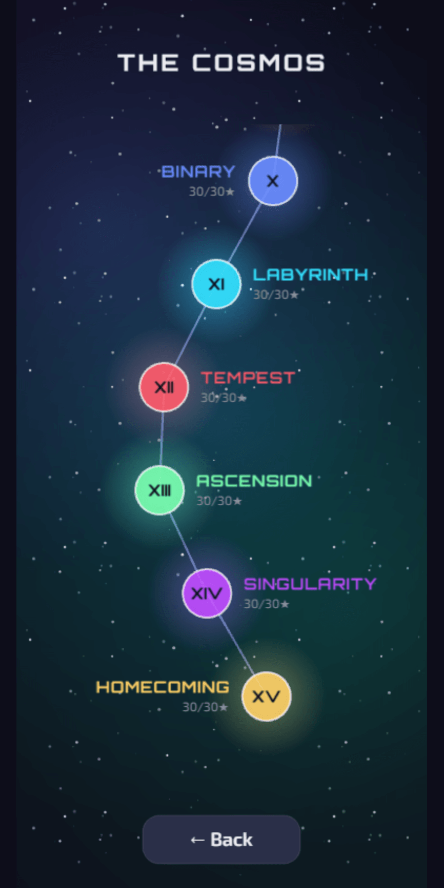
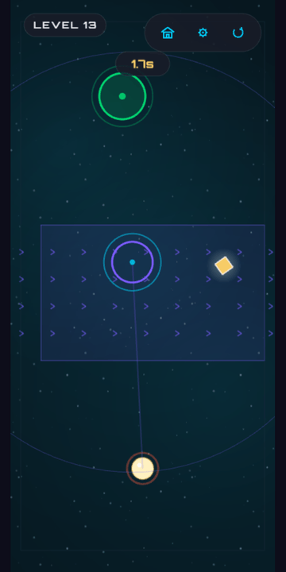
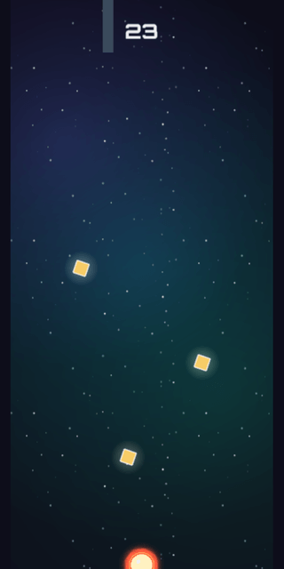
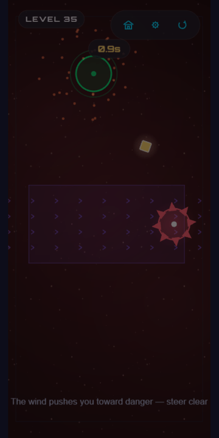
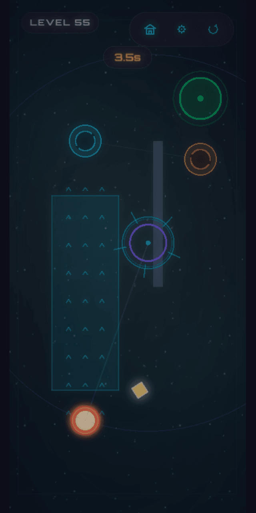
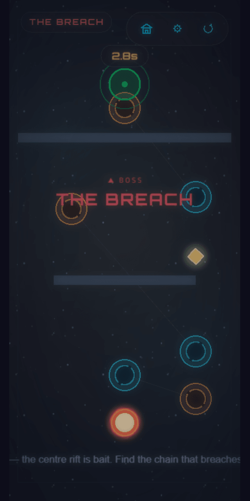
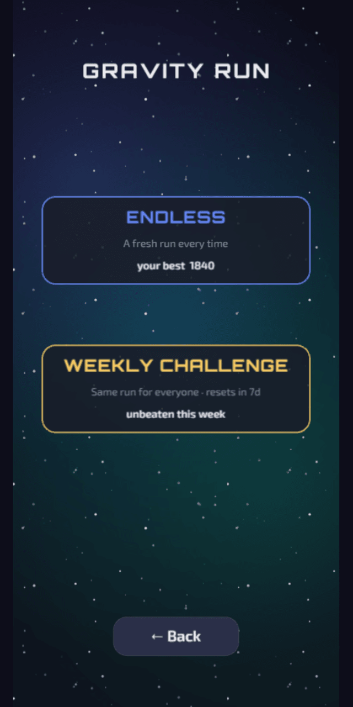
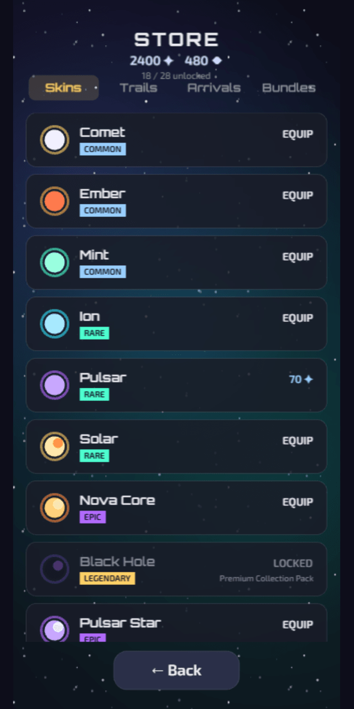
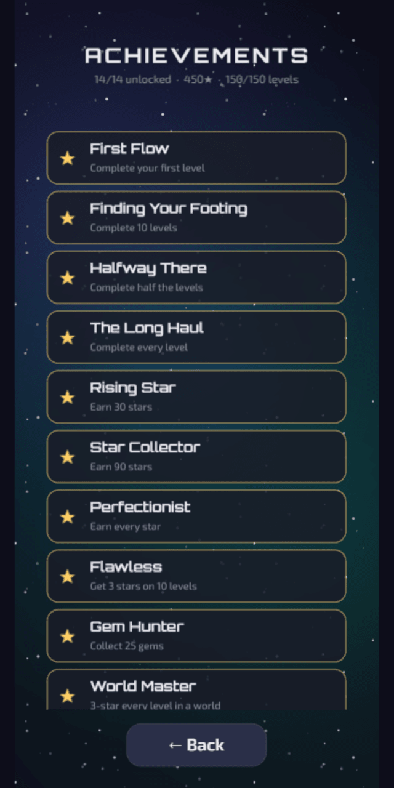
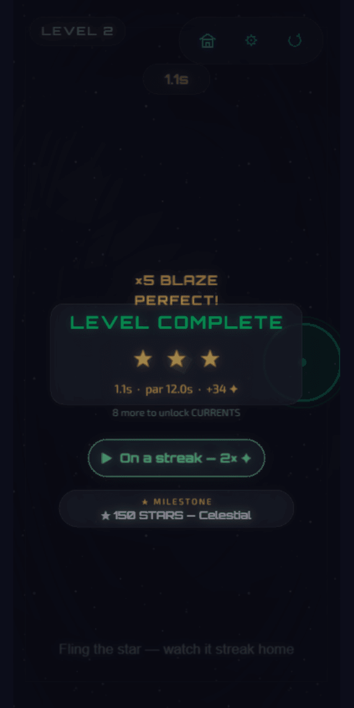

<div align="center">



# GRAVITY FLOW

**Hold to pull a lost star home.** A one-touch physics puzzler set in deep space —
**150 hand-tuned levels across 15 worlds**, plus an endless arcade mode, a cosmetics
economy, and a 3-star mastery layer.

<sub>by **True Story Labs**</sub>


%20%C2%B7%20iOS-informational)

</div>

---

## The mechanic

You never move the star directly. **Press and hold** to create a point of gravity; the star is pulled
toward it by an inverse-square force. **Drag** to steer, **release** to let go. Easy to learn, deep to
master.

<div align="center">

| Hold to pull | Endless climb | Perfect run |
|:---:|:---:|:---:|
|  |  |  |

</div>

## What's in it

- **150 levels · 15 worlds**, each teaching a new way to think and ending in its own **boss**:
  currents · clockwork · magnetic wells · rifts (portals) · one-way gates · spinning arms & pulsing
  lasers — then combination, tension, and mastery worlds.
- **Star Map** — a living constellation of worlds with a cinematic warp transition between them.
- **Gravity Run** — an endless, accelerating climb. **Endless** (fresh seed every run) + a **Weekly
  Challenge** leaderboard (everyone races the same seed).
- **3-star mastery** — finish · grab the off-route gem · beat par. Personal-best **ghost trail**.
- **Daily Challenge** + streaks, **14 achievements**, and a **28-item cosmetics store** (skins,
  trails, arrival effects across 5 rarities) bought with earned Stardust & Fragments. **No pay-to-win.**

## Gallery

<div align="center">

| | | |
|:---:|:---:|:---:|
| <br/>**Gravity puzzles** | <br/>**World bosses** | <br/>**Gravity Run** |
| <br/>**Cosmetics store** | <br/>**Achievements** | <br/>**3-star mastery** |

</div>

> More curated media (Google Play / App Store / portfolio / LinkedIn sets) lives in
> [`docs/media/`](docs/media/README.md).

## Tech & architecture

**Phaser 3 · TypeScript (strict) · Matter.js · Vite 5 · Vitest.** Wrapped for Android with
**Capacitor** (AdMob · RevenueCat · Firebase Analytics/Crashlytics, all guarded so the web build never
bundles native plugins).

The codebase follows one disciplined rule that keeps 150 levels and 7 mechanics maintainable:

> **A new mechanic = one entity class + one optional `LevelConfig` field.** No managers, no premature
> abstraction. Every gameplay constant lives in `src/config/`; the attractor force stays a tuned
> inverse-square law. Pure logic (scoring, daily seeding, endless pacing, achievements) is TDD'd.

- **Runtime-rendered visuals** — gameplay/UI are Phaser `Graphics`/vector icons (one bundled logo PNG +
  self-hosted Orbitron/Exo 2 fonts); a glassmorphic design-token system in `theme.config.ts`.
- **Custom Web-Audio synth** — all SFX + the ambient pad are generated at runtime (`AudioSynth.ts`).
- **Thin localStorage stores** — progress, cosmetics, currency, daily streak, ghost trails, stats.
- **103 unit tests** green; `tsc --noEmit` clean; full-flow capture with zero console errors.

## Run it

```bash
npm install
npm run dev          # http://localhost:5173
npm test             # Vitest (one-shot)
npm run build        # tsc + Vite production build
```

Architecture & conventions: [`CLAUDE.md`](CLAUDE.md) · current state: [`docs/project-status.md`](docs/project-status.md).

## Links

- **Privacy policy:** https://taysh123.github.io/Gravity-Game/
- **Play listing copy / ASO:** [`docs/store/listing.md`](docs/store/listing.md) · [`docs/store/aso.md`](docs/store/aso.md)

<div align="center"><sub>© True Story Labs · <i>Hold to pull. Find the flow. Bring the star home.</i></sub></div>
