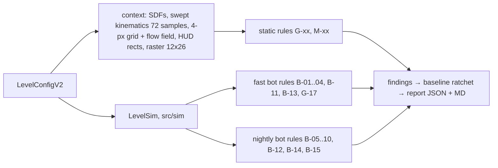

# Level Engine: Data Model v2, Authoring, Validation and the Quality Report

> **Status:** architecture of record for P2 (EXECUTION-ORDER steps 8, 9 and 11), written 2026-10-07 against `master @ d3c6aab`.
> **Conforms to:** D-05 (data model v2 + stable ids), D-06 (shared sim + bot + CI), D-02 (armed clock), D-03 (win precedence, rule G-03), D-07 (relief tiers, open frontier), D-22 (chunks reuse these validators), D-26 (attractor formula untouched), D-27 (quality before count).
> **Companions:** [`LEVEL-QA-SIMULATION.md`](LEVEL-QA-SIMULATION.md) (bot, agents, CI tiers) · [`../roadmap/phases/P02-level-engine-qa.md`](../roadmap/phases/P02-level-engine-qa.md) (tasks).
> **Labels:** **[V]** verified in the repo at `d3c6aab` · **[A]** from `docs/audit/2026-10-07/STATE-AUDIT.md` §C · **[R]** from `docs/research/` · **[D]** decided in this document · **[ASSUMPTION]** must be confirmed during implementation.

---

## 0. Baseline: what exists today [V]

| Concern | Today | Where |
|---|---|---|
| Level shape | `LevelConfig`: entity arrays plus `hint`, `title`, `boss: boolean`, `camera`, `parTimeMs`, `timeLimitMs`, `collectAllToWin`. No id, no intent, no role. | `src/types/index.ts:80-108` |
| Level order | One flat `LEVELS[]` array. **File names are not campaign numbers**: L11 = `level7.ts`, L80 = `level90.ts`, L150 = `level163.ts`. 13 files are not imported at all (retired: `level6/22/31/35/37/39/40/45/48/55/56/63/64`). | `src/config/levels/index.ts:159-214` |
| Worlds | Numeric `from/to` index ranges | `src/config/worlds.ts:14-34`, `src/utils/world.ts:6-23` |
| Themes | Keyed by numeric world id. Accents repeat: W5 = W14 `0xc04cff`, W6 = W11 `0x33e1ff`, W4 = W12 `0xff5a6a`, W8 = W15 `0xffd166` | `src/config/worldThemes.ts:15-32` |
| Progress | `gravity-flow:progress:v9`, `Record<number, {stars, bestTimeMs, gem}>` keyed by campaign index | `src/utils/ProgressStore.ts:21` |
| Ghosts | `gravity-flow:ghost:v1`, `Record<number, PathPoint[]>` | `src/utils/GhostStore.ts:7` |
| Validator | Bounds, goal radius 16–60, spawn in obstacle or static hazard, goal buried, limit > par, world ranges contiguous | `src/config/levels/levels.test.ts:68-160` |
| Unvalidated | `DAILY_LEVELS` (8), the 13 retired files, routes, bypasses, portal exits, moving-hazard clearance, duplicates, titles, hints | [A] C.4 |
| Index-coupled code | `GameScene` (`currentLevel`, `scene.restart({level})`), `LevelSelectScene`, `WorldMapScene`, `MainMenuScene`, `EndScene`, `StatsStore`, `onboarding.ts`, `world.ts`, analytics `levelStart/levelComplete/levelFail(level:number)` | grep at `d3c6aab` |

**Three latent defects the v2 model fixes along the way [V]:**
1. `ProgressStore.record` keeps `max(stars)` and a separate `gem` flag (`ProgressStore.ts:51-65`). A run with gem+clear (2★) followed by a run with par+clear (2★) stores 2★, so the union (3★) is lost. v2 stores each star as its own flag.
2. The `collectAllToWin` type comment says gathering the orbs *is* the win. The code still requires reaching the goal afterwards (`GameScene.ts:1016-1019`). v2 names that behaviour explicitly: `'orbsThenGoal'`.
3. The CoachMark is gated on `currentLevel === 1` (`GameScene.ts:840`), and `currentLevel` defaults to 1 for the Daily. So the tutorial can fire on the Daily and set `seenTutorial` for good ([A] C.5). In v2, tutorials are keyed by `tutorial.id`, never by position.

---

## 1. Principles [D]

1. **An id is identity; a position is data.** Progress, ghosts, stars, telemetry and the bot cache are all keyed by `LevelId`. Order lives only in `WorldMeta.levels[]`. Reordering, cutting or moving a level is a data edit (D-05, D-27).
2. **Everything a validator needs is in the config.** Header comments stop being the source of intent. `idea`, `role`, `teaches` and `uses` are typed fields.
3. **One mechanic = one registry entry + one optional config field + one entity class** (the CLAUDE.md rule). The registry is data, not a manager.
4. **One clock.** Every time is in sim-ms from arm (D-01, D-02).
5. **Additive and reversible migration.** v9 stores are never deleted during P2. A one-way-equivalence test proves that every v2 config downgrades to its exact v1 original.
6. **Validators and the bot read the same pure `src/sim/` code the game runs** (D-06). There are no parallel physics re-implementations.

---

## 2. Level data model v2

### 2.1 Identity, roles, mechanics

```ts
// src/content/schema.ts — pure types, no Phaser. v1 entity shapes are reused from src/types.
import type {
  Vec2, ObstacleConfig, GravityZoneConfig, MagnetConfig, GateConfig,
  PortalConfig, MovingPlatformConfig, HazardConfig,
} from '../types';

export const LEVEL_SCHEMA_VERSION = 2 as const;

/** Immutable once shipped. Campaign: `w<WW>-<worldSlug>-<NN>` (birth world + birth slot, e.g.
 *  'w02-currents-01'). Daily: 'd-01'. Vault/expert: 'x-<slug>'. Non-core packs: '<pack>:<id>'.
 *  Moving a level to another world or slot NEVER renames it. */
export type LevelId = string & { readonly __brand: 'LevelId' };
export type WorldId = string & { readonly __brand: 'WorldId' };      // 'w02-currents'
export type PackId = 'core' | 'daily' | 'vault' | (string & {});
export type RuleId = `G-${string}` | `M-${string}` | `B-${string}`;

export type LevelRole =                                             // D-05
  | 'sandbox' | 'experiment' | 'develop' | 'breather' | 'twist'
  | 'combine' | 'mastery' | 'boss' | 'remix';

export type MechanicId =
  | 'attractor' | 'zone' | 'magnet' | 'portal' | 'platform' | 'hazard' | 'gate'   // the 7 mechanics
  | 'wall' | 'orbs' | 'movingGoal' | 'launch' | 'timer';                           // elements + modifiers
export type MechanicVariant =
  | 'zone.up' | 'zone.down' | 'zone.side' | 'zone.diag' | 'zone.ride'
  | 'magnet.attract' | 'magnet.repel' | 'magnet.custom'
  | 'portal.single' | 'portal.multi' | 'portal.decoy'
  | 'gate.up' | 'gate.down' | 'gate.side' | 'gate.diag'
  | 'hazard.static' | 'hazard.sweep' | 'hazard.arm' | 'hazard.beam' | 'hazard.beamPhased' | 'hazard.beamMoving'
  | 'platform.bar' | 'platform.shutter' | 'wall.angled';
export type MechanicRef = MechanicId | MechanicVariant;

export type RouteShape = 'climb' | 'descent' | 'lateral' | 'returnTrip' | 'orbit' | 'chase' | 'free';
export type LevelTag =
  | `route:${RouteShape}`        // exactly one (M-05)
  | 'timed' | 'signature' | 'setPiece' | 'aha' | 'multiRoute' | 'redHerring'
  | 'precision' | 'gemRisk' | 'gemDetour' | 'callback' | 'onePress';

/** Stable reference to one element, used by relief highlights, boss patches, seals and findings. */
export type ElementRef =
  | `obstacle:${number}` | `zone:${number}` | `magnet:${number}` | `portal:${number}`
  | `gate:${number}` | `platform:${number}` | `hazard:${number}` | `gem` | `goal` | `orb:${number}`;
export interface Rect { x: number; y: number; width: number; height: number } // centre + size, play coords
```

### 2.2 The level

```ts
export interface GravityZoneConfigV2 extends GravityZoneConfig {
  ride?: boolean;          // deliberate ride-only current: exempt from the G-17 fight test (D-04)
}
export interface HazardConfigV2 extends HazardConfig {
  startPhase?: number;     // 0..1 of a sweep/arm cycle at arm time. Schema-reserved; first content use in P4.
}

export interface LevelConfigV2 {
  schema: 2;
  id: LevelId;
  pack: PackId;

  // ── design intent (required, D-05) ──
  idea: string;                  // one sentence, 12–140 chars: the interaction this level exists to show
  role: LevelRole;
  teaches: MechanicRef[];        // what debuts here; [] unless role ∈ {sandbox, experiment, twist}
  uses: MechanicRef[];           // what the idea depends on; each one is ablation-tested (B-08)
  redHerrings?: MechanicRef[];   // present but optional on purpose; allowed from world slot 5 [R §1]
  tags: LevelTag[];
  title?: string;                // ≤ 22 chars, unique campaign-wide (G-12)

  // ── arena (play coords: 0..360 × 0..780; ball centre reachable 16..344 × 16..764) ──
  ball: { x: number; y: number; startVelocity?: Vec2 };
  goal: { x: number; y: number; radius: number; to?: Vec2; durationMs?: number };
  obstacles: ObstacleConfig[];
  gravityZones?: GravityZoneConfigV2[];
  magnets?: MagnetConfig[];
  portals?: PortalConfig[];
  gates?: GateConfig[];
  movingPlatforms?: MovingPlatformConfig[];
  hazards?: HazardConfigV2[];
  collectible?: Vec2;            // the gem (★2). The v1 name is kept: renaming adds churn and no player value
  collectibles?: Vec2[];         // constellation orbs

  // ── rules ──
  objectives: Objectives;
  timing: Timing;

  // ── player support ──
  presentation: Presentation;
  relief: Relief;
  tutorial?: TutorialMeta;
  boss?: BossMeta;               // present ⇔ role === 'boss' (M-09)
  rewards?: RewardMeta;
  variants?: VariantRule[];      // generated remixes (post-game, expert, daily, events)
  remixOf?: { id: LevelId; transforms: Transform[] }; // an authored, labelled remix (D-27)
  qa?: QaMeta;
  provenance: Provenance;
}
```

### 2.3 Objectives, timing and the armed clock

```ts
export interface Objectives {
  complete: 'reachGoal' | 'orbsThenGoal';  // v1 collectAllToWin:true ⇒ 'orbsThenGoal'
  gem: boolean;                           // ★2 enabled (needs collectible)
  par: boolean;                           // ★3 enabled (needs timing.parMs)
  challenges?: ChallengeRule[];           // post-game/remix badges. Never star-bearing in the campaign.
}
export type ChallengeRule =               // evaluated from the sim event log; no new mechanic needed
  | { kind: 'collectAll' }                       // every orb + the gem
  | { kind: 'noPortal' }                         // win with zero teleports
  | { kind: 'noGate' }                           // win without passing any gate
  | { kind: 'limitedPresses'; max: number }      // press-down events counted from arm
  | { kind: 'holdBudget'; maxMs: number }        // total held sim-ms
  | { kind: 'underTime'; ms: number };

export interface Timing {
  clock: 'armed';                         // D-02: the only clock in v2
  parMs: number;                          // ★3 threshold, sim-ms from arm
  parSource: 'legacy' | 'formula' | 'manual';
  parFormula?: { version: string; tBestMs: number; tNoisyMedianMs: number; runId: string };
  timeLimitMs?: number;                   // countdown from arm; 0 ⇒ death('timeout')
  limitSource?: 'legacy' | 'formula' | 'manual';
}
```

**Armed semantics (D-02).** These are binding for LevelSim, the renderer and every agent:

| Phase | Physics steps | `simMs` | Kinematics | Input | Clock UI |
|---|---|---|---|---|---|
| Preview (after build) | none | 0 | t = 0 pose (hazards, platforms, beams, goal drift) | the first press arms | par/countdown chip shows its full value, frozen |
| Arm (first press-down) | the press is step 1's input | starts | `f(simMs)` | latched once per step | runs |
| Paused (overlay, background, ad) | none | frozen | frozen | ignored | frozen |
| End (win/death step) | stop | final | — | — | final value; best time = `simMs` at the win step |
| Retry | rebuilt | 0 | t = 0 pose | must re-arm | reset |

- Ghost and replay recording start at arm.
- Gravity Run arms at scene start, after its countdown (D-02 exception).
- **Consequence for QA:** "zero input" cannot win any more. The real exposure becomes *one tap anywhere*, and agent A0 tests exactly that (LEVEL-QA §3).

### 2.4 Presentation, relief, tutorial

```ts
export interface Presentation {
  entryHint?: string;                     // v1 `hint`, kept for parity; P3 decides whether it survives
  camera?: { introZoom?: number };        // clamp CAMERA_INTRO_ZOOM_MAX (physics.config.ts)
  titleCard?: 'world' | 'boss' | 'none';  // once per level per session (D-08)
}
export interface Relief {                 // D-07. The thresholds (3/6/10 fails, 4 min) live in
  tier1: string;                          //   src/config/relief.config.ts (P3), never per level.
  tier2?: string;                         // tier1: what to NOTICE, never the route; ≤ 60 chars
  highlight?: ElementRef[];               // pulsed while tier1 shows
  showMe: 'route' | 'none';               // 'route' = bot solution ghost (qa/solutions/<id>.json)
  skippable: boolean;                     // false only for a world's twist level once its skip is spent [R §2]
}
export interface TutorialMeta {
  id: 'holdToPull' | 'dragToSteer' | 'releaseToCoast' | (string & {}); // persisted seen-key
  coach: 'ghostDot' | 'staticArrow' | 'none';
  failFree: boolean;                      // sandbox guarantee: no hazards, no timer (M-07)
  focus: MechanicRef;
}
```

### 2.5 Boss, rewards, variants, QA intent, provenance

```ts
export type BossArchetype =
  | 'endurance' | 'chase' | 'puzzleLock' | 'orbit' | 'siege' | 'storm' | 'descent' | 'synthesis';
export interface BossMeta {
  archetype: BossArchetype;               // unique campaign-wide, except 'synthesis' (G-14)
  phases: BossPhase[];                    // 1 for migrated bosses; 2–3 for P4 bosses [R §4]
  finale?: boolean;                       // the campaign finale
}
export interface BossPhase {
  id: string;                             // 'p1'
  idea: string;                           // a DIFFERENT use of the world's mechanic
  uses: MechanicRef[];
  enter: { kind: 'arm' } | { kind: 'enterRect'; rect: Rect }
       | { kind: 'collectOrbs'; count: number } | { kind: 'portalJump'; portal: number };
  arena?: { add?: Partial<Pick<LevelConfigV2, 'obstacles' | 'hazards' | 'gravityZones' | 'magnets' | 'portals' | 'gates' | 'movingPlatforms'>>;
            remove?: ElementRef[] };      // schema in P2; runtime arena swap in P4
  checkpoint?: Vec2;                      // respawn point once this phase is reached
  parMs?: number;                         // ≤ 20 000 per phase [R §4]
}

export interface RewardMeta {             // values are owned by P7 (D-23 is PROPOSED)
  firstClear?: { currency: 'stardust'; amount: number };
  threeStar?: { currency: 'stardust'; amount: number };
  unlocks?: { cosmetic?: string; badge?: string };  // ids checked against the registries (M-11)
}

export type Transform =                   // pure: applyTransforms(cfg, t[]) → LevelConfigV2
  | { kind: 'mirrorX' }
  | { kind: 'goalScale'; factor: number }            // remix: 0.8 (−20% goal) [A C.6]
  | { kind: 'addTimer'; parPlusMs: number }          // limit = par + n
  | { kind: 'hazardSpeed'; factor: number }          // Fast-Foe; 0.9–1.1 for jitter (D-22)
  | { kind: 'jitter'; maxPx: number; seed: number }  // ±12 px placement jitter, bot-verified (D-22)
  | { kind: 'challenge'; rule: ChallengeRule };
export interface VariantRule {
  id: LevelId;                            // '<base>~<suffix>', e.g. 'w05-wells-03~mirror'
  mode: 'remix' | 'expert' | 'daily' | 'event';
  label: string;                          // player-facing: 'MIRROR', 'SPEEDY'
  transforms: Transform[];
  gate: 'fast' | 'nightly';               // which bot tier must pass before it can ship
}

export interface QaMeta {
  intendedRoute?: Vec2[];                 // designer waypoints → scripted replay + route-family check
  seals?: Array<{ rect: Rect; entries: Array<{ kind: 'portal' | 'gate'; index: number }> }>; // G-08
  lanes?: 'intended';                     // wall lanes ARE the idea (exempts G-09)
  allowSelfSolve?: boolean;               // sandbox only (B-01/B-02 become info)
  allowWallGoal?: boolean;                // goal within 64 px of a wall on purpose (G-16b)
}
export interface Provenance {
  legacy?: { file: string; exportName: string; v9Index?: number }; // e.g. level7.ts, 11
  backfilled?: Array<'idea' | 'role' | 'teaches' | 'uses' | 'tags'>; // codemod drafts; cleared on review
  notes?: string;
}
```

### 2.6 Worlds, themes, packs, mechanic registry

```ts
export interface WorldMeta {
  id: WorldId;                 // 'w02-currents'
  order: number;               // 1-based campaign position
  name: string;                // 'CURRENTS' (never a level title, G-12)
  levels: LevelId[];           // EXPLICIT order, 8–12 (D-27); the last one is the boss
  focus: MechanicRef[];        // what the world teaches (W9+ may be [] but must set newRule)
  newRule: string;             // the world's one new rule [R §5]
  tone: string;                // one emotional tone word [R §5]
  theme: WorldId;              // key into WORLD_THEMES
  signature?: LevelId;         // the world's set-piece
  unlock: { clearedFraction: number; orStars?: number }; // D-07 open frontier (default 0.8)
}
export interface WorldThemeV2 {            // src/config/worldThemes.ts, re-keyed by WorldId
  id: WorldId; roman: string; subtitle: string; bgColor: number; nebulaTints: number[];
  starTint: number; starAlpha: number; accent: number;
  music: string; backdrop: string;        // layer ids (P5 owns the assets)
  callbackOf?: WorldId;                   // the only legal reason to reuse another world's accent
}
export interface ContentPack {
  id: PackId; version: string; minSimVersion: string;
  worlds: WorldMeta[]; levels: LevelConfigV2[]; mechanics: MechanicRef[]; // must be 'live' in the client
}

export type AblationKind = 'zeroForce' | 'remove' | 'solid' | 'freezeAtT0' | 'disable' | 'none';
export interface MechanicDef {
  id: MechanicRef;
  kind: 'mechanic' | 'element' | 'modifier';
  configKey: keyof LevelConfigV2 | null;
  detect: (cfg: LevelConfigV2) => number;  // pure instance count → M-04 consistency
  ablate: AblationKind;                    // how the bot neutralises it (LEVEL-QA §3.9)
  bodiesPerInstance: number;               // perf budget (< 20 bodies, CLAUDE.md)
  rules: RuleId[];                         // validators that apply to it
  status: 'live' | 'planned';              // planned = schema only, rejected in content by M-04
}
```

**Mechanic registry** (`src/content/mechanics.ts`):

| Ref | Kind | Config key | Entity | Ablation | Bodies | Status |
|---|---|---|---|---|---|---|
| `attractor` | mechanic | — | `Attractor` | none (the core verb) | 0 | live |
| `zone.*` (up/down/side/diag/ride) | mechanic | `gravityZones` | `GravityZone` | zeroForce | 0 | live |
| `magnet.*` (attract/repel/custom) | mechanic | `magnets` | `Magnet` | zeroForce | 0 | live |
| `portal.*` (single/multi/decoy) | mechanic | `portals` | `Portal` | remove | 0 | live |
| `platform.*` (bar/shutter) | mechanic | `movingPlatforms` | `MovingPlatform` | freezeAtT0, then remove | 1 | live |
| `hazard.*` (static/sweep/arm/beam/…) | mechanic | `hazards` | `Hazard` | remove | 0 | live |
| `gate.*` (up/down/side/diag) | mechanic | `gates` | `Gate` | solid, then remove | 1 | live |
| `wall`, `wall.angled` | element | `obstacles` | `Obstacle` | none | 1 | live; `angled` blocked by G-05d until the `Obstacle.ts:16-26` render fix |
| `orbs` | element | `collectibles` | `Orb` | disable | 0 | live |
| `movingGoal` | modifier | `goal.to` | `Goal` | freezeAtT0 | 0 | live |
| `launch` | modifier | `ball.startVelocity` | `Ball` | disable | 0 | live |
| `timer` | modifier | `timing.timeLimitMs` | HUD | disable | 0 | live |
| `press.limited`, `magnet.flip`, `field.anti`, `well.moving` | mechanic | — | — | — | — | **planned** (P4 decides, [A] C.6) |

---

## 3. Level authoring

### 3.1 File layout [D]

```
src/content/
  schema.ts                 ← §2 types
  mechanics.ts              ← registry + pure detectors
  patterns.ts               ← typed geometry/hazard helpers (§3.3)
  worlds.ts                 ← WORLDS_V2: WorldMeta[] with explicit levels[]
  campaign.ts               ← campaignOrder(), levelById(), worldOfLevel(), campaignIndexOf(), nextInOrder()
  v1compat.ts               ← toV1(v2) + LEVELS shim (removed in P4)
  migrations/v9IndexToId.ts ← FROZEN 150-entry array (§6)
  migrations/progressV10.ts ← pure v9→v10 / ghost / tutorial transforms (run by P0's ladder)
  levels/
    _template.ts
    w01-foundations/w01-foundations-01.ts … -10.ts
    w02-currents/…   …   w15-homecoming/…
    daily/d-01.ts … d-08.ts
    vault/x-level6.ts …      ← the 13 retired files (pack 'vault')
    index.gen.ts            ← GENERATED (`npm run content:index`), CI checks it is current
```

`index.gen.ts` is a generated, checked-in import list. It is not `import.meta.glob`, because the Node CLI (vite-node/esbuild) has to resolve the same graph as Vite.

### 3.2 A migrated level, in full (L11 `level7.ts` → `w02-currents-01`)

```ts
import type { LevelConfigV2 } from '../../schema';
import { PHYSICS } from '../../../config/physics.config';
import { levelId } from '../../schema';

export default {
  schema: 2, id: levelId('w02-currents-01'), pack: 'core',
  idea: 'Feel a current carry the star before any test of it',
  role: 'sandbox', teaches: ['zone.up'], uses: ['zone.up'], tags: ['route:climb'],
  ball: { x: 180, y: 650 },
  goal: { x: 180, y: 140, radius: 46 },
  obstacles: [],
  gravityZones: [{ x: 180, y: 400, width: 150, height: 520, dir: { x: 0, y: -1 },
                   strength: PHYSICS.GRAVITY_ZONE_STRENGTH, ride: true }],
  collectible: { x: 180, y: 300 },
  objectives: { complete: 'reachGoal', gem: true, par: true },
  timing: { clock: 'armed', parMs: 9000, parSource: 'legacy' },
  presentation: { entryHint: 'Surf the current straight up', titleCard: 'world' },
  relief: { tier1: 'Surf the current straight up', showMe: 'route', skippable: true },
  qa: { allowSelfSolve: true },          // sandbox, explicitly; B-01 still REPORTS it
  provenance: { legacy: { file: 'level7.ts', exportName: 'level7', v9Index: 11 },
                backfilled: ['idea', 'role'] },
} satisfies LevelConfigV2;
```

This is honest data. With `allowSelfSolve` the self-solve is a declared sandbox property and no longer a hidden defect. P4 decides whether to keep it.

### 3.3 Reusable patterns (`src/content/patterns.ts`)

Patterns are pure functions that return plain v1/v2 entity data. They are not classes, so validators still see ordinary arrays. Each default is set to pass the rule named beside it.

```ts
export function wallRow(y: number, gaps: Array<{ x: number; w: number }>, thickness?: number): ObstacleConfig[]; // gaps ≥ 64 px (G-05/G-07)
export function fullSweepSaw(y: number, o?: { r?: number; durationMs?: number; fromRight?: boolean }): HazardConfigV2; // 40↔320, closes wall lanes (G-09) [A C.2 fix (a)]
export function barWithStubs(y: number, o: { width?: number; durationMs: number; stubW?: number }): { movingPlatforms: MovingPlatformConfig[]; obstacles: ObstacleConfig[] }; // side stubs [A fix (b)]
export function sealedChamber(rect: Rect, entries: QaMeta['seals'][number]['entries'], wall?: number): { obstacles: ObstacleConfig[]; seal: NonNullable<QaMeta['seals']>[number] }; // walls meet floor/ceiling [A fix (c)], G-08 metadata emitted
export function liftColumn(x: number, yTop: number, yBottom: number, width: number, strengthMul?: number): GravityZoneConfigV2;
export function riftAcross(wallY: number, from: Vec2, to: Vec2): { obstacles: ObstacleConfig[]; portals: PortalConfig[] }; // exit fan pre-checked (G-06)
export function armGuard(pivot: Vec2, orbitR: number, revMs: number, sawR?: number): HazardConfigV2;
export function beamCurtain(y: number, pulseMs: number, phaseMs?: number, width?: number): HazardConfigV2;
export function wellAwayFromBlades(m: MagnetConfig, hazards: HazardConfigV2[]): MagnetConfig; // throws when G-18 would fail
export function mirrorX<T extends Partial<LevelConfigV2>>(cfg: T): T;  // = Transform 'mirrorX'
```

### 3.4 Mechanic-combination catalogue [D, with audit evidence]

| Pair | The interesting interaction (idea seed) | Use today [A] | Validator risk |
|---|---|---|---|
| attractor alone | orbit, slingshot off the reach edge, release-to-coast | W1 | B-02 one-nudge |
| zone + attractor | fight the current up close, ride it from far away (needs D-04) | W2: no real fight | G-17 |
| zone + magnet | the current feeds a well's slingshot | L45 (copied as L97) | G-11 |
| zone + portal | the lift sets the exit velocity | L55, L72 (self-running) | B-01 |
| zone + gate | the current pushes you through a door you can't come back through | L65, L73 | G-08 |
| zone + hazard | a crosswind blows you into the blade band | L35, L127 ★ | G-07 |
| zone + platform | a platform shelters you from the current on a rhythm | **unused** | G-07 timing |
| magnet + portal | the exit lands in a well's orbit | L57 | G-06 |
| magnet + hazard | a well drags a released ball into the blades | L110, L128, L138, D8 (traps) | **G-18** |
| magnet + gate | a repeller's push is the only way through a one-way door | rare | — |
| magnet + platform | a moving shelter inside a well's reach | **unused** | — |
| portal + gate | the exit is only valid one way; return trip | L67 / L70 / L77 / L80 (duplicates) | G-11 |
| portal + hazard | exit timing against a sweep | L52, L74, L77 (unfair) | **G-06** |
| portal + platform | a platform shutters the mouth on a beat | **unused** | G-06 (all poses) |
| gate + hazard | commit-then-dodge | L64 (floor gap) | G-08 |
| gate + platform | the gate opens only while a platform bridges | **unused** | — |
| platform + hazard | timed corridors | W9 | G-09 |
| any + moving goal | chase: route to where the goal will be | only L20 | G-03 (goal sweep) |
| any + orbs | constellation order puzzle | only L3, L26 | G-20 |
| any + timer | pressure on an already-solved idea (never the idea itself) | W12 (loose) | G-10 / B-09 |

**Rule:** a `combine` level names its pair in `uses`. The pair must not repeat within the same world (G-13d), and each member must stay required under ablation (B-08).

### 3.5 World theme rules [D, R §5]

1. Every world declares four things: `newRule`, `tone`, a theme (palette + `backdrop` + `music` layer), and one `signature` level.
2. An accent may repeat another world's accent only with `callbackOf` set. Today's four repeats either get a callback or a new accent in P4.
3. Adjacent worlds keep accent hue ≥ 40° apart, and text on the accent meets 4.5:1 contrast (P5 audits rendered contrast).
4. A world name is never a level title. Subtitles are unique.
5. Worlds 9–15 have no new primitive. Each must get its novelty from a parameter twist or an input constraint on the core verb ([R §5] twist list).

### 3.6 Content conventions [D]

| Item | Convention |
|---|---|
| Coordinates | Integers, in play coords. Wall thickness 16. Capture points stay inside 16..344 × 16..764. |
| Constants | Zone strengths are always written as `PHYSICS.GRAVITY_ZONE_STRENGTH * k`, never as a literal, so D-04's retune stays one constant. |
| `idea` | Starts with a verb, ≤ 140 chars, says the *interaction*: "Drop out of the lift early to reach the side current". |
| `title` | Uppercase, ≤ 22 chars (the longest today is 20, "THE EYE OF THE STORM"). Signature and boss levels only. |
| `relief.tier1` | ≤ 60 chars, asks what to notice. It never states the route (P3 rewrites the legacy ones). |
| Comments | Free text only. Never the source of role or intent. |
| Gem | Off-route by default (G-04). On-route only with the `gemRisk` tag, which means past a hazard. |
| Goal radius by role | sandbox 40–52 · experiment/develop 34–40 · twist 30–36 · combine 26–32 · mastery/boss 22–28 (carried over from `_template.ts`) |

### 3.7 Adding a level in under 10 minutes

| Min | Step | Command / tool |
|---|---|---|
| 0–1 | Scaffold from a role template, or copy a sibling. This writes the file, a fresh id and the world `levels[]` entry. | `npm run level:new -- --world w03-clockwork --role twist [--from w03-clockwork-04]` |
| 1–5 | Write `idea`, then the geometry, using the patterns in §3.3 | editor |
| 5–6 | **Designer quick-check** (< 30 s, LEVEL-QA §5): static rules, then A0–A3, beam-16 T_best, a suggested par, and an SVG overlay with lanes, exit fans and the route | `npm run level:check -- w03-clockwork-11 --watch --svg` |
| 6–9 | Play it in the browser. The dev-only `?level=<id>` boot parameter skips the splash and menus. | `npm run dev` |
| 9–10 | Commit. CI runs the fast tier on the changed ids only (cache). | `git commit` |

The quick-check prints a pass/fail card per rule. Every failure carries its fix hint, for example "G-09: lane 6 px at y=480; use fullSweepSaw(480)".

---

## 4. Level validation architecture

### 4.1 Pipeline



- **Modules** (`src/sim/validate/`): `context.ts`, `geometry.ts` (rect/circle SDFs, rotation-aware), `sweep.ts` (kinematic sampling through P1's pure motion functions), `grid.ts` (4-px free-space grid, Dijkstra, reverse flow field; promoted from the analyzer), `raster.ts`, `rules/*.ts` (one file per rule), `baseline.ts`, `index.ts` (`runRules(cfgs, tier)`).
- **Thresholds** live in `src/config/qa.config.ts`, following the convention that numbers go in config files.
- **Rule contract:** `interface Rule { id: RuleId; title: string; tier: 'static' | 'fast' | 'nightly'; severity: 'error' | 'warn' | 'info'; appliesTo(cfg): boolean; check(ctx): Finding[] }`.
- **Severity:** `error` blocks CI unless baselined. `warn` never blocks, but the count per rule may not rise above the baseline count (ratchet). `info` is report-only.
- **Ratchet baseline** (`qa/baseline.json`, checked in): `{ rule, levelId, firstSeen, fixIn: 'P4-alpha' | 'P4', note }`.
  - CI fails on any error that is not in the baseline.
  - CI also fails on a **stale** entry, i.e. a baselined error that no longer reproduces. This forces cleanup.
  - The baseline is how "static validators are blocking" (D-06) coexists with "no mass rewrites in P2": today's defects are recorded, not fixed.

### 4.2 Static and sim-fast rule catalogue

R = `BALL_RADIUS` 16. "Kill region" = a hazard shape ⊕ R, swept over one full cycle (72 samples, beams counted regardless of duty).

| ID | Rule | Check | Sev | Blocks CI | Fails today [A] |
|---|---|---|---|---|---|
| G-01 | Bounds | Element anchors (incl. `to`, `pivot`, goal drift end) inside 0..360×0..780. Capture points (ball, goal, gem, orbs, mouths) inside 16..344×16..764. Element extents and swept extents inside the arena = warn. | err/warn | yes (err) | soft: L52 sweep [178,362], L53, L56, L69 |
| G-02 | Spawn safety | At arm and through the first 1000 ms of kinematics: spawn disc ≥ 24 px from every kill region, outside geometry, mouths and gates. Spawn inside a zone = warn (self-solve risk; B-01 confirms). | err/warn | yes | none err; L11/L12 warn |
| G-03 | Goal–hazard disc (D-03) | No kill region intersects the goal capture disc, or the drifting goal's swept disc. Surface gap < 16 px = warn. | err | yes | inventory `goalDanger` (10 levels < 40 px; L74 at 3 px) |
| G-04 | Gem placement | (a) reachable on the grid (err). (b) Pickup disc outside kill regions unless tagged `gemRisk`. (c) Grid detour ≥ 40 px (nightly B-xx confirms Δt ≥ 0.5 s). (d) ≥ 40 px from any portal exit point and from the spawn. | err/warn | (a) | 33 gems on-route incl. L50/L90/L120/L130; L59 on the exit |
| G-05 | Collision safety | (a) no static gaps 0 < g < 36 px (wedge, or a false gap). (b) a moving platform never leaves a 0 < g < 36 px gap to geometry unless tagged `platform.shutter`. (c) tunnelling: per-step kinematic speed + 12 px/step ball speed < thickness/2 + R. (d) `angle ≠ 0` is an error until the `Obstacle.ts:16-26` render fix. (e) Matter bodies < 20. | err | yes | none known (max 12 bodies, L69) |
| G-06 | Portal exit safety | For each mouth exit E and k = 0..15: P_k = E + 56·(cos 22.5k°, sin 22.5k°) (`PORTAL_EXIT_CLEAR`, `utils/portal.ts:14-18`; still → straight down). P_k must be (1) inside 16..344×16..764, (2) SDF ≥ R to obstacles, gates and platforms at all poses, (3) outside every kill region ⊕ 8 px, (4) outside every other mouth + 4 px (no auto-chain), (5) not inside a `seals` region the entry did not lead to. A direction counts as *reachable* if the approach point M − 42·dir is free space. Error when a reachable direction fails (2)–(4). | err/warn | yes | hazard: L52, L71, L74, L77 · geometry: L53/L103, L54, L56, L58–60, L71, L78, L80, L109, L129, L134 · chain: L109, L129 · decoy: L60 |
| G-07 | Hazard clearance and precision | (a) Corridor free play (width − 2R) at each hazard band on the static route: ≥ 32 px in W1–4, ≥ 24 in W5–11, ≥ 16 in W12–15. (b) Timing window (ms per cycle the crossing point is clear): ≥ 300 / 220 / 150 ms. (c) Window = 0 at a required band = err. | warn/err | (c) | L58 ~18 px gem window |
| G-08 | Sealed-space integrity | (a) Each `qa.seals` region: a ball-inflated flood fill must not enter except through its declared entries; the report gives the leak point and gap width. (b) Levels using portal or gate: goal reachable with portals disabled / gates solid ⇒ "optional for 1★". Error for the teaching roles (sandbox/experiment/twist), warn otherwise. | err/warn | yes | L53/L103 55 px, L56 85 px, L62 95 px floor gap, L64 50 px, L134; gates optional L122, L136, L80/L149/L150 |
| G-09 | Wall-lane check | For every sweep, arm, beam and platform bar: blocking interval over the full cycle [x_min − h − R, x_max + h + R], with h = radius or half-width, and arm = pivot ± (orbit + r). Lanes are [16, x₀) and (x₁, 344]. Any lane > 0 px on a crossing band (≥ 50% width) of a used mechanic is an error, unless `qa.lanes:'intended'`. Shares lane math with the endless chunk validator (`chunks.test.ts:7`, MIN_LANE 48, the inverse requirement). | err | yes | L40 bands 2/4: 6 px lanes, band 5: 38 px; W3 bars L22–25; L20, L36, L39; 19/70 of L81–150 |
| G-10 | Timer slack (static) | (a) limit ≥ par + 2000 ms (today only > par, `levels.test.ts:117`). (b) limit ÷ idealMs(route) in [1.5, 6] (the analyzer's ideal-run model); > 6 = decorative, < 1.5 = brutal (warn). Bot slack is B-09. | err/warn | (a) | L34 8 s / 6 s; W12 15–24 s on 3–6 s routes |
| G-11 | Duplicate layout | (1) Token similarity (analyzer `similarity`, tol 20 px, mirror-aware) ≥ 0.75 → candidate. (2) Raster 12×26 cells of 30 px with channels {solid, kill, zone×4 dirs, magnet±, mouth, goal, spawn, gem}; cosine similarity, max of direct and x-flipped. (3) Nightly: A5 route polylines resampled to 32 points, sim = 1 − clamp(meanDist / 120 px), mirror-aware. **dup = 0.6·raster + 0.4·route** (fast tier: raster only). Error at ≥ 0.85 vs any campaign or daily level unless `remixOf` links them with ≥ 1 non-mirror transform. | err | yes | L43/L91/L142, L45/L97, L53/L103, L63/L102, L65/D6, L67/L106, L84/L116, L101/L143, L150≈L80 |
| G-12 | Duplicate title/hint/idea | Titles unique after normalising (uppercase, strip a leading THE) and never equal to a world name (err). Hints/relief tiers: token Jaccard < 0.7 pairwise (warn). Ideas: Jaccard < 0.8 (warn). | err/warn | titles | THE GAUNTLET L8/L89, THE BINARY STAR L49/L99, THE SINGULARITY L50/L140; world-name titles ×4; 6 hint pairs; L80/L150 identical hint |
| G-13 | Mechanic novelty and teaching order | (a) Every ref, variants included, first appears in a sandbox/experiment/develop/breather level ≥ 3 positions before any mastery or boss level that uses it (err). (b) `teaches` ⊆ world `focus` (warn). (c) The world sets `newRule` and `tone` (warn). (d) Route-shape quota: ≤ 4 levels per world share a `route:*` tag; ≥ 1 descent, lateral, returnTrip and moving-goal level per world; no combine pair repeats within a world (warn). | err/warn | (a) | hazard debut in L10 boss; sweep + moving goal in L20 boss; arm in L29; 72/80 climbs |
| G-14 | Boss uniqueness | Archetype unique (except `synthesis`), title unique, dup < 0.70 vs every level, last in its world, 1–3 phases, phase `parMs` ≤ 20 s; uses only taught refs (G-13a). Difficulty ordering is B-12. | err | yes | template A L90/L120/L130; template B L80/L110/L150 |
| G-15 | HUD collision band | Pure `hudLayout(insets)` (`src/ui/hudLayout.ts`, later also consumed by `HudScene`, D-13), extracted from `createHud`/`createCountdown`/`createParChip`/`createNav` (`GameScene.ts:539-710`; SAFE_PAD 12, chip 80×36 at padY + 56, nav 172×56), evaluated at a worst-case top inset of 59 px [ASSUMPTION] and mapped to play coords (playX 15, playY 32). Goal disc + drift path, gem disc and every required hold point must stay ≥ 8 px from the exclusion rects. Taps there are swallowed by `isOverUi` (`GameScene.ts:796-798`). | err | yes | 16 levels incl. all 7 back-half boss goals at (180, 90–100) |
| G-16 | Touch accessibility | (a) Required hold points (A5 route, `intendedRoute`) outside the system-gesture edge bands: play x < 9 or > 351 (24 dp, [ASSUMPTION]: real `WindowInsets.systemGestures` vary) and y > 764. Warn when > 10% of hold time falls inside. (b) Goal within 64 px of an arena wall needs `qa.allowWallGoal` [R §1] (warn). | warn | no | wall-hug lanes push fingers to the edge [A C.2] |
| G-17 | Zone-vs-attractor fight test (D-04) | Sim micro-scenario: ball at rest at the zone centre and 2 points along its axis; attractor held 100 px *against* `dir` for 60 steps at the configured `FORCE_SCALE`. Pass = net displacement against `dir` > 0. Zones that cannot be fought must declare `ride: true`. | err | yes (baselined until P4) | all standard zones (6e-4 vs 2.6e-4 at 100 px) |
| G-18 | Well–hazard drag trap | An attract magnet whose core (20 + R) is within 40 px of a kill region, or whose force pulls a ball released at rest within 40 px outside a kill region into it. | err | yes | L110 (2 px), L128 (4), L138 (core in band), L150 (12), D8 (core in band) |
| G-19 | Static reachability | A free-space grid route exists ball → goal disc, modelling portals (16-direction exits), gates (one-way), platforms (any pose) and moving hazards (passable). | err | yes | none (inventory `staticImpossible` = []) |
| G-20 | Objective consistency | `orbsThenGoal` ⇒ ≥ 2 orbs, all reachable. `gem: true` ⇔ `collectible`. `par: true` ⇒ `parMs`. | err | yes | — |
| G-21 | World structure | `levels[]` resolve. No id in two worlds. 8–12 levels (D-27). Exactly one boss, placed last. `signature` belongs to the world. The theme exists. | err | yes | replaces `levels.test.ts:141-160` |
| G-22 | Daily/pack rules | Daily and pack levels pass every G rule. Each declares `minWorld`, and uses only refs taught by then (D-21). | err | yes | Daily D3/D4/D6 use untaught mechanics on day 0 |
| M-01 | Id | Format, uniqueness, immutability. Every v9-map id still resolves, or is listed in `RETIRED_IDS`. | err | yes | — |
| M-02 | Idea | Present, 12–140 chars, ≠ hint, ≠ title. | err | yes | 150/150 missing today |
| M-03 | Role | Valid enum. Slot coherence: sandbox only in slot 1, boss only last (warn). | err/warn | yes | — |
| M-04 | Uses/teaches | `teaches` ⊆ `uses`. detected ⊆ `uses` ∪ `redHerrings` ∪ {wall, attractor}. `uses` ⊆ detected. No `planned` refs. | err | yes | — |
| M-05 | Tags | Exactly one `route:*`. `timed` ⇔ `timeLimitMs`. | err | yes | — |
| M-06 | Timing | `parMs` > 0. `parSource` set. | err | yes | — |
| M-07 | Tutorial | `failFree` ⇒ no hazards, no timer. A tutorial `id` is used once campaign-wide. | err | yes | — |
| M-08 | Relief | `tier1` present, ≤ 60 chars (warn above). | err/warn | yes | 150 legacy hints copied (P3 rewrites) |
| M-09 | Boss meta | `boss` ⇔ role `boss`. `phases.length` ≥ 1. | err | yes | — |
| M-10 | Remix/variants | Targets exist. Transforms valid. Variant ids follow `<base>~<suffix>`. | err | yes | — |
| M-11 | Rewards | Cosmetic and badge ids exist in their registries. | err | yes | — |
| M-12 | Review | `provenance.backfilled` is empty for shipped worlds after P02-T06. | warn | no | all 150 until T06 |

**Bot rules** B-01…B-15 are defined in LEVEL-QA-SIMULATION §5.

- **Blocking in CI:** every `error` above, plus B-01…B-04, B-11 and B-13.
- **Report-only:** the nightly B-rules, until a DECISIONS edit promotes them (D-06).

**Interpretation note [D].** game-design §1 says "gaps of at least 2 ball diameters (32 px)". The ball diameter is 32 px, so the text is ambiguous. G-07 reads it as a *corridor of 2 diameters* (64 px), which gives **32 px of free centre play**. The 24 and 16 px tiers follow from "1.5 diameters" in W12–15.

---

## 5. Machine-readable level-quality report

**Outputs:** `qa-out/level-quality-report.json` plus `qa-out/level-quality-report.md`, both CI artefacts; the nightly run also publishes them. Per-level detail goes to `qa-out/levels/<id>.json`.

### 5.1 Schema

```ts
export type AgentId = 'A0' | 'A1' | 'A2' | 'A3' | 'A4' | 'A5' | 'A6' | 'SCRIPT' | 'ABL';
export type DeathClass = 'normal' | 'spawn' | 'portalExit' | 'goalAdjacent' | 'wellDrag' | 'timeout' | 'oob';

export interface LevelQualityReport {
  schema: 'gf.level-quality-report/1';
  run: {
    runId: string; createdAt: string; gitSha: string; tier: 'fast' | 'nightly' | 'quick';
    simVersion: string; rulesMode: 'v2' | 'legacy-hazard-first' | 'legacy-unarmed';
    forceScale: number;                      // D-01 FORCE_SCALE used
    constantsHash: string;                   // hash of the PHYSICS subset the sim reads
    agentVersions: Partial<Record<AgentId, string>>;
    node: string; cpus: number; wallMs: number; steps: number; usPerStep: number; cacheHits: number;
  };
  summary: {
    levels: number; pass: number; fail: number; baselined: number;
    newErrors: Array<{ levelId: string; rule: RuleId }>;
    staleBaseline: Array<{ levelId: string; rule: RuleId }>;
    byRule: Record<RuleId, { error: number; warn: number; info: number; baselined: number }>;
  };
  levels: LevelRecord[];
  worlds: Array<{
    worldId: string; levels: number; medianDifficulty: number | null; bossDifficulty: number | null;
    hardestNonBoss: { id: string; difficulty: number } | null; routeShapes: Record<string, number>;
    introduced: MechanicRef[]; findings: Finding[];
  }>;
  pairs: Array<{ a: string; b: string; raster: number; route: number | null; dup: number; mirrored: boolean; remixLinked: boolean }>;
}

export interface LevelRecord {
  id: string; worldId: string | null; campaignIndex: number | null; positionInWorld: number | null;
  role: LevelRole; title: string | null; pack: PackId; levelHash: string; legacyFile: string | null;
  static: {
    bodies: number; elements: number; distinctMechanics: MechanicRef[];
    routeLenPx: number | null; tortuosity: number | null; idealMs: number | null;
    dStatic: number;                          // the audit's difficulty proxy D, kept as a model feature
    lanes: Array<{ element: ElementRef; y: number; leftPx: number; rightPx: number }>;
    portalExitFan: Array<{ portal: number; mouth: 'a' | 'b'; bad: number; reachableBad: number; reasons: string[] }>;
    gemDetourPx: number | null; goalHazardGapPx: number | null; hudOverlap: boolean;
  };
  agents: Partial<Record<AgentId, {
    version: string; rollouts: number; wins: number; deaths: number; timeouts: number; stuck: number;
    winRate: number; bestMs: number | null; medianMs: number | null; p90Ms: number | null;
    deathClasses: Partial<Record<DeathClass, number>>; steps: number; cached: boolean;
    extra?: Record<string, number | string | boolean | null>;   // e.g. A4.aucess, A6.microFlip
  }>>;
  ablation: Array<{ ref: MechanicRef; kind: AblationKind; solved: boolean; tAblatedMs: number | null; ratio: number | null; decorative: boolean }> | null;
  timing: { windows: Array<{ element: ElementRef; minWindowMs: number; waitMs: number }>; slack: number | null } | null;
  hazards: Array<{ element: ElementRef; minClearancePx: number | null; nearMs: number; deathShare: number; decorative: boolean }> | null;
  route: { families: number; intendedMatch: boolean | null; unintendedFasterBy: number | null; edgeHoldShare: number | null } | null;
  par: { suggestedMs: number; currentMs: number; driftPct: number; tBestMs: number; tNoisyMedianMs: number | null; confidence: 'high' | 'low'; limitSuggestedMs: number | null } | null;
  scores: Scores;
  findings: Finding[];
  gate: 'pass' | 'fail' | 'baselined';
}

export interface Finding {
  rule: RuleId; severity: 'error' | 'warn' | 'info'; baselined: boolean; message: string;
  element?: ElementRef; at?: Vec2; value?: number; threshold?: number; fixHint?: string;
}

export interface Scores {              // null = the producing tier did not run
  difficulty: number | null;           // 0–10, ↑ harder
  fairness: number | null;             // 0–1, ↑ better
  bypass: number;                      // 0–1, ↓ better (risk)
  novelty: number;                     // 0–1, ↑ better
  mechanicDependency: number | null;   // 0–1, ↑ better
  timerQuality: number | null;         // 0–1, ↑ better; null if untimed
  gemQuality: number | null;           // 0–1, ↑ better; null if no gem
  readability: number;                 // 0–1, ↑ better (heuristic)
  replayVariance: number | null;       // 0–1, ↓ better (chaos)
  selfSolve: number;                   // 0–1, ↓ better
  provisional: Array<keyof Omit<Scores, 'provisional'>>; // filled from fast-tier proxies
}
```

### 5.2 Score formulas

`clamp01(x) = min(1, max(0, x))`. Times are sim-ms from arm.

| Score | Formula | Data source (tier) |
|---|---|---|
| **difficulty** | `round1(10 · clamp01(0.40·(1 − AUCCESS) + 0.40·(1 − s_noisy) + 0.20·clamp01((T_best − 2 s) / 18 s)))`. v1 weights, replaced by the fitted model in LEVEL-QA §8. | A4 AUCCESS, A6 success, A5 T_best (nightly) |
| **fairness** | `(1 − min(1, Σ_c w_c·u_c)) · cap`, where u_c = share of A4+A6 deaths in class c. Weights: spawn (< 1000 ms after arm) 2, portalExit (≤ 300 ms after a teleport) 2, goalAdjacent (centre ≤ goal.r + 16) 1.5, wellDrag (released, magnet share of net force > 0.5 over the previous 30 steps) 1, oob 1, normal 0. `cap` = 0.3 if any error in G-02/G-03/G-06/G-18, else 1. | A4, A6 death events; static rules (nightly) |
| **bypass** | `max(A3.winRate·[uses hazard.*/platform.* or role ∈ {mastery, boss}], 0.7·A2.winRate·[slot ≥ 4], 0.8·[G-09 lane], 0.9·[G-08 leak], 1·[featured mechanic decorative under ablation], 0.6·[unintended route ≥ 10% faster])` | A2, A3, G-08, G-09 (fast); ablation, route (nightly) |
| **novelty** | `0.7·(1 − maxDupPrior) + 0.3·combo`. maxDupPrior = max dup vs every level earlier in campaign order plus the daily pool. combo = 1 if (sorted `uses`, role) appears in none of the previous 10 levels, 0.5 if once, 0 if ≥ 2. | G-11 raster (fast) + route (nightly) |
| **mechanicDependency** | `min over m ∈ uses of dep_m`. dep_m = 1 if A5 cannot solve under ablation(m), else `clamp01((T_abl,m / T_best − 1) / 0.5)`. A ratio ≤ 1.1 also sets `decorative` (B-08). | ablation (nightly) |
| **timerQuality** | σ = limit / T_noisy_p90. σ < 1 → 0; 1–1.15 → 0.7·(σ − 1)/0.15; 1.15–1.6 → 1; 1.6–3 → 1 − 0.8·(σ − 1.6)/1.4; > 3 → 0.1. Fast-tier provisional: σ = limit / (1.6·idealMs). | A6 (nightly); G-10 (fast, provisional) |
| **gemQuality** | Δ = T_best(gem→goal) − T_best(goal). base: Δ < 0.5 s → 0 · 0.5–2 → 0.5 · 2–4 → 1 · 4–8 → 0.7 · > 8 → 0.3. If the gem leg passes a kill region at < 24 px and Δ ≥ 0.5 s, then base = max(base, 0.8). Multiply by 0.5 if A6-with-gem success < 25%. Fast-tier provisional: from the G-04 grid detour. | A5 ×2 objectives, A6 (nightly) |
| **readability** | `1 − clamp01(0.08·max(0, E − E_max) + 0.25·[G-15] + 0.10·V + 0.10·[tier1 > 60 chars] + 0.10·[distinct > budget])`. E = interactive elements. E_max: sandbox 3, experiment/develop/breather 6, twist/combine 8, mastery/boss 10. V = visual overlaps (a zone rect over a mouth, gem or goal; element boxes overlapping > 30%). Distinct-mechanic budget: 1/1/2/2/2/3/4/4 by role. | static (fast). Calibrated by playtest "time to first purposeful press". |
| **replayVariance** | `0.6·flip + 0.4·clamp01(CV_T / 0.5)`. flip = share of 20 micro-noise replays (σ = 2 px) of the A5 route whose outcome differs from noise-free. CV_T = stdev/mean of A6 win times. | A6 + micro-noise batch (nightly) |
| **selfSolve** | `max([A0 wins], A1.winRate over in-reach grid points)` | A0, A1 (fast) |

### 5.3 Example record (L40 THE INFERNO)

Lane values are computed from `level74.ts` geometry. The A3 rate is the audit's measurement. **Every other number is illustrative of the format.**

```json
{
  "id": "w04-peril-10", "worldId": "w04-peril", "campaignIndex": 40, "positionInWorld": 10,
  "role": "boss", "title": "THE INFERNO", "pack": "core", "levelHash": "9c1e…", "legacyFile": "level74.ts",
  "static": { "bodies": 5, "elements": 8, "distinctMechanics": ["hazard.static", "hazard.sweep"],
    "routeLenPx": 640, "tortuosity": 1.05, "idealMs": 2500, "dStatic": 7.1,
    "lanes": [ { "element": "hazard:2", "y": 480, "leftPx": 6, "rightPx": 6 },
               { "element": "hazard:4", "y": 260, "leftPx": 6, "rightPx": 6 },
               { "element": "hazard:5", "y": 170, "leftPx": 38, "rightPx": 38 } ],
    "portalExitFan": [], "gemDetourPx": 96, "goalHazardGapPx": 41, "hudOverlap": true },
  "agents": {
    "A0": { "version": "1", "rollouts": 1, "wins": 0, "deaths": 0, "timeouts": 0, "stuck": 1, "winRate": 0, "bestMs": null, "medianMs": null, "p90Ms": null, "deathClasses": {}, "steps": 1800, "cached": false },
    "A3": { "version": "1", "rollouts": 4, "wins": 3, "deaths": 1, "timeouts": 0, "stuck": 0, "winRate": 0.8, "bestMs": 6950, "medianMs": 7400, "p90Ms": 8100, "deathClasses": { "normal": 1 }, "steps": 1720, "cached": false }
  },
  "ablation": null, "timing": null, "hazards": null, "route": null, "par": null,
  "scores": { "difficulty": null, "fairness": null, "bypass": 0.8, "novelty": 0.74, "mechanicDependency": null,
    "timerQuality": null, "gemQuality": 0.5, "readability": 0.71, "replayVariance": null, "selfSolve": 0,
    "provisional": ["gemQuality"] },
  "findings": [
    { "rule": "G-09", "severity": "error", "baselined": true, "element": "hazard:2", "value": 6, "threshold": 0,
      "message": "6 px wall lane each side at y=480", "fixHint": "fullSweepSaw(480) → sweep 40↔320" },
    { "rule": "B-04", "severity": "error", "baselined": true, "value": 0.8, "message": "wall-hug wins 80% on a hazard-routing boss" },
    { "rule": "G-15", "severity": "error", "baselined": true, "element": "goal", "message": "goal disc under the par chip at a 59 px inset" }
  ],
  "gate": "baselined"
}
```

### 5.4 Markdown summary format

```md
# Level quality — nightly 2026-10-21 · a1b2c3d · sim 2.0.0 · FORCE_SCALE 2.08 · rules v2
**150 levels · 112 pass · 0 new errors · 38 baselined · 2 stale baseline entries** · 51.2 M steps · 14.1 µs/step · 37 min

## New since last run          ← blocking problems first (empty = ✅)
| Level | Rule | Finding | Fix hint |
## Stale baseline (delete these entries)
## Per world
| World | Lv | Median diff | Boss diff | Hardest non-boss | Self-solve ≥0.5 | Bypass ≥0.6 | Dup ≥0.85 | Route shapes |
## Worst 10 by score            ← one table per score: bypass, selfSolve, fairness, novelty, dependency
## Par drift (|suggested − current| > 25%)
| Level | Current | Suggested | T_best | T_noisy | Confidence |
## Trend vs previous nightly    ← score deltas > 0.1, gate flips, us/step change
```

---

## 6. Migration plan from today's 150 configs

| # | Step | Detail | Proof |
|---|---|---|---|
| 1 | **Freeze the index→id map** | `src/content/migrations/v9IndexToId.ts`: 150 ids in the v9 campaign order, generated once from `LEVELS` at the migration commit and **never regenerated**. The header records the source sha. | Test: length 150, unique, entry i matches the legacy file at `LEVELS[i]` of that sha |
| 2 | **Assign ids** | Campaign: `w<WW>-<slug>-<PP>` from today's world and position (slug = lower-case world name). Daily: `d-01`…`d-08`. Retired: `x-level6` etc. (renamable until first ship). | M-01 |
| 3 | **Move files** | One move-only commit, `git mv src/config/levels/level7.ts src/content/levels/w02-currents/w02-currents-01.ts` ×163 (100% rename detection keeps blame), then a separate content commit. `dailyLevels.ts` splits into `daily/d-NN.ts`. | `git log --follow` |
| 4 | **Codemod to v2** | `scripts/content/migrate-v2.mjs` is a line-based text transform, because all scalar props are single-line (verified in samples). It keeps comments and `PHYSICS.*` expressions. It renames the export to `default`, nests `hint`/`title`/`boss`/`camera`/`parTimeMs`/`timeLimitMs`/`collectAllToWin`/`startVelocity`, and inserts metadata. | **Round-trip test:** for all 163 configs, `toV1(v2)` deep-equals the v1 object loaded from the parent commit |
| 5 | **Backfill metadata (draft)** | `role`: slot template (1 sandbox · 2 experiment · 3 develop · 4 breather · 5 twist · 6 combine · 7 develop · 8 breather · 9 mastery · 10 boss), overridden by header words (TOY/TEACH→sandbox/experiment, DEVELOP, TWIST, COMBINE, MASTER/PRECISION→mastery, SIGNATURE→mastery + `signature`, SPECTACLE→breather + `setPiece`, REPRISE→remix when dup ≥ 0.85, BOSS/FINALE→boss). Header-word counts today: COMBINE 29, AHA 19, DEVELOP 16, TWIST 15, SIGNATURE 15, BOSS 15, TOY 11, TEACH 10, 12 untagged. `idea` comes from the first header sentence. `teaches` = refs first seen at this position (the analyzer timeline). `uses` = detected refs. `route:*` from dy (climb < −250, descent > 250, else lateral; `census.cjs`). Every drafted field is listed in `provenance.backfilled`. | M-12 warns until the P02-T06 review |
| 6 | **Worlds as id lists** | `WORLDS_V2` from today's ranges. `world.ts` becomes id-based (`worldOfLevel(id)`). `LEVELS` survives as a derived shim (`v1compat.ts`) for EndlessScene/daily until P4. | G-21; old world-range tests ported |
| 7 | **Progress v9→v10** | See below | TDD table |
| 8 | **Ghost v1→v2** | `gravity-flow:ghost:v2`: `Record<LevelId, { clock: 'legacy' \| 'armed'; points: PathPoint[] }>`. Points map through the frozen table. Legacy ghosts include pre-arm samples; they are display-only and get replaced on the next PB. | Unit test |
| 9 | **Tutorial key** | `SettingsStore.seenTutorial: true` ⇒ `tutorialsSeen: { holdToPull: true }`. The CoachMark triggers on `tutorial.id`, so the Daily can no longer fire it. | Unit test |
| 10 | **Navigation** | `scene.restart({ levelId })`. "LEVEL n" labels from `campaignIndexOf(id)`. Analytics events (in `src/services/analyticsEvents.ts` after P0's move) gain a non-breaking `level_id` param next to the existing index (D-14 validation tests extended; the taxonomy change itself is P6). | Boot smoke; analytics name/param test |

**Progress v10 record (`gravity-flow:progress:v10`).**
- It is written through the P0 durable-store layer (D-12: Preferences mirror, shape validation, backup key).
- The pure transform lives in `src/content/migrations/progressV10.ts`. It is registered as the next step of P0's `runMigrations()` ladder (`src/platform/migrations.ts`, per `TECHNICAL-ARCHITECTURE.md` §4.2).
- Shape validators go in `src/utils/storeSchemas.ts`.

```ts
export interface LevelProgressV10 {
  cleared: boolean; gem: boolean; par: boolean;   // stars = cleared + gem + par (a union, never a max)
  bestTimeMs: number; bestClock: 'legacy' | 'armed';
  attempts: number; assisted: boolean;            // P3 fills these (D-07: assisted ⇒ par never set)
}
export interface ProgressStoreV10 { schema: 10; migratedFrom?: 'v9'; levels: Record<LevelId, LevelProgressV10>; orphans?: Record<string, unknown> }
```

**Migration algorithm:**
- If v10 exists and validates, use it.
- Else, for each v9 entry `[k, p]`:
  - `id = V9_INDEX_TO_ID[Number(k) − 1]`; an unknown key goes to `orphans`
  - `cleared = p.stars ≥ 1`
  - `gem = p.gem && cleared`
  - `par = p.stars ≥ 3 || (p.stars === 2 && !p.gem)`
  - `bestTimeMs = p.bestTimeMs`, `bestClock = 'legacy'`
- Write v10 plus its backup. **Leave v9 untouched**, so a rollback build still reads it.

The one ambiguous case is `stars === 2 && gem`: either gem+clear, or a lost par+gem union. It migrates conservatively as `par: false`, because a generous rule would hand par to every gem-only player. Legacy best times were measured from `create()` on the wall clock, so they can only be worse than armed times; they are safe to keep [R physics Q3].

**Unlock during P2:** `unlocked(id)` = first in campaign order, or the previous id in order is cleared. This matches v9 exactly. The open frontier is P3 (D-07).

---

## 7. Scaling to 1000+ levels

| Concern | Design |
|---|---|
| **Content packs** | `ContentPack` (§2.6): `core`, `daily`, `vault` now; event, expert and remix packs later. Ids are namespaced `<pack>:<id>` outside core. Progress, ghosts and the bot cache key on the full id. |
| **Bundle size** | About 1 KB of source per level, so 1000 levels ≈ 300 KB minified. Packs other than core load through dynamic `import()` (Vite code-splitting). LevelSim is unaffected. |
| **Generation hooks** | `generate(template, seed, constraints) → LevelConfigV2[]` produces candidates. Candidates go through the same G/M/B pipeline, and survivors go to human curation. `VariantRule` + `applyTransforms` already generate remixes, Daily candidates (D-21: pipeline-curated, bot-verified) and Run chunk jitter (D-22 reuses G-09, G-18 and the pair-check). |
| **Remote packs (later, P6/P10)** | JSON only, with no functions; patterns are resolved at build time. Each pack is validated by a hand-written runtime guard `parseLevel(json)` (`src/content/parse.ts`) plus `minSimVersion`. It is delivered as a Remote Config pointer (D-14 dated overrides) and must carry a passing nightly report hash. Packs never execute code. |
| **QA cost** | The cache key includes the level hash, so nightly re-runs only changed levels plus a 10-level canary. A full sweep runs weekly, sharded (LEVEL-QA §6). At 1000 levels a full nightly tier is ≈ 80 core-hours, so it becomes a weekly job. |
| **Authoring scale** | Role templates, patterns, the combination catalogue and the < 30 s quick-check keep per-level cost flat. Duplicate detection (G-11) is O(n²) on 312-cell rasters, ≈ 0.5 M cosine ops at n = 1000: trivial. |
| **Ordering at scale** | Worlds stay explicit lists. Packs declare their own worlds. Campaign order = the concatenation of core worlds. |
