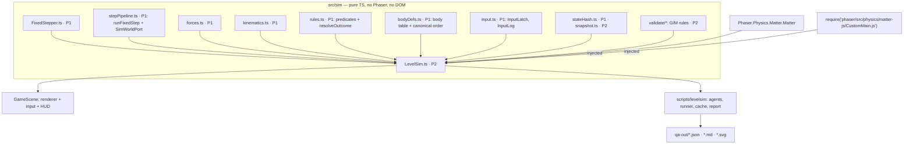

# Level QA Simulation: the Headless Bot as a Long-Term QA System

> **Status:** architecture of record for P2 (EXECUTION-ORDER steps 9 and 11), written 2026-10-07 against `master @ d3c6aab`.
> **Conforms to:** D-01 (fixed step, sim clock, FORCE_SCALE), D-02 (armed sim), D-03 (win precedence), D-04 (the fight test feeds the retune), D-06 (shared pure sim, agents A0–A6, CI split), D-07 (bot route = "Show me" ghost), D-22 (chunk jitter and pair-check reuse this bot), D-26 (formula untouched), D-27.
> **Companions:** [`LEVEL-ENGINE.md`](LEVEL-ENGINE.md) (data model, the G/M rules, report schema and score formulas) · [`../roadmap/phases/P02-level-engine-qa.md`](../roadmap/phases/P02-level-engine-qa.md).
> **Labels:** **[V]** verified in the repo · **[A]** audit §C · **[R]** research (`game-design.md` §6, `physics-rendering.md` Q4) · **[D]** decided here · **[ASSUMPTION]**.

---

## 0. What the bot must answer

| Question | Who answers | Gate |
|---|---|---|
| Does the level play itself after one tap? | A0 | B-01 (fast, blocking) |
| Does one press anywhere win? | A1 | B-02 (fast, blocking) |
| Does "pull straight at the goal" win? | A2 | B-03 (fast, blocking) |
| Does hugging a wall skip the idea? | A3 | B-04 (fast, blocking) |
| How findable is a solution? | A4 (AUCCESS) | B-05 (nightly) |
| Is it solvable, and how fast at best? | A5 beam | B-06 (nightly); feeds par |
| How hard is it to execute? | A6 noisy expert | B-07 (nightly); feeds par |
| Is the featured mechanic required? | ablation | B-08 (nightly) |
| Do earlier solutions still work after a change? | stored-solution replay | B-11 (fast, blocking) |
| Is the sim still deterministic? | canary | B-13 (fast, blocking) |
| Is it fun, readable, fair-feeling? | **humans only** (§9) | playtest protocol |

---

## 1. Architecture

### 1.1 Module map



- **P2 reuses P1's sim core; it does not redefine it.** The P1 module names below follow `TECHNICAL-ARCHITECTURE.md` §4.1.
  - `LevelSim` is the `SimWorldPort` implementation that **owns its own Matter world**, and it steps through P1's `runFixedStep()`. The D-01 order therefore has exactly one source.
  - It absorbs P1's test-only `HeadlessWorld`, which becomes a thin wrapper over `LevelSim` or is deleted once GameScene uses `LevelSim`.
  - P2 adds only `LevelSim.ts`, `snapshot.ts`, `matter.ts` and `validate/`, and extends `bodyDefs.ts`, `rules.ts` and `input.ts` where needed.
- **GameScene becomes a thin renderer** (D-06). Entities stop creating Matter bodies and draw from `sim.ball()` and `sim.poseAt(simMs + α·S)`.
- **EndlessScene keeps P1's `FixedStepper` + `forces.ts`.** Its own `RunSim` adapter belongs to P8 (chunk pair-check, D-22). This is a scoping choice, flagged in the P02 plan.

### 1.2 One Matter build, two runtimes [V]

- `node_modules/phaser/src/physics/matter-js/CustomMain.js` assembles the Matter namespace and requires only `./lib/*`. It is pure CommonJS, and it is the same object Phaser exposes as `Phaser.Physics.Matter.Matter`, which the game already uses as `RawMatter` in `src/utils/matter.ts:6`.
- `src/sim/matter.ts` declares a typed `MatterNamespace` subset:
  - `Engine.create/update`
  - `Bodies.circle/rectangle`
  - `Body.setPosition/setVelocity/setAngle/setAngularVelocity/applyForce`
  - `Composite.add`
  - `Pairs`
- `LevelSim` receives it through its constructor:
  - the browser passes `Phaser.Physics.Matter.Matter`
  - Node passes `createRequire(import.meta.url)('phaser/src/physics/matter-js/CustomMain.js')`
- Phaser stays at 3.90 (D-28), so both runtimes run byte-identical Matter 0.20 source.
- **LevelSim owns its own `Engine`**: `Engine.create({ gravity: { x: 0, y: 0, scale: 0 } })`, with Matter defaults (positionIterations 6, velocityIterations 4, sleeping off).
  - [ASSUMPTION] These options must equal what Phaser's `World.js:73` passes from the game's matter config, and Phaser's collision-events plugin must not alter integration. A T-task parity test verifies both.
- **Rejected alternative:** borrowing `this.matter.world.engine`. It couples the sim to Phaser's world lifecycle (rebuilt on every `scene.restart`) and makes Node differ from the browser.

### 1.3 LevelSim API

```ts
// src/sim/LevelSim.ts — implements P1's SimWorldPort (stepPipeline.ts); inputs are P1's LatchedInput {on,x,y}
import type { LatchedInput, InputLog } from './input';          // P1
import type { SimWorldPort, StepOutcome } from './stepPipeline'; // P1
export interface BallState { x: number; y: number; vx: number; vy: number; angle: number; av: number }
export interface Pose { platforms: Vec2[]; hazards: Array<{ x: number; y: number; live: boolean }>; goal: Vec2 }
export type RulesMode = 'v2' | 'legacy-hazard-first' | 'legacy-unarmed';  // legacy = audit reproduction only
export interface SimOptions {
  rules?: RulesMode;                    // default 'v2'
  forceScale?: number;                  // default PHYSICS.FORCE_SCALE (D-01, provisional 2.08)
  ablate?: Array<{ ref: MechanicRef; index?: number; kind: AblationKind }>;
  transforms?: Transform[];             // applied before build (remix / jitter / mirror)
  record?: boolean;                     // keep InputLog + 60 ms path samples
  hudExclusion?: Rect[];                // presses inside are dropped, as isOverUi does (GameScene.ts:796)
}
export type SimEvent =
  | { step: number; kind: 'arm' }
  | { step: number; kind: 'press' | 'release'; at: Vec2 }
  | { step: number; kind: 'portal'; pair: number; from: 'a' | 'b'; exit: Vec2 }
  | { step: number; kind: 'gate'; index: number; open: boolean }
  | { step: number; kind: 'gem' } | { step: number; kind: 'orb'; index: number }
  | { step: number; kind: 'phase'; id: string }
  | { step: number; kind: 'win' }
  | { step: number; kind: 'death'; cause: 'hazard' | 'timeout' | 'oob'; element?: ElementRef };

export class LevelSim implements SimWorldPort {
  constructor(cfg: LevelConfigV2, matter: MatterNamespace, opts?: SimOptions);
  readonly step: number; readonly simMs: number; readonly armed: boolean;
  readonly outcome: 'preview' | 'running' | 'win' | 'death';
  arm(): void;                                   // D-02; the first 'on' input calls it implicitly
  fixedStep(input: LatchedInput): boolean;       // = runFixedStep(this, input, simMs, S); false ⇒ run ended
  ball(): Readonly<BallState>;
  poseAt(simMs: number): Pose;                   // P1 kinematics (hazardPose/platformPose/goalPose), for interpolated rendering
  drainEvents(out: SimEvent[]): number;          // side effects are queued; caller flushes (audio/haptics/analytics)
  snapshot(): SimSnapshot;
  restore(s: SimSnapshot): void;
  hash(): string;                                // P1 stateHash() + P2 flags (gem, orbs, gates, phase)
  inputLog(): InputLog;                          // P1 InputLog (RLE runs)
  // SimWorldPort (P1): applyKinematics, updateGates, applyForces, storePrev, stepPhysics, resolvePortals, collectPickups, evaluate
}
export function replay(cfg: LevelConfigV2, log: InputLog, m: MatterNamespace, o?: SimOptions):
  { outcome: 'win' | 'death' | 'timeout' | 'stuck'; simMs: number; gem: boolean; hash: string; events: SimEvent[] };
```

### 1.4 Step order and rules modes

`fixedStep` follows D-01 §2 exactly:
1. latch and log the input
2. kinematics at `simMs + S`
3. gates (before collision detection)
4. forces: attractor + zones + magnets, through `forces.ts`, × FORCE_SCALE, with the formula unchanged (D-26)
5. `Engine.update(S)`
6. portals → gem/orbs → **win → hazard** (D-03) → timeout → oob

| Mode | Difference | Why it exists |
|---|---|---|
| `v2` | Armed start; win beats a hazard in the same step | The shipping rules |
| `legacy-hazard-first` | Hazard is checked before win (today's `GameScene.ts:922-923`) | Reproduces the audit's L74 47% death rate |
| `legacy-unarmed` | Steps from build; random start delay allowed | Reproduces L11/L12 zero-input wins and L80's 82% |

`physics-rendering.md` Q2 recommended keeping hazard-first. D-03 overrides it, and `v2` follows D-03.

### 1.5 Determinism contract

| Requirement | Enforcement |
|---|---|
| Same Matter code | One module file in both runtimes (§1.2) |
| Fixed `S = 1000/60`, timeScale 1 | LevelSim asserts; the FixedStepper (P1) is the only caller in the browser |
| Canonical body order = today's GameScene | `bodyDefs.ts` (P1, extended in P2): walls T, B, L, R (`GameScene.ts:334-337`) → ball → obstacles → gates → moving platforms (`GameScene.ts:349-411`). A unit test asserts `engine.world.bodies` labels in order. Matter's `Detector` sorts by `bounds.min.x` with a stable sort, so the order matters [R Q4]. |
| Identical body options | One table in `bodyDefs.ts`, filled from today's entities (ball: restitution 0.65, friction 0.01, frictionAir 0.02 per `physics.config.ts:11-13`; walls: restitution 0.5, friction 0) |
| No randomness in `src/sim` | Lint bans `Math.random` and `Common.random`. Agents use a seeded `sfc32` (`scripts/levelsim/rng.ts`). |
| No wall clocks | P1's lint rule, extended to `src/sim/**` (`Date.now`, `performance.now`, `game.loop.time`, `this.time.now`) |
| Pure kinematics | P1 `kinematics.ts`. No tweens on gameplay objects (D-01 §4). |
| Input latched once per step | `fixedStep(input)` is the only entry point |
| Float environment | V8 in Node and in the Android WebView; transcendental functions via V8's fdlibm port [R Q4]. iOS/JSC (D-29) gets a tolerance mode. |
| Verification | (a) Node replay twice → identical hash (unit). (b) Node 20 vs 22 hash matrix, weekly (CI runs Node 20 per `ci.yml`; dev runs 24.18 [V]). (c) Browser via the P1 harness at 30/60/90/120/144 Hz vs Node, identical for all stored solutions (weekly, plus every change under `src/sim/**`). |

### 1.6 Snapshot and restore

```ts
export interface SimSnapshot {
  step: number; simMs: number; armed: boolean; outcome: LevelSim['outcome'];
  ball: { x: number; y: number; px: number; py: number; angle: number; anglePrev: number; av: number }; // Verlet prev
  gatesOpen: boolean[]; portalLastJumpMs: number[]; gem: boolean; orbs: boolean[];
  phase: number; presses: number; heldMs: number; lastInput: LatchedInput;
}
```

**Restore** does four things:
1. writes the ball's `position`, `positionPrev`, angle and `anglePrev`
2. sets gate sensor flags
3. places kinematic bodies at `poseAt(simMs)`, with their previous pose
4. clears the contact-pair cache

Only the ball is dynamic, so a snapshot is about 30 numbers, which is what makes beam search cheap [R §6].

**Contract.** Restore-then-continue is **not** guaranteed bit-equal to a cold replay while contacts are active, because Matter's pair cache carries warm-start impulses [ASSUMPTION; the T-task measures the divergence distribution]. Therefore:
- A5 uses snapshots only to *search*.
- Every reported solution is a **cold replay of its input log**.
- Only cold-verified numbers enter the report.

### 1.7 Node CLI

```
npm run levelsim -- --tier quick|fast|nightly|weekly --levels all|changed|<id,...>
                    [--rules v2|legacy-hazard-first|legacy-unarmed] [--force-scale 2.08]
                    [--jobs N] [--no-cache] [--svg] --out qa-out
npm run level:check -- <id> [--watch] [--svg]          # designer quick-check (tier quick)
```

- **Build:** `esbuild` (present in `node_modules/.bin` via Vite [V]; pin it as an explicit devDependency) bundles `scripts/levelsim/cli.ts` together with `src/content` and `src/sim` into `.levelsim/levelsim.mjs`. Ad-hoc runs can use `vite-node` (present via Vitest 1.6 [V]).
- **Workers:** a `node:worker_threads` pool, defaulting to `os.cpus().length − 1` workers. The unit of work is `(levelId, agent)`.
- **Layout:** `scripts/levelsim/{cli.ts, runner.ts, cache.ts, rng.ts, matter-node.ts}`, plus `agents/{a0-none, a1-nudge, a2-pursuit, a3-wallhug, a4-random, a5-beam, a6-noisy, scripted, ablation}.ts`, `report/{json, markdown, svg, scores, par}.ts` and `fixtures/audit-2026-10-07.ts`.

---

## 2. Input model

### 2.1 Frames and logs
- The sim consumes one P1 `LatchedInput` per step.
- Logs use P1's run-length `InputLog.runs: Array<[count, on: 0 | 1, x, y]>` (`TECHNICAL-ARCHITECTURE.md` §4.1), where `count` is a step count. P2 adds no second log format.
- Agents emit integer-pixel targets. Recorded human logs keep the values the sim actually latched (rounded to 0.01 px), so a replay is exact.
- A typical solution is 0.5–2 KB, small enough to ship as the D-07 "Show me" ghost: the game can replay it live through LevelSim.

### 2.2 Macro-actions [R §6]
- The agent decides every **250 ms (15 steps)**.
- An action is either *release* or *hold at polar (r, θ) relative to the ball at decision time*:
  - r ∈ {60, 100, 150, 220, 300} px
  - θ ∈ 16 directions
  - that gives 80 holds + release = **81 actions**
- The hold point is fixed **in screen space** for the macro, because a finger presses a place on the glass, not a point that follows the ball.

### 2.3 Human limits [R §6, D]
| Limit | Value | Effect |
|---|---|---|
| Drag speed | ≤ 1500 px/s (25 px/step) | Re-targeting a held press moves along a capped path |
| Lift + re-press | release ≥ 100 ms (6 steps), press ≥ 50 ms (3 steps) [ASSUMPTION] | A far re-target picks the cheaper of drag or lift |
| Reaction delay | 200 ms (12 steps) | Closed-loop agents (A2, A3, A6, scripted) observe the state from 12 steps ago |
| UI parity | Presses inside `hudLayout` rects are dropped | Same as `isOverUi`; keeps the bot honest about HUD-covered goals (G-15) |
| Arena | Holds clamped to the canvas | The attractor may sit outside the play box, as in the game |

### 2.4 Noise model [R §6, Isaksen]
- **Expert noise (A6):**
  - σ = 8 px Gaussian on each hold target, per macro
  - σ = 40 ms on macro boundary times, rounded to steps
  - reaction delay and drag limit on
- **Micro-noise:** σ = 2 px, σt = 0. Used for chaos detection (replayVariance).
- **Seeding:** each run is seeded from `hash(levelId, agent, runIndex)`, so every report is reproducible.

---

## 3. Agents and analyses

| Agent | Policy | Rollouts | Horizon | Output | Gate |
|---|---|---|---|---|---|
| **A0 none** | `arm()` with no force (a sub-step tap, or a tap beyond `ATTRACTOR_MAX_DIST` 310 px), then nothing | 1 (+1 legacy-unarmed) | 30 s | outcome, time, gem | B-01 |
| **A1 nudge grid** | Press at grid point p for d ∈ {250, 500, 1000} ms, then coast | Fast: 48 px grid, in reach of spawn and outside HUD rects ≈ 225. Nightly: 24 px grid ≈ 900, × arm-wait w ∈ {0, 400, 800} ms | coast ≤ 10 s, or at rest 60 steps | win rate, win map | B-02 |
| **A2 pursuit** | Hold at ball + L·û(goal − ball) − v·kd, kd = 6 (the prototype `route()` controller), L ∈ {100, 150, 220} | 3 | min(limit, 30 s) | wins, time | B-03 |
| **A3 wall-hug** | Hold at x = 4 (left) or 356 (right), lead 80/120 px along the wall toward goal.y; at \|Δy\| < 150 switch to A2 | 4 | min(limit, 30 s) | wins, time | B-04 |
| **A4 random** | Per macro: release with p = 0.25, else uniform over the 80 holds | 2000 | min(limit, 30 s) | p̂, AUCCESS, best-5% progress, route families, death heatmap | B-05, B-12 |
| **A5 beam** | Width 64 × 24 "sensible" branches per macro; cold re-verify | 1 search per objective (goal, gem→goal) | min(limit, 40 s) | T_best, route, input log | B-06, par |
| **A6 noisy expert** | Closed-loop follower of A5's path, with §2.4 noise | 50 goal + 20 gem + 20 micro | min(limit, 40 s) | s_noisy, T_noisy median/p90, death classes, flip rate | B-07, par |
| **Scripted** | Same follower over `qa.intendedRoute` or audit fixtures | 20 noisy | min(limit, 40 s) | works / fails | B-14, acceptance |
| **Ablation** | Neutralise each `uses` ref (registry `ablate` kind), then A2 + A3 + A5 width 32 | per ref | as A5 | solved?, T_abl / T_best | B-08 |

### 3.1 A0: why "arm" rather than "nothing"
- Under D-02 a level cannot run with zero input, so a pure "do nothing" bot always stalls.
- The real exposure is a player who taps once, anywhere, and watches.
- A0 therefore arms with zero force. L11 still wins this way, because its spawn sits inside a zone that out-muscles everything ([A] C.2). The armed clock hides nothing.

### 3.2 A1
- An in-reach grid point is one within 310 px of the spawn. Points out of reach are equivalent to A0 and are skipped.
- Nightly adds arm-wait offsets: under the armed sim a player can tap, wait, then nudge. That re-introduces the kinematic phase variety the audit got from random start delays.

### 3.3 A5 sensible moves [R §6 Cut the Rope]
The 24 candidate moves are:
- holds at r ∈ {100, 150, 220} along the **flow-field direction** ± {0, 22.5, 45, 67.5}° (21 moves)
- release
- repeat-previous
- hold-at-goal (when the goal is in reach)

The flow field is the reverse Dijkstra of the 4-px free-space grid, including the analyzer's 16-direction portal edges.

Node cost:

`flowDist(ball)/300 px/s + simMs/1000 + 2·Σ_h max(0, 2R − clearance_h)/R + [gem objective, gem not taken]·flowDist_gem/300`

The coefficients are [D] and tunable in `qa.config.ts`.

- **Dedup:** quantise to (8 px position, 0.5 px/step velocity, flags) and keep the best node per cell.
- **If unsolved:** retry at width 128. A failure at 128 while G-19 passes is a human-check item, not proof of impossibility.

### 3.4 A6: why closed-loop
- An open-loop replay of a chaotic trajectory with 8 px noise underestimates people, because humans correct.
- A6 therefore follows A5's *ball path*: one waypoint per 250 ms, using the prototype's `route()` controller (lead 85, kd 6, tol 26) with delayed observations.
- The open-loop σ = 8 px replay is kept as a diagnostic: the `brittleness` value under `extra`.

### 3.5 Randomized replays
Stored solutions are re-planned under each `VariantRule` transform: mirrorX, jitter ±12 px, hazardSpeed 0.9–1.1. Each variant gets A5 width 32 + 20 A6 runs. This is how "bot-verified jitter" (D-22) is checked for remixes, and later for Run chunks. Arm time is fixed under D-02, so random start delays only exist in `legacy-unarmed`.

### 3.6 Frame-rate comparison (weekly, plus on `src/sim/**` changes)
- **Mode 1 (exactness):**
  - Convert each stored input log to timestamped pointer events.
  - Play them in headless Chromium through the P1 multi-rate harness at 30/60/90/120/144 Hz ± 1 ms jitter. CLAUDE.md: Python Playwright with `--disable-gpu --use-gl=swiftshader`.
  - Assert the same outcome, `simMs` and final hash as Node.
- **Mode 2 (human sampling):**
  - Quantise input changes to frame boundaries at rate R (a 30 fps phone samples touches every 33 ms).
  - Re-run A6 under that quantisation.
  - Flag levels whose s_noisy drops > 10 pp at 30 Hz: the level demands sub-frame precision.

### 3.7 Expected-route analysis
- **Route families:** cluster A4 wins, A5 and the intended route by discrete Fréchet distance (merge at < 60 px).
- **Flags:**
  - the intended route fails (B-14)
  - the best family is not the intended one and is ≥ 10% faster (a bypass term)
  - more than 30% of route time is in wall contact, or inside an edge band (G-16, B-15)

### 3.8 Timing and hazard-interaction analysis
- **For each kinematic element the A5 route crosses:**
  - the clear window per cycle at the crossing point (ms)
  - the bot's wait before crossing
  - the phase on arrival
  - these are compared with the G-07b thresholds (300/220/150 ms)
- **Timer slack:** `limit / T_noisy_p90`.
- **For each hazard:**
  - minimum clearance along the A5 route
  - time within 2R of its kill region during A6 runs
  - share of A4/A6 deaths
  - `decorative` = never within 3R of any winning route **and** removing it changes T_best by < 5%
- Death heatmaps go into the SVG.

### 3.9 Mechanic ablation [R §6]
| Kind | Applied to | Neutralised by |
|---|---|---|
| zeroForce | zones, magnets | strength 0 |
| remove | portals, hazards | element deleted |
| solid → remove | gates | always-solid first, then removed (both reported) |
| freezeAtT0 → remove | platforms; moving goal | t = 0 pose first, then removed |
| disable | launch, timer, orbs | field ignored |

- **Tools** (zones, magnets, portals, gates, platforms): solved in ≤ 1.1 × T_best without the tool ⇒ **decorative** (B-08).
- **Constraints** (hazards): the hazard counts as constraining if T_best with it is ≥ 1.1 × T_best without it, or if removing it changes the route family. Otherwise it is decorative.

---

## 4. Per-level diagnostics, scores and par

- **Diagnostics.** Every agent writes the `LevelRecord` fields in LEVEL-ENGINE §5.1: static, agents, ablation, timing, hazards, route, par.
- **Scores.** The **10 scores** (difficulty, fairness, bypass, novelty, mechanicDependency, timerQuality, gemQuality, readability, replayVariance, selfSolve) are computed **only** in `scripts/levelsim/report/scores.ts`, using the formulas in LEVEL-ENGINE §5.2. The fast tier fills `selfSolve`, `bypass` (partial), `novelty` (raster), `readability`, and provisional `timerQuality`/`gemQuality`. The rest are `null` until nightly.

**Par formula** [R §2]:

```
par      = ceil_to_0.5s( max( 1.30 × T_noisyExpert_median , T_best + 1.5 s ) )
ceil_to_0.5s(t) = 500 · ⌈t / 500⌉   (ms)
```

- **T_best:** A5 goal-only, cold-verified, sim-ms from arm. Stars are independent ★s (`scoring.ts:19-24`), so par ignores the gem.
- **T_noisyExpert_median:** the median over A6 goal-route wins.
- **Low-confidence fallback:** fewer than 10 of 50 A6 wins ⇒ `par = ceil_to_0.5s(max(1.6 × T_best, T_best + 1.5 s))`, `confidence: 'low'`. B-07 fires anyway.
- **Timed levels:** `limitSuggested = ceil_to_0.5s(max(1.15 × T_noisy_p90, par + 3 s))`, and par ≤ limit − 2 s.
- **Drift:** `driftPct = (suggested − current) / current`. Above 25% it is a warn (B-10).
- **Applying it:** P2 *reports* par and never edits content. P4-α (step 13) writes par into the levels with `parSource: 'formula'`, once FORCE_SCALE is final (D-01). Until then every report carries `forceScale`, and changing it invalidates the cache.
- **Refit (after M1):** for each level with ≥ 30 clears, `k_level = Q₀.₃₂(human clear times) / T_noisy_median`. Then `k_w = median(k_level)` per world replaces 1.30, so the 3★ share lands in 25–40% [R §2]. Levels with sparse data use `k_w`.

---

## 5. Gates and CI tiers

### 5.1 Bot rules

| ID | Condition | Severity | Tier | Blocks CI |
|---|---|---|---|---|
| B-01 Self-solve | A0 wins. `qa.allowSelfSolve` (sandbox only) ⇒ info. | error | fast | yes |
| B-02 One-nudge | A1 win rate ≥ 0.05 at slot ≥ 3, or any A1 win for mastery/boss (unless tagged `onePress`) | error (any win at slot ≥ 3 = warn) | fast | yes |
| B-03 Naive solve | A2 wins on mastery/boss | error (slot ≥ 4 = warn) | fast | yes |
| B-04 Wall-hug | Any A3 variant wins and the level uses `hazard.*`/`platform.*` or is mastery/boss, without `qa.lanes` | error | fast | yes |
| B-05 Findability | A4 p̂ = 0 and no scripted success ⇒ human check | warn | nightly | no |
| B-06 Solvable | A5 (64 → 128) fails. With G-19 passing ⇒ warn; scripted and intended routes also failing ⇒ error | warn/error | nightly | no |
| B-07 Execution band | s_noisy outside [0.40, 0.90] (sandbox/experiment may exceed 0.90) | warn | nightly | no |
| B-08 Decorative mechanic | Any `uses` ref with T_abl ≤ 1.1·T_best | error | nightly | no (report) |
| B-09 Timer slack | limit < 1.10·T_noisy_p90 ⇒ error; limit > 3·T_noisy_median ⇒ warn | error/warn | nightly | no |
| B-10 Par drift | \|drift\| > 25% | warn | nightly | no |
| B-11 Solution regression | Unchanged level hash and the stored `qa/solutions/<id>.json` no longer wins, or no longer beats par ⇒ error. Changed hash ⇒ quick re-plan (A5 width 16, 20 s cap); failure ⇒ warn + nightly. | error/warn | fast | yes |
| B-12 Boss ordering | Boss difficulty ≥ the world's slot-9 level and ≥ hardest non-boss − 0.5; lowest A4 p̂ in its world | warn | nightly | no |
| B-13 Determinism canary | 10 fixed levels × stored logs: replayed twice in-process and once in a fresh worker; hashes must be identical | error | fast | yes |
| B-14 Intended route | The scripted follower over `intendedRoute` fails ≥ 50% of 20 runs, or an unintended family is ≥ 10% faster | warn | nightly | no |
| B-15 Edge dependence | A5 restricted to non-edge-band holds fails, or is > 1.25× slower | warn | nightly | no |

G-17 (the zone fight test) is a sim micro-scenario that runs in the fast tier. Blocking status follows D-06: static rules and A0–A3 block; slow agents report. Promoting any nightly rule to blocking needs a DECISIONS edit.

### 5.2 Tiers

| Tier | Trigger | Content | Budget | Blocking |
|---|---|---|---|---|
| **Q** designer quick-check | `npm run level:check -- <id>` | static G/M; A0; A1 (48 px); A2; A3; G-17; A5 width 16 (20 s cap); rough par (1.6 × T_best rule, labelled *rough*); SVG | **< 30 s** per level | — |
| **F** fast | every push/PR: new `levelsim-fast` job in `.github/workflows/ci.yml` | static G/M on **all** levels (milliseconds); A0–A3 + G-17 on **changed** levels (cache); B-11; B-13 | **< 3 min** with a cold cache | **yes** |
| **N** nightly | `levelsim-nightly.yml`, 02:00 UTC on master, 4 shards | A1 at 24 px with waits; A4; A5 ×2; A6 + micro; ablation; par; gem Δ; timing; hazards; routes; G-11 route layer; trend diff | ≤ 90 min wall | no. Opens or updates one tracking issue on new errors. |
| **W** weekly | Sunday, plus `src/sim/**` changes | frame-rate modes 1–2; legacy-mode audit reproduction; Node 20/22 hash matrix | ≤ 60 min | no. A determinism failure blocks the next milestone tag. |

---

## 6. Compute budget and caching

**Benchmark first** [R §6]. The research estimate is 20–60 µs/step for 10–20 bodies. Our levels have ≤ 12 bodies (inventory max at L69) and exactly one dynamic body, so the planning range is **10–30 µs/step**. P02-T10 measures the real figure on the CI runner and writes it into every report (`usPerStep`).

| Work per level | Steps |
|---|---|
| A0 1 × 1800 · A2 3 × ~600 · A3 4 × ~700 · G-17 · B-11 replay | ≈ 9 k |
| A1 fast (≈ 225 rollouts × ~360 steps) | ≈ 81 k |
| **Fast tier total** | **≈ 90 k** |
| A1 nightly (900 × 3 waits × ~360) | ≈ 0.97 M |
| A4 (2000 × ~900) | ≈ 1.8 M |
| A5 two objectives (64 × 24 × 15 steps × ~40 depths, ×2) | ≈ 1.8 M |
| A6 + micro (90 × ~700) | ≈ 63 k |
| Ablation (≈ 2 refs × A5 width 32 + A2/A3) | ≈ 0.9 M |
| **Nightly total** | **≈ 5.5 M** |

| Run | Steps | Core time at 10 / 30 µs | Wall time |
|---|---|---|---|
| Fast, cold cache, 150 levels | 13.5 M | 135 / 405 core-s | 4 vCPU: 34–101 s + ~30 s build ⇒ **< 3 min**. 2 vCPU: 68–203 s [ASSUMPTION: runner size depends on repo visibility and plan]. |
| Fast, typical PR (≤ 5 changed levels) | ≤ 0.5 M | ≤ 15 core-s | seconds |
| Nightly, 150 levels | 825 M | 2.3 / 6.9 core-hours | 4 shards × 4 vCPU: 9–26 min |
| Quick-check, 1 level | ≈ 0.4 M | 4 / 12 s | **< 30 s** on a laptop core |

**Fallback.** If the measured µs/step makes the cold fast tier exceed 150 s, the fast tier runs A1 on changed levels only, even with a cold cache. Full-campaign A1 then moves to nightly. This is recorded as a STATUS note.

**Cache.**
- Key: `sha256(canonical level JSON after transforms ∥ simVersion ∥ constantsHash ∥ forceScale ∥ agentId@version ∥ agentParams ∥ rulesMode)`.
- Stored as `.levelsim-cache/<key>.json` via `actions/cache` (restore keys: branch, then master).
- Static rules are never cached. The B-13 canary always runs.
- A sim or constants change invalidates every entry. That is exactly the cold case the budget above is sized for.

---

## 7. Output artefacts

| Path | Content | Lifetime |
|---|---|---|
| `qa-out/level-quality-report.json` / `.md` | LEVEL-ENGINE §5 schema and format | CI artefact (30 days) |
| `qa-out/levels/<id>.json` | Full diagnostics, including per-run death lists | artefact |
| `qa-out/svg/<id>.svg` | Overlay: A5 route, intended route, wall lanes, portal exit fans (bad directions red), kill regions, A1 win map, death heat | artefact; also from `level:check --svg` |
| `qa-out/junit.xml` | One test case per (level, rule), for PR annotations | artefact |
| `qa-out/trend.json` | Score deltas and gate flips vs the previous nightly artefact | artefact |
| `qa-out/framerate.json` | Weekly modes 1–2 | artefact |
| `qa/solutions/<id>.json` (checked in) | `{ id, levelHash, simVersion, forceScale, objective, tBestMs, log: InputLog, path: PathPoint[≤90], hash }`. Feeds B-11 and the D-07 "Show me" ghost. | Updated by a nightly bot PR, human-merged |
| `qa/baseline.json` (checked in) | Ratchet entries (LEVEL-ENGINE §4.1) | Human-edited |

---

## 8. Calibration with human data (later: M1 onwards)

- **Targets per level:** first-attempt success rate (FASR), attempts per success (APS), time to pass, abandon rate, 3★ share, gem share.
- **Sources:**
  - P6 `level_end{success, cause, attempt, duration_ms}`, keyed by the `level_id` param P2 adds
  - closed-test (M1) cohorts
  - playtest CSVs (§9)
- **Features (agent best-case first).**
  - Rovio's 2021 work and Tactile's 2023 work both found the **best ~5% of agent runs** the strongest predictor of human completion [R §6].
  - So: best-5% A4 progress (`1 − flowDist(closest approach)/flowDist(spawn)` over the top 5% of runs), AUCCESS, p̂, s_noisy, T_best, T_noisy, the minimum precision window and corridor, hazards near the route, route length, `dStatic`, role, and world order.
- **Model:**
  - OLS on logit(FASR) and log(APS), with ≤ 6 features at first. M1 gives roughly 30 levels (W1–3).
  - Leave-one-world-out cross-validation, with per-world shrinkage.
  - Report MAE; target ≤ 10 pp on FASR. For reference, King's CNN reached 4.0% MAE on far more data [R §6].
  - Later: a Rovio-style sim2real population. Draw A6 noise σ per synthetic player so the bot pass-rate distribution matches humans.
- **Use:**
  - the fitted model replaces the v1 difficulty weights
  - k_w refits par (§4)
  - levels with |predicted − actual FASR| > 15 pp go to design review
- **Versioning:** the model lives in `qa.config.ts` as `difficultyModel@<version>` and is recorded in `run.agentVersions`.

---

## 9. What bots cannot tell us, and the human playtest protocol

**Bots cannot measure:**
- fun or the "aha"
- whether players *read* the idea
- perceived fairness: whether a death felt deserved [R §1 Juul]
- tilt and frustration
- whether a hint teaches
- thumb occlusion of the ball
- edge-gesture conflicts on real devices
- whether drag-to-steer is discoverable
- emotional pacing and novelty *as felt*
- accessibility (colour, reduced motion)
- device frame pacing and touch latency
- how players learn across attempts (A6 already knows the route)
- exploits humans share socially

Bots also find exploits humans never would. Those are triaged with a `bot-only` note in the baseline. They are fixed anyway when the level's idea is routing, because a self-solving level is actively harmful [R §1].

**Protocol, per world [R §6 point 8; Portal "watch people play"]:**

| Item | Rule |
|---|---|
| Testers | **5–8 per world**, new to that world. For W1–3, new to the game. Adults, or minors with guardian consent (audience is 13+, D-25). Mix casual-puzzle and physics-game players; at least one left-handed. |
| Devices | At least one low-end 60 Hz Android and one 120 Hz Android |
| Build | QA build (internal track) that logs, per attempt, the LevelSim input log, outcome, cause and sim-ms to a local file. No network. |
| Session | Watched (in person, or video with a hands camera). The facilitator stays silent. Up to 25 min, or until the boss is cleared. Relief ladder as shipped (once P3 lands). No think-aloud *during* play (it slows reactions); retrospective instead. |
| Per level, observed | Time to first purposeful press · first-attempt outcome · attempts to clear · each death (stamped cause vs the tester's explanation) · verbatim confusion moments · aha moments · wall-hugging or edge holds · accidental HUD taps · quit/skip |
| Per level, asked | Two 1–5 ratings: "fun", and "the failures were my fault" |
| Post-world interview | (1) What was this world about? Compare with `newRule`. (2) Which level felt unfair, and why? (3) Which felt like it played itself? (4) The most satisfying moment? (5) Anywhere you couldn't tell what to do? |
| Flag a level when | ≥ 2 testers say "played itself" or "unfair"; **or** median attempts fall outside the slot target (1 · 1–2 · 2 · 1–2 · 3 · 2–3 · 4 · 2 · 5–6 · 6–10, [R §2]); **or** ≥ 2 testers take > 10 s to a purposeful press |
| Outputs | `docs/playtests/<date>-<worldId>.md` + `docs/playtests/data/<date>-<worldId>.csv`. Human input logs are replayed in LevelSim to compare route families with the bot, and they feed §8. |
| Disagreement | Bot-only exploit ⇒ keep the gate, lower the priority. Human-only difficulty (the bot passes, humans fail) ⇒ readability or fairness redesign. Never "fix" the bot to agree. |

---

## 10. Mapping the prototype and analyzer onto the new code

Scratch root: `%LOCALAPPDATA%\Temp\claude\…\scratchpad\`. Read 2026-10-07 [V].

| Prototype piece | Where | Becomes | Required change |
|---|---|---|---|
| Engine/world build | `design-w1-8/sim.cjs:31-58` | `LevelSim` build + `bodyDefs.ts` (P1) | **Body order differs:** the prototype adds platforms before gates and the ball last; the game does walls → ball → obstacles → gates → platforms. Use the game's order. |
| Frame loop (policy → forces → gates → portals → gem → orbs → hazard → win → oob → `Engine.update`) | `sim.cjs:68-120` | P1 `runFixedStep` over LevelSim's `SimWorldPort` | D-01 order (checks after the step), D-03 win before hazard, armed start |
| `beamPhase`/`goalPhase = Math.random()·1e5` | `sim.cjs:60-61` | deleted | Phases become deterministic `f(simMs)`. Randomness survives only in `legacy-unarmed`. |
| `loadLevel(n)` (regex-stripped TS + `new Function`) | `sim.cjs:19-25` | `index.gen.ts` via the esbuild bundle | `n` was a *file* number (L11 = `level7`), which ids remove |
| `yoyo` Sine.easeInOut | `sim.cjs:26-29` | P1 `kinematics.pingPongSine` | P1 checks parity with Phaser's ease |
| Policies `none`, `nudge`, `route` (lead/kd/tol), `staged`, `holds`, `delayed` | `sim.cjs:125-140`, `batch2/5.cjs` | A0, A1, the shared follower (A2/A3/A6/scripted), fixtures | `delayed()` start offsets → arm-wait |
| batch1–6 scenario lists | `design-w1-8/batch*.cjs` | `fixtures/audit-2026-10-07.ts` (§11) | by `LevelId` |
| `census.cjs` route counts | `design-w1-8/census.cjs` | G-13d + `route:*` backfill | — |
| `rectSD`, hazard motion/samples, `hazClear` | `content-inventory/analyze.mjs:50-99` | `validate/geometry.ts`, `sweep.ts` | through P1 kinematics |
| `buildGrid`, `dijkstra`, `dijkstraRev`, 16-dir portal edges | `analyze.mjs:111-209` | `validate/grid.ts` (G-19, G-08b, G-04, A5 flow field) | TS + tests |
| `idleSim` | `analyze.mjs:210` | A0 on LevelSim | no second physics |
| `idealMs` | `analyze.mjs:104-109` | G-10, provisional timerQuality | constants × FORCE_SCALE |
| `elementsOf`, fingerprints, `similarity` | `analyze.mjs:419-444` | G-11 layer 1, `levelHash` input | + raster + route |
| Flag families (`goalDanger`, `portalExit*`, `bypass`, `gemIssues`, `unfairTimers`, `trivial`, `spikes/dips`, `simpleBosses`) | `analyze.mjs:485-545` | G-03, G-06, G-08b, G-04, G-10, features, G-14/B-12 | rule ids + severities |
| Difficulty proxy D | `levels.json` `Dcomp` | `static.dStatic` (a model feature, never a gate) | — |
| Endless `laneInfo`/`widest` | `analyze.mjs:562-570` | shared lane math (G-09, chunk validator in P8) | — |
| `bundle.mjs`/`entry.ts` | `content-inventory/` | the in-repo esbuild step | reproducible |
| Kill intervals, lanes; mechanic signature + hint Jaccard | `design-w9-15/bypass.ts`, `dup.ts` | G-09, G-12 | — |

---

## 11. Acceptance tests: known defects the bot must reproduce

These live in `scripts/levelsim/fixtures/audit-2026-10-07.ts` and run as Vitest tests (`scripts/levelsim/acceptance.test.ts`). They assert **agent evidence**, not gate status, so baselining a level can never hide a regression of the bot itself.

| Defect | Level (legacy file) | Required evidence | Rules |
|---|---|---|---|
| Self-solve | **L11** (`level7.ts`) | A0 (v2) wins ≤ 2.5 s after arm with the gem, under par. `legacy-unarmed` A0 wins ≈ 1.4 s. | B-01 (info: sandbox `allowSelfSolve`) |
| Self-solve | **L12** (`level11.ts`) | A0 (v2) wins; `legacy-unarmed` ≈ 1.8 s | B-01 error (baselined) |
| Wall-hug | **L40 THE INFERNO** (`level74.ts`) | G-09 lanes 6/6 px (y 480, 260) and 38 px (y 170). A3 win rate ≥ 0.5 (audit: 80%). | G-09, B-04 |
| Decoy chain | **L60 THE BREACH** (`level82.ts`) | G-06(4): portal 0 mouth b (300,640) exiting upward lands at (300,584), 24 px from portal 1 mouth a (300,560) inside r 26, an auto-chain. A scripted "press up" route wins without the intended chain. | G-06, B-02/B-14 |
| Exit in hazard | **L74** (`level87.ts`) | G-06(3) error on a reachable exit direction. G-03 error (hazard 3 px from a ball at the goal centre, inventory). `legacy-hazard-first`: scripted entries die ≥ 35% (audit 47%). `v2`: the same entries resolve as wins (D-03). | G-06, G-03 |
| One nudge | **L80 HOMECOMING** (`level90.ts`) | The audit nudge (400 ms at ball + (0, −80)) wins in v2. `legacy-unarmed` with 40 random delays wins ≥ 70% (audit 82%). A1 win rate ≥ 0.05. B-09: the 19 s limit is decorative. | B-02, B-09 |
| Bar bypass | **W3 L22–25** (`level14/13/15/16.ts`) | G-09 lanes on every platform bar. Example, L22: left bar blocks x 66–184 and right bar 176–294, leaving **50 px lanes** at both walls. A2 or A3 wins. | G-09, B-03/B-04 |
| Floor gaps | **W7 L62** (`level51.ts`), **L64** (`level83.ts`) | G-08b: goal reachable with gates solid. G-08a (seal declared at backfill) reports a 95 px and a 50 px leak. Nightly ablation: gate solid ⇒ solved within 1.1×. | G-08, B-08 |
| Extra | L109/L129 auto-chain; L138/D8 well-in-band | G-06(4); G-18 | — |

**Done-when:** all rows pass on `master`, and a deliberately broken fixture (each rule's own negative test) fails.

---

## 12. Risks

| Risk | Mitigation |
|---|---|
| False positives block authors | Ratchet baseline; `fixHint` on every finding; the quick-check before commit; B-rules that need slow agents never block |
| The bot overfits content to bots | Humans gate fun (§9); calibration (§8); scores are inputs to design, not targets |
| Determinism drift (V8/WebView updates) | B-13 canary every push; weekly browser/Node matrix; the hash is part of every solution file |
| Snapshot drift misleads the search | Cold re-verification is mandatory (§1.6) |
| Cost grows with content | Hash cache, changed-only fast tier, sharding, weekly full sweep beyond ~300 levels |
| FORCE_SCALE or the zone retune invalidates every number | The cache key includes `forceScale` and `constantsHash`; reports are never compared across scales; par is applied only after step 13 |
| A5 fails on portal-heavy levels | The flow field includes teleport edges; width 128 fallback; intended routes |
