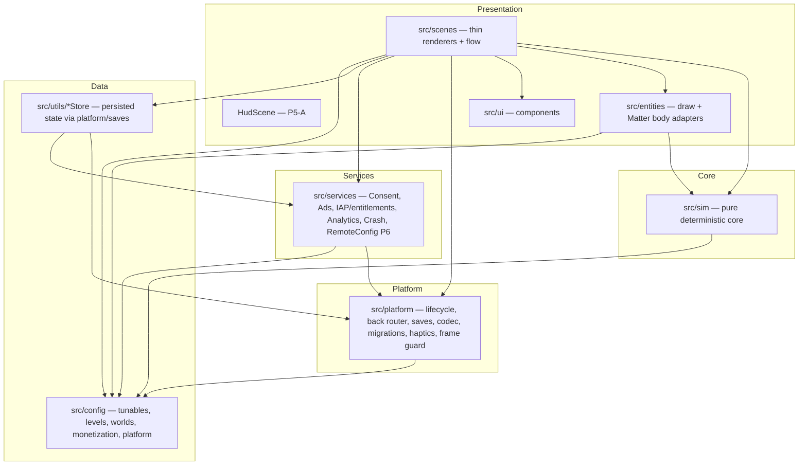
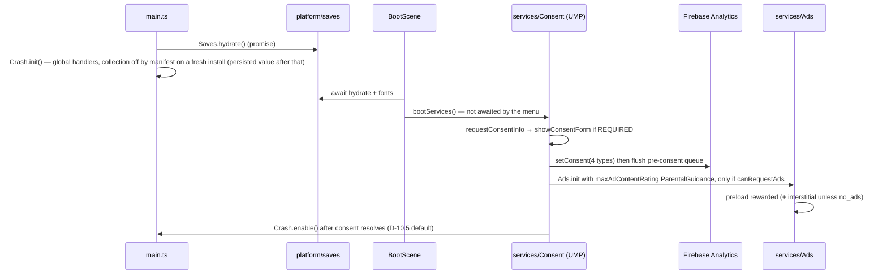
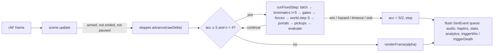
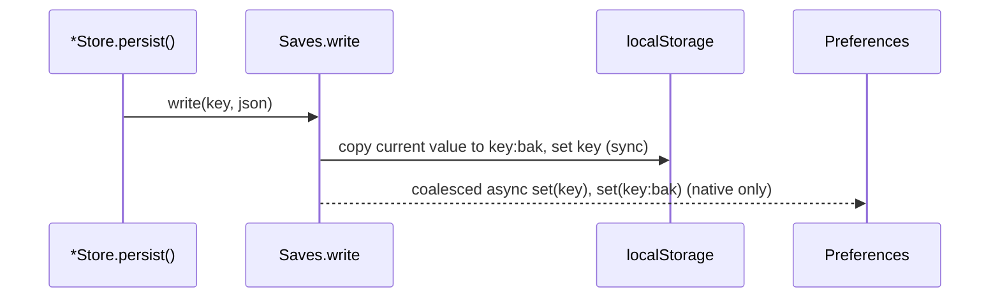
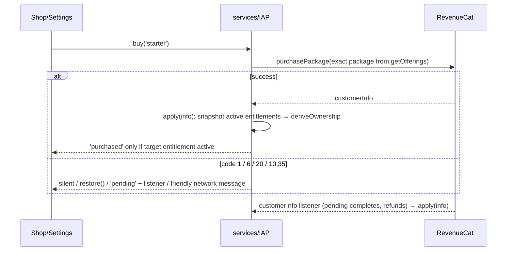

# Gravity Flow — Master Technical Architecture

> **Status:** plan of record, 2026-10-07 · baseline `master @ d3c6aab` · conforms to [`../roadmap/DECISIONS.md`](../roadmap/DECISIONS.md).
> **Scope:** the as-is system (verified), the target layering, module contracts, data flows, persistence, timing, errors, build/release, dependencies, testing, performance and security.
> **Phase plans that implement it:** [`../roadmap/phases/P00-foundation.md`](../roadmap/phases/P00-foundation.md) (steps 0–5), [`../roadmap/phases/P01-physics.md`](../roadmap/phases/P01-physics.md) (steps 6–7). Level data and the QA bot are specified by P2 in `LEVEL-ENGINE.md` and `LEVEL-QA-SIMULATION.md` (this folder, owned by P2).
> **Evidence labels:** **[V]** verified on 2026-10-07 by reading the file or running the command named · **[I]** inferred · **[D]** needs a physical device.

---

## 1. Principles

1. **One gameplay clock.** `simMs` (integer step count × `SIM_STEP_MS`) is the only time gameplay reads (D-01).
2. **Pure core, thin renderers.** Rules, forces, motion and input replay live in `src/sim/` with no Phaser or DOM import, so Node (tests, the P2 bot) and the browser run the same code (D-06).
3. **Seams, not managers.** Each external SDK sits behind one small module with a guarded dynamic import. No GameManager, no service locator, no event bus framework.
4. **Truth from the source.** Purchases from RevenueCat entitlements (D-09), consent from UMP (D-10), prices from the store, docs facts from a script.
5. **Fail soft, never freeze.** Store loads never throw, service calls never reject into scenes, the frame loop survives exceptions.
6. **Constants in config.** Every tunable lives in `src/config/*.config.ts` (CLAUDE.md rule), including the new sim, platform and ad-plumbing constants.

---

## 2. Current architecture (as-is, verified)

### 2.1 Stack [V]
| Item | Value | Source |
|---|---|---|
| Engine | Phaser **3.90.0** installed (`package.json` declares `^3.80.1`) with bundled Matter 0.20 | `node_modules/phaser/package.json`, `package.json:23` |
| Language/build | TypeScript 5.9.3 strict, Vite 5.4.21, Vitest 1.6.1 (`environment: 'node'`) | `vite.config.ts:6-9` |
| Native | `@capacitor/core\|android\|cli` **8.4.0** (critical advisory GHSA-rvm3-566m-v7fv, `npm audit --omit=dev` = 1 critical), admob 8.0.0, purchases-capacitor 13.1.5, capacitor-firebase 8.3.0 | `npm audit --omit=dev` run 2026-10-07 |
| Android | compile/target 36, min 24, AGP 8.13.0, `versionCode 1` / `versionName "1.0.0"` hard-coded | `android/variables.gradle`, `android/build.gradle:10`, `android/app/build.gradle:21-22` |
| Size | 16,135 TS lines (14,429 non-test); 13 scenes; `GameScene.ts` 1,708 lines; 163 level files → `LEVELS` = 150 | `wc -l`, `src/main.ts:43-57` |
| Tests | **28 files / 221 tests**, all pure helpers + structural level lints | `npx vitest run` 2026-10-07 |

### 2.2 Frame loop as-is [V]
- `src/main.ts:30-36` configures Matter with gravity 0 and no `autoUpdate` flag, so Phaser's `World.update` runs its own accumulator (0..N `Engine.update` per frame, `World.js:1174-1266`) before `scene.update()`.
- `GameScene.update` (`GameScene.ts:884`) applies forces **after** the world step (`:915-917`), so the force lands in the next frame's first step: ≈2.08× pull at 120 Hz, ≈0.48× at 30 Hz (physics brief Q1). `EndlessScene.update` repeats this (`EndlessScene.ts:227-229`).
- Gameplay checks run once per render frame (`GameScene.ts:919-924`).
- Clocks are mixed wall clocks: `levelStartMs = game.loop.time` (`:213`), countdown/par from the rAF `time` (`:616`, `:653`), win time from `this.time.now` (`:1027`).
- Moving hazards and platforms are Phaser tweens (`Hazard.ts:58-96`, `MovingPlatform.ts:46-59`) on the TweenManager's `Date.now` clock; beams and goal drift read the absolute rAF timestamp (`Hazard.ts:110-113`, `GameScene.ts:426-434`), so their phase differs on every attempt.
- `EndlessScene` scrolls from the frame `delta` (`:210-220`) and times invulnerability with `this.time.now` (`:106`, `:481`).

### 2.3 Services as-is [V]
| Seam | Defect | Location |
|---|---|---|
| `src/utils/Ads.ts` | UMP requested lazily at the first ad; `initialize()` with no options; `isRewardedReady()` always `true`; `showRewarded` awaits `showRewardVideoAd()` which never settles on early close; interstitial loaded after `scene.restart` | `Ads.ts:57-81`, `:75`, `:84-86`, `:100-105`, `GameScene.ts:1163-1166` |
| `src/utils/IAP.ts` | proxy registered as `'PurchasesPlugin'` (native name is `Purchases`); `apiKey: ''`; `availablePackages[0]` fallback; `hasEntitlement(result) \|\| true`; bundles granted locally, never restored | `native/revenueCat.ts:19`, `monetization.config.ts:26`, `IAP.ts:110`, `IAP.ts:152` |
| `src/utils/Analytics.ts` | no consent gate; plugin loaded on first `track()` | `Analytics.ts:12-33` |
| `analyticsEvents.ts` | reserved `session_start` emitted at boot; camelCase `bundleId` param | `analyticsEvents.ts:39`, `BootScene.ts:19`, `analyticsEvents.ts:70` |
| `src/utils/Crash.ts` | collection enabled at load; exceptions carry only a message | `Crash.ts:23-34`, `:58-67` |

### 2.4 Platform and persistence as-is [V]
- No `@capacitor/app` or `@capacitor/preferences` (`node_modules/@capacitor` holds only `android`, `cli`, `core`). `visibilitychange` only resumes audio (`main.ts:92-100`). There is no Back handler and no pause overlay.
- Manifest: no `screenOrientation`, no `appCategory`, no `VIBRATE`, `launchMode="singleTask"` (`AndroidManifest.xml:21-27`), `allowBackup="true"` with no rules (`:5`), Google test AdMob app id (`:17-19`). `AppTheme.NoActionBar` is DayNight (`styles.xml:12`). `MainActivity` is empty.
- `capacitor.config.ts:7-15` sets only app id, name, webDir and background colors. `vite.config.ts` has no `build.target`.
- Persistence is **localStorage only**: 19 literal `gravity-flow:*` keys written by 16 modules (11 `*Store.ts`, `Leaderboard.ts`, `IAP.ts`, `Ads.ts`, and scene-local keys in `GameScene.ts:90-106` and `EndlessScene.ts:146-160`). Each store parses inside `try/catch` and resets to defaults on failure (`ProgressStore.ts:26-35`), with no shape validation and no backup key. Versioning is "version in the key" (`progress:v9`, `cosmetics:v2` with a v1 migration in `CosmeticStore.ts`).

### 2.5 Build and CI as-is [V]
- `android/gradle.properties:19` sets a machine JDK path (the working tree points at Temurin 21; the committed value is the Android Studio JBR, now JDK 25).
- `android/app/build.gradle:43` uses `proguard-android.txt`, which AGP 9 rejects. Minify is off (`:42`).
- `.github/workflows/ci.yml` runs Node 20, `npm install`, tsc/test/build only; the Android job is commented out (`:31-51`).
- `.ai/skills|superpowers|ui-ux-pro-max-skill` are tracked symlinks (mode 120000) to a directory that no longer exists.

### 2.6 What already works and is kept
- The seam pattern: guarded `await import('./native/…')` behind `Capacitor.isNativePlatform()`, and the rule never to return a thenable Capacitor proxy from an async function (`Crash.ts`, `Ads.ts`, `IAP.ts` header comments).
- Pure, TDD'd helpers (`scoring.ts`, `interstitial.ts`, `hazardMotion.ts`, `portal.ts`, `gate.ts`, `ghost.ts`).
- Config-driven content (`LevelConfig`, `src/types/index.ts:80-108`).
- Lifecycle hygiene: 200 × `scene.restart` leaves textures/bodies/listeners flat (audit B.4).

---

## 3. Target architecture

### 3.1 Layers


| Layer | Directory | Responsibility | May import | Must not import | Lands |
|---|---|---|---|---|---|
| Config/data | `src/config/` | tunables (`physics`, `fx`, `theme`, `monetization`, `retention`, new `platform.config.ts`), levels, worlds; `rcConfig.ts` clamps in P6 | `src/types` | anything else | exists; `platform.config.ts` P0 |
| Sim core | `src/sim/` | `FixedStepper`, `forces`, `kinematics`, `rules`, `input`, `stepPipeline`, `stateHash`, `bodyDefs`, `HeadlessWorld`; `LevelSim` + `validate/` in P2 | `src/config/physics.config.ts`, `src/types`, pure `src/utils/{MathUtils,portal,gate,hazardMotion}.ts`, Matter lib passed in as a parameter | `phaser`, DOM, `src/platform`, `src/services`, stores | P1 (LevelSim P2) |
| Entities | `src/entities/` | Graphics + Matter bodies; render at interpolated poses | Phaser, `src/sim`, `src/config`, stores for cosmetics | `src/services` | refactored P1 |
| Scenes | `src/scenes/` | flow, input wiring, render pass, side-effect flush | all layers | — | thinned P1–P3 |
| Platform | `src/platform/` | Android/WebView contract: lifecycle, back router, saves mirror, store codec, migrations, haptics, frame guard, error overlay, external links | `@capacitor/app`, `@capacitor/preferences` (guarded), `src/config` | scenes, `src/sim` | P0 |
| Services | `src/services/` | third-party SDK seams + their pure state machines | `src/platform`, `src/config`, pure utils | scenes, entities | P0 (moved from `src/utils/`) |
| Tools | `scripts/` | `facts.mjs`, `version.mjs`, `harness/` (Playwright), `levelsim/` (P2) | `src/sim`, `src/config` via vite-node | — | P0/P1/P2 |

**Enforcement.** `src/sim/boundaries.test.ts` (P1) scans import statements: `src/sim/**` may not import `phaser`, `src/platform`, `src/services`, `src/scenes`, `src/entities`; `src/services/**` and `src/platform/**` may not import `src/scenes` or `src/entities`. It runs in `npx vitest run`.

### 3.2 GameScene as a thin renderer
| Concern | Today | After P1 | After P2/P3 |
|---|---|---|---|
| Step order and rules | inline in `update()` | `runFixedStep()` from `src/sim/stepPipeline.ts` via a `SimWorldPort` adapter over entities | `LevelSim` owns bodies and rules; GameScene renders its state |
| Clocks | wall clock | `FixedStepper.simMs` | same |
| Motion | tweens | `src/sim/kinematics.ts` poses | same |
| Result / death / hints / relief | `showWinOverlay` (325 lines), `triggerDeath` | unchanged | `ResultPanel`, `DeathStamp`, `HintSystem`, `ReliefLadder` modules (P3) |
| HUD | main camera | main camera | parallel `HudScene` (D-13, P5-A) |

---

## 4. Module contracts (TypeScript)

### 4.1 Sim core (`src/sim/`, P1)
```ts
// FixedStepper.ts — D-01 exactly: half-step phase bias, ≤SIM_MAX_STEPS, frame clamp, alpha out.
export class FixedStepper {
  constructor(stepMs?: number, maxSteps?: number, maxFrameMs?: number);
  readonly stepCount: number;            // integer; never reset mid-run
  readonly simMs: number;                // stepCount * stepMs (no float accumulation)
  readonly lastFrameSteps: number;       // for the debug overlay and the harness
  reset(): void;                         // acc = stepMs/2, stepCount = 0
  advance(frameMs: number, step: () => boolean): number; // returns alpha in [0,1)
}

// forces.ts — D-26 formula unchanged; FORCE_SCALE uniform; writes into `out` (no allocation).
export function attractorForce(out: Vec2, ball: Vec2, attractor: Vec2, scale: number): Vec2;
export function magnetForce(out: Vec2, ball: Vec2, m: { x: number; y: number; strength: number; maxDist: number }, scale: number): Vec2;
export function zoneForce(out: Vec2, ball: Vec2, z: ZoneRect, scale: number): Vec2; // ZoneRect = {cx,cy,w,h,fx,fy}

// kinematics.ts — pure functions of time; replace every gameplay tween.
export function pingPongSine(tMs: number, durMs: number): number;  // = Phaser Sine.easeInOut yoyo
export function triangle(tMs: number, durMs: number): number;      // goal drift (linear yoyo)
export function orbitAngle(tMs: number, durMs: number): number;    // radians, linear
export function beamState(tMs: number, pulseMs: number, phaseMs: number): 'fire' | 'charge' | 'idle';
export function hazardPose(h: HazardKin, tMs: number): { x: number; y: number; firing: boolean };
export function platformPose(p: PlatformKin, tMs: number): Vec2;
export function goalPose(g: GoalKin, tMs: number): Vec2;

// rules.ts — predicates + D-03 precedence.
export type StepOutcome = 'continue' | 'win' | 'hazard' | 'timeout' | 'oob';
export function resolveOutcome(f: { inGoal: boolean; winAllowed: boolean; hazardHit: boolean; timedOut: boolean; outOfBounds: boolean }): StepOutcome;

// input.ts — one latched sample per step; RLE log for replay.
export interface LatchedInput { on: boolean; x: number; y: number }
export class InputLatch { press(x: number, y: number): void; move(x: number, y: number): void; release(): void; sample(): LatchedInput }
export class InputLog { record(i: LatchedInput): void; readonly runs: Array<[count: number, on: 0 | 1, x: number, y: number]>; static replay(runs: InputLog['runs']): (step: number) => LatchedInput }

// stepPipeline.ts — the single source of the D-01 step order (shared by GameScene, HeadlessWorld, P2 LevelSim).
export interface SimWorldPort {
  applyKinematics(tMs: number): void;
  updateGates(): void;
  applyForces(input: LatchedInput): void;
  storePrev(): void;
  stepPhysics(dtMs: number): void;
  resolvePortals(tMs: number): void;
  collectPickups(): void;
  evaluate(tMs: number): StepOutcome;
}
export function runFixedStep(port: SimWorldPort, input: LatchedInput, simMs: number, stepMs: number): StepOutcome;

// stateHash.ts — FNV-1a over Float64 bytes of ball pos/vel/angle + simMs + outcome.
export function stateHash(s: { x: number; y: number; vx: number; vy: number; angle: number; av: number; simMs: number; outcome: StepOutcome }): string;
```

### 4.2 Platform (`src/platform/`, P0)
```ts
export interface KV { get(k: string): string | null; set(k: string, v: string): void; remove(k: string): void; keys(): string[] }
export interface AsyncKV { get(k: string): Promise<string | null>; set(k: string, v: string): Promise<void>; remove(k: string): Promise<void>; keys(): Promise<string[]> }
export const Saves: { hydrate(): Promise<HydrateReport>; write(k: string, v: string): void; remove(k: string): Promise<boolean>; onRestore(k: string, reset: () => void): void }; // as built in P00-T13 (src/platform/saves.ts); read(k) arrives with decodeStore (T22) if needed
export function decodeStore<T>(raw: string | null, bak: string | null, validate: (x: unknown) => x is T, fallback: T): { value: T; source: 'primary' | 'backup' | 'default'; corrupt: boolean };
export function runMigrations(ctx: MigrationContext, from: number): Promise<number>; // ordered, idempotent ladder; async because migration 1 copies into the mirror (P00-T13)
export type BackAction = { type: 'closeOverlay' | 'pause' | 'resume'; key: string } | { type: 'toScene'; key: string } | { type: 'system' } | { type: 'none' };
export function routeBack(s: { overlay: string | null; active: string; gameplayEnded: boolean; parents: Record<string, string> }): BackAction;
export function lifecycleDecision(e: LifecycleInput): { pauseGameplay: boolean; audio: 'suspend' | 'resume' | 'keep'; refreshScale: boolean };
export function frameGuardDecision(errorTimesMs: number[], nowMs: number): 'continue' | 'overlay';
export const Haptics: { pulse(pattern: number | number[]): void };       // navigator.vibrate behind SettingsStore + VIBRATE
```

### 4.3 Services (`src/services/`, P0; RemoteConfig P6)
```ts
export type ConsentOutcome = { canRequestAds: boolean; privacyOptionsRequired: boolean; analytics: 'granted' | 'denied'; adStorage: 'granted' | 'denied'; adUserData: 'granted' | 'denied'; adPersonalization: 'granted' | 'denied' };
export const Consent: { resolve(): Promise<ConsentOutcome>; showPrivacyOptions(): Promise<ConsentOutcome>; current(): ConsentOutcome | null };
// P00-T18: an OBTAINED answer is refined by what the player really chose. UMP's canRequestAds is also true after "Do not consent" (limited ads),
// so the four analytics types follow the IAB TCF purposes read by the app's own native plugin ConsentSignals (IABTCF_PurposeConsents; consentState.ts).
export const Ads: {
  init(c: ConsentOutcome): Promise<void>;              // once, only when canRequestAds (bootServices); idempotent. Any ad request before a successful init is refused as not ready: it never runs UMP or initialize (P00-T18)
  revoke(): void;                                      // consent withdrawn in Settings > Privacy choices: no further ad is requested or shown this session (P00-T18)
  isRewardedReady(): boolean;                          // real cache state (services/adState.ts reducer: loaded, fresh <= 55 min, not busy); web: a DEV-only stub, false in a production web build (P00-T19)
  showRewarded(source: string): Promise<'earned' | 'dismissed' | 'unavailable'>;
  showInterstitialIfEligible(ctx: { flowProtected: boolean }): Promise<'shown' | 'skipped'>; // only a preloaded interstitial, never waits on a load; GameScene awaits it before scene.restart
  isShowing(): boolean;                                // a show is in flight, from the request until it settles (busy guard); every show also raises setExternalFlowActive(true, 'ads') and mutes game audio. Back, RETRY, SHARE, the HUD toolbar and the shop tabs / Back are inert while it is true (ui/adOffer.unlessAdShowing, backRouter adShowing)
  noteLevelAdvance(): void;                            // a level whose interstitial is skipped (the 2x) still counts toward the session grace
};
// Ad timers (P00-T19 fix passes 1-2): the 5 s show watchdog and the 3 min on-screen ceiling count only the time the host ACTIVITY is resumed
// (platform/foreground.ts reportActivity: the native App pause / resume on Android, visibilitychange on the web; the WebView's visibility is not used on
// Android because AdMob's AdActivity is translucent), on a monotonic clock (performance.now()); a loaded ad still ages through a device sleep. The end of
// an ad gives audio back only through platform/lifecycleDecision.resumeAudioAfterAd (activity resumed, no pause overlay, Sound or Music on), and the
// lifecycle's own foreground path does not resume audio while the ads external-flow source is up. platform may not import services/Ads: Android Back
// reads isExternalFlowActive(AD_EXTERNAL_FLOW_SOURCE), which is up exactly while Ads.isShowing() (pinned in Ads.test.ts; src/platform/boundaries.test.ts).
export type Entitlement = 'no_ads' | 'pack_starter' | 'pack_premium_collection' | 'pack_founders';
export function deriveOwnership(active: readonly string[]): { noAds: boolean; bundleCosmetics: string[] };
export function classifyPurchaseError(code: string | number | undefined): 'cancelled' | 'already_owned' | 'pending' | 'network' | 'error';
export const IAP: { init(): Promise<void>; isPremium(): boolean; price(pkgId: string): string | null; buy(pkgId: string): Promise<'purchased' | 'pending' | 'cancelled' | 'network' | 'unavailable' | 'error'>; restore(): Promise<{ restored: Entitlement[] }>; inFlight(): boolean };
export const Analytics: { track(e: AnalyticsEvent): void; screen(name: string): void; applyConsent(c: ConsentOutcome): Promise<void>; resetData(): Promise<void> };
export const Crash: { init(): void; enable(): void; disable(): void; log(m: string): void; recordError(e: unknown, ctx?: string): void; setKeys(k: Record<string, string | number>): void };
export const RemoteConfig: { activateCached(): Promise<void>; fetchWithTimeout(ms: number): Promise<void>; get<K extends keyof RcValues>(k: K): RcValues[K] }; // P6, clamped via src/config/rcConfig.ts
```
Firebase consent (`setConsent`) and the Crashlytics collection switch (`Crash.enable()` / `disable()`) both persist across launches and take precedence over the manifest defaults, which only describe a fresh install; so the last explicit choice applies from process start until UMP answers on the next launch. `CRASH_REQUIRES_ANALYTICS_CONSENT` (`src/config/consent.config.ts`, default `false` = D-10.5) selects whether `bootServices` and Privacy choices enable Crashlytics in every outcome or follow `analytics_storage` (`enable()` when granted, `disable()` otherwise).

---

## 5. Data flows

### 5.1 Consent-first boot (D-10, D-12)

On a fresh install Firebase starts with all four `google_analytics_default_allow_*` manifest flags `false`, automatic screen reporting off and Crashlytics collection off, so nothing leaves the device before the outcome is applied. From the second launch the persisted Firebase consent and Crashlytics values apply instead (§4.3), until UMP answers.

### 5.2 Frame and step (D-01, D-03)


### 5.3 Saves write-through (D-12)

Hydrate (before Boot completes): if Preferences is empty and localStorage has data → copy all keys and set `gravity-flow:save:migratedV1`; for any key missing from localStorage but present in Preferences → restore it; then `runMigrations()`.

### 5.4 Purchase (D-09)


### 5.5 Win → interstitial → next level (D-24 plumbing; D-08 NEXT lands in P3)
`triggerWin` stops stepping → overlay → `advanceAfterWin()` awaits `Ads.showInterstitialIfEligible()` (resolves on Dismissed/FailedToShow or the 5 s Showed watchdog; skipped if not preloaded) → only then `scene.restart({ level: n + 1 })`. A rewarded view on the same overlay resets the interstitial clock, so no interstitial follows it.

---

## 6. State and persistence

| Key (`gravity-flow:` prefix) | Owner | Validator | Backup | Mirror | Cloud merge (P6 `mergeSave`) |
|---|---|---|---|---|---|
| `settings` | `SettingsStore` | `isSettings` | `:bak` | yes | local wins |
| `progress:v9` (→ id-keyed in P2, D-05) | `ProgressStore` | `isProgressMap` | `:bak` | yes | max stars, min non-zero best time, gem OR |
| `ghost:v1` | `GhostStore` | `isGhostMap` (`t?` per point from P1) | `:bak` | **no** (local-only, `PLATFORM.SAVE_LOCAL_ONLY_KEYS`: hundreds of KB; lost on a WebView wipe by design) | keep the path of the min best time |
| `currency:v1`, `fragments:v1` | `CurrencyStore`, `FragmentStore` | non-negative int | `:bak` | yes | per-device ledger or LWW — decided with D-23 in P7 |
| `cosmetics:v2` | `CosmeticStore` | `isCosmetics` | `:bak` | yes | owned union; equipped local |
| `daily`, `streak:v1`, `rewards:v1`, `stats`, `achievements` | daily/streak/reward/stats/achievement stores | per-store | `:bak` | yes | achievements union; stats max; streaks local (P6) |
| `leaderboard:daily\|run\|endless` | `Leaderboard` | arrays of records | `:bak` | yes | max |
| `entitlements:v1` (replaces `premium`) | `services/IAP` | `{active[],at,pending[]}` | none (RevenueCat is truth) | yes | never merged; re-derived |
| `interstitial:v1`, `storeNudge:v1`, `run:coached`, `firstPurchase` | Ads, GameScene, EndlessScene, IAP | scalar | none | yes | local |
| `save:schema`, `save:migratedV1` | `platform/migrations` | int / flag | none | yes | — |

- **Schema versioning.** Keys keep the existing "version in the key" rule. A global `save:schema` integer drives an ordered ladder in `src/platform/migrations.ts`; P0 ships migration 1 (Preferences copy), 2 (`premium` → `entitlements:v1`), 3 (delete dead `progress:v1…v8` and `cosmetics:v1` once v2 exists). P2 appends the index → id migration (D-05).
- **Corruption.** `decodeStore` validates the primary value, falls back to `:bak`, and only then to defaults. The unreadable raw value is copied to `:corrupt` and reported through `Crash.recordError`, so it is never silently overwritten.
- **Android backup.** `dataExtractionRules` (API 31+) and `fullBackupContent` (API 24–30) include only `sharedpref/CapacitorStorage.xml` and `root/app_webview/Default/Local Storage/`, so third-party SDK ids are not cloned to new devices.
- **Origin is permanent.** `androidScheme` and `hostname` are never set (default `https://localhost`); changing either orphans every save (D-11). A guard test asserts this.
- **Cloud save (P6).** PGS Saved Games through the local plugin of D-17, one `"progress"` snapshot merged by a pure, TDD'd `src/platform/mergeSave.ts`.

---

## 7. Error handling

| Layer | Mechanism | Result |
|---|---|---|
| Frame loop | `installFrameGuard(game)` replaces `game.step` inside the `READY` listener (Phaser emits `READY` at `Game.js:416` and binds `this.step` at `:438`), wrapping it in `try/catch` | isolated errors are recorded and the loop continues; ≥3 errors inside 2 s → `game.loop.sleep()` + DOM overlay "Something went wrong · Tap to restart" → `location.reload()` |
| Global | `window` `error` / `unhandledrejection` → `Crash.recordError` | deduped by message hash, ≤5 per session |
| Crashlytics | `recordException({ message, stacktrace })` with `parseStack()` frames; custom keys `scene`, `level`, `mode`, `webview_ver`, `renderer`, `build`; scene transitions as `log()` breadcrumbs | stack traces instead of bare messages |
| Services | every public method resolves to a typed result; native failures map to `'unavailable'` | scenes never `try/catch` SDK calls |
| Stores | `decodeStore` never throws | no TypeError freeze on valid-but-wrong JSON (audit H.4) |
| Native renderer | `MainActivity` `WebViewListener.onRenderProcessGone` → `recreate()` at most 2 times per process, increments `platform:rendererGone` in Capacitor Preferences | the next boot reports a non-fatal; progress survives because it is persisted |
| Old WebView | `android.minWebViewVersion: 87` + `server.errorPath: 'webview-update.html'` | update page instead of a blank screen |

---

## 8. Threading and timing model

- **One JS thread.** rAF drives `Game.step`; Phaser dispatches DOM input between frames (physics brief Q3).
- **Sim clock.** `S = SIM_STEP_MS = 1000/60`. `FixedStepper` accumulates `game.loop.rawDelta` clamped to `SIM_MAX_FRAME_MS = 100`, runs at most `SIM_MAX_STEPS = 4` steps per frame and drops the backlog beyond that (slow motion below 15 fps, never a spiral). The accumulator starts at `S/2`. `simMs = stepCount × S`, counting every executed step including the terminal one.
- **Input latch.** Pointer handlers only update an `InputLatch`; each step samples it once. The latch is edge-preserving: a press and release inside one step still yields one `on` sample. Samples are quantized to `INPUT_QUANT_PX = 0.25` and logged run-length encoded. `pointerupoutside` releases the latch.
- **Render interpolation.** Before `world.step` the port stores the previous ball position; the renderer draws `lerp(prev, cur, alpha)` and every kinematic object at `pose(simMs − (1 − alpha)·S)`, so ball and moving objects share one render time. Pulses, particles and tweens on UI/juice stay per frame.
- **Side effects.** Steps queue `SimEvent`s (`gem`, `orb`, `portal`, `win`, `death{cause}`); the scene flushes them after `advance()` returns, so a step is pure and headless-runnable.
- **Pause semantics.**

| State | Sim steps | `simMs` | UI tweens | Audio |
|---|---|---|---|---|
| Pre-arm preview (D-02) | no | 0 | yes | pad only |
| Settings / Pause overlay (`scene.pause`) | no | frozen | overlay only | pad continues (Settings) / suspended on background |
| App hidden (`visibilitychange`, App `pause`) | no (rAF stops; pause overlay opened) | frozen | no | `AudioContext.suspend()` |
| Ad or purchase in flight (`Ads.isShowing()`, `IAP.inFlight()`) | no (run already ended or overlay up) | frozen | — | game audio muted |
| Win / death | stopped by `false` from the step | final | yes | cues |

`fps.limit` is never configured (D-01.6); `src/sim/wallclock.test.ts` asserts it.

---

## 9. Build and release

- **One version file (D-20).** `package.json` holds `"version": "1.0.0"` (semver = `versionName`) and `"androidBuild": <1..99>`. `android/app/build.gradle` parses it with `JsonSlurper` and computes `versionCode = MAJOR*1_000_000 + MINOR*10_000 + PATCH*100 + BUILD`. The next upload is **1000001** (an AAB with versionCode 1 is already in Play Console). `scripts/version.mjs` prints, checks and bumps; CI compares its output with a Gradle `printVersionCode` task.
- **Labels.** rc/beta labels live only in git tags (`v1.0.0-rc.2` at M0). One AAB is promoted Internal → Closed → Production.
- **Toolchain.** The JDK (17–21) comes from `JAVA_HOME` or `-Dorg.gradle.java.home=…` on the command line, never from a tracked file. `proguard-android-optimize.txt`, R8 off for 1.0. Play App Signing; the upload keystore is backed up in two places (owner).
- **CI (`.github/workflows/ci.yml`).** Node 22, `npm ci`.

| Job | Steps | Blocking | From |
|---|---|---|---|
| `web` | tsc · vitest (JSON report) · build · `node scripts/facts.mjs --check` · `npm audit --omit=dev --audit-level=critical` | yes | P0 |
| `android-debug` | setup-java Temurin 21 · `npm run build` · `npx cap sync android` · `./gradlew assembleDebug` · version-code cross-check | yes | P0 |
| `smoke` | vite dev server + Playwright 1.63.0 Chromium (`--disable-gpu --use-gl=swiftshader`) boot smoke over all scenes, zero console errors | yes | P0 |
| `harness` | multi-rate determinism + replay (`scripts/harness/rates.mjs`, `replay.mjs`) | yes | P1 |
| `levelsim` | validators + bot A0–A3 (< 3 min) | yes | P2 |
| `nightly` | bot A4–A6 + ablation report | report only | P2 |

- **Release guard (P00-T20).** The Vite mode picks the ids: only `vite build --mode release` (`npm run build:release`) selects `ADMOB_PROD` and the production RevenueCat key; every other mode selects `ADMOB_TEST` and an empty key (`src/config/build.config.ts`, `monetization.config.ts`), and a release build never reads the UMP debug variables. `scripts/release-check.mjs` (`npm run release:check`; pure logic in `scripts/lib/releaseCheck.mjs`) fails and lists every problem if a production AdMob id is empty or a Google test id, the RevenueCat key is not `goog_…`, `VITE_UMP_DEBUG_GEOGRAPHY` or `VITE_UMP_TEST_DEVICE_IDS` is set, or `versionCode` is not greater than the last uploaded code (the `last-uploaded-version-code` marker in `docs/STATUS.md`). The same check runs inside the release Vite build and inside the release Gradle build (`verifyReleaseConfig`, which also runs `--assets` on the synced web assets); `--assets` alone is the step after `cap sync`. The AdMob app id reaches the manifest as the `${admobAppId}` placeholder: Google's test id for debug, `-PADMOB_APP_ID` for release, which fails without it (`android/app/build.gradle`, `verifyReleaseAdmobAppId`).

---

## 10. Dependency policy

- **Exact pins** for every runtime and build-critical package (no `^`). The P0 set (verified on npm 2026-10-07): `@capacitor/core|android|cli` 8.5.2, `@capacitor/app` 8.1.2, `@capacitor/preferences` 8.0.1, `@capacitor-firebase/analytics|crashlytics` 8.5.2, `@revenuecat/purchases-capacitor` 13.7.0, `phaser` 3.90.0 (D-28), `playwright` 1.63.0 (dev), `vite-node` 1.6.1 (dev, matches vitest).
- **Soak rule.** A release younger than 7 days ships only in its own commit, after the rest of its step is green and after its tracker has been checked for regressions. AdMob 8.2.x (8.2.0 published 2026-10-05, requires Capacitor ≥ 8.5) follows this rule.
- **Gates.** `npm audit --omit=dev` must report 0 critical (blocking); highs are listed in `docs/STATUS.md`. Each SDK bump re-checks the Data Safety matrix (launch brief §2).
- **Fallbacks.** If Capacitor 8.5.2 regresses on device, 8.4.3 also fixes the advisory.
- **Not now.** Vite 8, Vitest 5, TypeScript 7 and Phaser 4 wait until after launch (D-28); each needs its own plan.

---

## 11. Testing architecture

| Layer | Tooling | What | Gate |
|---|---|---|---|
| Unit / TDD | Vitest (`src/**/*.test.ts`, `scripts/**/*.test.mjs`) | every pure module in `src/sim`, `src/platform`, `src/services`, stores' validators, version and facts libs | CI `web` |
| Static lints as tests | Vitest | `wallclock.test.ts`, `boundaries.test.ts`, analytics name/param rules, store-copy claims, Capacitor origin guard, level structure (`levels.test.ts`) | CI `web` |
| Headless sim | Vitest + Phaser's Matter lib imported in Node (verified: `import Engine from 'phaser/src/physics/matter-js/lib/core/Engine.js'` runs under Node 24) | `HeadlessWorld` replays, graze corpus, cross-runtime hashes | CI `web` |
| Browser harness | Node Playwright against `vite` dev (uses the DEV-only `window.__game` from `main.ts:117-120` and a new `window.__sim`) | boot smoke; 30/60/90/120/144 Hz ±1 ms bit-identical; replay; trajectory snapshots | CI `smoke`, `harness` |
| Bot | `scripts/levelsim/` (P2) | solvability, self-solve, bypass, par | CI `levelsim`, `nightly` |
| Device | owner checklist `docs/qa/DEVICE-CHECKLIST-M0.md` | consent geographies, ads, license-tester purchases, back/pause, haptics, refresh-rate feel | M0 gate |

Ad-hoc Python scripts stay gitignored (`.gitignore:15`); tracked harnesses are Node.

---

## 12. Performance budgets

| Budget | Value | Source |
|---|---|---|
| Physics bodies / particles | < 20 / < 50 active | CLAUDE.md |
| Sim cost | `runFixedStep` p95 ≤ 0.5 ms on the Mid reference device; ≤ 4 steps per frame | [I] target; D-01 |
| Allocation | zero per-step allocations in `forces`/`kinematics`/`rules` (out-params) | design rule |
| Frame time | ≤ 8 ms Mid at 120 Hz; ≤ 14 ms Low at 60 Hz; p95 ≤ 20 ms Mid | physics brief Q6; roadmap P5 |
| Full-screen post passes | 0 after P5-A (bloom, ball glow, vignette postFX removed) | D-13 |
| Draw calls | Low ≤ 40 · Mid ≤ 60 · High ≤ 80 | D-13 |
| Boot | hydrate ≤ 60 ms added to Boot (parallel to fonts) | [I] |
| Restart leak | ≤ 13 KB heap per `scene.restart` (current), no growth in bodies/textures | audit B.4 |

---

## 13. Security and privacy

- **No secrets in the repo.** `keystore.properties`, `*.jks`, `google-services.json` stay gitignored (`.gitignore`). Public client ids (AdMob app/unit ids, RevenueCat `goog_…` key) are allowed in `src/config/monetization.config.ts` and selected by build mode; the release guard refuses test ids.
- **Origin.** `androidScheme`/`hostname` never change (D-11); `src/config/capacitorConfig.test.ts` asserts both are unset.
- **Advisory.** Capacitor ≥ 8.5.1 closes GHSA-rvm3-566m-v7fv; the game renders no user-supplied links.
- **Web build honesty.** The web IAP stub grants purchases only in DEV; production web returns `'unavailable'` (the public Vercel build currently gives paid items away, audit F.1).
- **Data minimisation.** Consent-first boot, no pre-consent identifiers, "Reset analytics data" (`resetAnalyticsData`), backup rules that exclude SDK ids, `maxAdContentRating` ParentalGuidance and no global child-directed tags (D-25).
- **Public docs.** GitHub Pages serves all of `docs/` (audit J.1). Moving internal strategy docs out of the public tree is an owner decision recorded in `docs/STATUS.md`.
- **Not needed for 1.0:** Play Integrity (launch brief §7), certificate pinning, code obfuscation.

---

## 14. What we deliberately do NOT build

| Not building | Why |
|---|---|
| Managers / service locator / DI container | Seams plus plain modules are enough; the 15 module-level stores already act as state owners (audit H.5) |
| ECS or a custom engine layer | 7 mechanics × one entity each fit the existing pattern; the sim core covers what the bot needs |
| Phaser 4 migration | D-28; re-evaluate after launch behind `src/sim/` |
| Custom render pipelines | D-13; Phaser 4 removes them |
| Generic event bus | only the per-step `SimEvent` queue |
| Backend, Firestore, accounts | D-30; RevenueCat anonymous ids + PGS cover 1.0 |
| Remote code push / hot updates | security and Play policy risk |
| R8 / minify for 1.0 | D-20; DEX far below the 50 MB vitals threshold |
| iOS project | D-29, P12 |
| Swept-collision CCD | per-step checks give 44–84 px windows vs ≤ 12 px/step travel (physics brief Q2) |

---

## 15. ADR index

All decisions live in [`../roadmap/DECISIONS.md`](../roadmap/DECISIONS.md). Architecture-relevant entries:

| ID | Topic | Where it lands in this document |
|---|---|---|
| D-01 | Fixed-step physics, sim clock, kinematics, interpolation, `FORCE_SCALE` | §4.1, §5.2, §8 |
| D-02 | Armed simulation | §8 pause table |
| D-03 | Per-step checks, win precedence | §4.1 `resolveOutcome` |
| D-05 / D-06 | Level model v2, `src/sim` + bot | §3.1, §11 (P2 specs) |
| D-09 | Entitlement-as-truth purchases | §4.3, §5.4 |
| D-10 / D-25 | Consent-first boot, 13+ audience | §5.1, §13 |
| D-11 | Android platform contract | §2.4, §7, §13 |
| D-12 | Durable saves | §5.3, §6 |
| D-13 | Rendering, HudScene, tiers | §3.2, §12 |
| D-14 | Analytics hygiene, Remote Config | §4.3, §5.1 |
| D-17 | PGS local plugin | §6 cloud merge |
| D-20 | Versioning and release | §9 |
| D-24 | Ad plumbing | §4.3, §5.5 |
| D-26 | Attractor formula unchanged | §4.1 `forces.ts` |
| D-28 / D-29 / D-30 | Engine, iOS, deferred systems | §10, §14 |

---

## 16. Assumptions (to confirm during P0/P1)
1. Opening the privacy policy with `window.open(url, '_blank')` hands off to the system browser in the Capacitor WebView [I; device check in P0].
2. Matter results do not depend on global body ids, so restarts and Node replays hash identically [I; the P1 harness proves or refutes it].
3. Preferences hydration of ~20 keys costs ≤ 60 ms [I; measured in P0].
4. UMP writes Consent Mode for EEA users when consent is obtained; the app still calls `setConsent` explicitly for every outcome [I; logcat "Setting consent" check, retention brief Q1].
