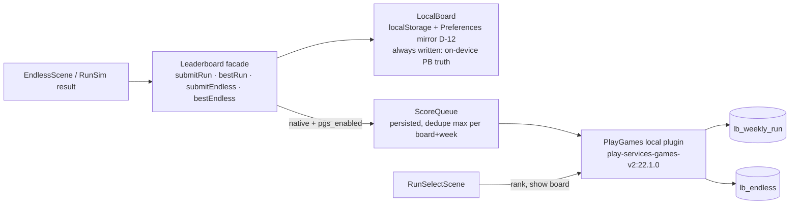

# Gravity Run 2.0: Endless & Weekly Design

> **Deliverable #9.** The design of record for the endless/weekly mode. Implementation plan: [`../roadmap/phases/P08-gravity-run.md`](../roadmap/phases/P08-gravity-run.md).
> **Conforms to:** D-01 (fixed-step sim), D-02 (Endless arms after a countdown), D-06 (shared sim + bot), D-14 (telemetry, dated Remote Config overrides), D-17 (PGS v2 boards via a local plugin, `weekKey` on PGS reset), D-22 (Run 2.0 content model), D-24 (ads policy), D-26 (attractor formula unchanged), D-30 (Firestore, friend ghosts and event currency deferred).
> **Evidence:** `docs/research/game-design.md` §7–§8 · `docs/research/retention-analytics-liveops.md` Q2, Q6–Q8 · `docs/research/physics-rendering.md` Q4 · `docs/research/android-capacitor.md` Q9 · `docs/audit/2026-10-07/STATE-AUDIT.md` §C.5, §G · `docs/audit/2026-10-07/inventory/endless_chunks.json` · code at `master @ d3c6aab`.
> **Schedule:** execution step 20 (after the production launch, step 19). Nothing here starts before M2.

---

## 1. Where Gravity Run stands today (verified)

| Area | Fact (file:line) | Consequence |
|---|---|---|
| Content | 20 chunks × 560 px; tiers 0/1/2/3 = 4/5/6/5 (`src/config/endless/chunks.ts:150-155`) | A run sees about the whole pool. Novelty is gone after 2–3 runs (audit §C.5). |
| Mechanics | Walls, zones, magnets, sweeping saws and beams only. `pivot` arms are **spawned but never moved** (`EndlessScene.ts:322-326` handles `to` only). No portals, gates or platforms. | 3 of the 7 campaign mechanics are missing, and a 4th fails silently. |
| Generator | Tier unlock every 3 chunks, breather after tier ≥2, no repeat in 4, no same tag twice in a row (`utils/endless.ts:37-77`). 0 rule violations over 500 seeds × 400 chunks. | The rules are sound. The pool is the problem. |
| Speed | 76 → 250 px/s, +4 px/s² after 3.5 s; the cap is reached at **≈47 s** (`physics.config.ts:141-144`) | The full pool is live by ≈38 s. **Nothing escalates after ≈50 s.** |
| Score | `floor(distance/10) + 25 × stars` (`utils/endless.ts:80-82`). Pool average 1.45 stars per chunk. | Stars can be **up to ~39%** of the score, so the "distance-dominant" comment is wrong. |
| Weekly | Seed `gw<floor(localDays/7)>` (`utils/endless.ts:31-34`). Resets at **Thursday local midnight**, so timezones play different courses. | Not fair, and misaligned with the PGS weekly reset. |
| Board | localStorage on one device (`utils/Leaderboard.ts:58-97`). The hub says "Same run for everyone" (`RunSelectScene.ts:53`). | No competition exists yet. Copy must say "your best" (D-17). |
| Revives | Weekly skips the submit for revived runs, but **Endless submits revived runs to the personal best** (`EndlessScene.ts:372-376`). | Breaks D-17 "Endless all-time (no revives)". |
| Clock | Wall-clock `delta`, `this.time.now` grace, tweened hazards (`EndlessScene.ts:207-261`, `Hazard.ts:58-90`) | Not deterministic (D-01). The weekly can't be fair until P1 lands. |
| UX | No pause button. Tapping the result scrim ejects to the menu (`EndlessScene.ts:393`). Share is clipboard-only on Android (audit §G.2). | Interruptions and taps cost runs. |

## 2. Decision: curated chunks, procedural assembly

| Option | Variety | Fairness / readability | Authoring cost | Bot-verifiable | Verdict |
|---|---|---|---|---|---|
| Fully procedural geometry (noise/grammar) | Unlimited | Low: unreadable combos, off-brand | Low content, high tuning | Hard (infinite space) | Reject |
| Fully curated sequences (handmade runs) | Very low | High | Very high | Easy | Reject |
| **Curated chunks + seeded assembly + mirror + bot-verified jitter (D-22)** | High (§3) | High: every chunk and seam is proven | Medium (½ day per chunk) | Yes: finite templates × finite knobs | **Adopt** |

This is the Spelunky/Downwell model (game-design §7): hand-authored rooms, a guaranteed path and random mutation. The existing generator already proves the assembly rules. Run 2.0 adds variety per template, structure (biomes, pressure) and proof (validator + bot).

## 3. Content variation

### 3.1 Three variation layers per template
1. **Mirror (x-flip).** `x → 360 − x` for every entity; `dir.x`, `to.x`, `pivot.x` and portal mouths flip; `angle → −angle`. Beams and polarity are unchanged. `mirror(mirror(c)) === c` (an involution, unit-tested). Authoring rule (Bleed 2): **≥80% of templates must be asymmetric**. A symmetric template gains nothing from mirroring, and the validator detects and counts these (C-14).
2. **Tier variants a/b/c** (felt difficulty). Every hard template exposes the same knob table:

   | Knob | a (gentle) | b (authored) | c (escalated) |
   |---|---|---|---|
   | Hazard / arm / platform speed | ×0.90 | ×1.00 | ×1.12 |
   | Beam duty (`BEAM_DUTY` 0.45 today) | 0.40 | 0.45 | 0.50 |
   | Static lane width (where authored as `laneAdjust`) | +12 px | 0 | −8 px (never < 48 px) |
   | `cOnly` entities (an authored second hazard) | off | off | on |

3. **Bot-verified micro-jitter (D-22).** Each chunk instance gets its own stream `mulberry32(fnv(seed + ':' + chunkIndex))`. One instance's knobs never shift the rest of the run.

   | Knob | Values | Steps |
   |---|---|---|
   | Placement `dx` (whole interior; side-wall-attached walls excluded) | −12, −8, −4, 0, +4, +8, +12 px | 7 |
   | Motion speed | ×0.90, 0.95, 1.00, 1.05, 1.10 | 5 |
   | Motion phase at spawn (saws, arms, platforms, beams) | 0, ⅛ … ⅞ cycle | 8 |

   Phase is an addition to D-22's two knobs (P8 plan §2, decision delta 1). It is the knob that actually defeats timing memorisation in Endless. The Weekly stays fixed per seed by construction.

### 3.2 Perceived-variant math
A **felt variant** is (template, mirror side, tier variant). Jitter is not counted, since ±12 px is not perceived as a new layout. Rest templates have a single variant.

`felt = hard × m × 3 + rest × m`, with mirror factor m = 0.8·2 + 0.2·1 = **1.8**.

The coupon-collector estimate of runs needed to see every felt variant at least once is `N·H_N / chunks per run`. It assumes a median 120 s run of ≈45 chunks (§5.3) and ignores eligibility filters, so it is optimistic.

| Milestone | Templates (hard + rest/opener) | Felt variants | Runs to see everything | Opener variety (first 17 s) |
|---|---|---|---|---|
| Today | 20 (16 + 4), no mirror or variants | 20 | **1.6** | 4 |
| **P8 ship (Run 2.0)** | **32 (24 + 8)** | **144** | **≈18** | 8 × 1.8 = 14 |
| +3 months (D-22: ≥40) | 40 (30 + 10) | 180 | ≈23 | 18 |
| +6 months | 56 (44 + 12) | 259 | ≈35 | 22 |

Plus 280 jitter micro-variants per felt variant (7 × 5 × 8). The target for "this run feels new" is no template repeat within 6 chunks, and no exact (template, side, variant) within 12.

### 3.3 Chunk count targets per biome (P8 ship)

| Biome | Focus mechanic | Hard templates (now → P8) | New templates in P8 |
|---|---|---|---|
| Launch (opener/rest) | open space, walls, gems | 4 tier-0 → 8 | 4 (2 openers, 2 rests) |
| Peril | sweeping saws, **arms**, beams | 6 → 6 | 2 arm templates; `twinSaws` and `sawMaze` are re-authored under new ids (`twinSaws` has no lane; `sawMaze` has 36 px bands at cap speed, audit §C.5) |
| Currents | gravity zones | 3 → 5 | 2 |
| Wells | magnets | 4 → 5 | 1 |
| Clockwork | **moving platforms** | 0 → 4 | 4 |
| Gates | **one-way gates** | 0 → 4 | 4 |
| Rifts | **portals** | 0 → 0 | 0 at ship. 4 in the +3-month drop |
| Walls (generic filler) | static walls | 3 → 0 | Absorbed into Launch and Peril, re-tagged |

Totals at P8 ship: 24 hard + 8 rest/opener = 32 (12 genuinely new + 4 re-authored + 16 carried over). The +3-month drop adds Rifts 4, fusion 2, rest 2 → 40.

## 4. Mechanics entering Endless

| Mechanic | In Run today | Engine work | Validator work | Effort | Ships |
|---|---|---|---|---|---|
| Walls | yes | none | dynamic lane (C-06) | — | P8 |
| Gravity zones | yes | Re-verify after the D-04 retune (P4) and `FORCE_SCALE` (D-01) | none | 0.25 d | P8 |
| Magnets | yes | none | seam distance (C-05) | — | P8 |
| Sweeping saws | yes (tweens) | Pose as a function of `simMs` (comes with P1) | dynamic lane | in P1 | P8 |
| Beams | yes (`pulse(time)`) | Duty as a function of `simMs` (P1) | timed window | in P1 | P8 |
| **Rotating arms (`pivot`)** | **silently static** (`EndlessScene.ts:322-326`) | Spawn path + `armPose(cfg, simMs)` in the sim | orbit-disc lane | 0.5 d | P8 |
| **Moving platforms** | no | Static body with `Body.setPosition` per step (D-01 §4); cull removes the body | swept-rect lane | 0.75 d | P8 |
| **One-way gates** | no | `Gate` + `gateOpen` (`utils/gate.ts`) at step 3 of `fixedStep()` (D-01 §2) | gate width ≥ 64 px; `dir` normalised | 0.75 d | P8 |
| **Portals** | no | `Portal` + `portalExit` (`utils/portal.ts`) at step 6 of `fixedStep()` | Both mouths in one chunk; \|Δy\| ≤ 400 px, so the exit stays on screen; exit clearance from 16 approach angles (C-07). This fixes the campaign's exit-in-geometry class (audit §C.4). | 1 d | engine P8, content +3 mo |
| Moving goals, constellations, `timeLimitMs` | n/a | — | — | — | never (no goal in a climb) |

**Body budget.** At most 4 live chunks (480 spawn-ahead + 844 view + 220 cull = 1,544 px). Each chunk holds ≤4 bodies, plus 2 side walls and the ball, for ≤19 bodies. That is under the 20-body ceiling. C-09 enforces the per-chunk cap.

**Teaching.** A biome joins the **Endless** pool once the player has cleared the level whose `teaches` field (D-05) first contains its mechanic. "New Gravity Run biome: Clockwork" then becomes a campaign reward beat. Launch and Peril-lite (sweeping saws, tier ≤1) are always on: red reads as deadly without teaching.

The **Weekly** must be identical for everyone, so it uses every biome. A mechanic's first appearance for a player gets a **first-sight callout**, a HUD-only 1.2 s label ("GATE: pass one way"). The callout has zero gameplay effect, so fairness holds.

**Gravity Run unlocks after World 1 is complete,** the same gate as the Daily (D-21). Session 1 stays on the campaign, and the Run arrives as a reward.

## 5. Structure: biomes, pressure and rest

### 5.1 Run layout
- **Opener:** chunks 0–2 come from the opener pool (tier 0), ≈17 s.
- **Phases:** then phases of **6 chunks** (D-22).
  - Each phase draws a biome from a seeded bag over eligible biomes, with no repeat of the previous 2.
  - About 60% of a phase's hard slots come from that biome; the rest come from the generic pool.
  - **Fusion phases** draw from templates tagged with both mechanics of a biome pair (previous + new).
- **Rest cadence:** fixed by D-22. After every 3 hard chunks, the next chunk is a rest chunk. A global counter runs independently of phase boundaries, so 25% of chunks are rests at every pressure.

  The research suggested escalating by thinning rests. **We don't**, because D-22 is binding.
- **Presentation per phase:**
  - The palette crossfades over 1.2 s via `themeForWorld(biome.themeId)` (`worldThemes.ts`): Currents → W2 theme, Clockwork → W3, Peril → W4, Wells → W5, Rifts → W6, Gates → W7, Launch → W1.
  - Music: `startWorldTheme(themeId)` (`AudioSynth.ts:306`).
  - A 1.2 s phase toast ("CURRENTS").
  - Under reduced motion the swap is instant with **no brightness change** (D-13).

### 5.2 Difficulty after the speed cap: composition, not speed
The scroll speed curve stays as it is (cap 250 px/s at ≈47 s). Pressure P rises once per phase.

| P | Chunks k | ≈Time (current speed curve) | Tier cap / tier-3 share | Variant mix | Fusion phase chance | Window tightening |
|---|---|---|---|---|---|---|
| 0 | 0–2 | 0–17 s | 0 | opener | 0 | — |
| 1 | 3–8 | 17–37 s | ≤1 | a | 0 | — |
| 2 | 9–14 | 37–49 s (cap at 47 s) | ≤2 | a/b 50/50 | 0 | — |
| 3 | 15–20 | 51–62 s | ≤3 / 20% | b | 0 | — |
| 4 | 21–26 | 65–76 s | 35% | b/c 70/30 | 25% | — |
| 5 | 27–32 | 78–89 s | 50% | b/c 50/50 | 50% | — |
| 6 | 33–38 | 92–103 s | 65% | c | 75% | — |
| 7 | 39–44 | 105–116 s | 65% | c | 100% ("Deep") | — |
| 8–12 | 45–74 | 118–184 s | 65% | c | 100% | +3% per phase (motion speed, beam duty +0.02), capped at +15% |
| 12+ | ≥75 | ≥185 s | plateau | c | 100% | +15% (cap) |

Times come from `t(h)`: below 7,356 px, solve `266 + 76τ + 2τ² = h` (τ = t − 3.5); above it, `t = 47 + (h − 7,356)/250`, with h = 560·k.

The worst motion speed the validator must clear is c (1.12) × jitter (1.10) × cap (1.15) = **1.42× authored**.

**Why it is shaped this way.** Under constant difficulty, death is memoryless, so a skilled player's run is unbounded (Isaksen, game-design §7). The P4→P8 ramp keeps the hazard rate rising through the 60–180 s band (MASTER-ROADMAP P8 target). The +15% plateau keeps late play readable rather than impossible.

### 5.3 Difficulty budget (no lucky seeds)
Each template carries a bot-measured `difficulty` (0–10, from A6 noisy-expert survival and minimum clearance, §11).

The generator keeps each phase's summed difficulty within **±10%** of the phase target. It resamples a slot up to 8 times, then accepts the best candidate.

Nightly gate: across 500 Endless seeds, the A6 median survival has a coefficient of variation ≤15%.

## 6. Score model

```
score = floor(climbPx / 10) + GEM_BONUS × gems        // GEM_BONUS = 5 (today: 25)
climbPx = camera climb, a pure function of sim steps survived (scroll curve in sim time)
```

- **Height dominates.** Score uses the camera climb, not the ball's maximum height, so rushing upward never pays.
- **Gem budget is fixed per chunk index.** Openers and hard chunks carry exactly 1 gem; rests carry 2.

  A 4-chunk cycle (3 hard + 1 rest) therefore offers 5 gems = 25 points against 224 climb points. **Gems are capped at ~10% of the score, identical on every seed.** Today's chunks carry 1–3 stars, so they are retrofitted (`starfield` 3→2, `drift` 2→1, …).
- **Excluded on purpose** (the Spelunky critique, game-design §7): near-miss bonuses, combo multipliers, time bonuses, risk multipliers and random drops. Nothing rewards luck or seed-hunting.
- **Personal best** is stored **in sim steps** with its score:

  ```
  {score, climbPx, simSteps, gems, seedKey, poolVer, modifierId, appVer, dateUtc}
  ```

  Ties go to the run with more gems, then the earlier one. Pausing, backgrounding or an ad cannot inflate a PB, because the sim doesn't step (D-01).
- **Revives** never count toward a PB or a board, in **both** modes (fixes `EndlessScene.ts:372-376`).

  A revived run shows its score labelled "Revived: not counted toward your best". The revive stays an honest rewarded offer: "Watch ad · revive", once per run (D-24).
- **Interstitials:** none in Gravity Run. Every run ends in a death, and D-24 forbids interstitials after a death.
- **Stardust per run:** keep the cap of 60. P7 retunes the divisor so the median payout is unchanged under the smaller gem bonus (economy-neutral, D-23).
- **Migration:** the Run 1.0 Endless best is archived as "Run 1.0 best" (shown once, then kept in the stats screen). Old `gw…` weekly bests stay as history. The scores aren't comparable, so nothing is converted.

## 7. Weekly fairness

| Requirement | Mechanism |
|---|---|
| Same course for everyone | Course identity = `(weekKey, poolVer, modifierId, generatorVer)`. It is printed on the card ("Week rw2961 · p3 · Mirror") and in the PGS score tag. |
| Same physics on every device | D-01 fixed step (bit-identical at 30–144 Hz). Every gameplay clock (scroll, kinematics, beams, grace) runs on `simMs`. The sim uses the fixed 390×844 game size, never `scale.height`. Android is V8 everywhere, the same engine as the Node bot (physics brief Q4). |
| Boundary on the PGS reset | `rw<i>` with `i = floor((nowUtcMs − 284,400,000) / 604,800,000)`, epoch = Sun 1970-01-04 07:00 UTC. Current week **rw2961**: 2026-10-04 07:00 → **2026-10-11 07:00 UTC**. The new prefix avoids colliding with legacy `gw2961`. The hub shows the reset in local time. |
| PB in sim steps | §6 |
| Unlimited practice, best counts | game-design §8. A run counts once armed (after the 3-2-1, D-02). |
| Revives excluded | §6 |
| Mid-week app updates | Shipped templates are **immutable**: a hash lockfile, C-13. A retune ships as a new id plus `retiredIn` on the old one. `pool(v)` = templates with `addedIn ≤ v < retiredIn`, so new clients can rebuild older pools. A client that doesn't know the week's `poolVer` or modifier shows **"Update to join this week's board"**: practice is allowed, submission is not. |
| Outlier seeds | Nightly, the next 8 weekly seeds are pre-simulated (A6 × 50). A seed whose median survival falls outside 1.5 IQR of the 52-week distribution gets a `seedKey` override in `event_calendar`, published ≥7 days ahead (D-14, LIVE-OPS). |
| Clock tampering | The score tag carries `weekKey`. A run submitted after its week ended is dropped from the board (still kept locally). Manual hiding in Play Console is the backstop. |
| Input-log validation (optional) | Every run records an RLE input log `{step, on, x, y}`, latched per step (D-01 §2). Only the **PB's log** is persisted (≤4 KB). It lets QA replay a PB in Node, and keeps the door open for server validation if Firestore is ever justified (D-30). **Not uploaded in P8.** |

**Risk: PGS's reset is "Saturday/Sunday midnight UTC-7".** If Google actually follows US Pacific time with DST, the boundary moves to 08:00 UTC from 2026-11-01. A **human device test** across that date is required (P8 §14). The offset is one constant (`RUN_WEEK_RESET_OFFSET_MS`).

## 8. Leaderboard architecture



| Board | Order / format | Bounds (Console) | Shown span | Who submits |
|---|---|---|---|---|
| `lb_weekly_run` | larger is better, numeric | 0 – 50,000; tamper protection **on** | **weekly only** (the all-time span mixes different courses, so it is never shown) | Clean Weekly runs, only while their `weekKey` is current |
| `lb_endless` | larger is better, numeric | 0 – 50,000; tamper protection **on** | all-time (plus "this week") | Clean **random-seed** Endless runs. **Custom or friend seeds never post**, so an easy seed can't be farmed. |

**Implementation notes.**
- **Upper bound.** 50,000 ≈ a 30-minute run under the current curve: climb ≈ 445,600 px (44,560 points) plus ≈5,000 gem points (796 chunks × 1.25 gems × 5). Escalation makes anything over 5 minutes rare.
- **Local plausibility check before submit:**
  - `score === floor(climbAt(steps)/10) + 5·gems`
  - `gems ≤ gemsAvailable(steps)`

  On a mismatch nothing is submitted: `score_submit{result:'rejected_local'}`.
- **Score tag** (≤64 URI-safe chars): `1.rw2961.p3.mirror.s7200.g21`, i.e. format, week, pool, modifier, steps, gems. Console reviewers can spot impossible combinations.
- **Offline queue:**
  - At most 16 entries.
  - Flush triggers: boot after PGS init, resume, sign-in, and run end.
  - Backoff from 1 min to 1 h.
  - Weekly entries expire at week end; Endless entries never expire.
  - Submissions use `submitScoreImmediate`, so a success is a confirmed success.
- **Sign-in.** PGS v2 signs in automatically. If that fails, the hub shows a "Sign in to Play Games" chip. **Play is never blocked.**
- **Web keeps local scores** (D-17), and the hub hides board buttons there.
- **Copy.**
  - Until boards are live: "your best" (D-17).
  - Afterwards: "LEADERBOARD", plus "#123 this week" from `loadCurrentPlayerLeaderboardScore`.
  - The PGS "Friends" collection comes free in the native UI.
- **Not doing:** Firestore boards, custom windows, server validation (D-30).

## 9. Ghost competition

| Ghost | Mode | Data | Phase |
|---|---|---|---|
| **Best-height marker** | Endless + Weekly | One number (PB `climbPx`). A dashed line labelled BEST. Crossing it plays a soft chime and a "NEW BEST" toast; the run doesn't pause. | P8 |
| **PB ghost** | Weekly only (same course) | Ball `(x, y)` every 6 steps (10 Hz) as delta-varint int16, base64. ≈4.5 KB for a 3-min run, capped at 6,000 samples (~15 KB). Only the current and previous week are kept. Drawn as a translucent comet interpolated by sim step; no trail under reduced motion. | P8 |
| **Author ghost** | Weekly | The owner's run (or the labelled A5 bot route) on the weekly seed, as static JSON on the link host (`/ghosts/rw2968.json`, ≤15 KB). Fetched only when the player taps "Race the author". No personal data. | P8 Phase B / P10 cadence |
| Friend ghosts | — | Need upload, storage and abuse handling | **Deferred (D-30)** |

Campaign `GhostStore` (`utils/GhostStore.ts`) is untouched. Run ghosts get their own `RunGhostStore` so the stores don't mix keys.

## 10. Event modifiers (the hook P10 uses)

P8 defines the interface and 3 built-ins: `standard`, `mirror` and `gem_rush`. P10 adds the full catalogue and the calendar rotation (LIVE-OPS §3).

```ts
interface RunModifier {
  id: string;                      // stable, lowercase
  minPoolVer: number;              // needs these templates
  generator?: { biomeWeights?: Record<BiomeId, number>; fusionFromPhase?: number; familyWeight?: Partial<Record<ChunkTag, number>> };
  transform?: { mirror?: 'all' | 'none' | 'seeded' };
  physics?: { frictionAirMult?: number /* clamp 0.7–1.0 */; zoneMult?: number /* clamp 1.0–1.25 */ };
  scoring?: { gemBonus?: 5 | 10 };
}
resolveWeeklyCourse(weekIndex, calendar, build) → { seedKey, poolVer, modifierId }   // pure; built-in rotation when the calendar is silent
```

**Rules:**
- Endless always plays `standard`, which keeps the all-time board's baseline stable.
- The Weekly applies exactly one modifier.
- Every modifier must pass the **modifier matrix**: validators plus the bot over the whole eligible pool. Only then can it appear in a calendar.
- The attractor formula is never a modifier (D-26).

## 11. Pause and interruptions

| Situation | Behaviour |
|---|---|
| HUD pause button | 48×48 at the top-left inside the safe area. The overlay offers RESUME (primary) · RESTART · QUIT to the hub. The field dims to 25%. |
| App background, call, notification shade | `visibilitychange`/App `pause` → auto-pause. **Never auto-resume** (D-11). |
| Resume | 3-2-1 countdown in UI time. The sim stays frozen and the attractor is released, logged as an input-latch event. |
| Ranked validity | Pausing never invalidates a run (the sim is frozen). Peeking gains nothing, since the course is learnable through unlimited practice. Pause count goes to telemetry. |
| Start | 3-2-1, then arm (D-02). The 1.2 s spawn grace becomes `ENDLESS_START_INVULN_STEPS = 72`. |
| Run over | Remove tap-the-scrim-to-return. Explicit buttons: RETRY (primary) · "Watch ad · revive" (once; reward style; never the largest element; D-08/D-24) · SHARE · BACK. RETRY is live before any offer appears. |
| Rewarded flows | Only while the run is over (sim stopped). Busy guards and watchdog per D-24 plumbing. |

## 12. Alto-style goals: 3 active

- **Structure:** 20 ranks × 3 goals = **60 goals at P8 ship**. Three are active at a time; clearing all three ranks you up (Alto: 180 goals, 3 active, game-design §7).
- **Rank rewards:** 20–60 Stardust. Ranks 5/10/15/20 grant an **earned Run cosmetic** (trail/arrival, `acquire:'achievement'`).
- **Goal families** (all evaluated by a pure `evaluateGoals(active, runSummary, lifetime)`):

  | Family | Examples |
  |---|---|
  | Height | Reach 500 / 1,000 / 2,000 / 3,500 in one run |
  | Gems | Collect 10 / 25 gems in one run |
  | Biome | Reach Wells; clear a full Clockwork phase; reach a Deep (fusion) phase |
  | Mechanic | Pass 5 one-way gates in a run; ride 3 currents; take 3 rifts |
  | Weekly | Play this week's Weekly 3 times; beat last week's best |
  | Ghost | Overtake your PB ghost; cross your best-height marker |
  | Restraint | Clear a Peril phase without touching a wall; reach 800 with ≤10 presses |

- **Rules:**
  - Goals never require a revive, an ad, a purchase, sharing or a sign-in.
  - Progress counts in Endless and Weekly. Custom seeds count for height goals only.
  - One free swap per day (no paid skip).
  - Run goals are the permanent skill ladder. P6 daily missions (cross-mode, rotating) may reference runs ("play 2 runs"), but the two systems never share a counter.

## 13. Telemetry (taxonomy v2, D-14)

| Event | When | Params | Product question |
|---|---|---|---|
| `level_start` | Run armed | `mode` (`endless`/`weekly`), `attempt`, `level`=0 | Mode adoption and depth; weekly WAU share |
| `level_end` | Run over or quit | `mode`, `success`=0, `cause` (`hazard`/`fell`/`quit`), `duration_ms` (sim), `attempt` | Median run length (60–180 s target); quit vs death |
| `post_score` | Run over | `score`, `mode`, `new_best`, `revived`, `duration_ms` | Depth; revive impact |
| `run_death` | Run over (not quit) | `chunk_id`, `variant` (e.g. `c_m`), `biome`, `pressure`, `idx`, `seed_kind` | Per-chunk kill rate. Entries are rebuilt offline from `seedKey` with the generator, so no per-chunk events are sent. |
| `run_goal_complete` | Goal cleared | `goal_id`, `rank` | Goal pacing |
| `score_submit` | Each submit settles | `board`, `result` (`ok`/`queued`/`dropped`/`rejected_local`/`error`) | Submit success ≥99% (P8 metric) |
| `run_pause` | Pause | `reason` (`button`/`background`) | Interruption rate |
| `share` | Share sheet completes | `method`, `content_type`=`run`, `item_id`=weekKey | Viral volume (P9) |

That is 4 new event names (`run_death`, `run_goal_complete`, `score_submit`, `run_pause`), well within budget (taxonomy ~35 events). Analytics is consent-gated and queued pre-consent (D-10/D-14). Register `chunk_id`, `biome`, `pressure` and `board` as event-scoped dimensions.

**Chunk-tuning loop.** Kill rate = deaths in a chunk ÷ entries into it. A chunk whose kill rate exceeds 2× its tier median for 2 weeks is retuned **as a new id**, keeping the immutability rule.

## 14. Chunk authoring and QA pipeline

### 14.1 Template schema (v2)
```ts
interface RunTemplate {
  id: string; biome: BiomeId; role: 'opener' | 'rest' | 'hard' | 'fusion';
  tier: 0 | 1 | 2 | 3; mechanics: MechanicId[]; addedIn: number; retiredIn?: number;
  height: 560; gems: Vec2[];                       // exactly 1 (opener/hard) or 2 (rest)
  obstacles?, hazards?, gravityZones?, magnets?, gates?, portals?, movingPlatforms?;
  knobs?: { laneAdjust?: string[]; cOnly?: string[]; jitterExclude?: string[] };
  difficulty?: number;                             // written by the bot report, not by hand
}
```
Templates live under `src/config/endless/pool/<biome>.ts`. `src/config/endless/chunks.ts` stays the aggregator that exports the pool.

### 14.2 Static validator (blocking, Vitest, <5 s)

| Rule | Check |
|---|---|
| C-01 | Ids unique, `^[a-z][A-Za-z0-9]{2,31}$` |
| C-02 | `height === 560` |
| C-03 | All entities in bounds at `dx = ±12`, both mirror sides, all tier variants |
| C-04 | **Seam bands:** the top and bottom 64 px are free of bodies, hazard sweep/orbit envelopes, zones and portal mouths. The 128 px between consecutive threats gives ≥0.5 s at cap speed. |
| C-05 | Magnet centres ≥140 px from the chunk top and bottom (≤50 px of influence crosses a seam) |
| C-06 | **Dynamic lane:** every row keeps a ≥48 px lane at all times, **or** a timed window of ≥450 ms at worst-case speed (1.42×). Covers saws, arms, beams and platforms. This closes the `twinSaws`/`sawMaze` gap; today's test checks walls only. |
| C-07 | Portals: both mouths in the chunk; \|Δy\| ≤ 400 px; the exit disc is clear from 16 approach angles |
| C-08 | Gates: width ≥ 64 px; `dir` normalised; a gate never seals the only lane against the climb direction |
| C-09 | ≤4 bodies, ≤3 hazards, ≤2 magnets per chunk |
| C-10 | Gem count by role; each gem ≥24 px from walls and ≥40 px from hazard envelopes |
| C-11 | Rest/opener = tier 0 with no hazards; fusion has ≥2 mechanics |
| C-12 | Knobs within clamps; `cOnly` ids exist |
| C-13 | Lockfile `src/config/endless/chunk-lock.json`: shipped templates are byte-stable (hash) |
| C-14 | Templates declared symmetric are mirror-equal; the asymmetric share is ≥80% |

### 14.3 Bot checks (`scripts/levelsim`, run mode, D-06)
- **Seam contract (assume-guarantee).** Pair safety becomes O(N) instead of O(N²).
  - The **entry envelope** is ball x ∈ [36, 324], anywhere in view, at speed ≤ V_max. V_max is calibrated from the P1 harness, initially 14 px/step.
  - Each template × mirror × variant × jitter corners must be survivable from 9 entry x positions × 3 velocities.
  - All of its exits must land back inside the envelope.
- **Single-template gates.** A6 noisy-expert survival from the envelope at cap speed and worst-case motion. These are initial values, refit from `run_death` after 4 weeks.

  | Role/tier | rest | 1 | 2 | 3 | fusion |
  |---|---|---|---|---|---|
  | A6 survival | ≥99% | ≥95% | ≥88% | ≥80% | ≥75% |

- **Flags (report only):**
  - **Free chunk:** A2 pursuit-up survives a tier ≥2 template at ≥95%.
  - **Decorative mechanic:** neutralising the template's mechanic moves A6 survival by ≤2 pp.

  A0 and A1 are meaningless in a scrolling climb, so they are skipped.
- **Pair confirmation.** Ordered pairs of (template × side) at ship: 64² ≈ 4.1k (all 32 templates, both sides). At 40 templates: 80² = 6.4k. Each pair is ≈270 steps at cap; using A5-lite (width 16) the full matrix is ~1–1.5 h on 8 cores, so it runs **nightly**. CI runs only the pairs that involve changed templates (≈2 × 80 × 2 = 320 per template, ~1 min).
- **Generator Monte Carlo.** 500 seeds × 200 chunks, asserting:
  - rest after every 3 hard
  - recency (6 template / 12 exact)
  - pressure schedule (§5.2)
  - phase budget ±10%
  - gems per index identical across seeds
  - 0 violations
- **Weekly pre-sim.** Next 8 seeds, plus the **modifier matrix** for every calendar-eligible modifier.

### 14.4 Authoring loop
1. Write the template.
2. Run `npx vitest run src/config/endless` (static).
3. Run the designer quick-check (<30 s: A2 + A5-16 + A6×10 on the nominal and 4 jitter corners).
4. PR CI: static + envelope + changed pairs.
5. Merge.
6. Nightly full matrix.
7. Release: the lockfile appends the hashes and `poolVer` bumps (only at a Sunday 07:00 UTC boundary for the Weekly).
8. Telemetry kill-rate review.

## 15. Success metrics (from MASTER-ROADMAP P8)
- Runs per DAU ≥1.5 among Run adopters.
- Weekly participation ≥15% of WAU.
- Median run 60–180 s.
- Leaderboard submit success ≥99%.

Internal gates:
- 0 validator or bot-gate failures.
- Generator Monte Carlo: 0 violations.
- Endless seed CV ≤15%.
- 0 crashes from unknown modifiers or pool versions.

## 16. Explicitly out of scope
- Firestore or custom-window boards, friend ghosts, tournaments, event currency (D-30).
- Server-side replay validation.
- Raising the scroll speed cap.
- Changing the attractor formula (D-26).
- Interstitials in Run (D-24).
- Daily on PGS: the Daily stays local, on the local-midnight habit (D-17).
