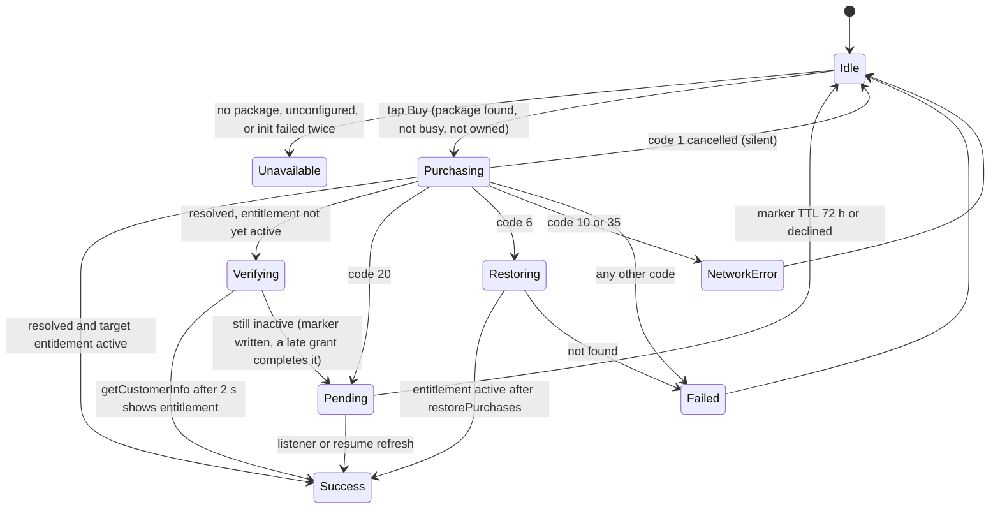
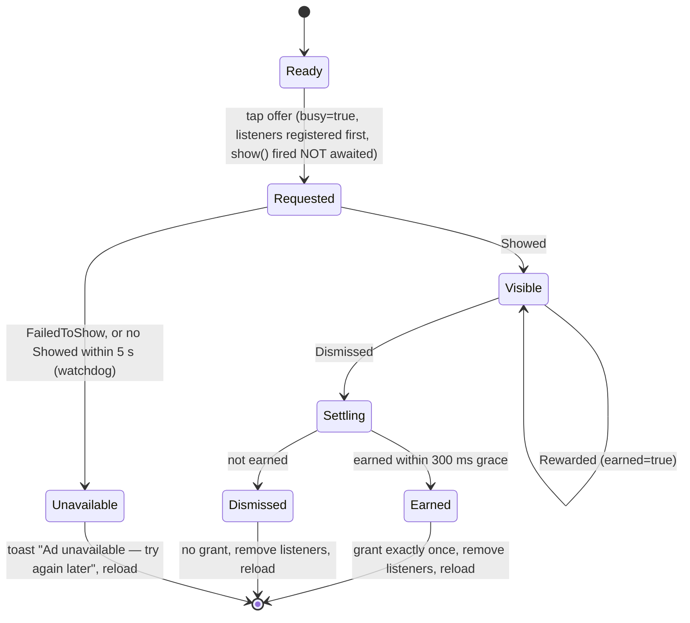

# Monetization Design: Gravity Flow

> **Status:** design of record, 2026-10-07 (baseline `master @ d3c6aab`). Working title "Gravity Flow" until D-19.
>
> **Conforms to** [`../roadmap/DECISIONS.md`](../roadmap/DECISIONS.md): D-07 (hints never sold), D-08 (result screen), D-09 (purchases), D-10 (consent-first boot), D-11 (lifecycle), D-12 (durable saves), D-14 (Remote Config), D-17 (boards copy), D-18 (login pause), D-21 (daily payout), D-23 (single currency), D-24 (ads policy), D-25 (13+), D-30 (deferred systems).
>
> **Two parts, two phases:**
> - **Part A, "Fix first"**, is the P0 plumbing spec (EXECUTION-ORDER steps 3 and 4, plan [`../roadmap/phases/P00-foundation.md`](../roadmap/phases/P00-foundation.md)). These are correctness defects, not design choices.
> - **Part B, "Design"**, is P7 (EXECUTION-ORDER step 18, plan [`../roadmap/phases/P07-monetization.md`](../roadmap/phases/P07-monetization.md)). It needs P5 shop components and P6 Remote Config and telemetry.
>
> **Evidence labels:** **VERIFIED** (read in this repo or in plugin source) · **DOCUMENTED** (vendor, Google or legal docs, cited in [`../research/monetization.md`](../research/monetization.md)) · **HEURISTIC** (industry practice or our judgement; a target to validate, not a fact).

---

## Part A: Fix first (P0 plumbing)

### A.0 What is broken today (VERIFIED)

On a device the game would make $0 today. It also carries policy and trust risks ([STATE-AUDIT §F](../audit/2026-10-07/STATE-AUDIT.md)).

| # | Defect | Evidence | Fixed in |
|---|---|---|---|
| 1 | RevenueCat proxy registered as `'PurchasesPlugin'`, but the native plugin is `"Purchases"`. Every call fails. | `src/utils/native/revenueCat.ts:19` | A.1 |
| 2 | `apiKey: ''`, so `configure()` is skipped. | `src/config/monetization.config.ts:26`, `IAP.ts:65` | A.1, A.14 |
| 3 | `availablePackages[0]` fallback can charge for the wrong product. | `src/utils/IAP.ts:107-110` | A.4 |
| 4 | `hasEntitlement(result) \|\| true`, and bundles granted only locally, so they are never restored. | `IAP.ts:151-152`, `165-180` | A.2, A.5 |
| 5 | Pending, cancelled and failed are all treated as `false` and shake the camera. There is no customer-info listener. | `IAP.ts:120-123`, `159-161` | A.4, A.5 |
| 6 | Prices are hard-coded USD strings. | `monetization.config.ts:56-58,67` | A.6 |
| 7 | `launchMode="singleTask"` can cancel purchases during a 3DS or bank-app hop. | `android/app/src/main/AndroidManifest.xml:26` | A.1 (D-09/D-11) |
| 8 | Rewarded resolves only on reward, so an early close hangs forever. | `src/utils/Ads.ts:101-105`; plugin `RewardedAdCallbackAndListeners.kt` | A.9 |
| 9 | `isRewardedReady()` is always `true`, so offers show when no ad exists. | `Ads.ts:84-86` | A.8 |
| 10 | The interstitial is loaded on demand *after* `scene.restart`, so it appears 1–3 s into the next level with timers running. `showInterstitial` resolves before dismissal. | `src/scenes/GameScene.ts:1163-1166`, `Ads.ts:138-139` | A.10 |
| 11 | A 2× rewarded view is followed straight away by an interstitial (stacked full-screen ads). | `GameScene.ts:1399-1404` → `1163` | A.10 |
| 12 | The Endless 2× button is disabled only *after* the await, so a double tap grants twice. | `src/scenes/EndlessScene.ts:487-494` | A.11 |
| 13 | Consent is requested lazily (it can pop mid-level), `canRequestAds` is ignored, `initialize()` has no content rating, and there is no privacy-options entry. | `Ads.ts:57-81`, `75` | A.7 |
| 14 | The web stub grants paid items for free on the public Vercel build. | `IAP.ts:96-100`, `133-138` | A.13 |
| 15 | Both Starter and Founder's grant Remove Ads, so a Starter owner pays for it twice. | `monetization.config.ts:56-58` | A.6 (label), B.4 (twins) |

### A.1 RevenueCat registration and init sequence (D-09)

**Registration.** Delete the local proxy (`src/utils/native/revenueCat.ts`). Inside the `Capacitor.isNativePlatform()` guard, call `import('@revenuecat/purchases-capacitor')`. The official entry is `registerPlugin('Purchases')` and gives typed `PURCHASES_ERROR_CODE` and `LOG_LEVEL` (VERIFIED). Never return the proxy from an `async` function: it is thenable (existing note at `IAP.ts:54-57`).

**Init sequence.** It starts from `main.ts:23` (`void IAP.initNative()`), is non-blocking, and never delays boot.

| Step | Call | Notes |
|---|---|---|
| 1 | Guard `isNativePlatform()`, then dynamic import | The web build never loads the plugin |
| 2 | `setLogLevel({ level: LOG_LEVEL.DEBUG })` | `import.meta.env.DEV` only |
| 3 | Choose the key | Release builds use the public `goog_…` key in `monetization.config.ts`. DEV builds use the Test Store key from `.env.development` only. If the key is empty, state is `unconfigured` and the shop shows "Purchases unavailable"; never a shake. |
| 4 | `configure({ apiKey })` | No `appUserID` (anonymous). Default transfer behaviour. |
| 5 | `addCustomerInfoUpdateListener(apply)` | Handles pending completion and refund revocation |
| 6 | `apply(await getCustomerInfo())` | **Mandatory.** On Android the listener does not replay current info (`PurchasesPlugin.kt:83,190-195`, VERIFIED). |
| 7 | `getOfferings()` | Cache `packageId → PurchasesPackage` (the full object) |
| 8 | On App `resume` (D-11) | `getCustomerInfo()` (cached ≤5 min, DOCUMENTED) |

IAP state: `unconfigured | initializing | ready | failed`. A `failed` state retries on the next `resume`.

**`apply(info)`** is a pure mapping (TDD, `entitlements → grants`). It:
1. Writes the snapshot `gravity-flow:entitlements:v1 = { v: 1, active: string[], at: epochMs }`, which keeps `isNoAds()` synchronous.
2. Mirrors the snapshot to Preferences (D-12).
3. Recomputes the derived bundle cosmetics.
4. If the equipped item is no longer owned (refund, or another Google account), falls back to the default.
5. Resolves any pending markers whose entitlement is now active, with the toast "Unlocked: …".

The legacy `gravity-flow:premium` key is read once as the initial snapshot, then dropped.

**Android.** `MainActivity` gets `launchMode="singleTop"` (D-09, D-11). Regression-test App and deep-link behaviour.

### A.2 Entitlement map (D-09, exact)

The game is unlaunched, so `premium` is renamed to `no_ads` now.

| Play product id | RC package id | Entitlements | Derived cosmetics |
|---|---|---|---|
| `remove_ads` | `remove_ads` | `no_ads` | — |
| `starter_pack` | `starter` | `no_ads`, `pack_starter` | `trail_galaxy` |
| `premium_collection_pack` | `premium_collection` | `pack_premium_collection` | `cosmic_blackhole`, `arrival_bolt` |
| `founders_pack` | `founders` | `no_ads`, `pack_founders` | `mythic_phoenix`, `mythic_dragon` |

**Ownership.** `owned = localOwned ∪ derived(active entitlements)`. Bundle cosmetics are **never** written into `CosmeticStore.owned`. They are derived on every read, so a refund removes them and a restore brings them back with no extra code path. `nonSubscriptionTransactions` is used only on a debug screen. Part B adds products to this map (B.4), which requires a D-09 table amendment.

### A.3 Non-consumable configuration

- Every one-time product is flagged **Non-consumable** in the RevenueCat dashboard. Otherwise RC consumes it, and Billing Library 8 can no longer restore it for anonymous users (DOCUMENTED).
- Each Play product has exactly one **Buy** purchase option, marked backwards-compatible. No Rent option and no Play-side discount offers: RC doesn't support them (DOCUMENTED, RC staff 2026-09-02).
- RC acknowledges purchases automatically. The license-tester **3-minute auto-refund** is the smoke test: a refund after 3 minutes means the configuration is broken (matrix row P6).

### A.4 Purchase flow state machine



**Rules:**
- **Lookup.** Find the package by package id, then by product id. If neither matches, the card is "Unavailable" and `purchase_failed{reason:no_package}` fires. **Never `[0]`.**
- **Call.** `purchasePackage({ aPackage })` receives the exact object from `getOfferings()`. Native code rejects a package without `presentedOfferingContext` (VERIFIED).
- **Success** means the target entitlement is active after `apply`. Nothing else counts.
- **Verifying never ends in Failed (amended in P00-T17, from T16 review M5).** `purchasePackage` resolved but the target entitlement is still not active after the one re-read 2 s later: the outcome is **Pending**, not `not_entitled`/Failed. A pending marker is written (so the card reads "Payment pending — unlocks automatically", never a second Buy), `purchase_pending` fires, and the customer-info listener or the next foreground refresh completes it (firing `purchase_completed` once). `iap.notEntitled` is reported once per session, because a persistent case points at the dashboard (a product not attached to its entitlement). The marker clears on the entitlement turning active, after the 72 h TTL, or on that card's "Check status".

| `e.code` (VERIFIED) | Outcome | UX | Analytics |
|---|---|---|---|
| `1` cancelled | Idle | Nothing: no toast, no shake | `purchase_failed{cancelled}` |
| `20` payment pending | Pending | Card chip "Payment pending — unlocks automatically". The marker `{productId, at}` persists. | `purchase_pending` |
| resolved, entitlement still inactive after the 2 s re-read ("Verifying", **amended in P00-T17**) | Pending (not Failed) | Same chip and marker as code 20. The store took the payment, so the player is never told a charged purchase failed. | `purchase_pending`, plus one `iap.notEntitled` Crashlytics report |
| `6` already purchased | Restoring | `restorePurchases()` (user-initiated, so allowed), then `apply` | `purchase_failed{already_owned}` → `restore{…}` |
| `10` network / `35` offline | NetworkError | "No connection — try again when you're online." | `purchase_failed{network}` |
| `42` Test Store simulated failure | Failed | Generic error (DEV only) | `purchase_failed{error}` |
| any other | Failed | "Purchase didn't go through. You were not charged unless Google Play says so." | `purchase_failed{error}` |

`purchase_completed` fires only on Success. `first_purchase` keeps its existing once-per-device flag (`IAP.ts:31-46`).

### A.5 Pending, refund, restore

- **Pending.** No grant until `PURCHASED` (DOCUMENTED). RC resolves pending purchases from RTDN and pushes them through the listener. The marker is advisory, and it clears when:
  - the entitlement turns active (toast "Unlocked: …"), or
  - after 72 h (INFERRED; verify with matrix row P5), or
  - when the user taps the card's "Check status" (which runs `restorePurchases` for that product). If the product is still not owned afterwards, its marker is cleared anyway, so the card goes back to a priced Buy button and the toast agrees with it: "No completed payment found yet. If a payment is still processing it will unlock automatically; otherwise you can try again." (`PURCHASE_COPY.CHECK_NOT_FOUND`). A payment that is genuinely still processing is not lost: the customer-info listener or the next foreground refresh unlocks it.
  
  A pending product never shows a second Buy button.
- **Refund / chargeback.** Revocation reaches RC within ≤24 h (DOCUMENTED). The next `apply` removes `no_ads` and the derived cosmetics, and the equipped item falls back to the default. Interstitials resume. There is no punitive copy, and Stardust is never clawed back.
- **Restore** has two entry points, both built with `makeLink` and run by `runRestore` (`ui/purchaseUi.ts`): Settings (in `SettingsScene.create`) and the shop's Bundles tab (in `CosmeticsScene.create`, none on web). Refer to them by function, not line.
  - It is user-initiated only (`restorePurchases`). `syncPurchases` is never used.
  - Busy-guarded.
  - Shows a toast that lists restored items, or "No purchases found for this Google account".
  - Covers **all** entitlements.

### A.6 Store price display and Starter visibility

- **Prices** come only from `pkg.product.priceString`. Delete `BundleDef.priceLabel` and `REMOVE_ADS_PRICE_LABEL` (`monetization.config.ts:40,67`; Settings uses it at `SettingsScene.ts:148`). Until offerings load, show `…` with the button disabled. If there's no package, show "Unavailable". The same goes for a store whose SDK init failed twice in a row (`PURCHASE_FLOW.INIT_FAIL_LIMIT`: the boot attempt plus one retry): a terminal "Unavailable" instead of "…" for ever. Opening the shop or Settings, or the next foreground, retries, and a success clears it.
- **Starter is hidden only when `no_ads` is owned through a different product** (Remove Ads or Founder's), per DECISIONS A-24. A Starter the player actually owns keeps its card and reads **OWNED** (the rule hides the offer, not what they bought), so it does not vanish at the moment of purchase. A locked bundle-only cosmetic whose bundle is hidden (Galaxy Trail) does not cross-sell to it: tapping it shows "Part of the Starter Pack — not offered once Remove Ads is owned" and records no `bundle_cross_sell` intent. Implemented in P00-T17 as `BundleDef.hideWhenNoAds` + `purchaseCardView` (`src/services/purchaseView.ts`).
- **Interim honesty (P0).** If `no_ads` is active, the Founder's card's value line reads "Remove Ads ✓ already yours". P7 replaces this with cosmetic-only twin products (B.4).

### A.7 AdMob consent-first boot (D-10, D-25)

| Step | Action | Detail |
|---|---|---|
| 1 | Firebase starts with **all four Consent Mode defaults denied** | Manifest: `google_analytics_default_allow_{analytics_storage, ad_storage, ad_user_data, ad_personalization_signals}=false`, plus `google_analytics_automatic_screen_reporting_enabled=false`. Analytics events queue before consent (D-14). |
| 2 | `requestConsentInfo()` during CompanySplash, non-blocking | **Every launch** (DOCUMENTED). DEV only: `debugGeography` (`AdmobConsentDebugGeography.EEA=1 / NOT_EEA=2`, VERIFIED in plugin 8.0.0) and `testDeviceIdentifiers`. |
| 3 | `showConsentForm()` | Safe to call every time; it wraps `loadAndShowConsentFormIfRequired` (VERIFIED) |
| 4 | Keep `privacyOptionsRequirementStatus` | Settings shows **"Privacy choices"** only when it is `REQUIRED`. That row calls `showPrivacyOptionsForm()` and then re-requests consent info. |
| 5 | **Only if `canRequestAds`:** `initialize({ maxAdContentRating: MaxAdContentRating.ParentalGuidance, initializeForTesting: DEV, testingDevices: DEV_IDS })` | Called once, behind an `initPromise`. D-10/D-25's "PG" is the enum value `'ParentalGuidance'` (VERIFIED). No `tagForChildDirectedTreatment` and no global under-age tag (D-25). |
| 6 | `FirebaseAnalytics.setConsent(...)` from the UMP outcome | Crashlytics collection follows the analytics choice (D-10) |
| 7 | Preload rewarded, and the interstitial unless `no_ads` | A.8 |

Settings also gains a "Privacy policy" link and "Reset analytics data" (D-10). Gameplay never waits on consent or ads; the first level is playable while the form is pending.

### A.8 Preload and readiness

Each format keeps `{ status: idle|loading|ready|showing|backoff, loadedAt, failCount }`. It is driven by the plugin events `RewardAdPluginEvents.{Loaded, FailedToLoad, Showed, FailedToShow, Dismissed, Rewarded}` and `InterstitialAdPluginEvents.{Loaded, FailedToLoad, Showed, FailedToShow, Dismissed}` (VERIFIED enum strings).

- Preload after init, and again after every `Dismissed` or `FailedToShow`. Each ad is one-shot (VERIFIED).
- On `FailedToLoad`, back off 30 s → 60 s → 120 s → max 300 s.
- If `now − loadedAt > 55 min`, reload (ads expire at 60 min, DOCUMENTED).
- `isRewardedReady()` returns the real state. **Every rewarded offer is hidden when it isn't ready** (D-24). It is checked at render time and again at tap time.
- The interstitial is preloaded only for players without `no_ads`, at the start of a level that could be followed by an eligible break.

### A.9 Rewarded state machine (D-24, 5 s watchdog)



**Rules:**
- `Ads.showRewarded(source)` returns `Promise<'earned' | 'dismissed' | 'unavailable'>` and **always settles**.
- The reward is granted **after dismissal**, once per offer, guarded by an offer-instance id. Game audio is suspended while the ad shows.
- **Any rewarded view resets the interstitial clock** (D-24). This fixes defect #11.
- `rewarded_offered`, `rewarded_shown` and `rewarded_earned` keep their `source` attribution (`analyticsEvents.ts:88-90`). Add `rewarded_result{source, result}`.

### A.10 Interstitial: awaited, and after NEXT once P3 lands (D-08, D-24)

- **P0 (before P3).** Inside `GameScene.advanceAfterWin` (`GameScene.ts:1149-1168`), the interstitial is awaited **before** `scene.restart`:
  1. The win overlay is held, input disabled, audio suspended.
  2. `await Ads.showInterstitialAndWait()` resolves on `Dismissed` or `FailedToShow`, or when no `Showed` arrives within 5 s.
  3. Then `scene.restart({ level: next })`. The next level's clock starts fresh, and the physics world stays paused throughout (`GameScene.ts:1106`).
- **If no interstitial is ready, skip it.** Never wait on a load (D-24).
- **P0 keeps the existing gate** (`src/utils/interstitial.ts`: premium, grace 3 levels / 120 s, flow-protected, 180 s gap) and adds the rewarded-resets-clock rule. The full D-24 cap table is P7 (B.2).
- **After P3.** The interstitial is triggered **only** from the NEXT handler on the result panel. RETRY and LEVELS never show one (D-08). Auto-advance is gone, so `advanceAfterWin`'s timer path is deleted.

### A.11 Busy guards and lifecycle

- **Ad flag.** One module-level `adInFlight` flag in `Ads.ts`; a second `show*` call while it is set resolves `'unavailable'`.
- **Purchase flag.** One `purchaseInFlight` flag in `IAP.ts`; while it is set, purchase and restore buttons render disabled.
- **Buttons disable synchronously on tap, before any await.** This fixes defect #12, and the same pattern applies to revive, the chest and free currency.
- **Lifecycle (D-11).** The `pause` handler ignores App background events while `adInFlight` or `purchaseInFlight` is set (ad activities and the Play sheet background the WebView). It does not show the pause overlay for them, and resumes into the same state.
- If the scene is torn down while a rewarded ad is in flight, an earned reward is still credited to the store (idempotent), and the UI update is skipped.

### A.12 Offline behaviour

| Situation | Behaviour |
|---|---|
| Offline at boot | Consent info request fails, so no ad init this session. Retry on the next `resume` with connectivity. The game is fully playable. |
| Offline, rewarded not loaded | Offers hidden; no dead taps |
| Offline at an interstitial break | Skipped |
| Offline purchase | Codes 10/35, "No connection" message |
| Offline with prior purchases | The entitlement snapshot keeps the player ad-free with cosmetics owned. RC also falls back to a local store check when its servers are down (DOCUMENTED). |
| Offline shop | Prices show `…` until offerings load. Stardust purchases work. |

### A.13 Release guards

- A Vite build-time check fails a **release** build if:
  - the ad unit or app ids are Google test ids (`ca-app-pub-3940256099942544…`, currently at `monetization.config.ts:9-11`), or
  - the RC key is empty or is the Test Store key.
- **Production web build.** IAP buttons read "Available in the Android app" and no web build, dev included, grants anything: buy and restore resolve `unavailable`, and the DEV grant stub was deleted in the P00-T17 fix pass (fixes defect #14). Rewarded on web stays a DEV-only stub. Production web never grants ad rewards.

### A.14 Owner dashboard setup checklist

| # | Where | Action | Verify |
|---|---|---|---|
| **Play Console** ||||
| G1 | Settings → Payments profile | Merchant account. **The address becomes public** for monetized apps; use a business or virtual address. Declare EU DSA trader status. | Profile active |
| G2 | Release → Internal testing | Upload a release-signed AAB with versionCode ≥ 1000001 (D-20). The product UI is already unlocked by the earlier BILLING-permission upload. | Build available to testers |
| G3 | Monetize → Products → One-time products | Create `remove_ads`, `starter_pack`, `premium_collection_pack`, `founders_pack`. Each gets one **Buy** option (backwards-compatible), a USD base price plus reviewed per-country prices (B.4), and is **Active**. **Product ids are permanent** and can never be reused. | 4 products Active |
| G4 | Settings → License testing | Add tester Gmail accounts; license response `RESPOND_NORMALLY` | Testers see "Test card" options |
| G5 | Internal testing → Testers | Add the same accounts and share the opt-in URL. Each tester accepts it on the device's primary Play account. | Testers install from Play |
| G6 | App content | Ads = Yes. Data safety includes Purchase history (RevenueCat + GA4F). IARC: Digital purchases = Yes, random paid items = **No**. Target audience 13–15 / 16–17 / 18+ (D-25). | Forms submitted |
| G7 | Monetization setup → RTDN | Paste the Pub/Sub topic from RC (R4); send a test notification | RC shows the test event |
| **Google Cloud + RevenueCat** ||||
| R1 | RevenueCat | Create the project and Play Store app `com.truestorylabs.gravityflow` | App listed |
| R2 | Google Cloud | Enable the Play Android Developer API and Play Developer Reporting API. Create a service account and JSON key. In Play Console → Users and permissions, invite it with the four permissions on RC's "Creating Play service credentials" page. | — |
| R3 | RC → app → Service credentials | Upload the JSON. Allow up to 36 h. | "Valid credentials" |
| R4 | RC → app → Google developer notifications | Connect to Google to create the Pub/Sub topic → G7 | Topic shown |
| R5 | RC → Products | Import the 4 products; set each to **Non-consumable** | Type column shows Non-consumable |
| R6 | RC → Entitlements | `no_ads`, `pack_starter`, `pack_premium_collection`, `pack_founders`, attached exactly as in A.2 | Map matches A.2 |
| R7 | RC → Offerings | Offering `default` set as **Current**, packages `remove_ads`, `starter`, `premium_collection`, `founders` (custom ids) | `getOfferings().current` lists 4 |
| R8 | RC → API keys | Copy the **public** `goog_…` key into `REVENUECAT.apiKey` (safe to commit). The Test Store key goes only into `.env.development`, never into a release. | Release guard passes |
| **AdMob + UMP** ||||
| M1 | AdMob → Apps | Create or confirm the app for the package. Link it to the Play listing once the listing is public. | App id issued |
| M2 | AdMob → Ad units | One **Interstitial** (`interstitial_level_break`) and one **Rewarded** (`rewarded_main`). Optional per-surface rewarded units are a P7 reporting choice. | Unit ids issued |
| M3 | Interstitial unit → Frequency capping | 1 impression per 3 min **and** 10 per day per user (backstop for D-24) | Cap saved |
| M4 | AdMob → Blocking controls | Maximum ad content rating **PG** (matches D-25) | Saved |
| M5 | AdMob → Settings → Test devices | Register every QA device | Test label on ads |
| M6 | Repo (developer) | App id → `AndroidManifest.xml:17-19` + `ADMOB.appId`; unit ids → `ADMOB` (release). DEV keeps Google test ids. | Release guard passes |
| U1 | Privacy & messaging → GDPR | Message for EEA + UK + CH: Consent / Do not consent / Manage options; privacy-policy URL | Published |
| U2 | Privacy & messaging → US state regulations | Message for the app | Published |
| **app-ads.txt** ||||
| W1 | Hosting | A **root-domain** site: a GitHub *user* site (`taysh123.github.io`) or a custom domain. The project path `/Gravity-Game/` will not verify (DOCUMENTED). | Site live |
| W2 | `/app-ads.txt` | `google.com, pub-<your 16-digit publisher id from AdMob → Settings → Account information>, DIRECT, f08c47fec0942fa0` | File served at the root |
| W3 | Play → Store settings → Website | The same root domain | Saved |
| W4 | AdMob → Apps → app-ads.txt | Status **Verified** (≤24 h after crawl). Unverified apps added after Jan 2025 get limited ad serving (DOCUMENTED). | Verified |

### A.15 On-device test matrix

The matrix runs on a release-signed internal-track build, with license testers and test ads (M5). The result of every row is reported as **HUMAN DEVICE TEST**.

| # | Scenario | Expected | Ref |
|---|---|---|---|
| C1 | Fresh install, `debugGeography: EEA` | The consent form appears before **any** ad request (no ad network calls in logcat beforehand). "Privacy choices" shows in Settings. | D-10 |
| C2 | EEA, "Do not consent" / Manage → reject all | Game fully playable. If `canRequestAds` is false, ads stay uninitialised and offers are hidden. No hang. | D-10, D-24 |
| C3 | `NOT_EEA` geography | No form. Privacy row hidden unless the status is REQUIRED. | D-10 |
| C4 | Settings → Privacy choices → change answer | Form re-shows; consent info re-requested; the next ad request reflects the change | D-10 |
| C5 | Firebase DebugView before and after consent | No events are sent before the UMP outcome. Queued events flush after a grant; storage stays denied after a denial. | D-10, D-14 |
| C6 | First launch offline, then go online and resume | No form, no ad init, game playable. The consent flow runs on resume. | A.12 |
| C7 | Debug log at init | `maxAdContentRating = ParentalGuidance`; no child-directed tag | D-25 |
| A1 | Campaign 2× with ad loaded | Offer visible; reward granted exactly once **after** dismissal; ad reloads | D-24 |
| A2 | Rewarded, close early | No reward. UI back to normal within 1 s. No hang. | A.9 |
| A3 | Rewarded with airplane mode / no fill | Offer hidden. If it was ready at render but fails at tap: "Ad unavailable" within 5 s (watchdog). | D-24 |
| A4 | Double-tap any rewarded button | One show, one grant | A.11 |
| A5 | Endless 2× and revive double-tap | One grant / one revive | A.11 |
| A6 | Home button during a rewarded ad, then return | Flow settles; no stuck pause overlay; reward if earned | D-11 |
| A7 | Eligible win (P0 gate) | Interstitial over the frozen win overlay; the next level starts only after dismissal, with its timer at full | D-24 |
| A8 | Eligible win, interstitial not loaded | Skipped instantly; no spinner; next level on time | D-24 |
| A9 | Watch 2×, then advance | **No** interstitial follows | D-24 |
| A10 | Two eligible breaks within 180 s | Second suppressed (`capped`) | D-24 |
| A11 | Buy Remove Ads mid-session | No more interstitials, none preloaded; rewarded still offered | D-09 |
| A12 | Audio during any full-screen ad | Game audio suspended, restored after | D-11 |
| A13 | After P3: RETRY / LEVELS from the result panel | Never an interstitial; only NEXT can trigger one | D-08 |
| P1 | Each product with "Test card, always approves" | Entitlement active; derived cosmetics owned; a localized `priceString` was shown before purchase | D-09 |
| P2 | Cancel the Play sheet | No toast, no shake, no grant | A.4 |
| P3 | "Always declines" | Friendly error; no grant | A.4 |
| P4 | "Slow test card, approves after a few minutes" | Pending chip; unlocks via the listener or the next foreground, without reinstall or restore | A.5 |
| P5 | "Slow test card, declines after a few minutes" | Pending chip clears (Check status or TTL); no grant | A.5 |
| P6 | Wait more than 3 min after a tester purchase | **Not** auto-refunded (proves Non-consumable + acknowledgement) | A.3 |
| P7 | Try to buy an owned product | Play blocks it, or code 6 → automatic restore → shown as owned | A.4 |
| P8 | Console "Refund + revoke" | Within ~24 h: entitlement gone, derived cosmetics removed, equip falls back, interstitials resume, Stardust unchanged | A.5 |
| P9 | Uninstall/reinstall, same account | Record whether entitlements return automatically. After Restore, all 4 entitlements are back, including bundles. | A.5 |
| P10 | Second device, same account | Restore → everything owned | A.5 |
| P11 | Second Google account on the same device | The cached snapshot is reconciled to the active account at launch | A.1 |
| P12 | Offline launch after purchase / offline buy | Still ad-free with cosmetics owned / "No connection" | A.12 |
| P13 | Play Billing Lab country IN, then DE | Local currency price strings, no "$" | A.6 |
| P14 | Background during purchase (3DS / bank app) | Purchase completes, not cancelled (`singleTop`) | D-09 |
| P15 | Open the shop before offerings load | `…` and disabled buttons, then real prices | A.6 |
| P16 | Own `remove_ads` or `founders_pack` | Starter hidden. Founder's reads "Remove Ads ✓ already yours". | D-09 |
| P17 | Restore with no purchases | "No purchases found for this Google account" | A.5 |
| P18 | DEV build with the Test Store key | Success, failure (42) and cancel paths all handled | A.4 |
| P19 | Release AAB inspection | `goog_` key, real ad ids; the release guard rejects test ids | A.13 |
| P20 | Production web build | Purchase cards read "Available in the Android app"; nothing granted | A.13 |
| P21 | AdMob app-ads.txt tab | Verified | W4 |

---

## Part B: Design (P7)

### B.1 Principles and what is never monetized

**Principles:**
1. **Optional, labelled, capped.** Every ad is opt-in rewarded, or an interstitial placed at a real break under D-24 caps.
2. **Money buys items, never currency, hints or progress** (D-07, D-23, D-24).
3. **One earned currency** that always has a use (D-23).
4. **Every price is a real store price** (D-09). There are no fake discounts and no countdowns (D-24).
5. **Session 1 is pure game.**
6. **Retention beats revenue.** Any monetization change that moves D1 or D7 outside the guardrails in B.10 is rolled back.

**Never monetized.** These are never for sale, never gated behind an ad (except where noted), and never time-pressured:

| Never | Basis |
|---|---|
| Level unlocks, the open frontier, world gates | D-07, D-24 |
| Stars, par, gems, mastery credit | D-07 (assisted clears never earn par) |
| Hints or "Show me" route ghosts **for money** (an earned token or rewarded ad is allowed) | D-07, D-24 |
| Attractor strength, physics, any gameplay stat | D-26, cosmetic-only |
| Streak freezes or repairs; daily attempts | `retention.config.ts:92-98`; D-21; retention Q4 |
| Weekly/Endless board placement; revives for money | D-17; revived runs never post |
| Energy, lives, timers, waiting | MASTER-ROADMAP P7 must-not |
| Currency for money; loot boxes; random paid rewards | D-23; IARC "random items: No" |
| Ads in session 1, after a death, at level start, mid-attempt | D-24; audit F.3 |

### B.2 Placements

**Rewarded** (all hidden when no ad is ready, D-24; all labelled "Watch ad · …", D-08):

| Placement | Surface | Reward | Eligibility | Caps (Remote Config) |
|---|---|---|---|---|
| Endless revive | Run-over panel (`EndlessScene.ts:422-426`) | One revive (existing `doRevive`) | Not revived this run | 1 per run. Revived runs never post to boards (D-17). |
| Campaign 2× Stardust | Result panel, **below** NEXT and only once NEXT is live (D-08) | Doubles that clear's paid base | Payout > 0; not the Daily; not session 1 | ≤1 per 3 paying wins, ≤4/day (D-24) |
| Endless 2× | Run-over panel | Doubles the run payout | Run payout > 0 | 1 per run, ≤3/day (HEURISTIC) |
| Daily chest double | MainMenu login chest, after the free claim | The same ladder amount again (10–70 SD) | Today's chest claimed; comeback gift (D-18) excluded | 1/day |
| Free Stardust | Top card in the shop (replaces Free Fragments, `CosmeticsScene.ts:24,230-264`) | +50 SD | — | 1/day, resets at **local** midnight |
| Route ghost, after the free first view | Relief ladder at 6 fails (D-07, built in P3) | Plays the bot route once | First view per level is free. Never on levels 1–3. | Earned **hint token** *or* rewarded: 1 per attempt, 60 s cooldown, ≤5/day |

**Hint tokens** are earned only:
- +1 for each world completed (boss clear)
- +1 per 10 three-star clears
- cap 5

They are never sold, never convertible and never covered by any paid perk (D-07). An assisted clear earns ★1 and the gem, never the par star (D-07).

**Interstitial.** All values are Remote Config clamps (D-24):

| Rule | Value |
|---|---|
| Placement | **Only** after NEXT on a campaign result (D-08). Awaited and pre-loaded; skipped if not ready. |
| Lifetime grace | None before lifetime level 12 (first clears) |
| Spacing | ≥180 s **and** ≥3 completions since the last full-screen ad, rewarded included |
| Caps | ≤4 per session, ≤10 per day (plus AdMob server cap M3) |
| Never | after any death on that level, after a failure streak (≥3 attempts), at level start, on launch/resume/exit, right after a rewarded view, in session 1, for `no_ads` |

**Exceptions by level or mode type:**

| Context | Interstitial | Why |
|---|---|---|
| Boss clear, or NEXT into a new world | No | Climax and world ceremony |
| 3★ or a new par star | No | Mastery moment (existing `flowProtected`) |
| Hot streak (FLOW+) | No | Existing `streakTier(...).level ≥ 1` |
| Level needed ≥3 attempts, or any death on it, or assisted | No | D-24 failure streak. Today's gate hits the struggling player (audit F.2); this fixes it. |
| Daily / Weekly / Endless / post-game modes | No | Daily is a one-payout habit (D-21); Endless monetizes through revive and 2× |
| RETRY, LEVELS | Never | D-08 |

**Expected rate (HEURISTIC).** About 1 interstitial per 4–6 eligible clears for non-payers past level 12. The KPI ceiling is ≤1.5 per DAU (MASTER-ROADMAP P7).

### B.3 Economy v2 (D-23)

#### B.3.1 Currency merge: ×10, value-neutral

Cosmic Fragments are a "premium" currency nobody can buy. They carry the cost of two currencies without the benefit (research Q5), and Stardust dies by about level 25–30 (audit F.2). Fragments merge into Stardust at ×10 on **balances, prices and every faucet**, so purchasing power is unchanged.

**Migration** is pure, idempotent and run once after the D-12 hydrate:

```
sd_v2 = floor(max(0, sd_v1)) + 10 × floor(max(0, fr_v1))      (NaN/corrupt → 0, as CurrencyStore.load does today)
write currency:v2 = sd_v2 → then write economy:v2 marker {v:2, at, sd:sd_v1, fr:fr_v1}
v1 keys (currency:v1, fragments:v1) are left untouched (frozen) for rollback
```

- A crash between the two writes re-derives the same value from the frozen v1 keys, so the migration is idempotent by construction.
- Owned and equipped cosmetics are untouched.

| Player | SD before | FR before | SD after | Purchasing-power check |
|---|---|---|---|---|
| Fresh install | 0 | 0 | 0 | — |
| Early (≈L20) | 180 | 6 | 240 | Ion (70) affordable before and after |
| Mid (≈L80, owns all SD items) | 2,480 | 37 | 2,850 | 37 FR bought Nova Core (30). 370 SD buys it (300). |
| Hoarder | 5,000 | 400 | 9,000 | 400 FR bought Void + Bloom + Titan (290 FR). 4,000 SD buys them (2,900). |

**Price conversion** (`src/utils/cosmetics.ts:56-87`): every `acquire: 'fragments'` item becomes `'stardust'` at cost ×10. The **earnable catalog** is then:

| Tier | Items | Price range (SD) | Subtotal |
|---|---|---|---|
| Common / Rare (unchanged) | 6 | 40–110 | 440 |
| Epic | 8 | 250–450 | 2,450 |
| Legendary | 4 | 500–900 | 2,550 |
| Mythic | 2 | 1,000 | 2,000 |
| **Earnable catalog** | **20** | | **7,440** |

The rarity ladder invariant (`src/utils/economy.test.ts`) still holds in one currency: Common max 40 < Rare min 70, Rare max 110 < Epic min 250, Epic max 450 < Legendary min 500, Legendary max 900 < Mythic min 1,000.

#### B.3.2 Faucets: today vs v2

| Source | Today (VERIFIED) | v2 | Guard |
|---|---|---|---|
| Campaign clear | 5 + 3/★ on every win, replays included (`currency.ts:5-8`) | **Lifetime per level = 5 + 3 × best★.** First clear pays 5 + 3/★; replays pay only newly earned ★ (×3). | Anti-farm once RETRY is one tap (P3) |
| Win-streak bonus | 10/20/35/60 at 3/5/8/12 (`retention.config.ts:43-48`) | Same amounts; only **paying** wins advance the bonus counter (the flourish still counts every win) | Stops trivial-replay farming |
| Daily | 15 + 3/★, streak 10/25/50/100 at 3/7/14/30 | Unchanged, **one payout per day** (D-21) | 1/day |
| Endless | `min(60, floor(score/40))` per run (`endless.ts:86-88`) | Unchanged per run | **≤150 SD/day** |
| Achievements (14) | 655 SD + 71 FR | sd + 10×fr = **1,365 SD** (e.g. `stars_all` 150 + 200) | Once |
| ★ milestones 30/60/100/150 | 10/15/25/40 FR (`Rewards.ts:36-38`) | 100/150/250/400 SD **plus a prestige cosmetic** (B.3.6) | Once |
| Collection complete | 20 FR, counts bundle items (`cosmeticsLogic.ts:27-30`) | 200 SD, **earnable items only** | Once per collection |
| Login ladder | 10/12/15/18/22/28/40 SD + 0/0/1/0/1/1/3 FR | **10/12/25/18/32/38/70 SD** (205 per 7 login days). Pauses, never resets (D-18, P6). | 1/day |
| Free Fragments ad | 5 FR/day, UTC key (`RewardStore.ts:5-7`) | Free Stardust 50 SD/day, local date | 1/day |
| Rewarded 2× / chest double | 2× on every win | B.2 caps | B.2 |

#### B.3.3 Sources and sinks over time

This is a modelled **median retained player** (HEURISTIC; P7-T01 encodes the model as a test so the numbers stay honest).

| Assumption | D1 | D7 | D30 | End of campaign (≈D50) |
|---|---|---|---|---|
| Campaign first clears | 15 | 50 | 110 | 150 |
| Best ★ total | 30 | 105 | 240 | 360 |
| Dailies paid / login days / Endless runs | 1 / 1 / 0 | 5 / 7 / 5 | 20 / 24 / 20 | 33 / 40 / 30 |

| Cumulative Stardust earned | D1 | D7 | D30 | EoC |
|---|---|---|---|---|
| Campaign (5/clear + 3/best★) | 165 | 565 | 1,270 | 1,830 |
| Win-streak bonus | 30 | 100 | 250 | 350 |
| Daily + daily-streak bonus | 21 | 115 | 550 | 833 |
| Login ladder v2 | 10 | 205 | 662 | 1,122 |
| Achievements v2 | 120 | 570 | 795 | 1,015 |
| ★ milestones | 100 | 500 | 900 | 900 |
| Collection completions (earnable) | 0 | 200 | 400 | 600 |
| Endless (≤150/day) | 0 | 100 | 400 | 600 |
| **Non-watcher total** | **446** | **2,355** | **5,227** | **7,250** |
| Rewarded (2× every capped offer; free SD, chest double and Endless 2× on ~60% of days/runs) | 93 | 545 | 1,775 | 2,760 |
| **Watcher total** | **539** | **2,900** | **7,002** | **10,010** |

| Sinks at P7 launch | Items | Price (SD) | Total |
|---|---|---|---|
| Earnable catalog (B.3.1) | 20 | 40–1,000 | 7,440 |
| Procedural recolors, 1 per Epic+ earnable item (B.3.5) | 14 | 150 | 2,100 |
| "First Light" seasonal Stardust drop (B.3.5) | 3 | 300 / 300 / 650 | 1,250 |
| **Total spendable** | **37** | | **10,790** |
| Prestige cosmetics (B.3.6) | 6 | achievement-only | — |

**Share of the sink a player can own:**

| | D1 | D7 | D30 | EoC |
|---|---|---|---|---|
| Non-watcher | 4% | 22% | 48% | 67% |
| Watcher | 5% | 27% | 65% | 93% |

The first purchase (Ember, 40 SD) is affordable at about lifetime level 3. After D7, the next Epic (250) arrives every 2–3 play days.

The research heuristic for a campaign finisher was 40–50% of earnables. v2 lands higher (67%), because the merge makes the old dead Stardust spendable and collections are no longer paywalled. We accept that: the post-campaign sink cadence (B.3.7) carries players from there.

#### B.3.4 Spotlight rotation (D-23)

- **What.** One earnable Epic+ item a week at **20% off in Stardust only**. The price is floored to the nearest 10 (Void Trail 1,000 → 800; Quantum 450 → 360).
- **Schedule.** Deterministic from a fixed shuffled list and the week key. The week boundary is shared with the Weekly Run: Sunday 07:00 UTC (D-17). Remote Config `spotlight_schedule` dated overrides only, never retroactive (D-14).
- **Honest.** The same item for everyone. The shelf shows **this week and next week**, so nobody has to buy now. There is **no countdown** (D-23, D-24). If the player owns it, the shelf reads "Owned · Next week: …".
- **"Was" price** is always the regular Stardust price, which has been unchanged ≥30 days. This mirrors the EU rule (B.4) even though Stardust isn't money.

#### B.3.5 Procedural recolors and seasonal drops

**Recolors** are an evergreen sink with near-zero art cost, because cosmetics are runtime Graphics:
- One palette variant per Epic+ earnable item: a hue rotation of +150° on `fill / glow / accent / trail.colors / arrival.*`, with glow lightness clamped to 0.45–0.85 so the ball stays readable (D-13).
- 150 SD each, and **requires owning the base item**. Price < base price is an invariant.
- Variant id `<baseId>@shift`. Bundle items get no recolors, which keeps exclusives exclusive.
- A second palette wave (+2,100 SD) ships with P10.

**Seasonal Stardust drops** add earnable items each content update:
- **"First Light" ships with P7:** First Light Core (Epic skin, 300), Dawn Burst (Epic arrival, 300), Daybreak Trail (Legendary trail, 650).
- A season's items are featured on a "This season" shelf. Afterwards they move to the permanent **Vault** shelf at the same price.
- **Nothing earnable is ever permanently missable** (retention Q4, Q7).

#### B.3.6 Achievement-unlocked prestige cosmetics (D-23)

These replace Fragments' prestige role. They have no price in any currency. They live in a new **Prestige** collection and are granted retroactively on first boot after the update. Each grant is idempotent, keyed in RewardStore.

| Cosmetic | Category / rarity | Unlock |
|---|---|---|
| Voyager Trail | trail / rare | 30★ (`MILESTONE_LABEL` "Voyager", `retention.config.ts:66`) |
| Luminary Burst | arrival / epic | 60★ "Luminary" |
| Ascendant | skin / legendary | 100★ "Ascendant" |
| Celestial | skin / mythic | 150★ "Celestial" |
| Homecoming Trail | trail / legendary | `all_done` (every level cleared) |
| Singularity | skin / mythic | `stars_all` (every star) |

#### B.3.7 Collections not paywalled; no dead currency; no inflation

- **Collections.** Completion counts **earnable items only** (`acquire ∈ free | stardust | achievement`). Today 4 of 6 collections include bundle items, so 80 of the 120 Fragment rewards sit behind a purchase (research §0).
  - Bundle items still show in their collection with a "Supporter item · not needed to complete" chip.
  - The Mythic collection's earnable set is Titan Eye. The next seasonal drop adds one earnable Mythic to it.
- **No dead currency:**
  - One currency, so nothing is stranded.
  - Guardrail: % of DAU with ≥1 affordable unowned item must stay within **30–70%**.
  - Guardrail: median days of currency on hand (balance ÷ trailing-7-day earn rate) must stay within **2–10**.
  - Above 10 days for veterans, add sinks: a recolor wave or a seasonal drop. Each content update adds ≥1,250 SD of sinks.
  - Post-campaign veterans (about 110–230 SD/day) will still out-earn the catalog. An evergreen vanity sink (lighting Star Map constellations) is an **open question for P10**, not built now.
- **No inflation:**
  - Prices of existing items **never rise**.
  - Faucet changes go only through clamped, dated Remote Config values (D-14).
  - Stardust never expires.
  - Money never buys Stardust (D-23).
  - Rewarded share of a watcher's earnings stays ≤30% (model: 28% at EoC).

### B.4 Offers and pricing

**Catalog.** USD base prices are HEURISTIC, from the research ranges. Every price shown in-app is the store `priceString` (D-09).

| Product (Play id) | Price | Entitlements | Contents | Shown |
|---|---|---|---|---|
| Remove Ads (`remove_ads`) | $2.99 (from $1.99) | `no_ads` | Interstitials off; rewarded stays optional | Until `no_ads` |
| Starter Pack (`starter_pack`) | $3.99 | `no_ads`, `pack_starter` | Remove Ads + Galaxy Trail (Legendary). Keeps the honest **BEST VALUE** tag (`monetization.config.ts:44-52`). | After the first World 1 boss clear (B.6); **hidden once `no_ads` is owned through another product** (D-09, A-24) |
| Galaxy Trail (`starter_cosmetic`) | $0.99 | `pack_starter` | Galaxy Trail only | Only to `no_ads` owners without it |
| Premium Collection (`premium_collection_pack`) | $4.99 | `pack_premium_collection` | Black Hole + Lightning Strike | Always |
| Founder's Pack (`founders_pack`) | $7.99 | `no_ads`, `pack_founders` | Remove Ads + Phoenix Core + Dragon Heart + **Founder badge** | Until the honest end date |
| Founder's Cosmetics (`founders_cosmetic`) | $4.99 | `pack_founders` | The same, without Remove Ads | `no_ads` owners, until the end date |
| Supporter Pack (`supporter_pack`) | $9.99 | `no_ads`, `pack_supporter` | Remove Ads + Halcyon set (Halcyon Core mythic skin, Halcyon Wake legendary trail, Halcyon Bloom legendary arrival) + a supporter star in the EndScene sky | Shop; once on the EndScene |
| Supporter Cosmetics (`supporter_cosmetic`) | $6.99 | `pack_supporter` | The same, without Remove Ads | `no_ads` owners |
| Seasonal pack, e.g. "First Light Pack" (`season_first_light_pack`) | $2.99 | `pack_season_first_light` | Morning Star (legendary skin) + Horizon (legendary arrival) | During the season, then permanently in the Vault |
| No-Ads+ (`no_ads_plus`) | $4.99 | `no_ads`, `ad_skip` | **USER-GATED** (see below) | Not shipped by default |

**Twin rule: you never pay twice for Remove Ads.** Every pack that includes `no_ads` has a cosmetic-only twin priced at the pack price minus the Remove Ads price, rounded to .99. Twins are shown instead of the pack whenever `no_ads` is active. This also fixes the dead end in which D-09 hides Starter, and so Galaxy Trail, from every `no_ads` owner.

**Founder's honest end date:**
- The pack is sold from production launch for 182 days. The calendar date is written into `monetization.config.ts` and the store listing on launch day, and shown as a static line ("Available until 1 Jun 2027"; example for a 2026-12-01 launch). It is never a timer, never in a prompt, and **never extended or resold**.
- The copy states the truth: *"Phoenix Core and Dragon Heart may return in future packs; the Founder badge never will."* Only the badge is permanently exclusive.
- Owners keep everything, and Restore keeps working after the product leaves the offering.

**Seasonal packs** are cosmetic-only. There is one new product id per season, and they stay purchasable in the Vault, so there is no FOMO.

**No-Ads+.** The roadmap asks for it. As specified in the research, it lets money remove the ad step from capped currency rewards (2× Stardust, chest double), which is an indirect money→currency path that D-23 forbids. It can never cover route ghosts (D-07) or revives (pay-to-continue).
- Status: **USER-GATED** behind a D-23 amendment, built behind Remote Config `offer_no_ads_plus=false`.
- Default for launch: the Supporter Pack is the "more than Remove Ads" tier.

**Spend ceiling (HEURISTIC).** A completionist buying in the cheapest order (Starter, Premium Collection, Founder's twin, Supporter twin) pays **$20.96 at launch**, plus $2.99 per seasonal pack. That's about $33 in year one, against $15.97 today. There is no unbounded money sink, by design.

**Regional pricing (HEURISTIC).** Play converts prices at FX with no purchasing-power adjustment, and the templates are gone (DOCUMENTED), so prices are set per product:

| Market | Target vs FX-converted USD | Round to |
|---|---|---|
| IN, EG | ~40% | local charm price (e.g. ₹…9) |
| ID | ~45% | local charm price |
| TR, PH | ~50% | local charm price |
| BR | ~60% | R$ x,90 |
| MX | ~65% | $xx MXN |
| EUR markets | 1:1 with USD (€2.99, €3.99, …; VAT inclusive) | .99 |

**EU 30-day prior-price rule** (Omnibus Art. 6a, DOCUMENTED). Any "was" or strikethrough must show the lowest price applied in that country in the prior 30 days. RC can't do Play one-time discount offers, so a sale needs a separate product id. **v1 policy: no strikethrough prices and no money sales at all.** If a sale ever runs, it uses a new id, shows "lowest price in the last 30 days: …" per country, and is logged in the release notes.

**No fake urgency** (D-24):
- No countdown timers anywhere.
- No "limited time" except Founder's static, pre-announced date.
- No "only N left".
- No modal offers.
- No guilt copy. The dismiss button reads "Not now".

### B.5 Shop and paywall UX requirements

Built on the P5 components (ScrollView, Modal, Toast, shop cards):

1. **Try-on preview.** A live mini-stage reuses `Ball` and the trail/arrival entities (audit E.3) and previews **any** item, including locked, paid and recolors. Leaving the item restores the equipped set. Under reduced motion it shows a static pose.
2. **Honest labels:**
   - Rarity and item counts come from the catalog (existing `bundleValueLine`, `CosmeticsScene.ts:301-312`).
   - "Includes Remove Ads" or the twin card.
   - "Cosmetic only — no gameplay advantage" on every paid card.
   - The store `priceString` only.
   - Rewarded offers read "Watch ad · +N ✦".
3. **Can't-afford messaging** replaces the camera shake (`CosmeticsScene.ts:217`) with a toast: "Need 120 more ✦ — about 4 level clears". The estimate comes from the trailing earn rate, plus "Free Stardust" if an ad is ready. **Never "buy Stardust"**; it doesn't exist.
4. **States:** Owned, Equipped, Pending (chip), Unavailable (no package), Offline (`…`).
5. **Shelves:** This week's Spotlight (+ next week), This season, Vault, then the catalog by category. Restore stays visible in the shop and in Settings.
6. **Collections view:** progress counts earnable items; Supporter items are chipped. The Prestige collection shows each unlock condition.
7. **Free Stardust** is the top card, but never the biggest element (D-08 spirit).
8. **Accessibility:** 48 px targets, 4.5:1 contrast, reduced motion (P5 gates).
9. **No custom confirm dialog** before the Play sheet. The Play sheet *is* the confirmation.

### B.6 Offer timing rules

| Rule | Value |
|---|---|
| Session 1 | **No IAP prompts, no interstitials, no result-screen rewarded offers.** The shop is browsable. |
| IAP prompts outside the shop | ≤1 per session, across Starter card, Remove Ads line, Supporter card and season card |
| Never | After a death or fail, during play, over Settings, on boot or splash, on resume, stacked with a rewarded offer on the same screen (the existing one-CTA rule, `GameScene.ts:1356-1380`) |
| After any purchase | 14-day prompt cooldown (shop unaffected) |
| Pending purchase | No prompt for that product |
| **Starter** | After the first World 1 boss clear, in session ≥2. A dismissible card below the primary action on the world-complete beat, then a highlighted shop card for 7 days. Prompted once ever. Hidden once `no_ads` is owned through another product (A-24). |
| **Remove Ads line** | After the 3rd lifetime interstitial: one line under the next result's actions; ≤1 per 7 days |
| **Supporter** | Once, on the campaign-complete EndScene |
| **Season pack** | MainMenu event card during the season (P10); counts toward the per-session cap |
| **Founder's** | Shop only |
| Stardust nudge (not IAP) | Existing honest nudge, 6-win cooldown, only when affordable (`monetization.config.ts:74-88`) |
| Under-18 signal (Age Signals plugin, D-25) | Prompts outside the shop off |

### B.7 Whales vs casual

| Segment | What they get | What we refuse |
|---|---|---|
| Casual non-payer (~97–98%) | Everything earnable through play; ≤1.5 interstitials/DAU; rewarded optional | Dead currency, paywalled collections, ads in session 1 |
| Rewarded watcher | +23–38% Stardust under caps (D7 → EoC); route ghosts via ads | Uncapped faucets, back-to-back ads |
| One-time payer | Remove Ads or Starter; twins so nothing is double-charged | Upsell nagging (14-day cooldown) |
| Supporter / whale | Founder's, Supporter, seasonal packs, badges; about $33/yr ceiling | Infinite money sinks, currency packs, gacha, VIP tiers |

ARPPU will be bounded (≈$6–9, HEURISTIC). Revenue is limited by installs far more than by SKU design (audit F.4).

### B.8 Subscriptions and battle pass: why not now

These are deferred by D-30 and MASTER-ROADMAP P7. The reasons:
- It's an offline single-player game with no recurring content pipeline yet.
- A paid pass needs a content treadmill and thousands of DAU.
- Season FOMO is exactly what the EU DFA targets (retention Q4, Q7).
- A subscription would read as predatory here (audit F.4).

**Revisit when:**
- D30 ≥8–10% and DAU ≥5–10k (HEURISTIC, audit F.4);
- P10 has run ≥2 seasons on schedule;
- a **free** "Star Path" milestone track (no paid lane) has shown D7 lift first.

### B.9 Pricing and policy experiments

- **Remote Config** (D-14, clamped in `rcConfig.ts`) carries every cap in B.2/B.3: interstitial thresholds, 2× cadence, free Stardust amount, Endless cap, Spotlight percentage, offer switches and the experiment arm.
- **RevenueCat Offerings.** The key `iap_offering` (whitelist: `default`, `price_b`) selects `offerings.all[id] ?? offerings.current`. The `price_b` arm uses **separate product ids** (e.g. `remove_ads_b` at $3.99) attached to the same entitlement, so restore and ownership are unaffected.
- **Rules:**
  - Fix the duration in advance: ≥14 days (Firebase), no peeking.
  - Only one experiment at a time below ~300 installs/day, and only large swings: interstitials on/off, 2× every 2 vs 3 wins.
  - Price tests only at **≥300 purchases/month** (research Q5).
  - **Price tests exclude EEA and UK users** (conservative, given EU personalised-pricing disclosure rules).
- **Holdout.** 10% of new users get no interstitials for their first 28 days after launch. This measures the retention cost directly.
- **Sample sizes** (retention Q3): detecting D1 +3 pp needs about 3,300 per arm (about 67 days at 100 installs/day). Below that, results are directional only.

### B.10 KPIs and guardrails

| KPI | Target | Guardrail / stop rule |
|---|---|---|
| Rewarded opt-in (earned ÷ offered) | ≥20% | — |
| Interstitial impressions per DAU | ≤1.5 | Above 1.5 for 3 days → tighten caps via RC |
| Payer conversion | ≥1.5% (HEURISTIC 1–3%) | — |
| Retention delta between ad-cap arms / holdout | within ±1 pp D1 and D7 | Breach at significance → ship the gentler arm |
| D1 / D7 overall (P6 targets) | ≥30% / ≥10% | −2 pp versus the 14 days before P7 ships → kill switch `ads_interstitial_enabled=false` and review |
| Levels 1–20 funnel | No drop >2 pp after P7 | Revert the offending change |
| Refund rate | ≤5% of purchases (HEURISTIC) | Review copy and labels |
| Purchase failure rate (excluding cancels) | <3% | Check the dashboard config |
| % DAU with an affordable unowned item | 30–70% | Add sinks / review faucets |
| Median days of currency on hand | 2–10 | Same |
| ARPDAU | $0.02–0.08 (HEURISTIC) | Informational |

### B.11 Risks

| Risk | L / I | Mitigation |
|---|---|---|
| Migration bug loses or doubles balances | M / H | Pure TDD migration; frozen v1 keys; marker; D-12 backup key; device row M1 |
| Brand trust: feels greedy | M / H | B.1 never-list; session-1 rule; caps; twins; the honest BEST VALUE tag |
| AdMob or Play policy strike (disruptive interstitial) | L / H after P0 | Only after NEXT, awaited, server cap, never at level start |
| EU CPC / DFA scrutiny | L / M | No paid currency; no countdowns; login pause (D-18); no strikethrough; one static Founder's date |
| No-Ads+ read as selling currency | M / M | USER-GATED; off by default |
| Founder's end date seen as pressure | L / M | Static date, no prompts, never extended, "skins may return" copy |
| app-ads.txt unverified → limited serving | M / H | W1–W4 before launch |
| Low fill at PG rating | M / M | Fall back to T only if fill is poor (launch §3) |
| Price experiment seen as unfair or illegal personalisation | L / M | Random arms, EEA/UK excluded, separate ids |
| Veteran dead currency | M / L | Sink cadence + the P10 open question |
| Refund-and-keep abuse | L / L | Entitlements derived, so revocation is automatic |
| RevenueCat outage | L / M | SDK local fallback + snapshot |
| Developer address public / DSA trader | Certain / L | Business or virtual address (G1) |

### B.12 Decisions this design needs

- **D-09 amendment:** extend the entitlement map with `pack_supporter`, `pack_season_*`, the twin products, and (gated) `ad_skip`.
- **D-23 amendment, or a refusal:** No-Ads+ ad-skip. The default is refusal.
- **Owner:** Founder's end date, set on launch day; final USD prices in Play.
