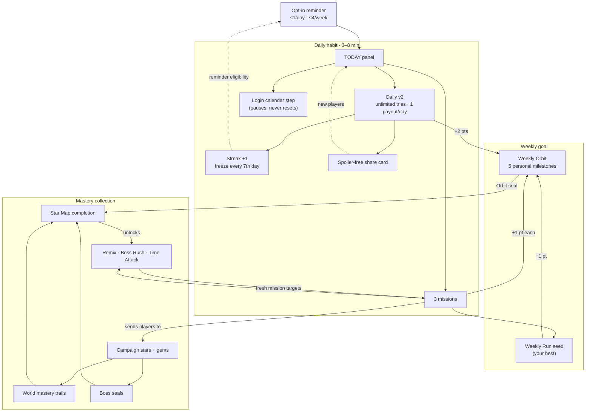
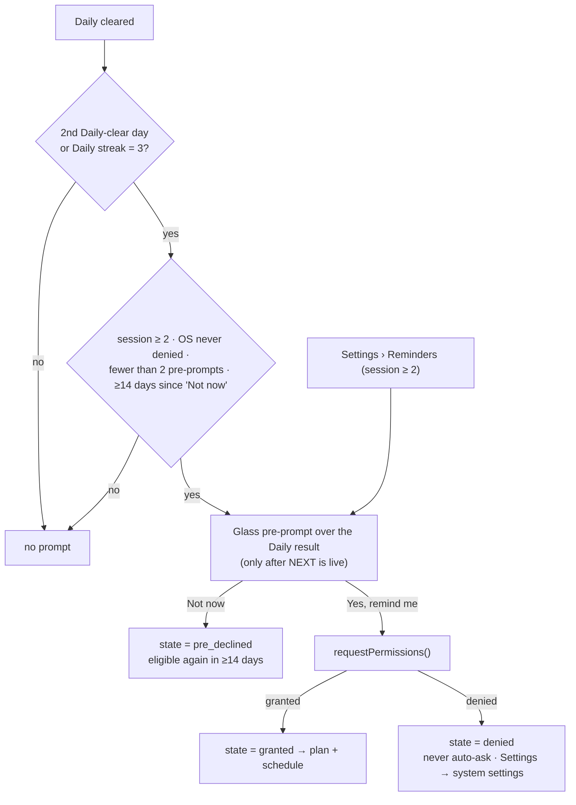

# Retention Design: the Return Loop

> **Deliverable #7.** The design of record for P6 (execution step 17). Implementation plan: [`../roadmap/phases/P06-retention.md`](../roadmap/phases/P06-retention.md). Measurement: [`../analytics/ANALYTICS-PLAN.md`](../analytics/ANALYTICS-PLAN.md).
> **Conforms to** [`../roadmap/DECISIONS.md`](../roadmap/DECISIONS.md), especially D-10 (consent), D-14 (analytics + Remote Config), D-15 (notifications), D-17 (honest "your best" copy), D-18 (login pause + comeback gift), D-21 (Daily v2), D-24 (no paid hints/progress) and D-30 (deferred systems).
> **Evidence:** `docs/research/retention-analytics-liveops.md` (Q3–Q5, Q7), `docs/research/game-design.md` (§2, §5, §8), `docs/research/android-capacitor.md` (Q7), `docs/audit/2026-10-07/STATE-AUDIT.md` (§F.2, §G).
> **Currency units.** Amounts are in today's ✦ Stardust and ◆ Fragments. Every grant in this document goes through one helper (`Rewards.grant`, P06-T12). If D-23 (PROPOSED, P7) merges the currencies at ×10, the conversion happens in that one place.
> Date: 2026-10-07.

---

## 0. Baseline: what exists and what P6 changes

| System (code) | Today (audit §G.2) | P6 change |
|---|---|---|
| Daily Challenge (`daily.ts`, `DailyStore.ts`, `dailyLevels.ts`) | 8 levels × 4 modifiers by FNV hash of the date. Open on day 0 with untaught mechanics. **Pays out on every replay.** `Leaderboard.recentDaily` is never read. | Daily v2 (§3): a bot-verified pool, a dated Remote Config schedule, unlimited attempts, one payout per day, a spoiler-free share card, gated after World 1, taught mechanics only |
| Daily streak + freeze | Streak and an earned freeze every 7th day (max 3) exist, but the menu shows them only as a text caption | Visible streak strip, freeze tokens, and rewards keyed to the cumulative Daily count (§4.1) |
| Login chest (`loginBonus.ts`, `DailyStore.claimLoginBonus`) | 7-day ladder that **resets to day 1** after a missed day (`nextStreak` returns 1). The once-per-day key is UTC (`RewardStore.todayKey`) while the day logic is local, so the chest can be claimed twice in one local day (audit §F.1). | The calendar **pauses instead of resetting** (D-18), uses one local-date key, and gets a visible 7-slot calendar (§4.2) |
| Win streak (`streak.ts`, `StreakStore.ts`) | FLOW/BLAZE/NOVA tiers. Any death breaks it, and replays of trivial levels farm it. | Counts only first-try clears of levels with something left to earn (§4.3) |
| Weekly (`EndlessScene` `mode:'weekly'`, `Leaderboard.submitRun`) | Fixed seed and a local best, buried two screens deep. No participation reward. Resets Thursday local midnight. | The Weekly Orbit personal milestone track (§5) and a Weekly card on the TODAY panel |
| Achievements (`achievements.ts`, 14 defs) | All passive. None for modes, bosses or cosmetics. No progress bars. | 26 achievements, PGS-mappable, with progress bars (§8) |
| Collections (`cosmetics.config.ts`, 6 collections) | 4 of 6 need an in-app purchase. No cosmetic is tied to world or boss completion. | Earn-only mastery collections and Star Map meta (§7) |
| Missions | none | 3 per day (§6) |
| Post-game | none: CONTINUE points at L150 forever (audit §G.1) | Remix, Boss Rush and Time Attack hooks (§10) |
| Comeback | none (`lastLoginDate` is tracked) | A one-time gift after 7+ days away (§11, D-18) |
| Notifications | none ("the biggest gap", audit §G.2) | Opt-in local notifications, ≤1/day (§12, D-15) |

---

## 1. Design principles

1. **One loop, three cadences.** A *daily habit* (3–8 minutes), a *weekly goal* and an open-ended *mastery collection*. Every system feeds at least one other system. Nothing stands alone.
2. **Slack, not punishment.** Missing a day never removes anything already earned. Calendars pause (D-18). Streak rewards come from cumulative counts, and the streak number is the only thing that restarts. Freezes are earned, never bought.
3. **Earn-only and paywall-free.** No retention system can be bought, accelerated with money, or blocked by a purchase. This follows D-24 ("never sell hints, gate progress, or use fake urgency") and D-23 (real money buys items, never currency).
4. **Protect the channel.** Notifications are opt-in, contextual, at most 1 a day and 4 a week, quiet at night, and stop entirely after 14 days of absence (D-15).
5. **Honest copy.** Copy says "your best" until real boards exist (D-17). There are no countdown timers, no guilt and no fake scarcity.
6. **Respect the first session.** Session 1 shows PLAY and, after the first win, one login chest. The Daily, missions and the Weekly Orbit unlock together when World 1 is complete (D-21). This removes the first-win overload the audit flagged (§G.4 #4).
7. **Data, not code.** Every tunable is a Remote Config key read through the pure, clamped `rcConfig.ts` (D-14). The clamps make these principles impossible to break remotely: no key can exceed 1 notification a day, and no key can make a freeze purchasable.

---

## 2. The retention loop



**How the loop reads to a player:**
- "Every day there's a new short puzzle, three small jobs and a chest."
- "Every week I fill an orbit."
- "Everything I do fills my Star Map."

The TODAY panel is the single entry point for the daily layer. It sits on the main menu as one card with **one** attention dot. Today the menu has 9 interactive elements and 3 gold cues (audit §G.1); P6 lowers that count.

---

## 3. Daily habit: Daily v2 (D-21)

### 3.1 Rules

| Rule | Value | Source |
|---|---|---|
| Availability | Unlocks when the World 1 boss is first cleared. Before that, the TODAY card reads "Clear World 1 to unlock the Daily". | D-21 |
| Reset | Local midnight (`daily.ts#dateKey`). The Daily never goes on PGS, because PGS daily boards reset at UTC-7. | D-17, research Q8 |
| Attempts | Unlimited. Retry is one tap (ResultPanel, D-08). | D-21 |
| Payout | **One per local day**, paid at the first clear: `15 + 3 × stars` ✦ (`currency.ts#stardustForWin(stars, true)`, i.e. 15–24 ✦). Later clears improve the record but pay 0. | D-21; fixes audit §G.2 "infinite replay payout" |
| Records | First-try result (stars + time, or failed), best time in **sim ms** (D-01), best stars, attempt count, and modifier. All stored in `DailyStore` and `Leaderboard.submitDaily`. | D-21 |
| Streak | Kept alive by any clear, any stars, on any tier | D-21 |
| Mechanics | Only mechanics the player has been taught (§3.4) | D-21 |
| Content | A curated, bot-verified pool shipped in the binary. Remote Config carries only the dated *mapping* (date → level ids + modifier). | D-21, D-14 |
| Session cost | Author time ≤ 20 s. Median human clear 30–60 s including retries. | game-design §8 (Trackmania "≤ 20 s") |
| Number | `Daily #N`, where `N = daysBetween('2026-11-01', today) + 1` (`DAILY_EPOCH` in `retention.config.ts`, never changed after launch) | Wordle-style shareable identity |

### 3.2 Content pipeline (from the level engine and bot, D-05/D-06)

Daily levels are ordinary v2 `LevelConfig` objects with a stable id (`dly-t{tier}-{nnnn}`, e.g. `dly-t3-0042`), `uses: MechanicId[]` and `tier`. They live in `src/config/dailyLevels.ts`, which becomes the `DAILY_POOL`.

Sources, in order:
1. Levels cut or retired during the P4 rework (D-27 explicitly allows these to come back).
2. The 13 retired files (audit §C.5).
3. The current 8 Daily levels, after re-checking them. D6 = L65 and D7 = retired `level39`, so those two must be relabelled or dropped.
4. New hand-authored levels.
5. An x-mirror of a base level. At most one mirror per base, and it may not appear within 60 days of its base.

A candidate enters the pool only if it passes the **daily gate profile** in `scripts/levelsim/`. P2 creates the tool; P06-T06 adds the profile.

| Gate | Threshold |
|---|---|
| Static validators v2 (spawn, goal and exit safety, hazard–goal overlap, bounds) | 0 failures (blocking) |
| A0 no-input | Must **fail** (not self-solving) |
| A2 pursuit or A5 beam | Must solve |
| A5 best time (author time) | ≤ 20 s |
| Bot-estimated median attempts (A6 noisy expert) | 1.5–4 ("medium") |
| Par | From the P2 formula (`max(1.30 × T_noisy, T_best + 1.5 s)`, rounded up to 0.5 s) |
| Gem | Reachable by A5 with a ≤ 4 s detour |
| Duplicate score vs every campaign level | < 0.85, unless the level is labelled as a remix of a campaign level |
| `uses` ⊆ the tier's mechanic set (§3.4) | Exact |

**Pool size at P6 exit:** ≥ 60 entries: Tier I ≥ 12, Tier II ≥ 18, Tier III ≥ 30. Today there are 8.

### 3.3 Dated schedule (Remote Config `daily_schedule`, D-14)

```json
{
  "2026-11-14": { "mod": "timed",   "t3": "dly-t3-0042", "t2": "dly-t2-0017", "t1": "dly-t1-0005" },
  "2026-11-15": { "mod": "none",    "t3": "dly-t3-0007", "t2": "dly-t2-0003", "t1": "dly-t1-0011" },
  "2026-11-16": { "mod": "gemRush", "t3": "dly-t3-0019", "t2": "dly-t2-0021", "t1": "dly-t1-0002" }
}
```

**Resolution, the first time the Daily is opened on a local date:**
1. Look up `daily_schedule[dateKey]`.
2. Pick the highest tier the player qualifies for (§3.4). If that tier's id exists in this binary's pool, use it with `mod` (`sched: 'rc'`).
3. Otherwise use the deterministic hash fallback. `dailyChallengeFor(date, poolSize)` is extended to filter the pool by tier, so every client on the same binary and tier gets the same pick (`sched: 'hash'`).
4. **Persist the resolved `{dailyNo, tier, levelId, modifier}` in `DailyStore.today`.** A later fetch can never change today's Daily for this player, so changes are never retroactive (D-14).

**Publishing rules:**
- Publish in one monthly sitting, at least **7 days ahead**. That covers the 12 h minimum fetch interval and app-update lag (research Q7).
- Reference only ids that shipped in a binary released ≥ 14 days earlier. An RC condition on app version guards older builds.
- Within a tier, a base id may not repeat within 28 days, and a given `(id, mod)` pair may not repeat within 90 days. `scripts/daily/schedule-lint.ts` (run with `npx vite-node`) enforces both and runs in CI on the JSON before upload.

**Modifiers:**
- `none` (weight 2), `timed` (`timeLimitMs = par + 3 s`) and `gemRush` (the goal needs the gem) all exist today.
- `mirror` (x-flip) is added once the Remix transform exists (P06-T17).

### 3.4 Tiers: only mechanics the player has been taught

A mechanic counts as *taught* once the player has cleared any level whose D-05 `teaches` list contains it. The campaign teaches in world order:

| Mechanic | Taught in |
|---|---|
| attractor | W1 |
| zones | W2 |
| platforms | W3 |
| hazards | W4 |
| magnets | W5 |
| portals | W6 |
| gates | W7 |

| Tier | Share label | Allowed `uses` | Player qualifies when |
|---|---|---|---|
| I | `I` | attractor (+ walls) | World 1 boss cleared (the Daily unlock) |
| II | `II` | + zones, platforms, hazards | The W4 teach level cleared |
| III | `III` | all 7 mechanics | The W7 teach level cleared |

Everyone on the same tier plays the same level that day. The share card shows the tier, so comparisons stay fair. This fixes audit §C.5: magnets, portals and gates were reachable on day 0. It also fixes the Level 1 CoachMark firing on the Daily (`currentLevel` defaults to 1) and permanently setting `seenTutorial`.

### 3.5 The Daily result screen and the "tomorrow" hook

The Daily uses the P3 ResultPanel: **NEXT** returns to TODAY, **RETRY** is secondary, and there is no auto-advance (D-08). It adds:
- the stars, the time and "Try 3"
- a "First try" badge when attempt 1 succeeded
- the streak flame ticking up (static under reduced motion)
- a secondary **Share** button
- one information line: "New Daily in 7 h". It shows hours only and never ticks seconds, so it isn't a countdown.

On the second Daily-clear day this is also where the reminder pre-prompt appears (§12.2).

### 3.6 Spoiler-free share card (D-21; image + text)

**Text** (`dailyShare.ts`, pure and TDD-tested):

```
GRAVITY FLOW Daily #214 · III
★★☆ · 8.5 s · 3 tries
🟥🟥🟩
🔥 12
https://play.google.com/store/apps/details?id=com.truestorylabs.gravityflow&referrer=utm_source%3Dshare%26utm_medium%3Ddaily
```

- The brand name comes from the `BRAND` config, never a literal (D-19).
- **Attempt strip:** 🟥 per failed attempt and 🟩 for the clear. With more than 6 fails it becomes `🟥×7 🟩`.
- Time is the best sim time at one decimal.
- The 🔥 line appears only when the streak is ≥ 2.
- The link line can be turned off with RC `share_link_enabled`. With it, share → install attribution works through the Play `referrer`, which P9 measures.
- There is **no level geometry, route or hint**.

**Image:** a 1080×1350 card rendered off-screen with the logo, the Daily number and tier, the stars, the time, the attempt strip, the streak and the world-neutral cosmic backdrop. It never shows the level.
- **Native path (Android):** write the PNG with `@capacitor/filesystem` to `Cache/share/daily-<N>.png`, then call `@capacitor/share` `Share.share({ files: [uri], text })`.
- **Web path:** the existing `Share.ts` (Web Share API, then a clipboard fallback).
- This is also the fix for audit §G.2: `navigator.share` is unsupported in the Android WebView, so today's share silently falls back to the clipboard.

### 3.7 Edge cases

- **Clock moved backward.** `DailyStore` keeps `maxDateSeen`. A date earlier than that can be played but never pays and never touches the streak. This stops payout farming by changing the clock.
- **Offline.** The hash fallback always works. The share card works without a network; the link resolves later.
- **Timezone travel.** Dates are local keys. Skipping a calendar date counts as a missed day (a freeze may cover it); repeating a date reads as already done. Accepted.
- **Web build.** The Daily is identical. Notifications and the native share are hidden.

---

## 4. Streaks

### 4.1 Daily streak and freeze

| Rule | Value | Code |
|---|---|---|
| Increment | +1 on the first clear of a new local day | `daily.ts#nextStreakWithFreeze` (unchanged) |
| Freeze | One missed day is forgiven by a held freeze, consumed at the next clear | unchanged |
| Earning freezes | +1 at every 7th consecutive day, up to 3 held (`RETENTION.STREAK_FREEZE_GRANT_EVERY = 7`, `STREAK_FREEZE_MAX = 3`); also the comeback gift (§11) | unchanged |
| Purchasable | **Never.** There is no RC key, product or ad that grants a freeze or repairs a streak. | D-24; research Q4 "Avoid" |
| Streak-related rewards | **Keyed to the cumulative Daily count**: `streakReward(lifetimeDailyClears)`. Same numbers as today (+10 at every 3rd clear, +25 at every 7th, +50 at every 14th, +100 at every 30th), but a broken streak never loses reward progress. | Design choice for the EU DFA concern about "streaks that penalise a break" (research Q4) |
| What a break costs | Only the streak number and the flame tier. `bestStreak`, achievements and all currency are kept. | D-18 spirit |

The streak still matters. Duolingo found the number itself is the motivator (7-day streakers are 3.6× likelier to finish), while easier-to-keep streaks did not raise DAU (research Q4). The freeze gives slack, which raised commitment (+0.38% DAU).

### 4.2 Login calendar: pauses, never resets (D-18)

- The **7-slot calendar** advances one slot per local day on which the player opens the app *and taps claim*.
- A missed day **pauses** the calendar on the current slot. It never resets.
- Slot rewards are the existing ladder `RETENTION.LOGIN_BONUS_LADDER`, unchanged:

| Slot | 1 | 2 | 3 | 4 | 5 | 6 | 7 |
|---|---|---|---|---|---|---|---|
| Reward | 10 ✦ | 12 ✦ | 15 ✦ + 1 ◆ | 18 ✦ | 22 ✦ + 1 ◆ | 28 ✦ + 1 ◆ | 40 ✦ + 3 ◆ |

- **Model:** `loginSteps` counts lifetime claims and is monotonic. The next slot is `loginSteps % 7 + 1` and the cycle is `floor(loginSteps / 7) + 1`.
- **Migration:** `loginSteps = loginStreak`, so every existing player keeps their position, lapsed or not.
- The once-per-day gate uses one key: the store's own local `lastLoginDate`. This removes the UTC/local double-claim bug (audit §F.1).
- **UI:** a 7-slot strip. Claimed slots are ticked, today's slot glows gold while claimable, and future slots show their reward. The header reads "Day 4 of 7 · Cycle 2". There is no red "missed" mark anywhere.

### 4.3 Win streak (FLOW / BLAZE / NOVA)

The tiers (3/5/8) and the repeatable milestone bonus (`STREAK_MILESTONES`: 10/20/35/60 ✦) are unchanged.

The rule tightens: a win counts only if it is a **first-attempt clear of a level that is not yet 3★**. Replays of mastered levels neither add to the streak nor break it. That closes the farming hole and makes FLOW a real skill signal; it correlates with FASR. A death still breaks it, as before.

### 4.4 Where streaks are visible

| Surface | Shows |
|---|---|
| TODAY card (main menu) | 🔥 streak number, freeze tokens (up to 3 snowflake glyphs), and one dot when something is claimable |
| TODAY overlay | A 7-day strip of Daily clears (Mon–Sun, from `Leaderboard.recentDaily`), the streak, best streak, and "Next freeze in 3 days" |
| Daily result | The streak tick-up |
| Win overlay | The win-streak tier (existing) |

There is no streak UI before the Daily unlocks.

---

## 5. Weekly goal

### 5.1 Weekly Orbit: a personal milestone track

This is a parallel personal milestone track, so everyone earns. Top puzzle games converge on it (research Q4). It needs no global board and it is **not a battle pass**: no paid lane, no premium track, and points that can't be spent (D-30).

**Points (each with a daily cap):**

| Source | Points | Cap per day |
|---|---|---|
| Daily clear | 2 | 1 clear |
| Mission complete | 1 | 3 |
| Gravity Run (Weekly or Endless) lasting ≥ 20 s | 1 | 2 |
| Campaign or post-game first clear, or a new star | 1 | 2 |

The daily maximum is 9.

**Milestones:**

| Milestone | M1 | M2 | M3 | M4 | M5 |
|---|---|---|---|---|---|
| Points | 4 | 8 | 13 | 18 | 24 |
| Reward | 10 ✦ | 20 ✦ | 2 ◆ | 30 ✦ | 5 ◆ + **Orbit seal** |

**Calibration:**

| Player | Points per day | Week result |
|---|---|---|
| Daily + 2 missions + 1 run, 4 days/week | 5 | 20 → M4 |
| Same player, 5 days/week | 5 | 25 → M5 |
| Daily only, 7 days/week | 2 | 14 → M3 |

So a casual player always earns something, and a committed one finishes.

**Orbit seals** are cumulative, never consecutive, so a missed week costs nothing. Seal rewards are earn-only cosmetics:

| Seals | Reward |
|---|---|
| 4 | "Orbit Ring" trail |
| 12 | "Constellation" arrival |
| 26 | "Eternal Orbit" skin |

**Reset:** at the week boundary (§5.3). Unclaimed but reached milestones are auto-granted at reset, never lost.

### 5.2 Weekly Run

Gravity Run's shared weekly seed (`EndlessScene` `mode:'weekly'`) gets a **Weekly card on the TODAY overlay**: this week's best, runs this week, and the days until the seed changes. That lifts it out of the two-screens-deep hub.

Copy follows D-17: "Your best this week: 1,240". Never "leaderboard" and never "Same run for everyone", until PGS boards ship in P8. Revived runs still don't post a best. P8 owns everything else (Run 2.0, boards).

### 5.3 Week boundary

There must be **one week** in the game: the Weekly Run seed, Weekly Orbit and the `weekly` notification share `weekWindow(now)` (P06-T05).
- Today's `endless.ts#weekKey` rolls over at Thursday local midnight.
- D-17 moves the boundary to the PGS reset (Sunday 07:00 UTC) in P8.

**Recommendation:** flip the boundary in P6, before launch, so live players never see a mid-life boundary shift. This needs an owner edit to D-17 / EXECUTION-ORDER (see the P06 conflicts list). Until then, `weekWindow` wraps today's `weekKey`, and P8 flips one constant.

---

## 6. Missions: 3 per day

### 6.1 Rules

- **Unlock:** together with the Daily, when the World 1 boss is cleared.
- **The set:** 3 missions per local day (`missions_per_day`, clamped 0–3): one easy, one medium, one hard.
- **Generation:** deterministic from `fnv(dateKey + installSalt)`. The set is personal but stable across restarts.
- **Variety:** when the player has ≥ 2 modes unlocked, the 3 missions must cover ≥ 2 modes. This is the mechanism that "sends players across modes" (MASTER-ROADMAP P6).
- **Eligibility:** only missions whose mechanic or mode is unlocked. No mission can require a purchase, an ad or a cosmetic.
- **Swap:** 1 free swap per day for a mission of the same difficulty. No ad swaps and no paid rerolls.
- **Tracking:** progress counts live. Completed missions show a claim button on the TODAY overlay. Unclaimed completed missions are auto-granted at the next local midnight, never lost.

### 6.2 Catalog: reuses `StatsStore`, `ProgressStore`, `Leaderboard` and the analytics signals

| Type id | Text | Easy | Medium | Hard | Signal (where it is counted) | Eligible when |
|---|---|---|---|---|---|---|
| `clear_levels` | Clear N levels | 3 | 5 | 8 | `level_end{success:1}` in `GameScene.triggerWin` | always |
| `earn_stars` | Earn N new stars | 2 | 4 | 6 | `stars_new` from `ProgressStore.record` delta | the player has an un-3★ level |
| `collect_gems` | Collect N gems | 1 | 2 | 3 | win with `gemCollected` | the player has an uncollected gem or a replayable level |
| `under_par` | Finish N levels under par | 1 | 2 | 3 | `under_par:1` | always |
| `first_try` | Clear N levels on the first try | 1 | 2 | 3 | `attempt:1, success:1` | always |
| `daily_clear` | Clear today's Daily | 1 | — | — | `DailyStore.recordWin` | Daily unlocked |
| `daily_first_try` | Clear today's Daily on the first try | — | — | 1 | Daily `firstTry` | Daily unlocked |
| `run_play` | Play N Gravity Runs (≥ 20 s) | 2 | 3 | — | `post_score` | always |
| `run_score` | Reach X in Gravity Run | — | 50% of PB | 80% of PB | `post_score.score` vs `Leaderboard.bestEndless()` (min 300) | ≥ 1 run played |
| `rifts` | Travel through N rifts | 5 | 10 | — | `StatsStore.recordPortalJump` | portals taught |
| `beat_best` | Beat your best time on any cleared level | — | 1 | 2 | `ProgressStore` best-time improvement | ≥ 5 cleared levels |
| `boss_clear` | Clear a boss level (first clear or replay) | — | — | 1 | `level_end{boss:1, success:1}` | ≥ 1 boss cleared |
| `remix_clear` | Clear N Remix levels | — | 2 | 4 | `level_end{mode:'remix'}` | Remix unlocked (§10) |

### 6.3 Rewards

| | Easy | Medium | Hard | All 3 bonus |
|---|---|---|---|---|
| Reward | 5 ✦ + 1 Orbit point | 10 ✦ + 1 Orbit point | 15 ✦ + 1 Orbit point | 1 ◆ |

The daily maximum is 30 ✦ + 1 ◆ + 3 Orbit points.

Mission currency is deliberately small. Missions mainly feed the Weekly Orbit, which turns three small jobs into a weekly goal instead of inflating Stardust. Stardust already has only 440 ✦ of sinks (audit §F.2); P7 owns the economy rebalance. Values are RC `mission_rewards`.

---

## 7. Mastery collection

### 7.1 World mastery

Earning 3★ on every level of a world grants the following once (`RewardStore` key `mastery:w<NN>`):
- A **world trail** (`trail_w<NN>`, `acquire:'achievement'`), procedurally recoloured from `worldThemes.ts` accent and palette. There are 15 trails at near-zero art cost because cosmetics are runtime Graphics.
- 5 ◆.
- A gold **mastery crown** on the world's Star Map node.

This repurposes the existing `master_world` achievement (first world) and `StatsStore.worldsMastered`.

### 7.2 Boss seals

Clearing a world's boss **under par** grants that world's **Boss Seal** (`seal:w<NN>`): a badge on the Star Map node, with no currency. Reaching 5, 10 and 15 seals unlocks earn-only cosmetics:

| Seals | Cosmetic |
|---|---|
| 5 | "Eclipse" arrival |
| 10 | "Corona" skin |
| 15 | "Homecoming Star" mythic skin |

This gives the 15 "STAR FREED" moments somewhere to lead (audit §G.5 #9).

### 7.3 Collections without paywalls

- New collections `mastery` (15 world trails), `seals` (3 seal cosmetics) and `orbit` (3 Orbit-seal cosmetics) are **100% earnable**.
- Collection completion counts **earnable items only**, so no collection's completion depends on a purchase.
- Bundle exclusives move to a separate "Supporter" collection that grants no completion reward. P7 owns that restructure (monetization research §economy); P6 ships the earnable-only counting rule.
- All new cosmetics use the existing `Acquire = 'achievement'` path and are granted by `CosmeticStore.grant(ids)`.

### 7.4 Star Map collection meta (`WorldMapScene`)

**Each world node shows:**
- stars `x/30`
- gems `x/10`
- the mastery crown
- the Boss Seal
- a small Remix ring once Remix is unlocked

**The map header shows Constellation completion %:**

`(stars + gems + seals + masteries) ÷ (3 × levels + levels + worlds + worlds)`

One number to chase at D30, with each part tappable to see what remains. It is never a purchase prompt.

---

## 8. Achievements v2: 26 total, PGS-mappable, with progress bars

**Rules:**
- Ids are stable forever, and the 14 existing ids are unchanged.
- Each definition gains `progress(snapshot) → {cur, max}` for the AchievementsScene progress bar, and a `pgs` mapping.
- Nothing is hidden.
- **Points:** PGS allows ≤ 1,000 total in multiples of 5. This plan uses 760, leaving room to grow. Verify the constraints in the Play Console in P8.
- "First 2 h" = earnable in the first two hours. The PGS v2 blog recommends ≥ 15 achievements with 5 in that window, and Level Up wants 4 in the first hour (research Q7–Q8).

| # | id | Name | Condition | PGS type (steps) | Pts | First 2 h | Reward |
|---|---|---|---|---|---|---|---|
| 1 | `first_win` | First Flow | Complete a level | standard | 5 | ✔ | 10 ✦ 1 ◆ |
| 2 | `ten_done` | Finding Your Footing | Complete 10 levels | incremental (10) | 10 | ✔ | 20 ✦ 2 ◆ |
| 3 | `half_done` | Halfway There | Complete half the levels | standard (count may change, D-27) | 40 | | 40 ✦ 4 ◆ |
| 4 | `all_done` | The Long Haul | Complete every level | standard | 100 | | 100 ✦ 12 ◆ |
| 5 | `stars_30` | Rising Star | 30 stars | incremental (30) | 10 | ✔ | 30 ✦ 3 ◆ |
| 6 | `stars_90` | Star Collector | 90 stars | incremental (90) | 20 | | 60 ✦ 6 ◆ |
| 7 | `stars_all` | Perfectionist | Every star | standard | 150 | | 150 ✦ 20 ◆ |
| 8 | `perfect_10` | Flawless | 3★ on 10 levels | incremental (10) | 20 | | 40 ✦ 4 ◆ |
| 9 | `gems_25` | Gem Hunter | 25 gems | incremental (25) | 20 | | 40 ✦ 4 ◆ |
| 10 | `master_world` | World Master | Master a world | standard | 30 | | 50 ✦ 5 ◆ |
| 11 | `portal_50` | Rift Walker | 50 rift jumps | incremental (50) | 15 | | 25 ✦ 2 ◆ |
| 12 | `deaths_25` | Persistence | 25 wipe-outs | incremental (25) | 5 | ✔ | 15 ✦ 1 ◆ |
| 13 | `streak_3` | Daily Devotee | 3-day Daily streak | standard | 10 | | 25 ✦ 2 ◆ |
| 14 | `streak_7` | Weeklong | 7-day Daily streak | standard | 20 | | 50 ✦ 5 ◆ |
| 15 | `first_daily` | Daily Debut | Clear your first Daily | standard | 5 | ✔ | 15 ✦ 1 ◆ |
| 16 | `first_run` | Lift Off | Finish a Gravity Run | standard | 5 | ✔ | 15 ✦ 1 ◆ |
| 17 | `run_60s` | Escape Velocity | Survive 60 s in one Gravity Run (time-based, so it survives the D-22 scoring change) | standard | 15 | | 25 ✦ 2 ◆ |
| 18 | `equip_first` | Make It Yours | Equip a cosmetic you earned | standard | 5 | ✔ | 10 ✦ |
| 19 | `weekly_orbit` | Full Orbit | Complete a Weekly Orbit | standard | 20 | | 30 ✦ 3 ◆ |
| 20 | `streak_30` | Monthlong | 30-day Daily streak | standard | 50 | | 100 ✦ 10 ◆ |
| 21 | `boss_5` | Giant Slayer | Defeat 5 bosses | incremental (5) | 25 | | 40 ✦ 4 ◆ |
| 22 | `boss_all` | Starbringer | Defeat every boss | standard | 75 | | 100 ✦ 10 ◆ |
| 23 | `missions_25` | Mission Control | Complete 25 missions | incremental (25) | 20 | | 30 ✦ 3 ◆ |
| 24 | `remix_10` | Mirror Mind | Clear 10 Remix levels | incremental (10) | 25 | | 40 ✦ 4 ◆ |
| 25 | `boss_rush` | Rush Hour | Finish any Boss Rush set | standard | 30 | | 50 ✦ 5 ◆ |
| 26 | `ta_gold_10` | Gold Standard | 10 Time Attack golds | incremental (10) | 30 | | 50 ✦ 5 ◆ |

Rows 1–14 keep today's `Rewards.ts#ACH_REWARD` values. Rows 15–26 add 505 ✦ and 48 ◆ of one-time rewards.

**UI:**
- AchievementsScene groups achievements as Campaign, Daily & Weekly, Gravity Run, Mastery and Post-game.
- Each row has a progress bar (`cur/max`; standard ones show 0/1 or their underlying counter).
- Unlock toasts stay on the win overlay.
- Until PGS lands (P8), the copy never mentions Google Play Games.

---

## 9. Progression milestones

| Milestone | Today | P6 |
|---|---|---|
| Star milestones 30/60/100/150★ (`Rewards.claimMilestoneRewards`: 10/15/25/40 ◆, names Voyager/Luminary/Ascendant/Celestial) | Silent toast on the win overlay | Unchanged values. Each also appears as a Star Map marker on the path. |
| World unlock (D-07 open frontier: 8/10 cleared or a star threshold) | Title card | The world title card plus "World 5 · WELLS unlocked" on the Star Map with the path animation (static under reduced motion) |
| World 1 boss | — | **The unlock ceremony.** A one-time card: "The Daily, Missions and Weekly Orbit are open", with one CTA to play today's Daily. This is the D0 → D1 hook. |
| World N boss | Generic win | The Boss Seal check (§7.2) and a hint at the next world's identity |
| Campaign complete | EndScene, then CONTINUE points at L150 forever | The EndScene finale (P5), then a "Post-game unlocked" card listing Remix, Boss Rush and Time Attack. CONTINUE becomes "Next goal", pointing to the nearest unfinished star, gem, mastery or post-game target. |

---

## 10. Post-campaign content hooks

The mode rules (scoring, modifiers, timers) live in [`GAMEPLAY-DESIGN.md`](GAMEPLAY-DESIGN.md), following game-design §5 and audit §C.6. This section owns the **unlocks, entry points and meta integration**. Every mode reuses `GameScene` through a `mode` parameter (P06-T17), with no new engine.

| Mode | What it is | Unlock | Entry point | Meta hooks |
|---|---|---|---|---|
| **Remix** | An x-mirrored layout plus one constraint modifier (`timed` par+3 s, a −20% goal radius, or `gemRush`), per level; labelled remix ids `<id>~rx` | Per world: when that world is **mastered** (§7.1), **or** for every world once the campaign is complete | The Remix ring on the Star Map node | Missions `remix_clear`, achievement `remix_10`, own stars toward Constellation %, Orbit points (first clears) |
| **Boss Rush** | 5 consecutive bosses with cumulative sim time; local best | Set I (bosses 1–5) after the W5 boss; Set II after W10; Set III after W15 | A Boss Rush node at the top of the Star Map | Achievement `boss_rush`, mission `boss_clear` (counts), a best time shown as "your best" (D-17). A PGS board is optional in P8. |
| **Time Attack** | Race the bot's author ghost (the P2 A5 best route) on any level; medals Bronze = par, Silver = par − 15%, Gold = author × 1.10, Author = beat the author | Per level: once the level has 3★ | The "⏱" chip on the level tile and the ResultPanel ("Race the author") | Achievement `ta_gold_10`, mission `beat_best`, medals on the level tile |

**Why staggered unlocks:**
- Remix rewards mastery mid-campaign.
- Boss Rush I appears around D7–D14 of play.
- Time Attack keeps every mastered level alive.

So the end-of-campaign cliff (audit §G.1 "D30 cliff") becomes a slope. Remix also absorbs content cut in P4 (D-27).

---

## 11. Comeback gift (D-18)

| Rule | Value |
|---|---|
| Trigger | The first launch after ≥ 7 local days with no session (`comeback_min_days`, clamped ≥ 7) |
| Frequency | At most **once per lapse**. A lapse is identified by its last-active date (`SessionStore.comebackFor`). |
| Gift | 50 ✦, plus 1 streak freeze if the streak before the lapse was ≥ 7 and the player holds fewer than 3. The freeze can't revive a streak broken during the lapse; it protects the next one. |
| Presentation | A glass "Welcome back" card on the main menu. Content: the gift (claim button); "Last time: World 4 · PERIL, 6 of 10"; today's Daily; the login calendar slot (paused, not reset). One CTA: "Continue". |
| What it never does | No "you lost X", no catch-up purchase offer, no countdown |

A gift is a reason to come back, not compensation for a punishment. Nothing was taken away while the player was gone.

---

## 12. Local notifications (D-15)

### 12.1 Rules of record

| Rule | Value | Enforced by |
|---|---|---|
| Plugin | `@capacitor/local-notifications`, **inexact only** (`allowWhileIdle: true`, exact disabled), `SCHEDULE_EXACT_ALARM` removed from the merged manifest | D-15; android brief Q7; manifest test |
| Opt-in | In-game pre-prompt first, then the OS dialog. Nothing is scheduled before an explicit "Yes" plus an OS grant (also on Android ≤ 12, where the OS grants silently). | `NotifStore.state` |
| When to ask | After the **2nd Daily-clear day** or a **Daily streak of 3**, whichever comes first. **Never in session 1.** Plus a user-initiated Settings "Reminders" row at any time after session 1. | D-15 |
| Re-ask | "Not now" → ask again no sooner than 14 days later; ≤ 2 pre-prompts per lifetime. OS denial → never auto-ask again; Settings opens the system notification settings. | research Q5 |
| Cap per day | ≤ 1 | `notifPlan.ts` (hard constant) |
| Cap per week | ≤ 4 with an active Daily streak ≥ 3, otherwise ≤ 3 (rolling 7 days, counting notifications already fired) | D-15 ceiling 4; RC `notif_max_per_week` clamped 0–4, `notif_max_per_week_casual` clamped 0–4 (default 3) |
| Quiet hours | 21:00–09:00 local. Fire times are clamped to 09:30–20:00, leaving an hour of margin for inexact delivery. | D-15; RC can only widen the window |
| Types | `daily` (the Daily is ready) · `streak` (streak saver) · `weekly` (weekly reset) · `comeback` (days 3, 7 and 14 after the last session), **then stop** | D-15 |
| Lifecycle | Cancel everything and reschedule the next 14 days on every launch, resume and background. Completing the Daily cancels today's reminder. | D-15 |
| Content | Game features only: no offers, prices, ads or "sale" (Play policy, android brief Q7). Specific and honest, no guilt. | copy review checklist |
| Channels | `gf_daily`, `gf_streak`, `gf_weekly`, `gf_comeback` (importance DEFAULT, no sound), so players can mute a type in the OS | Android channels (API 26+) |
| Kill switch | RC `notif_enabled = false` → cancel all and schedule nothing | `rcConfig.ts` |

**Why 3, not 2, for casual players.** Research Q5 suggested 2/week without a streak. That can't fit D-15's comeback days 3 and 7 plus a day-1 reminder. Three stays under D-15's ceiling of 4. This is noted in the P06 conflicts list.

### 12.2 Pre-prompt flow



**Pre-prompt copy:**
- **Title:** "Want a heads-up for the Daily?"
- **Body:** "At most one reminder a day, around when you usually play. Never at night. Turn it off any time in Settings."
- **Buttons:** "Yes, remind me" and "Not now", at **equal visual weight**. No confirmshaming.

### 12.3 Choosing the type and time

- **One slot per day.** If several types qualify on a day, the priority is `comeback` > `streak` > `weekly` > `daily`.
- **Habitual minute:** the median local minute of the player's first armed attempt (D-02) on each of the last 7 play days. It needs ≥ 3 days of data; the default is **18:30** (`notif_default_minute = 1110`).
- **Streak reminders** fire at `max(habitual, 19:00)`, the "late-day saver" pattern (research Q4).
- **All fire times** are clamped to 09:30–20:00.

### 12.4 Copy examples

Titles are ≤ 40 characters and bodies ≤ 90. Every message names something concrete and true, and no message implies loss.

| Type | When | Title | Body |
|---|---|---|---|
| `daily` | Day +1, no active streak ≥ 3 | Daily #214 is ready | A Timed run today, about 40 s. |
| `daily` | (variant) | New Daily: tier III | Gem rush today. Grab the gem, then the goal. |
| `streak` | Day 0 late (Daily not done), streak ≥ 3 | Your 12-day streak is still open | Today's Daily takes about 30 s. |
| `streak` | Day +1, streak ≥ 3 | Day 13 is one Daily away | Today: a mirror layout, about 45 s. |
| `streak` | Day +2, freeze held | A freeze is holding your streak | Clear today's Daily to keep day 12 going. |
| `weekly` | Reset day, played that week | New week, new Weekly Run seed | Your best last week: 1,240. Weekly Orbit is fresh too. |
| `comeback` | Day +3 | World 4 · PERIL is waiting | You cleared 6 of 10. The next one is a short one. |
| `comeback` | Day +7 | A welcome-back gift is ready | 50 Stardust when you next open the game. |
| `comeback` | Day +14 (last) | New Dailies every day | Pick up at World 4 whenever you like. This is our last reminder. |

**Banned words and patterns:** "Don't lose", "Hurry", "Last chance", "Only N hours", "We miss you 😢", a price, an offer, or an exclamation-heavy tone. The day-14 copy honestly says it is the last reminder.

**Tap routing:**
- `daily`/`streak` → the TODAY overlay with the Daily focused (one tap to play)
- `weekly` → the Weekly card
- `comeback` → the main menu with the Welcome back card

### 12.5 Scheduling algorithm (`notifPlan.ts`, pure, TDD)

```
plan(now, s, rc):                       // s = snapshot of on-device state
  if !rc.notif_enabled or s.state != 'granted' or !s.osEnabled: return []
  last   = s.lastSessionDate             // local date of the most recent session (today when called at launch/pause)
  base   = s.habitualMinute ?? rc.notif_default_minute            // 1110
  clampT = m -> clamp(m, rc.notif_quiet_end*60 + 30, rc.notif_latest_minute)   // 570..1200
  cand   = []
  // day 0: late-day streak saver, only if it is still ≥ 2 h away
  if s.dailyUnlocked and s.streak >= 3 and !s.dailyDoneToday and !s.firedToday:
      t = at(last, clampT(max(base, 1140)));  if t >= now + 2h: cand.add(t, 'streak')
  // day +1
  if s.dailyUnlocked: cand.add(at(last+1, clampT(s.streak >= 3 ? max(base,1140) : base)), s.streak >= 3 ? 'streak' : 'daily')
  // day +2: only a freeze can keep the streak alive after a missed day
  if s.dailyUnlocked and s.streak >= 3 and s.freezes > 0: cand.add(at(last+2, clampT(max(base,1140))), 'streak')
  // weekly reset (≤ 6 days ahead) for players active in the Weekly this week
  if s.playedWeeklyThisWeek and s.nextWeekReset <= last+6: cand.add(at(dateOf(s.nextWeekReset), clampT(base)), 'weekly')
  // comeback: fixed days, then nothing (D-15)
  for d in [3, 7, 14]: cand.add(at(last+d, clampT(base)), 'comeback')
  // one per day, by priority comeback > streak > weekly > daily
  cand = onePerDay(cand, priority)
  // weekly cap on a rolling 7-day window, including already-fired notifications
  cap = s.streak >= 3 ? min(4, rc.notif_max_per_week) : min(4, rc.notif_max_per_week_casual)
  out = []
  for c in sort(cand by time):
      if countIn(s.firedLog ∪ out, c.time - 7d, c.time) < cap: out.add(c)
  return out                              // ≤ 6 entries, all inside [09:30, 20:00], ≤ 14 days ahead
```

**Lifecycle:**
- **On launch or resume:**
  1. `getPending()`. Anything scheduled earlier that is past due and no longer pending is appended to `firedLog`, which is pruned to 14 days.
  2. `cancel(all ids 1000–1099)`.
  3. `plan()` → `schedule()`.
  4. Re-read `checkPermissions()` and `areEnabled`. If the OS disabled notifications: state `denied` and analytics `notif_disabled`.
- **On Daily completion and on `pause`:** steps 2–3.

**Worst case for a lapsed player:**

| Player | Days | Notifications |
|---|---|---|
| With streak ≥ 3 and a freeze | 1, 2, 3, 7, 14 | 5 in 14 days, ≤ 4 in any 7 |
| Without | 1, 3, 7, 14 | 4 in 14 days |

After day 14: silence until they open the app again.

**Active player:** whoever plays the Daily before their reminder time gets nothing, because completing the Daily cancels it.

---

## 13. Player journey

| Touchpoint | When | What the player meets | The hook | Systems | Measured by |
|---|---|---|---|---|---|
| First open | D0, 0–30 s | Splash → PLAY → L1 coach → first win | "You are gravity": the first press pulls the ball home | P3/P5 onboarding | `tutorial_complete` rate; time to first win ≤ 30 s |
| First session | D0, 2–15 min | W1 levels, stars, FLOW tier. The first menu return reveals the TODAY card with **calendar slot 1**. | Visible next step: "Clear World 1 to unlock the Daily" | Campaign, login calendar | `level_end` funnel L1–10; W1 FASR ≥ 70% |
| End of session 1 | D0 | W1 boss → **unlock ceremony** → Daily #N (tier I) playable now → "Tomorrow: a new Daily + calendar slot 2" | A concrete reason to return tomorrow, without a notification (not opted in yet) | Daily v2, missions, Orbit | % of D0 players clearing W1; `daily_start` D0 |
| Day 1 | D1 | Calendar slot 2, Daily #N+1, 3 fresh missions, Orbit at M1 | Second Daily-clear day → **reminder pre-prompt** | Daily, missions, notifications | D1 ≥ 30%; `notif_prompt` funnel |
| Day 3 | D3 | Streak 3 → `streak_3` achievement; first Remix teaser if a world is mastered | Streak identity begins; the freeze is shown "3 days away" | Streak, achievements | Users with ≥ 2 Dailies by D3 (correlate with D7) |
| Day 7 | D7 | Streak 7 → **first freeze earned**; calendar slot 7 (best chest); first Orbit seal for active players; Weekly Run seed changes | Slack ("your streak is now protected") and a weekly reset | Freeze, calendar, Orbit, Weekly Run | D7 ≥ 10%; Orbit completion rate |
| Day 14 | D14 | Around W5–W8; **Boss Rush I** unlocks after the W5 boss; Daily tier II/III; Time Attack on 3★ levels | Mastery collection opens: crowns, seals, Constellation % | Mastery, post-game | Seals and masteries per active user |
| Day 30 | D30 | Daily count 30 bonus (+100 ✦); `streak_30` if unbroken; 4 Orbit seals → "Orbit Ring" trail; campaign end or late worlds; Remix everywhere after completion | The Star Map % and post-game keep going after the campaign | All loops | D30 ≥ 4%; post-game adoption |
| Lapsed (opted in) | +3 / +7 / +14 days | A specific reminder of where they left off (+7 mentions the gift) | Comeback gift at ≥ 7 days; nothing lost (calendar paused) | Notifications, comeback | `notif_open` → `level_start` ≤ 30 min; return rate |
| Lapsed (not opted in) | any | The Welcome back card on next open | Same gift, same honesty | Comeback | Return after ≥ 7 days |

---

## 14. Anti-spam guarantees

Each guarantee is a code-level invariant with a named unit test (P06 §8).

1. **No notification without consent.** It needs a pre-prompt "Yes" and an OS grant. *(`notifPlan.test.ts`: state ≠ granted → [])*
2. **≤ 1 per local day**, including notifications already fired today. *(hard constant; test)*
3. **≤ 4 per rolling 7 days** with a streak ≥ 3, otherwise ≤ 3. No RC value can raise either above 4. *(`rcConfig.test.ts` clamp; `notifPlan.test.ts` over a simulated 28 days)*
4. **0 between 21:00 and 09:00.** Fire times stay in 09:30–20:00 and RC can only widen quiet hours. *(test across DST transitions and UTC±12)*
5. **0 after 14 days without a session.** The plan never looks beyond day 14. *(test)*
6. **0 when today's Daily is done**, for daily and streak types. *(test)*
7. **No duplicates or stale reminders.** Everything is cancelled and rebuilt on every launch, resume, pause and Daily clear. *(seam test with a mocked plugin)*
8. **No exact alarms.** `SCHEDULE_EXACT_ALARM` is absent from the merged manifest, and every schedule passes the inexact flag. *(manifest check in CI; mocked call assertion)*
9. **No promotional content.** The copy table is a closed set in `notif.copy.ts`. A test rejects prices, currency symbols tied to purchases, and the banned words in §12.4.
10. **Never in session 1**, and at most 2 automatic pre-prompts per lifetime. *(test)*
11. **One kill switch.** RC `notif_enabled=false` cancels all on the next launch. *(test)*
12. **No in-app imitation of system notifications.** In-game toasts never look like OS notifications (Play policy). *(design review)*

---

## 15. What we avoid

| Pattern | Why it's harmful or risky | Our rule |
|---|---|---|
| Login rewards that reset after a missed day | Named by the EU Digital Fairness Act proposal (expected Q3–Q4 2026) | The calendar **pauses** (D-18) |
| Streaks that penalise a break | Same DFA target | Rewards key off the cumulative Daily count; a break costs only the number; freezes are earned |
| Paid streak repair or purchasable freezes | Pay-to-keep pressure | Never. No product, ad or RC path. |
| Countdown timers, fake scarcity, "was €X" | DFA/CPC pressure selling; Omnibus 30-day rule | No countdowns anywhere. "New Daily in 7 h" is hours only. Spotlight-style deals stay P7's, Stardust-only, without timers (D-23). |
| Permanently missable cosmetics | FOMO | Orbit seals are cumulative. Event cosmetics return in a vault (P10). Nothing in P6 is time-limited. |
| Guilt or shame copy, confirmshaming | Dark pattern | Banned-word test; equal-weight "Not now" |
| Notification promos or ads | Play policy | Copy closed set; no offers |
| Selling currency, hints or progress | CPC virtual-currency principles (2025-03); D-24 | Missions, Orbit, mastery and achievements grant only earn-only rewards. Hints are never sold (D-07, D-24). |
| Currency-only price display or layered currencies | CPC transparency | No new currency in P6. Orbit points are a non-spendable progress meter (D-30: no event currency). |
| Battle pass or paid track | Needs a content treadmill and DAU; DFA/FOMO risk | Deferred (D-30). The Orbit has no paid lane. |
| Leaderboard claims without boards | Misleading | "Your best" until P8 (D-17) |
| Red badges for non-actionable things | Attention spam | One dot on TODAY, only when something is claimable or playable today |
| Interstitials around retention moments | Breaks trust | No ad on the Daily result before NEXT. Reminders never lead into an ad. D-24 caps apply. |
| Reward overload in session 1 | Audit §G.4 #4 | Daily, missions and Orbit unlock together after W1 |

---

## 16. Tunables and success metrics

**Remote Config keys introduced by this design:**
- `daily_schedule`, `daily_payout`, `daily_count_rewards`
- `streak_freeze_every`, `streak_freeze_max`
- `login_ladder`
- `missions_per_day`, `mission_rewards`, `mission_weights`
- `weekly_track`
- `comeback_min_days`, `comeback_gift`
- `notif_enabled`, `notif_max_per_week`, `notif_max_per_week_casual`, `notif_quiet_start`, `notif_quiet_end`, `notif_default_minute`, `notif_latest_minute`
- `share_enabled`, `share_link_enabled`
- `postgame_enabled`

Types, defaults and clamps are in [`../analytics/ANALYTICS-PLAN.md`](../analytics/ANALYTICS-PLAN.md) §10.3.

| Metric | Target | Source |
|---|---|---|
| D1 / D7 / D30 | ≥ 30% / ≥ 10% / ≥ 4% | MASTER-ROADMAP P6 |
| Daily participation | ≥ 25% of DAU (≥ 40% of Daily-eligible DAU) | MASTER-ROADMAP P6 |
| Notification opt-in | ≥ 35% of prompted players | MASTER-ROADMAP P6 |
| Notification disable rate | < 3% of granted players per week | MASTER-ROADMAP P6 |
| Weekly Orbit | ≥ 50% of WAU reach M1; ≥ 20% reach M5 | this doc |
| Missions | ≥ 1 mission completed by ≥ 60% of Daily-eligible DAU | this doc |
| Comeback | ≥ 25% of gifted players play ≥ 2 sessions in the following 7 days | this doc |

---

## 17. Open questions for the owner

1. **Week boundary.** Flip to Sunday 07:00 UTC in P6, before launch (recommended), or keep Thursday-local until P8 (§5.3)?
2. **Campaign-only players.** D-15 fixes the prompt triggers to Daily events, so a player who never plays the Daily is only reachable through Settings. Should the World 2 boss in session ≥ 3 become an extra trigger? It would need a D-15 edit.
3. **`DAILY_EPOCH = 2026-11-01`.** Keep it, so the numbers already run in the closed beta, or move it to the production launch date?
