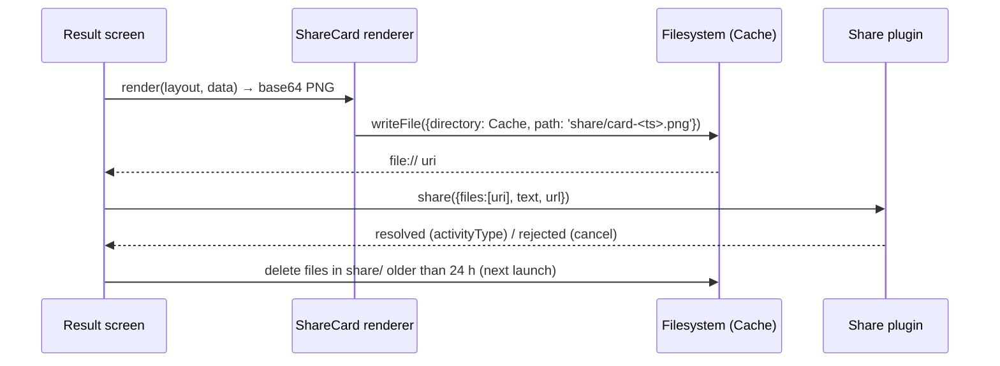

# Social & Viral Design

> **Deliverable #10.** The design of record for sharing, links, challenges and reviews. Implementation plan: [`../roadmap/phases/P09-social.md`](../roadmap/phases/P09-social.md).
> **Conforms to:**
> - D-16: share card + in-app review first; weekly-seed challenge links via App Links on a GitHub user site or custom domain
> - D-17: PGS boards; web stays local
> - D-21: the Daily share card is spoiler-free
> - D-10: consent-first analytics
> - D-19: no name hard-coded; everything reads `BRAND`
> - D-24: never gate progress or use fake urgency
> - D-25: 13+, no child-directed features
> - D-30: friend ghosts and referral rewards deferred
>
> **Evidence:** `docs/research/retention-analytics-liveops.md` Q6/Q8 · `docs/research/android-capacitor.md` Q8 · `docs/audit/2026-10-07/STATE-AUDIT.md` §G.2, §G.5 · `docs/archive/2026-10-07/growth-architecture.md` · code at `master @ d3c6aab`.
> **Schedule:** execution step 21, after Gravity Run 2.0 (step 20). It depends on P6 (Daily), P8 (weekly seeds, boards) and P11 (website/domain).

---

## 1. Starting point (verified)
- **Sharing.**
  - `Share.shareCard` (`src/utils/Share.ts:13-35`) tries Web Share with a file, then Web Share with text, then the clipboard.
  - In the Android WebView `navigator.share` is not reliably available, so on device it **silently copies text** (audit §G.2).
  - The only share surface is Gravity Run's result (`EndlessScene.ts:496-505`): `"I climbed to N in GRAVITY RUN 🌌 — can you beat it?"`. It has no link, no seed and no store URL.
- **Platform.**
  - Not installed: `@capacitor/share`, `@capacitor/filesystem`, `@capacitor/app` (`package.json`). `@capacitor/app` 8.1.2 arrives in P0 step 1 (D-11).
  - The manifest has only a LAUNCHER intent filter (`AndroidManifest.xml:29-32`). The FileProvider exists, but `file_paths.xml` includes a broad `<external-path path=".">` we don't need.
  - `MainActivity.java` is a bare `BridgeActivity` (Java; no Kotlin in the build).
- **Hosting.**
  - `https://taysh123.github.io/.well-known/assetlinks.json` returns **404**. Pages is a *project* site (`/Gravity-Game/`, serving `docs/` = the privacy policy), and the `taysh123.github.io` user-site repo doesn't exist (android brief Q8).
  - The web build is deployed on Vercel (`gravity-flow-six.vercel.app`), where **the web IAP stub grants purchases for free** (`docs/launch/EXTERNAL-SERVICES-AUDIT.md`).
- **Deterministic content to share.**
  - Daily (date seed; pool via dated RC overrides after P6, D-21).
  - Weekly Run (`rw<i>` after P8).
  - Endless (random seed, recordable).
  - Campaign levels (stable ids after D-05).

## 2. Candidate systems, ranked

Scores run 1–5. For the **cost columns, 1 = cheapest**. Priority = Retention + Virality + Revenue − Eng cost − Moderation cost.

| # | System | Retention | Virality | Eng cost | Moderation cost | Revenue potential | Priority | Recommendation / phase |
|---|---|---|---|---|---|---|---|---|
| 1 | **Daily share grid** (spoiler-free text + card) | 3 | 4 | 2 | 1 | 1 | **5** | **Build: P9 core** (D-16 #1; text grid from P6) |
| 2 | **Challenge links** (App Links + web landing + Install Referrer) | 2 | 5 | 3 | 1 | 2 | **5** | **Build: P9 core** (D-16 #3) |
| 3 | **Friend score challenge** ("beat my 2,418" on a weekly or seed link) | 3 | 4 | 2 | 1 | 1 | **5** | **Build: P9 core** (rides on #2) |
| 4 | **In-App Review** at positive moments | 1 | 2 | 1 | 1 | 3 | **4** | **Build: P9 core** (D-16 #2) |
| 5 | Leaderboards (PGS v2) | 4 | 2 | 3 | 1 | 2 | 4 | Built in **P8** (D-17); P9 only links to them |
| 6 | Weekly competitions (seed + modifier + board) | 4 | 2 | 3 | 1 | 2 | 4 | **P8** board + **P10** modifier rotation |
| 7 | **Shareable run cards** (image) | 2 | 3 | 2 | 1 | 1 | 3 | **Build: P9 core** (the shared renderer with #1) |
| 8 | Level challenge sharing (campaign level card + link) | 2 | 3 | 2 | 1 | 1 | 3 | Build: **P9-B** (after the core is live) |
| 9 | Creator tools: visible seed codes, custom-seed entry, clean-HUD toggle | 1 | 3 | 1 | 1 | 1 | 3 | Build: **P9-B** |
| 10 | Ghost races with friends | 3 | 3 | 4 | 3 | 1 | 0 | **Defer (D-30)**. A serverless input-log-in-URL variant exists (§9) for when the metric gate opens. |
| 11 | Community events (global collective goals) | 3 | 2 | 5 | 2 | 2 | 0 | **Won't build now**: needs a server aggregate |
| 12 | Referral rewards | 1 | 2 | 3 | 4 | 1 | −3 | **Won't build (D-30)**: fraud and incentivised-install policy risk |

Why this order. The Wordle mechanism, a spoiler-free shareable result of a shared puzzle, is the proven growth engine (retention Q6). The **web build is a unique asset**: a link can be *playable* in a browser at zero SDK cost. Everything in the core set is serverless.

## 3. Share card: image spec

**One renderer, three layouts:** Run, Daily and Level. It draws offscreen into a 2D canvas, never a screenshot of the live game. That avoids HUD clutter, spoilers and the WebGL snapshot round-trip in `EndlessScene.ts:508-523`.

| Property | Value |
|---|---|
| Size | **1080 × 1350 px** (4:5). It previews well in WhatsApp, Messages, Instagram feed and X/Bluesky. Story (1080×1920) is a P9-B option. |
| Format | PNG, target ≤350 KB (flat fills, no photo noise) |
| Safe area | 64 px margin; nothing essential in the bottom 120 px (chat apps crop) |
| Typography | Orbitron for the wordmark and the big number, Exo 2 for labels (`theme.config.ts`). No text under 28 px at 1080 width. |
| Background | Cosmic gradient from `worldThemes` (the biome or world the run/level reached). Static star field, no darkening post-FX (D-13). |
| Contrast | Number and labels ≥4.5:1 against the background |
| Branding | `BRAND.displayName` + logo mark (D-19: the name is data) + a small "Get it on Google Play" text line (not the badge, to avoid trademark-usage rules on generated images) |
| Render budget | ≤120 ms on the Mid-tier reference device. A 1-frame "Preparing…" state on the button. |

**Layouts:**

| Run card | Daily card | Level card (P9-B) |
|---|---|---|
| "GRAVITY RUN · WEEK 41" (+ modifier, e.g. "Mirror Week") or "ENDLESS · SEED 7K3-QX9" | "DAILY #214" + date | World name + level title |
| Big score; "NEW BEST" ribbon if it is one | Stars ★★☆ + time 12.4 s + "3 tries" | Stars + time vs par |
| Climb bar: one coloured segment per biome reached, ending at the death height. Abstract, so no course spoiler. | 5-cell attempt strip (red = fail, green = clear), spoiler-free | Route hidden; only the star result |
| "Beat it → `<host>/c/`" | "Play today's → `<host>/c/`" | "Try it → `<host>/c/`" |

No avatar, no PGS gamertag and no device data appear on any card.

## 4. Share text formats (pure, unit-tested)

- At most 280 characters. No personal data.
- The link goes on the last line, on its own, so chat apps unfurl it.
- Wordle left its link off; we keep one because installs are our binding constraint (MASTER-ROADMAP P11).

```
Daily (from P6's dailyShareText; P9 appends the link):
<BRAND> Daily #214 ★★☆
⏱ 12.4 s · 3 tries · 🔥7
🟥🟥🟩
https://<host>/c/?d=2026-10-07

Weekly Run:
<BRAND> · Gravity Run Week 41 (Mirror Week)
🌌 2,418 · reached WELLS
Beat my climb 👇
https://<host>/c/?w=rw2961&s=2418

Endless seed challenge:
<BRAND> · Gravity Run seed 7K3-QX9
🌌 1,840 — same course, your turn
https://<host>/c/?e=7K3QX9&s=1840
```

`<BRAND>` and `<host>` are runtime values from the `BRAND` config (D-19) and `LINK_HOST`. They are never literals in code.

## 5. Native share flow (`@capacitor/share` 8.0.3 + `@capacitor/filesystem` 8.1.4)



- **Native:** Share accepts only `file://` paths and wraps them through `${applicationId}.fileprovider`. Text and URL are combined into `EXTRA_TEXT` (android brief Q8, source-verified). Remove `<external-path>` from `file_paths.xml` and keep `<cache-path>`.
- **Fallback chooser** (pure function, TDD):
  1. Native: Share plugin.
  2. Web with `navigator.canShare({files})`: Web Share with the file.
  3. Web Share with text.
  4. Clipboard plus a toast, "Copied: paste anywhere".
  5. A silent failure is never allowed: the user always sees an outcome.
- **Analytics:** `share{method: 'native'|'web_share'|'clipboard', content_type: 'daily'|'run'|'level'|'seed', item_id}` fires only on a resolved share (D-14 taxonomy). Cancel is not an error.
- **Surfaces:**
  - Daily result
  - Run over
  - Run new best
  - World complete (P9-B level card)

  Share is always a secondary button and never auto-opens.

## 6. Links: App Links, host, landing

### 6.1 Host decision

| | **A. GitHub user site** `taysh123.github.io` | **B. Custom domain** (bought in P11 after naming, D-19) |
|---|---|---|
| Cost | Free, available now | ≈$10–20/yr |
| assetlinks.json | Repo `taysh123.github.io` with `.well-known/assetlinks.json` + `.nojekyll` (Jekyll skips dot-folders) | `/.well-known/assetlinks.json` (on Vercel or Pages with a custom domain) |
| app-ads.txt (AdMob) | `/app-ads.txt` at the user-site root. **INFERRED** to verify, since github.io is on the Public Suffix List; confirm with AdMob's crawler. | `/app-ads.txt`. Standard and verified. |
| Routing | Static only: links use **query strings** (`/c/?w=…`) | Rewrites allowed (`/c/w/rw2961`) |
| Brand fit | Weak (personal handle) | Strong |
| Migration risk | Moving to B later changes the URLs. Old links keep working only while A keeps serving. | None if chosen before the first public link |

**Recommendation.** Use **B** if P11 buys the brand domain. Naming is step 14, long before P9 at step 21. Otherwise use **A**.

The binding rule: **links are published only on the final host.** All link building goes through one `LINK_HOST` constant. If A ever precedes B, A keeps serving `assetlinks.json` and the landing page permanently, because re-verification can take up to 7 days on Android 15+ (android brief Q8). The same host carries `app-ads.txt`, which is why P11 owns it.

### 6.2 assetlinks.json
```json
[{
  "relation": ["delegate_permission/common.handle_all_urls"],
  "target": {
    "namespace": "android_app",
    "package_name": "com.truestorylabs.gravityflow",
    "sha256_cert_fingerprints": ["<Play App Signing SHA-256>", "<upload key SHA-256>"]
  }
}]
```
It must be served over HTTPS as `application/json` with **no redirects** (D-16, android brief Q8). Both fingerprints are read from Play Console → App integrity. The upload key is the one in `android/keystore.properties`.

### 6.3 Intent filter and routing
```xml
<intent-filter android:autoVerify="true">
  <action android:name="android.intent.action.VIEW" />
  <category android:name="android.intent.category.DEFAULT" />
  <category android:name="android.intent.category.BROWSABLE" />
  <data android:scheme="https" android:host="<LINK_HOST>" android:pathPrefix="/c/" />
</intent-filter>
```
- `App.addListener('appUrlOpen')` (from `@capacitor/app`) and `App.getLaunchUrl()` on cold start both go to the pure `parseChallenge(url)`.
- The route then depends on the payload:
  - `w`: the Weekly, if its `weekKey` is current; otherwise "That week has ended. Play this week's".
  - `e`: an Endless custom seed (practice; never posts, GRAVITY-RUN §8).
  - `d`: that Daily, if within the last 7 days.
  - `l`: a level id. Locked levels show "Unlocks at World N".
- The activity is already `singleTask` (`AndroidManifest.xml:26`); D-09 moves it to `singleTop`. Both deliver `appUrlOpen` warm.

### 6.4 Link payload (versioned, tolerant)

| Param | Meaning | Validation |
|---|---|---|
| `v` | Link format version (default 1) | Unknown higher → open the hub with an "update" hint |
| `w` | Weekly key `rw\d{1,6}` | Regex |
| `e` | Endless seed code, 6 chars Crockford base32 (no I/L/O/U), displayed `7K3-QX9` | Regex. Maps to `seedKey = 'x' + code`. |
| `d` | Daily date `YYYY-MM-DD` | ≤7 days old |
| `l` | Level id (D-05) | Exists in the build |
| `s` | Sender's claimed score, display only ("Beat 2,418") | Integer 0–50,000. **Never trusted for anything.** |

Unknown params are ignored. There is no player id, name or device data, ever. A user editing `s` only changes what their own friend sees, so it needs no server.

### 6.5 Web landing route (uses the web build)
- **Option A host:** a static `/c/index.html` (≈6 KB, instant, OG tags for chat previews: generic 1200×630 card, title "Can you beat this climb?") with two buttons:
  - **Play now in your browser:** the web build URL plus the same query.
  - **Get it on Google Play:** `https://play.google.com/store/apps/details?id=com.truestorylabs.gravityflow&referrer=<urlencoded>`.
- **Option B host:** the landing and the web build live on the same domain (`/c/` landing, `/play/` build; Vite `base: './'` makes the build relocatable).
- **Web build, "landing mode"** (`?w|e|d|l` present on web):
  - boots straight into the challenged content after the normal L1 onboarding gate (see 6.6)
  - **shop, IAP and ads hidden** (closes the "web IAP stub grants purchases free" hole for public traffic)
  - after the run, a result card with "Get it on Google Play" (referrer-tagged) as the primary action
  - web scores stay local (D-17)
- **Landing page:** no analytics or cookies on the static page. Installs are measured through the Play referrer (6.6), not web tracking.

### 6.6 Deferred deep link: Play Install Referrer
- **Referrer value** (URL-encoded inside `&referrer=`):

  ```
  utm_source=share&utm_medium=challenge&utm_campaign=rw2961&gf=w.rw2961.2418
  ```

  GA4 attributes `first_open` to `utm_*` automatically (retention Q6).
- **Reading it.** The client reads the referrer **once on first launch** via `com.android.installreferrer:installreferrer:2.2`, exposed by the local `PlayGrowth` plugin (see 6.7). The data lives for 90 days.
- **Storage.** The `gf` payload is stored only after consent resolves, because analytics use is consent-gated (D-10).
- **New-player flow:**
  1. Level 1 (≈30 s) with a banner: "Learn the pull, then take on the challenge".
  2. The challenged run opens **once**, even though Gravity Run normally unlocks after World 1. This is a one-time exception for referred content only.
  3. Return to the campaign.
- **Never** skip onboarding, and never grant rewards for being referred (no referral rewards, D-30).

### 6.7 Native surface
P9 adds **one local Java plugin**, `PlayGrowthPlugin`, next to P8's `PlayGames` plugin. It has two methods:
- `getInstallReferrer()`
- `requestReview()` (Play In-App Review `com.google.android.play:review:2.0.2`)

Java, because the app has no Kotlin toolchain (`MainActivity.java`). Separate from PGS, so a PGS failure never blocks reviews or referrer reads.

## 7. In-App Review: rules and triggers

The policy is a pure `shouldRequestReview(state, trigger)`, TDD. The limits come from Remote Config, clamped (D-14 `review_min_wins` = 15).

| Rule | Value |
|---|---|
| Eligible triggers | `world_complete` for World ≥2 · a boss cleared on the first or second attempt · Daily streak reaches 7 · Run goal rank-up to 5/10/15/20 · a new Weekly best that is also ≥ the previous week's best |
| Preconditions | ≥15 lifetime wins; not session 1; ≥3 days since install |
| Never | After a fail or death; within 30 s of any ad; during or after a purchase flow; from a button ("Rate us" taps go to the store listing, never the API); behind a "Do you like the game?" gate; with an altered card (Play policy, retention Q6) |
| Frequency | At most once per 60 days, at most 3 per lifetime (local counter). The hidden Play quota may still suppress it. |
| Placement | After the celebration settles and the primary action (NEXT/RETRY) is live. Never covering live play. |
| Telemetry | `review_request{trigger}` (taxonomy v2). The API doesn't report whether a card was shown, so we compare Play Console rating volume with request timing. |

## 8. Privacy and Data-safety implications

| System | Data | Who processes | Data safety / policy action |
|---|---|---|---|
| Share card / text | Generated on device; the user picks the target app | User-initiated transfer, not collection by us | None in the form. The privacy policy notes that shares contain only game results. |
| Challenge links | Only `v/w/e/d/l/s` (no identifiers) | Link host (static) | Policy: the link host logs standard HTTP access (GitHub/Vercel). No cookies on the landing page. |
| Install Referrer | Referrer string (campaign + `gf` payload) | Firebase Analytics attribution (Google) | Disclose under App activity / analytics, consent-gated (D-10). Already covered by Firebase disclosure; update the policy text. |
| In-App Review | None from us | Google Play | None |
| PGS boards (P8) | Gamertag, avatar, scores | Google (the controller of the profile) | Update the Data safety form and policy per PGS data-collection guidance. Users control visibility and deletion through Google. |
| Web landing build | No analytics, no IAP, no ads | Static host | Nothing beyond host logs |

13+ audience (D-25): no chat, no free-text, no user-generated content. Moderation exposure is therefore zero for every P9 core system. Update `docs/store/privacy-policy.md` and the served copy `docs/index.html` together.

## 9. What we explicitly won't build (and why)

| Not building | Why |
|---|---|
| Referral rewards ("invite 3 friends, get X") | Fraud-prone with no backend; incentivised-install risk; deferred by D-30 |
| Friend ghosts via backend | Needs storage, auth and abuse handling (D-30). *Note for later:* a run's RLE input log (~1.2 KB) plus deterministic replay could travel in the URL fragment, with no server and no moderation. Revisit when D-30's metric gate opens. |
| Firestore leaderboards, friend lists, follow graph | D-30. PGS covers boards and its own Friends collection. |
| In-game chat, comments, display names | Moderation cost and child-safety exposure for no core-loop value |
| UGC level editor with browsing or sharing | MASTER-ROADMAP P9 "must not": moderation, plus quality control against D-27 |
| "Share to unlock" or share-gated rewards | Incentivised sharing is a dark pattern and against several platforms' rules. Sharing is never rewarded. |
| Contact import, auto-posting, social login | Privacy cost; no fit |
| Global community events or collective meters | Needs a server aggregate. Revisit with DAU. |
| Prize tournaments | Legal and gambling exposure |
| FCM push campaigns around shares | D-30 (≤2/month, later) |
| Firebase Dynamic Links | Shut down 2025-08-25 (retention Q6) |

## 10. Success metrics (MASTER-ROADMAP P9)
- **Shares per DAU ≥3%** (`share` ÷ DAU).
- **Share → install attribution measured:** `first_open` with `utm_source=share`.
- **Rating ≥4.5 with volume.**

Internal checks:
- `pm get-app-links` shows `verified` for `LINK_HOST`.
- 0 silent share failures (every attempt resolves to native, web, clipboard or cancel).
- The landing build exposes no shop.
