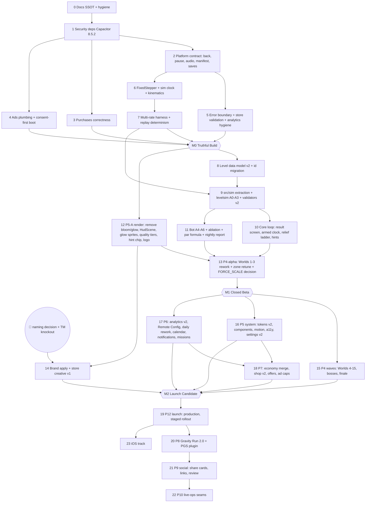

# Exact Execution Order

> Phases group work by domain ([`MASTER-ROADMAP.md`](MASTER-ROADMAP.md)). **This file is the order we actually work in.** It is dependency-aware: every step lists what it needs and what it unblocks.
>
> **Bite-sized TDD plans** (writing-plans format) are written *just in time* at the start of each step, in `docs/superpowers/plans/`. Later steps depend on data from earlier ones.
>
> **Owner-gated** steps are marked 👤.

## Dependency graph

## "What should Claude do first thing tomorrow morning?"
**Step 0 → Step 1, in order:**
1. Create `docs/STATUS.md`. It is the single source of truth: generated facts, gates, next actions, open bugs, decisions.
2. Add `scripts/facts.mjs` and its CI check.
3. Archive the stale state docs.
4. Strip state out of `CLAUDE.md`.
5. Hygiene:
   - remove the machine JDK path from `android/gradle.properties`
   - untrack the dead `.ai/*` symlinks
   - switch to `proguard-android-optimize.txt`
   - adopt the versionCode scheme (D-20)

Then **Step 1**: bump Capacitor to 8.5.2 plus the plugins. The installed 8.4.0 has a CVSS 9.3 advisory, and this must land before any other native change so later work is tested on the final runtime.

## The sequence

| # | Step | Phase | Needs | Unblocks | Verification |
|---|---|---|---|---|---|
| 0 | Docs SSOT (`STATUS.md` + facts script), archive stale docs, CLAUDE.md state-free (+ Node Playwright convention, A-20); repo hygiene; versionCode scheme + version script + release preflight (P12-T01–T08 pulled forward, A-15) | P0 | — | everything | facts script `--check` green; tsc/test/build |
| 1 | Security deps: `@capacitor/*` 8.5.2, `@capacitor/app` 8.1.2, capacitor-firebase 8.5.2, purchases-capacitor 13.7.0, then `cap sync`. AdMob 8.2.x follows in a separate soak commit. | P0 | 0 | 2, 3, 4 | `npm audit --omit=dev` = 0 critical; `assembleDebug` |
| 2 | Platform contract (D-11): • back router (incl. **Endless pause button + overlay**, A-08) • pause/foreground contract with audio suspend • portrait + `appCategory=game` + `VIBRATE` + backup rules + dark `windowBackground` + `singleTop` • `minWebViewVersion` 87 + error page + vite target • SystemBars config • renderer-crash recovery • Preferences save mirror + migration (D-12) | P0 | 1 | 5, 6 | Unit tests for router/pause/save mirror; `assembleDebug`; 👤 device checklist |
| 3 | Purchases (D-09): entitlement-as-truth, non-consumable products, error codes, pending flow, restore, store prices, Starter hidden when `no_ads` | P0 | 1 | M0 | TDD `entitlements → grants` mapping; 👤 license-tester matrix |
| 4 | Ads + consent (D-10, D-24 plumbing): consent-first boot, `canRequestAds`, privacy-options row, privacy link, Firebase Consent Mode defaults, preload, event-driven rewarded with watchdog, awaited interstitial before restart, busy guards | P0 | 1 | M0 | TDD consent/ad state machines; 👤 EEA/US debug-geography test |
| 5 | Error boundary (frame-step guard + "tap to restart" overlay + Crashlytics stack traces + custom keys); store-shape validation + backup keys; analytics hygiene (remove reserved `session_start`, pre-consent queue, manual `screen_view`, name/param lint test, **`level_start`/`level_end{success,cause,attempt,duration_ms}` with `level_id` + `level`**, A-10); honest store copy (no "leaderboard"); Data-safety + privacy-policy drafts | P0 | 2 | M0 | Unit tests; boot smoke |
| 6 | **FixedStepper** + `src/sim/forces.ts` + sim clock + kinematics as functions of `simMs` + per-step checks with win precedence + input latch + `FORCE_SCALE` (provisional 2.08) | P1 | 2 | 7 | TDD stepper/forces/kinematics |
| 7 | Multi-rate harness (30/60/90/120/144 Hz + jitter, bit-identical after N steps) + replay determinism (input log) + wall-clock lint rule | P1 | 6 | **M0** | Harness in CI |
| **M0** | **Truthful Build:** release AAB with versionCode ≥ 1000001 → 👤 internal track + device smoke + FORCE_SCALE feel A/B | | 3, 4, 5, 7 | 8, 12 | 👤 |
| 8 | Level data model v2 (D-05): stable ids, idea/role/teaches/uses/tags, worlds as explicit id lists, ProgressStore/GhostStore id migration | P2 | M0 | 9 | TDD migration; validators |
| 9 | `src/sim/` extraction (LevelSim, DOM-free) + `scripts/levelsim` agents A0 none / A1 nudge / A2 pursuit / A3 wall-hug + validators v2 (spawn, goal and exit safety, hazard–goal overlap, bounds, duplicates, titles, hints) + quality report JSON + CI gate | P2 | 7, 8 | 10, 11 | Bot reproduces the audit's known defects; CI < 3 min |
| 10 | Core loop (D-02, D-07, D-08): • armed clock • ResultPanel (NEXT/RETRY/LEVELS) • DeathStamp • title card once per session • hint tiers • relief ladder + route ghost from the bot • open frontier • interstitial after NEXT | P3 | 9 | 13 | TDD relief/frontier/scoring; boot smoke |
| 11 | Bot A4 random / A5 beam / A6 noisy + mechanic ablation + par formula + nightly report | P2 | 9 | 13 | Report for 150/150 levels |
| 12 | P5-A render: • remove bloom + ball postFX glow • HudScene • additive glow sprites • baked static layers • pre-rendered vignette • quality tiers + persisted watchdog • hint chip (Exo 2, wrapped) • transparent logo re-export | P5 | M0 | 13, 14 | Luminance check; perf on device 👤 |
| 13 | **P4-α:** Worlds 1–3 rework against bot gates + zone retune (D-04) + par from the formula + no-debut-in-boss + hint rewrite; FORCE_SCALE finalised | P4 | 10, 11, 12 | M1 | 0 bot-gate failures in W1–3 |
| 👤 | Naming choice from `NAMING-STUDY.md` + trademark knockout | P11 | — | 14 | owner |
| 14 | Brand apply (one `BRAND` config + assets) + store creative v1 (9:16 shots with captions, feature graphic, icon) + listing copy. Can run any time after 👤; it gates production, not the closed test (A-14). | P11 | 12, 13, 👤 | M2 | Asset spec check |
| **M1** | **Closed Beta:** 👤 closed track (12×14 if required) under the working title + telemetry review | | 13 | 15–18 | 👤 |
| 15 | P4 waves: Worlds 4–15 in data-informed batches; boss phases; finale synthesis; copies → remixes | P4 | M1 | M2 | Bot gates; closed-test FASR |
| 16 | P5 system: tokens v2, Button variants, Modal, Toast, ScrollView, LevelNode map, shop components, Settings v2, motion and shake helpers, accessibility options, splash fast path, EndScene finale | P5 | M1 | 18, M2 | Contrast and touch-target audit; reduced-motion audit |
| 17 | P6: analytics taxonomy v2 + user properties + Remote Config; Daily rework (3 tiers/date, full share card); **`weekKey` → Sunday 07:00 UTC**; login calendar pause; missions; achievements v2; local notifications; comeback gift; **In-App Review**; post-game modes; pure `mergeSave()` | P6 | M1 | 18, M2 | TDD; DebugView 👤 |
| 18 | P7: currency merge + migration; shop v2 (Spotlight, try-on); offers (Starter after W1 boss, No-Ads+, Supporter); ad caps via Remote Config | P7 | 16, 17 | M2 | TDD economy; license testers 👤 |
| **M2** | **Launch Candidate:** 👤 production access → staged rollout | | 15–18 | 19 | 👤 |
| 19 | P12: production rollout 20→50→100%; vitals; weekly metrics review; `v1.0.0` tag + GitHub Release | P12 | M2 | 20, 23 | vitals thresholds |
| 20 | P8: Gravity Run 2.0 (chunks ×3, biomes, escalation, pause, ghost) + local PGS plugin + boards + `weekKey` alignment | P8 | 19 | 21 | Bot pair-check; 👤 PGS setup |
| 21 | P9: share cards, challenge links (user site/domain `assetlinks.json`), in-app review | P9 | 20 | 22 | 👤 link verification |
| 22 | P10: `event_calendar` schema, weekly modifier rotation, seasonal palettes, earned cosmetic drops | P10 | 21 | — | Unknown-kind safety tests |
| 23 | iOS track (macOS) | P12 | 19 | — | 👤 |

## What must wait (and why)
| Item | Waits for | Reason |
|---|---|---|
| Any par/timer/difficulty tuning | Step 7 (+ Step 11 for par) | Tuning on the frame-rate-dependent sim is meaningless |
| Zone strength retune (D-04) | Step 9 fight test | Must be bot-verified, never a blind constant change |
| Campaign rework beyond W1–3 | M1 telemetry | Real-player FASR/APS decides which worlds first |
| Store screenshots/video | Steps 12–14 | The current render is dim; the current name is undecided |
| Renaming anything | 👤 D-19 | Owner choice + trademark knockout |
| Economy redesign | Steps 16–17 | Needs shop components, Remote Config and telemetry |
| Gravity Run 2.0, social, live ops | Launch (M2/19) | They need players and DAU to matter; plumbing first |
| Battle pass, event currency, Firestore, friend ghosts | Metrics (D-30) | Deferred until data justifies them |
| iOS | Android launch stable | macOS-gated; avoid splitting focus |
| Phaser 4 | After launch, behind `src/sim/` | No engine migration before 1.0 |

## Per-step working agreement
1. Verify the prerequisites (previous step's gates green).
2. Restate the step goal.
3. Load the relevant skills.
4. Write the bite-sized plan in `docs/superpowers/plans/`.
5. Implement with TDD where the logic is pure.
6. Run the gates (`MASTER-ROADMAP.md` §6).
7. Code review.
8. Update `STATUS.md`, `CHANGELOG.md` and the phase doc.
9. Commit in small logical commits.
10. Push `origin/master`.

Tag only at milestones (A-15): M0 = `v1.0.0-rc.2`, M1 = `v1.0.0-rc.3`, M2 = `v1.0.0-rc.4`, launch = `v1.0.0`.
