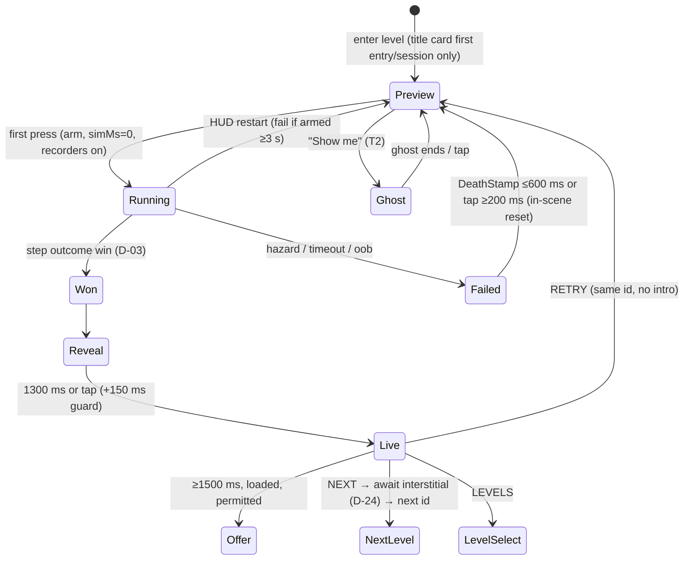

# P03 — Core "One More Try" Loop

**Status:** PLANNED · EXECUTION-ORDER **step 10**.
- **Needs:** step 7 (P1 harness: `FixedStepper`, sim clock, input latch and log), step 8 (P2 ids + D-05 fields) and step 9 (`src/sim/LevelSim`, levelsim A0–A3, validators v2).
- **Soft input:** step 11 (A5 routes for "Show me").
- **Unblocks:** step 13 (P4-α) → M1.
- Baseline `master @ d3c6aab` · 2026-10-07.

> **Conforms to:**
> - D-02: armed sim; the first press arms; retries return to the armed preview.
> - D-03: win beats hazard, consumed from the P1 rules.
> - D-07: relief ladder 3/6/10 fails or 4 min; route ghost free the first time per level; assisted ⇒ no par star; open frontier.
> - D-08: NEXT/RETRY/LEVELS, no auto-advance, tap skips the reveal, factual missed-star lines, offer never first or biggest, interstitial only after NEXT, title card and intro once per level per session, cause stamp ≤ 600 ms.
> - D-12: validated stores, migration ladder.
> - D-14: event names unchanged until P6.
> - D-24: hints never sold; interstitial caps untouched.
> - D-26: no formula change.
>
> **Design source:** [`../../design/GAMEPLAY-DESIGN.md`](../../design/GAMEPLAY-DESIGN.md) Part A.
> **Visual spec** (P5 restyles what P3 builds functionally): [`../../design/UX-UI-MOTION.md`](../../design/UX-UI-MOTION.md) §2.6, §2.7, §5.1 and §5.2.
> **Hand-offs:** P05-T05/T07/T18 (HudScene, HintChip, restyle), P07-T05/T07 (rewarded policy, rewarded route ghost), P06 (analytics taxonomy v2, streak semantics from RETENTION §4.3).

## 1. Summary
P3 turns a win-and-wait overlay into a mastery loop. It delivers:
1. **Armed preview.** Each attempt starts frozen and readable: hazards hold their t=0 pose with faint motion paths, and the par chip reads "par 9.5 s". The first press arms the sim and pulls.
2. **DeathStamp.** A cause-stamped fail (Hazard / Time's up / Out of bounds) outlines the killer and adds an honest near-miss line. It returns control in **≤ 600 ms** via an in-scene reset, with no title card, intro zoom or hint replay.
3. **ResultPanel.** It follows the D-08 choreography: NEXT primary, RETRY secondary, LEVELS tertiary, no auto-advance, tap-to-fast-forward and factual missed-star lines. The reward offer appears ≥ 1500 ms in, only when loaded and never next to a missed-star line. The **interstitial moves to the NEXT tap**.
4. **Hint system v2 + relief ladder:**
   - T0 rule line on debut levels
   - T1 "notice" at 3 fails
   - T2 "Show me" route ghost at 6 (free the first time per level, then an earned hint token)
   - T3 "Skip for now" at 10 fails or 240 s

   An assisted clear withholds the par star.
5. **Open frontier.** Two levels ahead are always open. The next world opens at `ceil(0.8 × size)` cleared or `2 × size` stars. Skips are hollow-badged.
6. **Local attempt accounting** (attempts, fail streak, active time, first-clear attempt), so FASR and APS are computable on device and in telemetry.

## 2. Scope
| Aspect | Detail |
|---|---|
| **Systems** | `GameScene` (title cards, intro zoom, `showHint`, `triggerDeath`/`deathFeedback`, `triggerWin`/`showWinOverlay`/`advanceAfterWin`, par/countdown chips, `maybeShowCoach`); new `ResultPanel`, `DeathStamp`, `RouteGhost`; HintSystem and ReliefLadder as pure modules; `ProgressStore`; `scoring.ts`; `nearMiss.ts`; `onboarding.ts`; LevelSelect / WorldMap / MainMenu CONTINUE; Ads call site; the P0 back router |
| **Dependencies** | **P1:** `FixedStepper`, `simMs`, `InputLatch`/`InputLog`, an arm hook (D-02). **P2:** stable ids, `relief`/`teaches`/`role` fields (D-05), `LevelSim.reset()`, the level content hash, A0–A3, validators. **P2 step 11 (soft):** A5 routes for T2. **P0:** `Ads.showInterstitialIfEligible()` (awaited), back router, PauseScene, `decodeStore` and the migrations ladder. **P5-A (soft):** `HudScene` and `HintChip`. Whichever lands second integrates (P05 C7) |
| **Difficulty** | Engineering **M** · design **H** · QA **M** |
| **Risk** | Medium. (1) Relief could hollow out challenge: mitigated by opt-in chips, par-star exclusion and thresholds in `LOOP` (Remote Config in P6). (2) Collision with P5-A moving HUD into HudScene: components take a host scene and never assume GameScene. (3) Stale routes after P4 edits: validated by level hash, and T2 is hidden when stale |
| **Upside** | High. It unlocks the already-built 3★/par/ghost loop (audit G.5 #1 and #3), removes the "plays itself" auto-advance and the replayed cutscenes, and moves interstitials to a policy-safe slot |
| **Success metrics** | Death → control ≤ 600 ms · RETRY ≤ 1 tap and ≤ 300 ms to armed · title cards on retry = 0 · 0 interstitials outside NEXT · FASR/APS computable per level id · relief usage < 15% of attempts in W1–4 (closed-test telemetry, M1+) |
| **Must NOT do yet** | Campaign retune, zone changes, par refit (P4) · hint copy beyond W1–3 + the 7 flagged spoilers (P4 waves) · rewarded route-ghost path and token tuning (P07-T07) · analytics renames (P6) · visual restyle (P05-T18) · win-streak semantics (P6) · "Auto-continue" setting (would need a D-08 amendment) · new mechanics |

## 3. Architecture plan
**Shape.** Rules live in small pure modules under `src/utils/` (TDD, per CLAUDE.md "discrete logic"). Presentation components in `src/ui/` take a host `Phaser.Scene`: GameScene today, HudScene after P05-T05. GameScene orchestrates with explicit methods; there's no manager class.



**Key mechanisms:**

| Mechanism | Design |
|---|---|
| **Reset** | `GameScene.resetRun()` calls `LevelSim.reset()` (P2: ball to spawn, kinematics t=0, pickups and gates reset, stepper reset), re-syncs entity renderers, clears trail and pull line, and re-enters Preview. Fallback: `scene.restart({ level, retry: true })` with `session.ts` suppressing intros. P03-T08 benchmarks both; target reset ≤ 50 ms on the Mid-tier reference device |
| **Arm** | The P1 input latch gets `armed=false` until the first accepted press (not over a blocker, not the consumed title-card tap). The stepper doesn't advance while unarmed, so `simMs` stays 0. The ghost and replay recorders start at arm |
| **Killer identity** | The P1 rules return the index of the hazard that overlapped in the resolving step, so DeathStamp can outline it. Timeout and oob carry no index |
| **Near-miss numbers** | Computed from the sim state at the resolving step: edge gap = `dist − goalR − ballR`, and over-par = `simMs − parMs` |
| **Result model** | `resultModel(input) → view` is pure. It decides headline, kicker, NEXT label, missed lines, stats line, NEW BEST, NEXT pulse and offer eligibility. `ResultPanel` only renders it and runs the timeline |
| **Interstitial** | `onNext()` disables input, then `await Ads.showInterstitialIfEligible()` (P0; skipped if not preloaded), then starts the next level id (`frontier.nextAfter(id)`). Nothing else in GameScene calls Ads interstitial APIs (source-lint test) |
| **Relief** | `relief.ts` reduces `{failStreak, activeMs, cleared, role, mode}` to tier 0–3. GameScene shows chips; tapping one runs T1/T2/T3. `activeMs` accrues only while the scene is active and unpaused (P0 pause contract) |
| **Route ghost** | Artifact `src/config/routes/<levelId>.json` from the P2 levelsim export (A5 best route, or a verified dev input-log replay). Lazy-loaded via `import.meta.glob` (one chunk per level, not in the main bundle). Valid only when `levelHash` equals the current content hash. `RouteGhost` replays recorded positions (no physics, so no determinism risk), plus a touch ring from the RLE input log, at sim speed. Tapping skips it |
| **Frontier** | `frontier.ts`: `isOpen(id)`, `worldOpen(w)`, `lockReason(w)`, `nextAfter(id)`, `continueTarget()`. LevelSelect, WorldMap and MainMenu read only this. `ProgressStore.isUnlocked` delegates to it |
| **Session flags** | `session.ts`: in-memory sets `titleSeen`, `introSeen`, `ruleSeen`, keyed by level id. They reset on cold start (D-08 "per session") |
| **Constants** | `src/config/loop.config.ts` (`LOOP`). There are no literals in scenes (CLAUDE.md). Feature flags live here and move to Remote Config in P6 |

**`LOOP` values:**

| Key | Value | Key | Value |
|---|---|---|---|
| `RELIEF_T1_FAILS` | 3 | `RESULT_PANEL_AT_MS` | 450 |
| `RELIEF_T2_FAILS` | 6 | `RESULT_STARS_AT_MS` | [600, 860, 1120] |
| `RELIEF_T3_FAILS` | 10 | `RESULT_STATS_AT_MS` | 1250 |
| `RELIEF_T3_ACTIVE_MS` | 240 000 | `RESULT_LIVE_AT_MS` | 1300 |
| `RESTART_COUNTS_AS_FAIL_MS` | 3000 | `RESULT_FASTFWD_GUARD_MS` | 150 |
| `FRONTIER_AHEAD` | 2 | `RESULT_OFFER_AT_MS` | 1500 |
| `WORLD_OPEN_CLEAR_FRACTION` | 0.8 | `OFFER_MIN_LIFETIME_LEVEL` | 6 |
| `WORLD_OPEN_STARS_PER_LEVEL` | 2 | `NEAR_GOAL_GAP_PX` | 24 (replaces centre-distance `RETENTION.NEAR_GOAL_PX` 60) |
| `DEATH_HITSTOP_MS` | 60 | `TIMEOUT_PROGRESS_MAX_PX` | 200 |
| `DEATH_TAP_SKIP_AFTER_MS` | 200 | `JUST_PAR_MS` | 500 (replaces 400) |
| `DEATH_TO_CONTROL_MS` | 600 (hard cap) | `NOTICE_MAX_CHARS` / `RULE_MAX_CHARS` | 60 / 70 |
| `HINT_T1_SHOW_MS` | 5000 | `TOKENS_CAP` / per world / per 3★ clears | 5 / +1 / +1 per 10 |
| `FLAGS` | `RESULT_PANEL_V2`, `RELIEF_LADDER`, `OPEN_FRONTIER`, `ROUTE_GHOST`, `INSCENE_RESET` (all true) | | |

## 4. Files/modules affected
| Path | Action | Purpose |
|---|---|---|
| `src/config/loop.config.ts` | Create | `LOOP` constants, copy strings and flags |
| `src/utils/relief.ts` + `.test.ts` | Create | Ladder tiers, fail and clear transitions, active-time trigger, scope rules |
| `src/utils/frontier.ts` + `.test.ts` | Create | Open frontier, world open, lock reason, next and continue targets |
| `src/utils/session.ts` + `.test.ts` | Create | Once-per-level-per-session flags |
| `src/utils/hints.ts` + `.test.ts` | Create | T0 selection from `teaches`; chip tier text; hint lint (banned direction words → warning) |
| `src/utils/resultModel.ts` + `.test.ts` | Create | Result view decisions (headline, labels, missed lines, offer gating) |
| `src/utils/routes.ts` + `.test.ts` | Create | Route artifact schema validation, hash check, lazy loader |
| `src/utils/hintTokens.ts` + `.test.ts`, `src/utils/HintTokenStore.ts` | Create (P07-T07 extends) | Earn (+1 per boss clear, +1 per 10 three-star clears, cap 5) and spend; key `gravity-flow:hinttokens:v1` `{tokens, grantedKeys[]}` |
| `src/ui/ResultPanel.ts` | Create | Host-agnostic panel + timeline + actions (functional; P05-T18 restyles) |
| `src/ui/DeathStamp.ts` | Create | Stamp chip, killer outline, near-miss line, tap-to-skip |
| `src/ui/HintChip.ts` | Create if P05-T07 hasn't landed, else Modify | Chip presentation (Exo 2 15/21, wrap 320); P3 adds the relief-chip variant ("?", "Show me", "Skip for now") |
| `src/entities/RouteGhost.ts` | Create | Ghost ball + touch-ring playback |
| `src/config/routes/*.json` | Create (generated) | Route artifacts per level id |
| `scripts/smoke/loop_timing.py` | Create | Playwright (`--disable-gpu --use-gl=swiftshader`) timing probes |
| `src/scenes/GameScene.ts` | Modify | Preview/arm UX, `resetRun`, DeathStamp, ResultPanel, `onNext`/`onRetry`/`onLevels`, relief chips, session gating, coach mark only on campaign L1 (not the Daily), par/countdown chips removed from `uiBlockers` (display-only), `advanceTimer` deleted |
| `src/utils/scoring.ts` + test | Modify | `computeStars({…, assisted})`: `underPar` is false when assisted |
| `src/utils/nearMiss.ts` + test | Modify | Edge-gap model; timeout progress; `stampFor(cause, gapPx)` |
| `src/utils/ProgressStore.ts` | Modify | New fields (§5), `isUnlocked` → `frontier.isOpen`, `recordAttempt`/`recordFail`/`recordClear`/`markSkipped`/`addActiveMs` |
| `src/platform/migrations.ts` | Modify | Append the P3 migration (§9) |
| `src/utils/onboarding.ts` + test | Modify | `nextUnlockHint` uses `frontier.lockReason` |
| `src/scenes/LevelSelectScene.ts`, `WorldMapScene.ts`, `MainMenuScene.ts` | Modify | Frontier, hollow badge, lock-reason line, CONTINUE = `continueTarget()` |
| `src/platform/backRouter.ts` + test | Modify | Result showing → LEVELS; DeathStamp → ignore (≤ 600 ms); ghost playing → stop ghost |
| `src/utils/AudioSynth.ts` | Modify | `playFail(cause)`: hazard = falling buzz, timeout = double low tone (UX §6) |
| `src/utils/analyticsEvents.ts` + test | Modify | Add params `attempt`, `cause`, `assisted`, `tier` to existing builders (names unchanged until P6) |
| `src/config/retention.config.ts` | Modify | Retire `NEAR_GOAL_PX`, `JUST_PAR_MS`, `SO_CLOSE_TEXT` (moved to `LOOP`); first-win and streak copy stay |
| `src/types/index.ts` | Modify (only if P2 hasn't) | `relief?: { notice?: string; rule?: string }` |
| `src/config/levels/*.ts` | Modify (data) | `hint` → `relief.notice` codemod; new copy for W1–3 + L38, L56, L58, L60, L66, L70, L80 |
| `src/sim/LevelSim.ts` | Modify (only if P2 lacks it) | Expose `reset()`, `armed`, killer index |

## 5. Data-model changes
**`ProgressStore` entry** (id-keyed after P2; additive):
```ts
interface LevelProgress {
  stars: number; bestTimeMs: number; gem: boolean; // existing
  attempts: number;          // lifetime armed runs → `attempt` param, local APS
  failStreak: number;        // consecutive fails since last clear (relief)
  activeMs: number;          // unpaused time on the level since last clear (relief T3)
  firstClearAttempt: number; // 0 = never cleared; else attempt # of first clear (local FASR)
  opened: boolean;           // frontier/skip opened; monotonic
  skipped: boolean;          // T3 used, not yet cleared → hollow badge
  assistedClear: boolean;    // best clear was assisted until an unassisted clear
  routeFreeUsed: boolean;    // D-07 free first ghost consumed
}
```

**Validator.** `isProgressMap` extended. Unknown fields are preserved for forward compatibility. Numbers are clamped ≥ 0.

**Hint tokens.** `gravity-flow:hinttokens:v1` = `{ tokens: number (0..5), grantedKeys: string[] }`. Grant keys are `boss:<id>` and `three:<n>`, so grants are idempotent.

**Level data.** `relief.notice` (T1) and `relief.rule` (T0, only on levels whose `teaches` is non-empty). Legacy `hint` stays readable as a fallback for `relief.notice` until P4 completes. The P2 validator enforces lengths and uniqueness.

**Route artifact** (`src/config/routes/<id>.json`):
```json
{ "v": 1, "levelId": "w01-foundations-06", "levelHash": "9f3c…", "source": "A5",
  "stepMs": 16.6667, "tWinMs": 7350,
  "inputs": [[42,0,0,0],[90,1,212,388]],
  "path": [[180,660],[181,652]] }
```
- `inputs` uses the P1 `InputLog` RLE format.
- `path` is sampled at 10 Hz in play coordinates.
- CI test: replaying `inputs` headlessly in `LevelSim` wins within ±1 step of `tWinMs`.

## 6. UI changes
| Surface | Change | Spec |
|---|---|---|
| Armed preview | Path previews at 0.18 alpha (dotted sweep, dashed arm circle, beam rail with first window); launch arrow when `startVelocity`; par chip "par 9.5 s"; countdown frozen at the limit | GAMEPLAY A.3 |
| Title cards / intro zoom | First entry per session only. While a card shows, the first tap skips it and is consumed (P05 rule #6) | D-08 |
| DeathStamp | E4 chip at the contact point, killer outline, copy per cause, honest second line | GAMEPLAY A.4, UX §5.2 |
| ResultPanel | Kicker / headline / stars labelled HOME · GEM · PAR / missed lines / stats; below: offer slot → [LEVELS \| RETRY] → NEXT | GAMEPLAY A.6, UX §2.6 |
| Relief chips | One chip slot, bottom-left above the safe area, ≥ 48 px, never in back-gesture zones: "?" (T1) → "Show me" (T2) → "Skip for now" (T3), showing the highest reached tier plus a ‹ › pager to lower tiers | GAMEPLAY A.9/A.10 |
| Route ghost | Ghost ball (white 0.35 + 8-point trail) + touch ring (attractor violet 0.4) + a "Guide" caption chip; tap to stop | — |
| LevelSelect / WorldMap | Hollow star badge for skipped levels; nodes open per frontier; world lock line ("Clear 2 more in CLOCKWORK — or earn 4 more ★") | GAMEPLAY A.12 |
| MainMenu CONTINUE | `continueTarget()`: first open uncleared level, else the next gem or par target | — |
| HUD | Par and countdown chips stop blocking touches (display-only) | GAMEPLAY F.1 |

## 7. Gameplay changes
- **Clock:** starts at the first press (D-02). Par, best time and countdown are measured from arm.
- **Self-solving:** L11/L12 class becomes impossible. L12 can no longer finish under its title card.
- **Retries:** go to the armed preview, with hazards back at t=0 (deterministic, D-01).
- **Relief:** opt-in ladder on uncleared levels (A.10). T2 marks the visit assisted, so ★1 + gem only.
- **Unlocks:** open frontier replaces strict sequential unlock. Nothing currently open becomes locked.
- **Fails:** a manual restart after ≥ 3 s armed counts as a fail for relief and `level_end` cause `restart`.
- **Daily:** uses ResultPanel with the Daily copy (DONE / RETRY; one payout per day, D-21, owned by P6). The relief ladder is off and the coach mark never shows (fixes the audit's `seenTutorial` bug).

## 8. Test strategy
| Layer | Files | Key cases |
|---|---|---|
| Unit (TDD, Vitest) | `relief.test.ts` | 2 fails → 0; 3 → 1; 6 → 2 (hidden without a route); 10 → 3; 239 999 ms → < 3, 240 000 → 3; clear resets; sandbox / Daily / L1–3 / cleared → always 0; restart < 3 s ≠ fail |
| | `frontier.test.ts` | furthest + 2 open; monotonic `opened`; world opens at 8/10 and at 20★ for size 10, and at 7/9 for size 9; skip counts as opened, not cleared; legacy sequential unlocks stay open; `lockReason` copy; `continueTarget` priority |
| | `scoring.test.ts` | Assisted ⇒ no par star, gem still counts; unchanged when not assisted |
| | `nearMiss.test.ts` | Edge gap 24 → "So close"; 25 → none; timeout 200 → progress line; 201 → none; over-par 0.5 s → just-par; 0.51 → none |
| | `resultModel.test.ts` | Labels per context (normal / boss / L80 / L150 / Daily / assisted); missed-line order and copy; offer hidden when a missed line shows, before 1500 ms, when not loaded, in session 1, lifetime level < 6; NEXT pulse only on 3★ |
| | `session.test.ts`, `hints.test.ts`, `routes.test.ts`, `hintTokens.test.ts` | Once per session; T0 only on `teaches`; lint flags "left/then/commit"; stale hash rejected; token cap 5; idempotent grants |
| | `ProgressStore` migration test | v-prev map → new defaults; corrupt → `:bak`; unknown fields preserved |
| | `backRouter.test.ts` | Result → LEVELS; stamp → none; ghost → stop |
| Source lint | `sourceLint.test.ts` (extend P1's) | Interstitial API referenced only from `GameScene.onNext`; no `delayedCall` auto-advance in `GameScene` |
| Determinism | `routes.replay.test.ts` | Every committed route replays to a win in Node `LevelSim` within ±1 step |
| Integration (Playwright) | `scripts/smoke/loop_timing.py` | Death → first accepted press ≤ 600 ms (synthetic hazard on a test level); RETRY → armed ≤ 300 ms; title card count on 3 retries = 0; tap during reveal never navigates; NEXT awaits the interstitial stub; HUD chip tap passes through to the attractor |
| Boot smoke | Existing | All scenes, 0 console errors |
| Device | Checklist (§12) | Thumb reach, haptics per cause, interstitial after NEXT, Back behaviour |

## 9. Migration strategy
1. **Migration `p3-progress`** is appended to `src/platform/migrations.ts`, after P2's index → id migration. It adds defaults to every entry: `attempts = stars > 0 ? 1 : 0`, `firstClearAttempt = stars > 0 ? 1 : 0`, all other new fields 0 or false.
2. It sets `opened = true` for every id open under the legacy rule (cleared, or directly after a cleared one), so no player loses access.
3. **Hint data.** A one-shot codemod copies `hint` → `relief.notice` in every level file. Then W1–3 and the 7 flagged levels get the new copy. Other levels keep their legacy text until their P4 wave. It is now shown only at T1, which is a smaller spoil than on entry.
4. **Ghost and best times** are untouched. Pre-P3 times included pre-touch idle, so they're only ever *slower* than new times; nothing is lost.
5. **Backup.** `:bak` is written before the migration runs (D-12).

## 10. Rollback
- **Per-feature flags** in `LOOP.FLAGS`, becoming Remote Config in P6:
  - `RESULT_PANEL_V2=false` restores the old overlay *without* auto-advance: a minimal NEXT button. The auto-advance is never reintroduced (D-08).
  - `RELIEF_LADDER=false` hides the chips.
  - `OPEN_FRONTIER=false` uses sequential unlock OR `opened`, so it never re-locks.
  - `ROUTE_GHOST=false` hides T2.
- **Data is additive.** An older build ignores the new fields and keeps working.
- A binary rollback to a pre-P3 build is allowed only on internal or closed tracks: it would re-lock skipped-ahead levels. Production uses the flags.
- **Reset path:** if `resetRun()` misbehaves, `LOOP.FLAGS.INSCENE_RESET=false` falls back to `scene.restart({retry:true})`.

## 11. Performance
| Item | Budget |
|---|---|
| In-scene reset | ≤ 50 ms Mid tier; no body re-creation (P2 `LevelSim.reset`) |
| ResultPanel | ≤ 14 game objects; 1 glow sprite; text pre-created once per scene and re-texted |
| DeathStamp | ≤ 6 objects + ≤ 16 particles (existing puff budget) |
| Route ghost | 1 sprite + 8-point trail + ring; JSON ≤ 6 KB per level, lazy chunk |
| Path previews | Baked into one Graphics per level at create (re-used across retries) |
| Bodies | +0 Matter bodies; the < 20 ceiling is unchanged |
| GC | No per-frame allocations in the timeline (pre-allocated tweens; `simMs` comparisons) |

## 12. Platform
- **Back** (D-11, P0 router): Result → LEVELS; DeathStamp → ignored for ≤ 600 ms; route ghost → stop; preview or running → PauseScene.
- **Pause and background** (P0): `activeMs` stops accruing, and the timeline pauses with the scene. The DeathStamp resolves on resume (never auto-advances). Background during Reveal resumes in Live.
- **Interstitial (device):** appears only after NEXT, over the frozen result. The next level's armed preview starts after dismissal; its clock is 0 until the press (P0 device matrix A1).
- **Haptics:** death pattern per cause (hazard `[60,40,20]`, timeout `[30,30,30]`, oob `[40]`) via the P0 haptics seam; star 10 ms × n.
- **120 Hz / 30 fps:** UI timelines use real time; gameplay uses sim time. Covered by the P1 harness.
- **Low end:** the Low tier drops the path-preview dotted pattern to solid lines (one draw).

## 13. Documentation changes
- `docs/STATUS.md`: step 10 gates and results.
- `CHANGELOG.md`: player-facing loop changes.
- This file: task status.
- `CLAUDE.md`: architecture section only. Scene-flow note (result → NEXT/RETRY/LEVELS) and folder entries for `ui/ResultPanel.ts`, `ui/DeathStamp.ts`, `entities/RouteGhost.ts`, `config/loop.config.ts`, `config/routes/`. The "Win feel" and "Level progression" paragraphs are rewritten (no auto-advance).
- `docs/design/GAMEPLAY-DESIGN.md`: only if a threshold changes during implementation.
- A handoff note to P05-T18 and P07-T07 listing the component APIs.

## 14. Validation criteria
| # | Criterion | Method | Class |
|---|---|---|---|
| V1 | `npx tsc --noEmit`, `npx vitest run`, `npm run build` green | CI | VERIFIED |
| V2 | All new pure modules ≥ 95% line coverage | Vitest coverage | VERIFIED |
| V3 | Death → control ≤ 600 ms, p95 over 50 deaths | `loop_timing.py` | VERIFIED |
| V4 | RETRY → armed ≤ 300 ms; HUD restart ≤ 250 ms | `loop_timing.py` | VERIFIED |
| V5 | Title cards / intro zoom on retry = 0 across 3 retries × 3 titled levels | `loop_timing.py` | VERIFIED |
| V6 | No navigation from a tap during reveal (20 random taps at 0–1300 ms) | `loop_timing.py` | VERIFIED |
| V7 | Interstitial API referenced only by `onNext` | Source lint | VERIFIED |
| V8 | A0 (arm tap outside reach, then no input) never wins L11/L12 | levelsim A0 in CI (P2) | VERIFIED |
| V9 | Every committed route replays to a win | `routes.replay.test.ts` | VERIFIED |
| V10 | Migration keeps every previously unlocked level open | Fixture test with a v9-derived save | VERIFIED |
| V11 | Relief, frontier and assisted rules match GAMEPLAY A.10–A.13 | Unit tests | VERIFIED |
| V12 | Ladder feels supportive, not nagging; chips never overlap the ball's spawn | Designer playtest W1–3 | INFERRED |
| V13 | Relief chip and result buttons reachable one-handed; no Back-gesture conflicts | Reference Android, gesture nav | HUMAN DEVICE TEST |
| V14 | Interstitial only after NEXT, next level unarmed at 0 s | Device, test ad unit | HUMAN DEVICE TEST |
| V15 | Haptic patterns distinguishable per cause | Device | HUMAN DEVICE TEST |
| V16 | Relief usage < 15% of attempts in W1–4 | Closed-test telemetry | INFERRED until M1 data |

## 15. Exact completion definition
P3 is complete when **all** of these hold:
1. V1–V11 are VERIFIED in CI, and V13–V15 are signed off on the reference device.
2. `showWinOverlay`'s auto-advance timer, `advanceAfterWin` and the in-scene `deathFeedback` are deleted. ResultPanel and DeathStamp are the only win and fail surfaces.
3. Every campaign level resolves a `relief.notice` (new copy for W1–3 and the 7 flagged levels). T0 rule lines exist for every W1–3 level with non-empty `teaches`.
4. Routes are committed for every W1–3 level that has an A5 or replay route. Levels without one hide T2 (listed in STATUS).
5. Frontier drives LevelSelect, WorldMap, MainMenu CONTINUE and the onboarding nudge. `ProgressStore.isUnlocked` has no other logic.
6. STATUS, CHANGELOG and CLAUDE.md (architecture) are updated. The handoff note to P05/P07 is written. Code review passed (`superpowers:requesting-code-review`).

## 16. Task breakdown
| ID | Goal | Files | Tests | Done when |
|---|---|---|---|---|
| **P03-T01** | Loop constants, copy and flags | C `loop.config.ts`; M `retention.config.ts` | Constants snapshot | No new literals in scenes (review); old near-miss keys removed |
| **P03-T02** | Relief ladder (pure) | C `relief.ts` | `relief.test.ts` (A.10 cases) | V11 relief part green |
| **P03-T03** | Open frontier (pure) + onboarding nudge | C `frontier.ts`; M `onboarding.ts` | `frontier.test.ts`, `onboarding.test.ts` | World-open and lock-reason cases green |
| **P03-T04** | ProgressStore fields, validator, migration | M `ProgressStore.ts`, `platform/migrations.ts` | Migration fixture test | V10 |
| **P03-T05** | Assisted scoring + near-miss v2 | M `scoring.ts`, `nearMiss.ts` | Both tests | Assisted ⇒ no par; edge-gap thresholds |
| **P03-T06** | Session gating (title, intro, T0) + coach mark campaign-only | C `session.ts`; M `GameScene.ts` (`showWorldTitleCard`, `showLevelTitleCard`, `applyCameraIntro`, `maybeShowCoach`) | `session.test.ts`; V5 | No intro on retry; Daily never shows the coach mark |
| **P03-T07** | Armed preview UX | M `GameScene.ts` (preview layer, par chip text, chips not `uiBlockers`, title-card tap consumption); P1 arm hook | Playwright: press over a chip arms; `simMs` = 0 before the press | L12 can't finish under its card; path previews visible |
| **P03-T08** | DeathStamp + in-scene reset + cause sounds | C `ui/DeathStamp.ts`; M `GameScene.ts` (`resetRun`), `AudioSynth.ts`, `LevelSim` (if needed) | V3; reset benchmark | ≤ 600 ms p95; killer outline correct on 5 hazard types |
| **P03-T09** | Result model (pure) | C `resultModel.ts` | `resultModel.test.ts` | All copy and offer-gating cases green |
| **P03-T10** | ResultPanel + NEXT/RETRY/LEVELS + fast-forward | C `ui/ResultPanel.ts`; M `GameScene.ts` (delete `advanceTimer`, `advanceAfterWin`), `backRouter.ts` | V4, V6; `backRouter.test.ts` | D-08 behaviour end to end in campaign and Daily |
| **P03-T11** | Interstitial only after NEXT | M `GameScene.ts` (`onNext`), `sourceLint.test.ts` | V7; stub-ad Playwright | Next level arms at 0 s after the stub dismisses |
| **P03-T12** | HintSystem: T0 and T1 + relief chips | C `hints.ts`; C/M `ui/HintChip.ts`; M `GameScene.ts` | `hints.test.ts`; Playwright chip at 3 fails | Chips appear at 3/6/10 and 240 s on a forced-fail fixture |
| **P03-T13** | Route ghost ("Show me") + assisted flag | C `routes.ts`, `entities/RouteGhost.ts`, `config/routes/*.json`; M `GameScene.ts`, `ProgressStore.ts` | `routes.test.ts`, V9 | First view free; a second view needs a token; a clear after the ghost shows the assisted par line |
| **P03-T14** | Hint tokens (earn/spend; rewarded path left to P07-T07) | C `hintTokens.ts`, `HintTokenStore.ts` | `hintTokens.test.ts` | +1 per boss clear, +1 per 10 3★, cap 5, idempotent |
| **P03-T15** | Skip for now + hollow badges + frontier UI | M `LevelSelectScene.ts`, `WorldMapScene.ts`, `MainMenuScene.ts`, `GameScene.ts` | Playwright: skip opens next; badge hollow | CONTINUE goes to `continueTarget()` |
| **P03-T16** | Relief copy: codemod + W1–3 + 7 rewrites + lint | M `src/config/levels/*.ts`; C codemod script under `scripts/` | Validator (P2) lengths and uniqueness; `hints.test.ts` lint | 0 duplicate notices; 0 lint warnings in W1–3 |
| **P03-T17** | Telemetry params + local FASR/APS dev readout | M `analyticsEvents.ts` (+test), `GameScene.ts` (dev overlay behind `?debug`) | Event param tests | `level_start` carries `attempt`; the fail event carries `cause` and `assisted` |
| **P03-T18** | Timing smoke, device checklist, docs | C `scripts/smoke/loop_timing.py`; M `STATUS.md`, `CHANGELOG.md`, `CLAUDE.md` | V3–V6 in CI | §15 satisfied |

**Order:** T01 → T02–T05 and T09 (parallel, pure) → T06–T08 → T10–T11 → T12–T15 → T16–T18. Estimated **9–12 dev-days** (design copy included).
