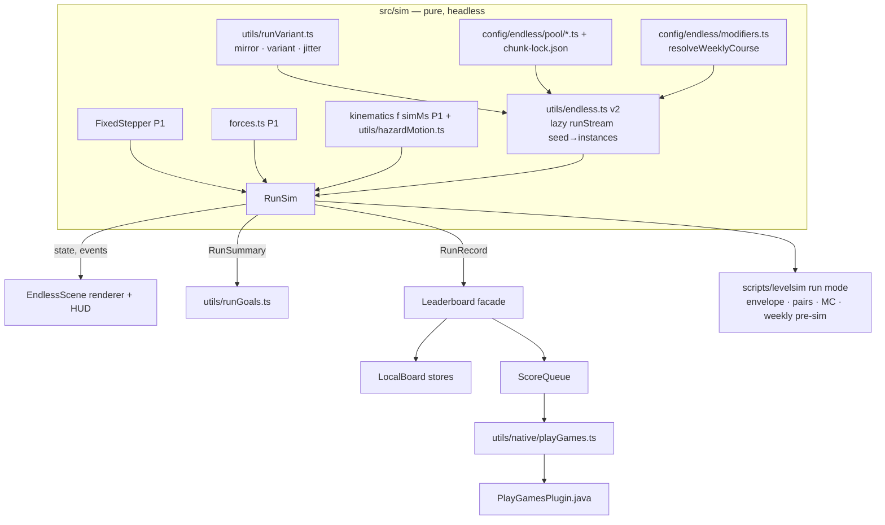

# P08 — Gravity Run 2.0 & Competitive Systems

**Status:** PLANNED, not started.
- **Execution step:** 20 ([`../EXECUTION-ORDER.md`](../EXECUTION-ORDER.md)). Needs step 19 (production rollout at 100%).
- **Design:** [`../../design/GRAVITY-RUN.md`](../../design/GRAVITY-RUN.md).
- **Decisions:** D-01, D-02, D-06, D-10, D-12, D-14, D-17, D-22, D-24, D-26, D-30.
- **Baseline:** `master @ d3c6aab`.

## 1. Summary
Turn Gravity Run from a 20-chunk prototype into a mode players return to weekly.

**The problem today.** A run sees about the whole pool. Nothing escalates after ≈50 s. The weekly resets at Thursday local midnight, so timezones play different courses. Scores live only in localStorage. Arms are silently static, revived runs count toward the Endless best, and there is no pause button.

**P8 delivers:**
- a deterministic `RunSim` on the shared fixed-step sim (D-01/D-06)
- a phase/biome generator with composition-based escalation, mirror, tier variants and bot-verified jitter (D-22)
- 32 templates at ship (≥40 within 3 months)
- portals, gates, platforms and arms in the Run
- a height-dominant score with a fixed gem budget
- PB in sim steps, best-height marker and a weekly PB ghost
- Alto-style 3-active goals
- pause and interruption handling
- telemetry
- a local Play Games Services v2 plugin with two tamper-bounded boards, an offline queue, and `weekKey` aligned to the PGS Sunday 07:00 UTC reset (D-17)

## 2. Scope

### Systems
| System | In P8 | Notes |
|---|---|---|
| Run simulation | `src/sim/RunSim.ts` (headless), EndlessScene as a thin renderer | Second caller = `scripts/levelsim` run mode |
| Content | Template schema v2, per-biome pool files, mirror/variant/jitter transforms, gem budget, lockfile | 32 templates at ship; +8 in the +3-month drop (T19) |
| Generator v2 | Opener, 6-chunk biome phases, fixed rest cadence (3 hard : 1 rest), pressure P0–P12, ±10% phase budget, recency 6/12, lazy stream (no 400-chunk wrap) | Pure, Monte-Carlo tested |
| Mechanics | Arms, moving platforms, one-way gates, portals | Portals: engine in P8, Rifts content in T19 |
| Scoring / records | Score v2 (gem bonus 5), PB in sim steps, revive exclusion in both modes, legacy-best archive | — |
| Ghosts | Best-height marker (both modes), PB ghost (Weekly) | Author ghost deferred to T19/P10; friend ghosts D-30 |
| Goals | 60 goals, 20 ranks, 3 active | — |
| UX | Pause button, auto-pause, resume countdown, run-over rework, biome toasts, first-sight callouts, This Week card shell | — |
| Competition | `PlayGamesPlugin.java` + TS bridge, `lb_weekly_run` + `lb_endless`, ScoreQueue, score tags, plausibility check, rank display | Web stays local |
| Telemetry | `level_start`/`level_end` (mode), `post_score`, `run_death`, `run_goal_complete`, `score_submit`, `run_pause` | Consent-gated (D-10) |
| Modifier hook | `RunModifier` + `resolveWeeklyCourse` + `standard`/`mirror`/`gem_rush` | Catalogue and calendar: P10 |

### Dependencies
| Needs | From | Why |
|---|---|---|
| `FixedStepper`, sim clock, `src/sim/forces.ts`, kinematics as f(`simMs`), input latch, multi-rate harness | P1 (steps 6–7) | Weekly fairness is impossible on the wall clock |
| `src/sim/` extraction, `scripts/levelsim` A2/A5/A6, validators v2 + CI gate, D-05 `teaches` metadata | P2 (steps 9, 11) | Bot verification of chunks and seams; biome unlock data |
| D-04 zone retune, final `FORCE_SCALE` | P4 (step 13) | Chunks are verified against final constants |
| Pause/foreground contract, `@capacitor/app`, Preferences mirror, consent-first boot | P0 (steps 1–5) | Auto-pause, durable stores, lawful telemetry |
| Analytics taxonomy v2, `rcConfig.ts`, achievements v2 | P6 (step 17) | Events, kill switches, PGS achievement mapping |
| HudScene, Modal/Toast components | P5 (steps 12, 16) | HUD unaffected by camera; pause overlay |
| 👤 PGS Console project, OAuth credentials, boards, testers | Owner | Plugin can't authenticate without it |

### Difficulty, risk, upside
| Item | Rating / note |
|---|---|
| Difficulty | Engineering **H** · design **H** · QA **M** |
| Risk: native plugin build (AGP 8.13 / Gradle 8.14.3) | Medium. Mitigated with a **Java** local plugin (the app has no Kotlin toolchain, `MainActivity.java`) pinned to `play-services-games-v2:22.1.0`. |
| Risk: PGS reset boundary differs from the doc (UTC-7 vs Pacific DST) | Medium. One constant, plus a device test across 2026-11-01. |
| Risk: bot cost of the pair matrix | Low. Envelope contract makes CI O(N); the full matrix runs nightly. |
| Risk: tampering on boards | Medium. PGS tamper protection, 50,000 bound, score tag audit, Console hiding. |
| Risk: content treadmill | Medium. 12 new templates at ½ day each; telemetry decides the next ones. |
| Upside | Medium-high: session frequency, rewarded-revive inventory, a real weekly social hook |

### Success metrics (MASTER-ROADMAP P8)
- Runs per DAU ≥1.5 among Run adopters.
- Weekly participation ≥15% of WAU.
- Median run 60–180 s.
- Leaderboard submit success ≥99%.

Internal:
- 0 validator/bot-gate failures.
- Generator Monte Carlo: 0 violations.
- Endless seed survival CV ≤15%.

### Must NOT be done yet
- Firestore boards, friend ghosts, tournaments, event currency, server replay validation (D-30).
- Raising the scroll cap.
- Touching the attractor formula (D-26).
- Interstitials in Run (D-24).
- Daily on PGS (D-17).
- The full weekly modifier catalogue and calendar (P10).
- Share links (P9).

### Decision deltas (register in `DECISIONS.md` before T01 starts)
| # | Delta | Against | Proposed resolution |
|---|---|---|---|
| 1 | Jitter gains a third knob: motion **phase** at spawn (8 steps), alongside ±10% speed and ±12 px | D-22 (names two knobs) | Amend D-22: "bot-verified jitter (±10% speed, ±12 px, ⅛-cycle phase)" |
| 2 | PGS Saved Games wiring lands in P8 (T17), not P6 | D-12 says cloud save in P6, but D-17 and EXECUTION-ORDER put the PGS plugin at step 20, after P6 (step 17) | P6 ships the pure, tested `mergeSave()`; P8 wires it to `loadSave`/`writeSave` |
| 3 | Gravity Run unlocks after World 1 (like the Daily, D-21); Endless biomes unlock by `teaches` | New (today the Run is ungated: `MainMenuScene.ts:171-184`) | New decision row (proposed: D-31) |
| 4 | Score v2: gem bonus 25 → 5 with a fixed gem budget; custom/friend seeds never post; shipped templates immutable (`poolVer`) | Refines D-22 "small gem bonuses" and D-17 boards | Record as D-22 detail |
| 5 | Local plugin in **Java**, not Kotlin | MASTER-ROADMAP P8 text says "(Kotlin)"; D-17 doesn't specify | Edit the roadmap text; the app has no Kotlin toolchain (`MainActivity.java`) |

The current code also violates D-17 in one place: the Endless best includes revived runs (`EndlessScene.ts:372-376`). This is a bug fixed in T06, not a delta.

## 3. Architecture plan



### Key rules
1. **`RunSim`** owns everything gameplay:
   - camera climb as a function of steps
   - spawn and cull by **sim** climb using fixed `RUN_VIEW_H = 844` (never `scale.height`)
   - side walls
   - per-step order (D-01 §2): latch → kinematics → gates → forces → `world.step` → portals → gems → hazard/fall checks
   - the invulnerability grace in steps
   - revive

   It returns events (gem, death cause, phase change, first-sight). Audio, haptics and analytics flush after the step loop.
2. **Generator v2.** `runStream(seedKey, {poolVer, modifier, eligibleBiomes})` is lazy and memoised. `instance(k)` returns `{templateId, mirrored, variant, dx, speedMul, phase, biome, pressure}`. Per-instance jitter uses `mulberry32(fnv(seed + ':' + k))`.
3. **Course identity** is `(weekKey, poolVer, modifierId, generatorVer)`. `pool(v)` = templates with `addedIn ≤ v < retiredIn`. Shipped templates are immutable (lockfile).
4. **Leaderboard facade.** `Leaderboard.ts` keeps `submitRun/bestRun/submitEndless/bestEndless` and adds `RunRecord`.

   The local write always happens first. PGS submission is queued and fire-safe; `submitScoreImmediate` settles each entry. Weekly entries expire at week end. Custom-seed runs never post.
5. **Week key.** `runWeekIndex(nowMs) = floor((nowMs − 284,400,000) / 604,800,000)`, key `rw<i>`. The current week is `rw2961`, resetting **2026-10-11 07:00 UTC**.

## 4. Files/modules affected

### Create
| Path | Purpose |
|---|---|
| `src/sim/RunSim.ts` (+ `RunSim.test.ts`) | Headless Gravity Run sim |
| `src/config/endless/pool/launch.ts`, `peril.ts`, `currents.ts`, `wells.ts`, `clockwork.ts`, `gates.ts`, `rifts.ts` | Templates per biome (v2 schema) |
| `src/config/endless/biomes.ts` | Biome ids, focus tags, `themeId`, unlock mechanic |
| `src/config/endless/modifiers.ts` | `RunModifier` + `standard`/`mirror`/`gem_rush` + `resolveWeeklyCourse` |
| `src/config/endless/runGoals.ts` | 60 goals / 20 ranks + rank rewards |
| `src/config/endless/chunk-lock.json` | Template hash lockfile (C-13) |
| `src/utils/runVariant.ts` (+ test) | `mirrorTemplate`, `applyVariant`, `applyJitter` (pure) |
| `src/utils/runGoals.ts` (+ test) | `evaluateGoals`, rank-up, daily swap |
| `src/utils/scoreQueue.ts` (+ test) | Pure queue logic (dedupe, expiry, backoff) |
| `src/utils/RunRecordStore.ts` | PB records (weekly map + endless) + legacy archive |
| `src/utils/RunGhostStore.ts` | Weekly PB ghost samples (current + previous week) |
| `src/utils/RunGoalsStore.ts` | Active goals, rank, swap date |
| `src/utils/ScoreQueueStore.ts` | Persisted queue |
| `src/utils/native/playGames.ts` | `registerPlugin('PlayGames')` bridge + web no-op |
| `android/app/src/main/java/com/truestorylabs/gravityflow/PlayGamesPlugin.java` | `isAuthenticated`, `signIn`, `submitScore`, `loadPlayerScore`, `showLeaderboard`, `unlockAchievement`, `incrementAchievement`, `showAchievements`, `loadSave`, `writeSave` |
| `android/app/src/main/res/values/games-ids.xml` | `game_services_project_id`, leaderboard and achievement ids |
| `scripts/levelsim/run/` (`envelope.ts`, `pairs.ts`, `generatorMc.ts`, `weeklyPresim.ts`) | Run-mode QA (needs P2's `scripts/levelsim/`) |
| `src/sim/validate/chunks.ts` (+ test) | Static rules C-01…C-14 (beside P2's `src/sim/validate/`) |

### Modify (verified to exist)
| Path | Change |
|---|---|
| `src/scenes/EndlessScene.ts` | Becomes a renderer of `RunSim`. Removes: `Math.random` seed (`:128`); local `weekKey` (`:127`); tween-driven hazards (`:322-326`, which also drops `pivot`); revived-PB bug (`:372-376`); scrim tap-to-return (`:393`). Adds pause, ghost, marker, toasts, callouts. |
| `src/scenes/RunSelectScene.ts` | Week key and reset countdown (`:49`, `:96-101`); honest copy (`:53`); This Week card shell; goals strip; board buttons/rank (native) |
| `src/utils/endless.ts` (+ `endless.test.ts`) | `runWeekKey`, `msUntilWeekReset`, `runStream` v2, `runScore` v2 (gem bonus 5), `climbAt(steps)`, `maxScoreAt(steps)`. Legacy `weekKey` kept for history reads. |
| `src/config/endless/chunks.ts` (+ `chunks.test.ts`) | Becomes the aggregator over `pool/*`; gem retrofit; `twinSaws`/`sawMaze` retired in favour of new ids |
| `src/utils/Leaderboard.ts` | `RunRecord`, LocalBoard + queue + PGS routing, plausibility check, score tag |
| `src/config/physics.config.ts` | `RUN_*` constants (§5) beside the existing `ENDLESS_*` (`:141-148`) |
| `src/entities/CosmicBackground.ts` | `setTheme(theme, ms)` crossfade (constructor takes a theme at `:51`) |
| `src/utils/AudioSynth.ts` | Biome music via `startWorldTheme` (`:306`); crossfade on phase change |
| `src/utils/analyticsEvents.ts` (+ test) | New builders (§T14) |
| `src/utils/achievements.ts`, `src/utils/AchievementStore.ts` | PGS id mapping; Run achievements |
| `src/utils/cosmetics.ts` | Rank-reward Run cosmetics (`acquire:'achievement'`) |
| `src/scenes/MainMenuScene.ts` | Gravity Run entry gated after World 1 (`:171-184`) |
| `src/scenes/SettingsScene.ts` | "Play Games" row (status, sign in, achievements) |
| `android/app/build.gradle` | `implementation "com.google.android.gms:play-services-games-v2:22.1.0"` |
| `android/app/src/main/AndroidManifest.xml` | `<meta-data android:name="com.google.android.gms.games.APP_ID" android:value="@string/game_services_project_id"/>` |
| `android/app/src/main/java/com/truestorylabs/gravityflow/MainActivity.java` | `registerPlugin(PlayGamesPlugin.class)` before `super.onCreate`; `PlayGamesSdk.initialize` |
| `.github/workflows/ci.yml` | Run-mode validators + changed-template envelope/pair checks; nightly job |

## 5. Data-model changes

**Template v2:**

```
id, biome, role, tier, mechanics[], addedIn, retiredIn?, height=560, gems[], entities…, knobs{laneAdjust, cOnly, jitterExclude}, difficulty?
```

It is additive over today's `RunChunk` (`chunks.ts:22-32`), which also gains `gates`, `portals` and `movingPlatforms`.

**`RunRecord`:**

```
{score, climbPx, simSteps, gems, seedKey, poolVer, modifierId, appVer, dateUtc, revived:false}
```

**Stores.** All use the D-12 Preferences mirror, schema + version, and a last-good backup key.

| Key | Shape |
|---|---|
| `gravity-flow:run:records:v2` | `{v:2, weekly:{[weekKey]:RunRecord}, endless:RunRecord?, legacyEndlessBest?:number}` (weekly map pruned to the last 12 weeks) |
| `gravity-flow:run:ghost:v1` | `{[weekKey]: base64 delta-varint samples}` (current + previous week; ≤15 KB each) |
| `gravity-flow:run:goals:v1` | `{rank, active:[id,id,id], progress:{[id]:n}, swapDate}` |
| `gravity-flow:run:queue:v1` | `[{board, score, tag, weekKey?, t, tries}]` (≤16) |
| `gravity-flow:run:seen:v1` | `string[]` mechanics already called out |
| Legacy, kept read-only | `gravity-flow:leaderboard:run` (`gw…`), `gravity-flow:leaderboard:endless`, `gravity-flow:run:coached` |

**Constants** (`physics.config.ts`):

| Group | Constants |
|---|---|
| Week | `RUN_WEEK_EPOCH_MS 284400000`, `RUN_WEEK_MS 604800000` |
| Score | `RUN_GEM_BONUS 5`, `RUN_SCORE_MAX 50000` |
| Generator | `RUN_PHASE_CHUNKS 6`, `RUN_REST_EVERY_HARD 3`, `RUN_RECENCY_TEMPLATE 6`, `RUN_RECENCY_EXACT 12` |
| Jitter | `RUN_JITTER_DX [−12…12 step 4]`, `RUN_JITTER_SPEED [0.9…1.1 step 0.05]`, `RUN_JITTER_PHASES 8` |
| Variants | `RUN_VARIANT_{A,B,C}` knob tables |
| Escalation | `RUN_DEEP_TIGHTEN_PER_PHASE 0.03`, `RUN_DEEP_TIGHTEN_MAX 0.15` |
| Seams | `RUN_SEAM_PX 64` |
| Timing | `ENDLESS_START_INVULN_STEPS 72`, `RUN_GHOST_SAMPLE_STEPS 6` |
| View | `RUN_VIEW_H 844` |

**Remote Config** (via `rcConfig.ts`): `pgs_enabled` (bool, true) and `run_ghost_enabled` (bool, true). These are kill switches only; no gameplay knob is RC-driven, which protects weekly determinism.

**PGS resources:** `lb_weekly_run` and `lb_endless` (numeric, larger-better, 0–50,000, tamper protection on), plus achievement ids.

## 6. UI changes
| Surface | Change |
|---|---|
| RunSelect | ENDLESS card ("your best" + best height). WEEKLY card: week label, modifier name, "resets Sun HH:MM" (local), this-week best, `#rank this week` (native, signed in). Goals strip (3 goals with progress bars, swap ↻ once per day). "LEADERBOARD" buttons are native-only and appear only after boards are live; until then the copy says "your best" (D-17). |
| Run HUD (HudScene) | Score (top-centre). Pause 48×48 (top-left, safe area). Phase toast (1.2 s). First-sight callout (1.2 s, HUD-only). Best-height dashed line + BEST label (world space). PB ghost comet (Weekly). |
| Start | 3-2-1 countdown, then arm (D-02) |
| Pause overlay | RESUME (primary) · RESTART · QUIT. Field dimmed to 25%; resume 3-2-1. |
| Run over | Score, "NEW BEST" or "best N", "Revived: not counted" when revived. RETRY (primary, live first) · "Watch ad · revive" (once, reward style, never the largest) · SHARE · BACK. **No scrim tap.** Goal ticks animate on the card. |
| Main menu | Gravity Run entry locked until World 1 is complete ("Clear World 1 to unlock") |
| Settings | "Play Games": signed-in state, sign-in button, achievements |
| Accessibility | Reduced motion: palette swaps are instant with no brightness change (D-13); ghost without trail; toasts fade only. All targets ≥48 px. |

## 7. Gameplay changes
- **Unlock:** Gravity Run opens after World 1 is complete. Endless biomes unlock when the level that `teaches` the mechanic is cleared. Launch and Peril-lite are always on. The Weekly uses all biomes, with first-sight callouts.
- **Structure:** 3-chunk opener; 6-chunk biome phases; a rest after every 3 hard chunks at all pressures (D-22); pressure P0–P12 as in GRAVITY-RUN §5.2. The speed curve is unchanged (`ENDLESS_SCROLL_*`).
- **Mechanics:** arms, platforms, gates and portals behave as in the campaign (shared sim code). The jitter worst case is 1.42× authored motion speed.
- **Score:** `floor(climbPx/10) + 5·gems`; 1 gem per opener/hard chunk, 2 per rest.
- **Records:** revived runs count for nothing, in both modes. Endless custom seeds never post.
- **Start:** a 3-2-1 countdown replaces wall-clock grace; the sim-step grace is 72 steps.
- **The run stream is infinite.** No wrap at 400 chunks (today `run[runIndex % 400]`, `EndlessScene.ts:304`).

## 8. Test strategy
| Layer | Tests | Gate |
|---|---|---|
| Pure unit (TDD) | `runWeekKey` boundaries (2026-10-11T06:59:59.999Z → rw2961, 07:00:00.000Z → rw2962); `msUntilWeekReset`; mirror involution and bounds; jitter determinism per `(seed,k)`; variant clamps; `runScore`/`climbAt`/`maxScoreAt`; plausibility; `scoreQueue` dedupe/expiry/backoff; `evaluateGoals`; `resolveWeeklyCourse` fallback; store shape validation + backup restore | CI blocking |
| Generator Monte Carlo | 500 seeds × 200 chunks: rest cadence, recency 6/12, pressure schedule, phase budget ±10%, identical gems per index, biome eligibility, `poolVer` filtering | CI blocking |
| Static validator | C-01…C-14 over pool × mirror × variants × jitter extremes | CI blocking |
| Sim determinism | `RunSim` with a recorded input log at 30/60/90/120/144 Hz ±1 ms jitter → bit-identical state hash after N steps (reuses P1's harness); browser-vs-Node replay hash | CI blocking |
| Mechanic scenarios | RunSim scenarios: arm orbit kills on contact; platform carries the lane; gate passes upward and blocks downward; portal exit inside the view with velocity carried | CI blocking |
| Bot | Envelope check per changed template; pairs involving changed templates; nightly full matrix + weekly pre-sim (next 8 seeds) + modifier matrix | Changed: blocking. Nightly: report. |
| Boot smoke | Headless boot through RunSelect → EndlessScene (both modes) → pause → run over, 0 console errors | CI blocking |
| Device 👤 | PGS matrix (§14) | Release gate |

## 9. Migration
1. **Records.** On first launch of the P8 build:
   - the legacy `gravity-flow:leaderboard:endless` value is copied to `records.legacyEndlessBest`
   - RunSelect shows "Run 1.0 best: N" once; it then lives in Stats
   - legacy keys are never deleted, so a rollback build still reads them
2. **Weekly.** Old `gw…` entries stay as history; no conversion. The new course and scoring aren't comparable.
3. **Chunks.** Existing ids keep their ids where unchanged (`addedIn: 1`). Retunes (`twinSaws`, `sawMaze`, gem retrofits that change geometry) become new ids. The lockfile starts at P8 ship (`poolVer 1`).
4. **Economy.** `stardustForRun` divisor retuned so the median-run payout is unchanged (economy test). Final numbers belong to P7 (D-23).
5. **Copy.** `docs/store/listing.md` (`:33`, `:37` say "leaderboard") stays "your best" wording (P0 step 5) until T16's boards are live and verified; then it flips.

## 10. Rollback
| Failure | Action |
|---|---|
| PGS crashes or bad submits | RC `pgs_enabled=false` → local-only boards. The queue holds weekly entries until expiry and endless entries indefinitely. |
| Ghost perf or corrupt data | RC `run_ghost_enabled=false`. The store validator restores from backup or drops the ghost. |
| Generator or content regression | Halt the staged rollout; ship versionCode+1 with the previous pool version pinned (`poolVer` is data). Shipped templates are immutable, so reverting is a pool pin, not a content edit. |
| Full revert | Previous build re-released as a higher versionCode (D-20). New stores are additive and legacy keys are intact, so older code runs on current data. |
| PGS board misconfigured | Fix while the boards are still in **draft** with testers. Sort order can't change after publishing (retention Q8), so publish only after the test matrix passes. |

## 11. Performance
| Item | Budget |
|---|---|
| Physics bodies | ≤19 (≤4 live chunks × ≤4 bodies + 2 walls + ball; C-09) |
| Particles | Unchanged ceilings; biome crossfade uses tint lerp, not particles |
| Chunk spawn | ≤2 ms per chunk on the Mid tier (bodies + baked static layer, D-13). Templates are pre-transformed and cached per (template, side, variant). |
| Generator | O(1) amortised per chunk (memoised stream); MC test runtime <2 s |
| Ghost | 1 additive glow quad. Decode at scene start ≤2 ms; encode at run end only. |
| Sim step | Within P1's harness budget. RunSim adds no per-step allocation (pooled arrays). |
| Quality tiers | Low tier: no ghost glow, instant palette swap (D-13) |

## 12. Platform
- **Android:**
  - local Java plugin, `play-services-games-v2:22.1.0`
  - `APP_ID` meta-data
  - `PlayGamesSdk.initialize` at startup (v2 auto sign-in)
  - `submitScoreImmediate` for confirmed submits
  - `loadCurrentPlayerLeaderboardScore` for rank
  - native leaderboard and achievement UIs
  - Saved Games methods (`loadSave`/`writeSave`) for D-12 cloud save (see T17)
- **Owner, in Play Console:**
  - PGS project linked to `com.truestorylabs.gravityflow`
  - OAuth consent screen
  - Android credentials with the **SHA-1 of both the upload key and the Play App Signing key**
  - testers
  - boards created with bounds and tamper protection, plus ≥15 achievements
  - publish PGS config after testing
- **Web:** local boards only; no PGS buttons (D-17).
- **iOS:** none (D-29; Game Center is a P12 question).

## 13. Documentation
- `docs/design/GRAVITY-RUN.md`: as-built deltas.
- `CHANGELOG.md`.
- `docs/STATUS.md` (created in P0 step 0).
- `docs/release-android.md`: PGS setup and fingerprints.
- `docs/store/listing.md`: the leaderboard copy flip, after boards are verified.
- `docs/store/privacy-policy.md` + `docs/index.html`: PGS data (gamertag, scores, achievements).
- Data safety notes in `docs/LAUNCH-READINESS.md`.
- Chunk authoring guide as the header comment of `src/config/endless/chunks.ts`.

## 14. Validation criteria
| Criterion | Evidence type |
|---|---|
| tsc / vitest / build / validators / generator MC / multi-rate RunSim harness green | VERIFIED (command output) |
| 0 static-rule (C-01…C-14) or envelope-gate failures for all 32 templates | VERIFIED |
| Nightly pair matrix and weekly pre-sim completed with 0 blocking flags | VERIFIED (report JSON) |
| Bot A6 median run length in 90–150 s; Endless seed CV ≤15% | VERIFIED (bot) / INFERRED for humans |
| `runWeekKey` matches the PGS weekly switchover | VERIFIED (unit) + **HUMAN DEVICE TEST**: two test accounts submit before and after Sun 2026-10-18 07:00 UTC **and** across the US DST change (Sun 2026-11-01) |
| PGS auto sign-in; submit online; submit offline → queued → flushed on reconnect; rank shown; tamper-hidden score visible in Console | **HUMAN DEVICE TEST** (internal track) |
| Pause: button, background, incoming call, resume countdown; sim frozen (sim-time delta 0 across 30 s background) | VERIFIED (unit/harness) + **HUMAN DEVICE TEST** |
| 120 Hz and 60 Hz devices produce identical weekly outcomes for a replayed input log | VERIFIED (harness) + **HUMAN DEVICE TEST** (one replay on each) |
| Revived run absent from PB and both boards | VERIFIED (unit + boot smoke) |
| Telemetry events in DebugView with correct params | **HUMAN DEVICE TEST** |
| Median human run 60–180 s; submit success ≥99%; weekly participation ≥15% WAU | INFERRED until 4 weeks of live data |

## 15. Exact completion definition
P8 is complete when **all** of the following hold:
1. T01–T18 are merged on `master`. Each gate in MASTER-ROADMAP §6 is green on the final commit, with outputs recorded in `docs/STATUS.md`.
2. 32 templates (24 hard + 8 rest/opener) pass C-01…C-14 and the envelope gates, and the nightly pair matrix is green.
3. Both modes run on `RunSim` with zero wall-clock reads (the lint rule from P1 covers `EndlessScene.ts` and `src/sim/RunSim.ts`).
4. `lb_weekly_run` and `lb_endless` are published in PGS with bounds and tamper protection. The §14 device matrix passed on the internal track with 2 accounts.
5. RunSelect and store copy say "LEADERBOARD" only on native with boards live. Web says "your best".
6. A production release containing P8 has reached 100% rollout with crash-free sessions ≥99.5%.
7. T19 (the +3-month content drop to ≥40 templates) is scheduled in `docs/STATUS.md`. It is tracked separately and does not block P8 completion.

## 16. Task breakdown

| Task | Goal | Files | Tests | Done when |
|---|---|---|---|---|
| **P08-T01** RunSim | Extract the Run onto the shared fixed-step sim; EndlessScene renders it | Create `src/sim/RunSim.ts`(+test); Modify `src/scenes/EndlessScene.ts` | Multi-rate bit-identical hash; parity: no-input run dies at the same step as the pre-refactor behaviour model; spawn/cull by sim climb | Both modes play on RunSim; 0 wall-clock reads; harness green |
| **P08-T02** Week key | Align the Weekly to Sunday 07:00 UTC | Modify `src/utils/endless.ts`(+test), `src/scenes/RunSelectScene.ts` | Boundary ms tests; local-time countdown formatting; legacy `weekKey` untouched | `rw2961` resolves for 2026-10-07; hub shows the local reset time |
| **P08-T03** Template v2 + validator | Schema v2, pool split, gem retrofit, lockfile, rules C-01…C-14 | Create `src/config/endless/pool/*.ts`, `biomes.ts`, `chunk-lock.json`, `src/sim/validate/chunks.ts`(+test); Modify `src/config/endless/chunks.ts`(+test) | Every rule has a failing fixture first; current 20 chunks reported; `twinSaws`/`sawMaze` fail C-06 as expected | Validator blocking in CI; retired ids replaced |
| **P08-T04** Variant transforms | Mirror, a/b/c variants, jitter | Create `src/utils/runVariant.ts`(+test) | Involution; bounds at extremes; deterministic per `(seed,k)`; 1.42× worst-case speed computed | All templates transform cleanly in every knob combination |
| **P08-T05** Generator v2 | Phases, biomes, pressure, rest cadence, budget, lazy stream, eligibility, `poolVer`, modifier hook | Modify `src/utils/endless.ts`(+test); Create `src/config/endless/modifiers.ts` | Monte Carlo (500×200) 0 violations; schedule table matches GRAVITY-RUN §5.2; `resolveWeeklyCourse` built-in fallback | Generator Monte Carlo green in CI |
| **P08-T06** Score + records | Score v2, PB in steps, revive exclusion, plausibility, legacy archive | Modify `src/utils/endless.ts`, `src/utils/Leaderboard.ts`; Create `src/utils/RunRecordStore.ts` | `runScore`/`climbAt`/`maxScoreAt`; revived run never stored; store validation + backup | Endless PB bug (`EndlessScene.ts:372-376`) gone; migration shows the legacy best once |
| **P08-T07** Mechanics in Run | Arms, platforms, gates, portals | Modify `src/sim/RunSim.ts`, `src/scenes/EndlessScene.ts` (reuse `src/utils/hazardMotion.ts`, `gate.ts`, `portal.ts`, entities) | RunSim scenario tests per mechanic; portal exit on screen | `pivot` arms move; all 4 mechanics validated by C-06/C-07/C-08 |
| **P08-T08** Bot run mode | Envelope, pairs, generator MC, weekly pre-sim, modifier matrix; CI wiring | Create `scripts/levelsim/run/*`; Modify `.github/workflows/ci.yml` | Known-bad fixture template fails the envelope; pair report JSON schema | CI changed-only checks under 3 min; nightly job produces a report |
| **P08-T09** Content | 12 new templates + 4 re-authored + 16 carried over (32), re-verified after D-04/`FORCE_SCALE` | `src/config/endless/pool/*.ts` | Validator + envelope gates; bot difficulty written to the report | 32/32 pass; per-biome counts match GRAVITY-RUN §3.3 |
| **P08-T10** Biome presentation | Palette crossfade, music, phase toast, first-sight callouts | Modify `src/entities/CosmicBackground.ts`, `src/utils/AudioSynth.ts`, `src/scenes/EndlessScene.ts` | Pure: phase→theme mapping; reduced-motion path; seen-set store | Visible phase changes; luminance unchanged under reduced motion |
| **P08-T11** Pause + run-over | Pause button, auto-pause, resume 3-2-1, start 3-2-1, run-over rework | Modify `src/scenes/EndlessScene.ts` (reuse P0/P5 pause overlay) | Harness: background 30 s → sim delta 0; input latch release logged | No scrim tap; RETRY live before offers; D-24 checks pass |
| **P08-T12** Marker + PB ghost | Best-height line; weekly PB ghost | Create `src/utils/RunGhostStore.ts`; Modify `src/scenes/EndlessScene.ts` | Encode/decode round-trip; size cap; previous-week pruning | Ghost replays the PB in sync (same step) on the same week |
| **P08-T13** Run goals | 60 goals, 3 active, ranks, rewards, daily swap | Create `src/config/endless/runGoals.ts`, `src/utils/runGoals.ts`(+test), `src/utils/RunGoalsStore.ts`; Modify `RunSelectScene.ts`, `src/utils/cosmetics.ts` | Each goal family evaluated from `RunSummary`; no goal needs an ad, revive or purchase (static test) | Goals strip live; rank-ups grant idempotently |
| **P08-T14** Telemetry | `level_start/level_end{mode}`, `post_score`, `run_death`, `run_goal_complete`, `score_submit`, `run_pause` | Modify `src/utils/analyticsEvents.ts`(+test), `EndlessScene.ts`, `Leaderboard.ts` | Name/param lint (P0 rule); params ≤100 chars | Events visible in DebugView 👤 |
| **P08-T15** PGS plugin | Local Java plugin + TS bridge + Gradle/manifest | Create `PlayGamesPlugin.java`, `res/values/games-ids.xml`, `src/utils/native/playGames.ts`; Modify `MainActivity.java`, `android/app/build.gradle`, `AndroidManifest.xml` | TS bridge web no-op unit test; `assembleDebug` | Auto sign-in works on the internal track 👤 |
| **P08-T16** Boards | Facade swap, ScoreQueue, score tags, plausibility, rank UI, copy flip | Create `src/utils/scoreQueue.ts`(+test), `src/utils/ScoreQueueStore.ts`; Modify `src/utils/Leaderboard.ts`, `RunSelectScene.ts`, `docs/store/listing.md` | Queue: dedupe, expiry, backoff, max 16; custom seeds never post; rejected_local path | §14 PGS device matrix passes 👤 |
| **P08-T17** PGS achievements + Saved Games bridge | Mirror achievements v2 (≥15, ≥5 in the first 2 h) and expose `loadSave`/`writeSave` for D-12's `mergeSave()` | Modify `src/utils/achievements.ts`, `AchievementStore.ts`, `PlayGamesPlugin.java` | Mapping completeness test (every local id has a PGS id) | Unlocks appear in PGS; 2-device save conflict merges 👤 |
| **P08-T18** Release + docs | Ship behind the RC kill switches; staged rollout; docs | §13 files | Full gate list (MASTER-ROADMAP §6) | §15 items 1–6 satisfied |
| **P08-T19** +3-month drop (tracked separately) | Rifts biome (4), fusion (2), rest (2) → 40 templates; author ghost (static JSON on the link host) | `src/config/endless/pool/rifts.ts` + others; `chunk-lock.json` | Same gates as T09; ghost fetch is opt-in | ≥40 templates live (D-22) |
