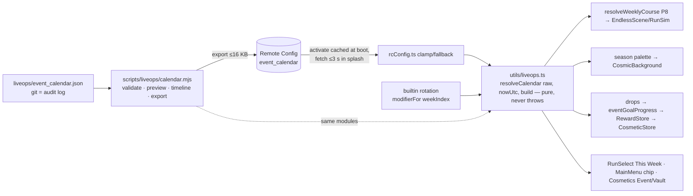

# P10 — Live-Ops Seams

**Status:** PLANNED, not started.
- **Execution step:** 22 ([`../EXECUTION-ORDER.md`](../EXECUTION-ORDER.md)). Needs step 21 (P9) and, through it, P6 Remote Config, P7 cosmetic pipeline and P8 Weekly modifier hook.
- **Design:** [`../../design/LIVE-OPS.md`](../../design/LIVE-OPS.md).
- **Decisions:** D-14, D-15, D-17, D-21, D-22, D-23, D-24, D-26, D-30.
- **Baseline:** `master @ d3c6aab`.

## 1. Summary
Build the **seams, not a platform**: the extension points that let one developer run weekly twists, seasons and earned limited cosmetics as **dated data**.

**P10 delivers:**
1. The `event_calendar` Remote Config schema and a pure, never-throwing resolver. Unknown kinds are ignored, dates are UTC, and events are published ≥7 days ahead.
2. A **weekly modifier catalogue** of 8 modifiers, all built from existing knobs, with a deterministic built-in rotation the calendar can override.
3. **4 season palettes** reusing the `WorldTheme` shape.
4. **Earned event cosmetics** with a guaranteed vault return and a permanent fallback, so nothing is permanently missable.
5. A personal **weekly challenge ladder**.
6. Event surfaces: the RunSelect "This Week" card and a MainMenu chip.
7. A validator/preview CLI with CI.
8. An operating runbook.

**Not in P10:**
- Level packs: the schema reserves the kind, but packs ship later.
- Event currency, battle pass, server events (D-30).

## 2. Scope

### Systems
| System | P10 | Later |
|---|---|---|
| `event_calendar` + resolver | Kinds `weekly_mod`, `season_palette`, `cosmetic_drop`; `level_pack` parsed but inert until a pack exists | `level_pack` activation |
| Weekly modifiers | 8 modifiers + built-in 8-week rotation + modifier matrix in nightly bot | New modifiers per release |
| Seasons | `aurora`, `bloom`, `solar`, `ember` palettes for MainMenu, RunSelect, the Run Launch biome and the share-card backdrop | Seasonal ladder (from season 2) |
| Event cosmetics | `acquire:'event'`, goal tracking, vault months, permanent Stardust/achievement fallback | — |
| Challenge ladder | Weekly milestone track (500/1,000/1,500/2,000 → 5/10/15/25 Stardust) | — |
| Themed weeks | Calendar convention: a `weekly_mod` row plus a D-21 `daily_schedule` override for the same week | Author ghost per themed week (P8-T19 data) |
| Surfaces | RunSelect This Week card (fills the P8 shell), MainMenu event chip, Cosmetics "Event / Vault" tab | — |
| Tooling | `scripts/liveops/calendar.mjs` (`validate`/`preview`/`timeline`/`export`), `liveops/event_calendar.json`, CI step | — |
| Telemetry | `event_view`, `event_progress`, `event_reward`, `liveops_reject` | — |

### Dependencies
| Needs | From |
|---|---|
| `rcConfig.ts` (parse → clamp → fallback), fetch-during-splash with a 3 s timeout, dated overrides | P6 (D-14) |
| `daily_schedule` dated override for themed weeks | P6 (D-21) |
| Stardust single currency, shop v2, cosmetic try-on, seasonal-drop sink | P7 (D-23) |
| `RunModifier`, `resolveWeeklyCourse`, This Week card shell, `poolVer`, modifier matrix runner | P8 |
| Share-card backdrop hook | P9 |
| Contrast audit tooling | P5 |

### Difficulty, risk, upside
| Item | Rating / note |
|---|---|
| Difficulty | Engineering **M** · design **M** · QA **L** |
| Risk: content-treadmill fatigue (solo dev) | Medium. Mitigated by the built-in rotation (zero-ops weeks), monthly 2 h cadence, cosmetics batched per release. |
| Risk: old clients mis-resolve events | Low. Unknown kinds/fields/references are ignored; `minBuild` gating; property tests. |
| Risk: weekly course split between builds | Low. Overrides use only modifiers every build ≥ `minBuild` knows; older clients practise only. |
| Risk: FOMO / regulatory (EU DFA) | Low. Earned-only, vault return, factual copy, no countdown urgency (D-24). |
| Upside | Medium: reactivation, D7 lift for participants, cosmetic engagement at low operating cost |

### Success metrics (MASTER-ROADMAP P10)
- Event participation ≥20% of WAU.
- D7 retention of participants vs non-participants reported weekly.
- **Zero crashes on unknown event kinds.**

Internal:
- Calendar validator in CI.
- 100% of `'event'` cosmetics have a vault return ≤12 months and a permanent fallback.

### Must NOT be done yet
- Battle or season pass, event currency, server-run events, FCM campaigns (D-30).
- New notification types (D-15's 4 types are fixed).
- Runtime-downloaded level JSON.
- Paid event cosmetics: event items are earned-only. P7's paid seasonal packs are separate items.
- Modifiers that thin rests or raise scroll speed (D-22) or touch the attractor formula (D-26).

## 3. Architecture plan



### Rules
1. **One resolver.** `resolveCalendar` is the only reader of `event_calendar`. The CLI imports the same module and catalogues, so there is no drift.
2. **Resolution is pure** in `(raw, nowUtcMs, versionCode)`. Exceptions are caught and the built-in defaults returned.
3. **Ordering:** "first valid row in array order wins" for exclusive kinds. Duplicate ids keep the first.
4. **Cosmetics, palettes and modifiers are compiled catalogues.** A calendar reference to an unknown id skips that row.
5. **`liveops_enabled` (RC bool, default true) is the kill switch:** false means built-in defaults only.

## 4. Files/modules affected

### Create
| Path | Purpose |
|---|---|
| `src/utils/liveops.ts` (+ `liveops.test.ts`) | Schema parse, validation, `resolveCalendar`, `eventGoalProgress`, weekly ladder math |
| `src/config/liveops/seasons.ts` | `SEASON_THEMES` (4 × `WorldTheme`-shaped) |
| `src/config/liveops/drops.ts` | Drop goal types + vault schedule helpers |
| `src/utils/EventProgressStore.ts` | Per-event progress, claimed flags, ladder week state (D-12 mirror + validation) |
| `liveops/event_calendar.json` | Calendar source of truth (the first 3 months committed in T10) |
| `scripts/liveops/calendar.mjs` | `validate`, `preview <iso>`, `timeline`, `export` |

### Modify (verified to exist on `master @ d3c6aab`, except the two rows marked "created in P8")
| Path | Change |
|---|---|
| `src/config/endless/modifiers.ts` (created in P8) | Add `focus_currents`, `focus_wells`, `pulse_storm`, `slipstream`, `deep_end` + `ROTATION` (8) |
| `src/scenes/RunSelectScene.ts` | Fill the This Week card (modifier, rule line, local reset time, ladder progress, rank) |
| `src/scenes/MainMenuScene.ts` | Event chip (active drop / themed week) |
| `src/scenes/CosmeticsScene.ts` | "Event / Vault" tab: active drop progress, past drops with return month |
| `src/entities/CosmicBackground.ts` | Accept a season palette (constructor `theme` parameter at `:51`; `setTheme` from P8) |
| `src/utils/cosmetics.ts` | `Acquire` gains `'event'` (`:10`); `Cosmetic` gains `eventId?`, `vaultReturn?`, `fallback?` |
| `src/utils/cosmeticsLogic.ts` | Ownership/visibility rules for event items (locked → "Earn in <event>" / "Returns <month>") |
| `src/utils/Rewards.ts` | `grantEventReward(eventId, rewardId)` via `RewardStore.claimedEver('event:<id>')` |
| `src/utils/RewardStore.ts` | No API change. Event claims reuse `claimedEver` (`:39`); its `claim()` writes a date, so presence = claimed. |
| `src/utils/analyticsEvents.ts` (+ test) | `eventView`, `eventProgress`, `eventReward`, `liveopsReject` builders |
| `src/utils/endless.ts` | `modifierFor(weekIndex)` built-in rotation (beside P8's `resolveWeeklyCourse`) |
| `.github/workflows/ci.yml` | `node scripts/liveops/calendar.mjs validate liveops/event_calendar.json` in the web job |
| `scripts/levelsim/run/` (created in P8) | Modifier matrix includes all 8 modifiers nightly |

## 5. Data-model changes

**Remote Config:**
- `event_calendar`: JSON, default `{"v":1,"events":[]}`, ≤16 KB.
- `liveops_enabled`: bool, default true.

**Calendar schema** (LIVE-OPS §2):

```
{ v:1, events:[{ id, kind, start, end, minBuild?, …kind payload }] }
```

| Kind | Payload |
|---|---|
| `weekly_mod` | `modifier`, `poolVer`, `seedKey?`, `title`. Exactly Sunday 07:00 UTC + 7 d. |
| `season_palette` | `palette` ∈ {aurora, bloom, solar, ember}, ≤100 d |
| `cosmetic_drop` | `rewardId`, `goal{type ∈ weekly_runs, run_height, daily_clears, run_gems, levels_3star; target}`, `vaultReturn: 'YYYY-MM'`; ≤45 d; ≤2 concurrent |
| `level_pack` | `packId` (inert until a compiled pack exists) |

**Cosmetic:**

```
acquire:'event', eventId, vaultReturn (≤12 months after first window), fallback:{acquire:'stardust', cost} | {acquire:'achievement', id}
```

**Store** `gravity-flow:events:v1`:

```
{ v:1, progress:{[eventId]:number}, ladder:{weekKey, claimed:[500,1000,…]}, seen:[eventId] }
```

**Constants** (`retention.config.ts`):

| Constant | Value |
|---|---|
| `LADDER_STEPS` | [500, 1000, 1500, 2000] |
| `LADDER_REWARDS` | [5, 10, 15, 25] |
| `EVENT_PUBLISH_LEAD_DAYS` | 7 |
| `CALENDAR_MAX_BYTES` | 16384 |
| `VAULT_MAX_MONTHS` | 12 |

## 6. UI changes
| Surface | Change |
|---|---|
| RunSelect "This Week" | Modifier name + one-line rule ("Every chunk mirrored"). "resets Sun HH:MM" in local time. Ladder (4 pips). Best this week. Rank (native). "Update to join this week's board" when below `minBuild`. |
| MainMenu | Small chip for an active drop or themed week ("Aurora Trail · 3/5 Weekly runs"). Tap → Cosmetics Event tab. |
| Cosmetics | "Event / Vault" tab. Active drop: progress bar + factual end date + "returns in the Vault". Past drops: "Returns Jun 2027" or "Available for ✦ 300". |
| Season palettes | Menus, RunSelect, Run Launch biome, share-card backdrop. Campaign worlds untouched. |
| Copy rules | No red countdowns, "last chance" or urgency styling (D-24). Dates are factual. |
| Accessibility | Each palette passes HUD contrast ≥4.5:1. Reduced motion: palette swap is instant with no brightness change (D-13). |

## 7. Gameplay changes
- **Weekly Run** applies exactly one modifier per week:
  - the built-in rotation `[standard, mirror, focus_currents, gem_rush, pulse_storm, focus_wells, slipstream, deep_end]`, indexed by `weekIndex % 8`
  - or a calendar override
- **Endless** stays `standard`, so the all-time board baseline is stable.
- **Modifier bounds:** `slipstream` sets `BALL_FRICTION_AIR` ×0.7 (0.02 → 0.014, clamped ≥0.7×). Zone multipliers are clamped ≤1.25. `gem_rush` sets the gem bonus to 10, so gems are ≤18% of score. The attractor formula is never modified (D-26).
- **Ladder rewards** are Stardust in a fixed small amount (max 55 per week), counted inside P7's economy budget (D-23).
- **Seed outliers** found by P8's weekly pre-sim are fixed by a `seedKey` override published ≥7 days ahead.

## 8. Test strategy
| Layer | Tests | Gate |
|---|---|---|
| Resolver unit (TDD) | Unknown kind skipped; unknown fields ignored; `v` higher → defaults; malformed JSON → defaults; non-UTC or `end ≤ start` → skip; duplicate id → first; exclusive-kind overlap → first valid; references to unknown modifier/palette/reward → skip; `minBuild` gating; start inclusive / end exclusive; week boundary Sun 07:00:00.000Z; kill switch | CI blocking |
| Property | 10k random instants × a randomly generated calendar → resolver never throws; identical inputs → identical outputs | CI blocking |
| Static invariants | Every `acquire:'event'` cosmetic has `vaultReturn` ≤12 months and a `fallback`; every `ROTATION` entry exists in `modifiers.ts`; no consecutive duplicate in the rotation | CI blocking |
| Calendar CI | `calendar.mjs validate liveops/event_calendar.json`: schema, references, ≥7-day lead for future rows, window/overlap rules, size ≤16 KB | CI blocking |
| Bot | Modifier matrix (8 modifiers × eligible pool) + next-8-week pre-sim under scheduled modifiers | Nightly report; blocks scheduling (not merge) |
| Old-client simulation | Resolve the committed calendar with `versionCode` = oldest supported build → no throw, `minBuild` rows skipped, weekly course falls back only for gated rows | CI blocking |
| Device 👤 | Airplane-mode first launch → built-in rotation; RC fetch updates the This Week card on the next launch; drop progress and claim; vault display | Release gate |

## 9. Migration
- New store `gravity-flow:events:v1` starts empty. No existing data changes.
- `Acquire` gains a value, so existing items are unaffected. `cosmeticsLogic` treats an unknown acquire as locked, which keeps old builds safe if a newer catalogue were ever read.
- Weekly courses before P10 were `standard` (P8 built-ins). Turning on the rotation changes the course **only at a Sunday 07:00 UTC boundary**, never mid-week. The first rotated week is announced in the calendar ≥7 days ahead.
- Season palettes affect only non-campaign surfaces. No level re-verification is needed.

## 10. Rollback
| Failure | Action |
|---|---|
| Bad calendar row | Fix the JSON and republish, or roll back to the previous RC template version. The resolver skips invalid rows anyway. |
| Systemic live-ops issue | RC `liveops_enabled=false` → built-in defaults (rotation, no palette, no drops) |
| A modifier proves unfair live | Publish a `weekly_mod` override back to `standard` for the **next** week (never retroactive, D-14). The current week stays as is for fairness. |
| Drop goal broken | Extend the drop or schedule its vault return earlier. Grants are idempotent, so double claims are impossible. |
| Code regression | versionCode+1 release with the previous resolver. Calendar rows with `minBuild` above that build are skipped automatically. |

## 11. Performance
| Item | Budget |
|---|---|
| Calendar parse + resolve | ≤2 ms at boot (≤16 KB JSON), cached for the session; re-resolve only on scene entry to RunSelect/MainMenu/Cosmetics |
| Palette | Zero new draw calls (tints on the existing `CosmicBackground` layers) |
| Event progress | O(1) increments at run/daily end; no per-frame work |
| Network | No additional fetch: rides the existing RC fetch (≤3 s splash timeout, D-14) |

## 12. Platform
- **Android:** Firebase Remote Config, part of the P6 integration; no new native code. Note RC's 12 h minimum fetch interval, which is why events are published ≥7 days ahead.
- **Web:** Remote Config may be unavailable on the web build. The resolver then runs the built-in rotation and defaults. Web weekly courses remain identical to Android when the calendar has no override for that week, and overrides are rare by design.
- **Ops tooling:** Node CLI only. Publishing is by pasting into the Firebase console, or `firebase deploy --only remoteconfig` with a template file. The CLI path is INFERRED, to be confirmed in T02.
- **iOS:** none (D-29).

## 13. Documentation
- `docs/design/LIVE-OPS.md`: as-built.
- `CHANGELOG.md`.
- `docs/STATUS.md`.
- A new runbook section in `docs/release/RUNBOOK.md`: "Monthly live-ops sitting", the commands, and the kill switch.
- `liveops/event_calendar.json` header comment convention.
- `docs/store/listing.md`: seasonal mentions only when an event is live (honest copy).

## 14. Validation criteria
| Criterion | Evidence type |
|---|---|
| tsc / vitest (resolver, property, invariants) / build / calendar validate green | VERIFIED |
| Resolver never throws on 10k fuzzed calendars; unknown kinds skipped | VERIFIED |
| Every event cosmetic has a vault return ≤12 months and a fallback | VERIFIED (static test) |
| Modifier matrix nightly: 8/8 modifiers pass validators + bot on the eligible pool | VERIFIED (report) |
| Weekly modifier switches exactly at Sunday 07:00 UTC on device; This Week card shows the local reset time | **HUMAN DEVICE TEST** |
| Airplane-mode first launch uses the built-in rotation; RC update applies on the next launch | **HUMAN DEVICE TEST** |
| Drop: progress counts only inside the window; claim grants once; vault displays the return month | VERIFIED (unit) + **HUMAN DEVICE TEST** |
| Season palettes pass HUD contrast ≥4.5:1 as rendered | VERIFIED (P5 contrast tooling) |
| Event participation ≥20% WAU; participant vs non-participant D7 | INFERRED until 4+ weeks live |
| Zero crashes on unknown kinds in production (Crashlytics) | VERIFIED (Crashlytics query after 2 weeks) |

## 15. Exact completion definition
P10 is complete when **all** of the following hold:
1. T01–T10 are merged with all MASTER-ROADMAP §6 gates green. Outputs are recorded in `docs/STATUS.md`.
2. `liveops/event_calendar.json` holds ≥3 months of scheduled rows. It validates in CI and is published to Remote Config ≥7 days before its first row.
3. The 8-modifier rotation is live on the Weekly, and at least one rotated week has switched over on device (§14).
4. One season palette and one earned drop are live in production, with the drop's vault return scheduled. The Cosmetics Event/Vault tab shows both.
5. The runbook is documented, and one monthly sitting has been performed using only the CLI and the RC console, in ≤2 h.
6. A production release containing P10 has reached 100% rollout with crash-free sessions ≥99.5% and **0 crashes attributed to live-ops parsing** in Crashlytics.

## 16. Task breakdown

| Task | Goal | Files | Tests | Done when |
|---|---|---|---|---|
| **P10-T01** Resolver | Schema parse + `resolveCalendar` + kill switch | Create `src/utils/liveops.ts`(+test) | Every rule in §8 resolver row; property test | Never throws; 100% branch coverage of skip paths |
| **P10-T02** Calendar tooling | Source file + CLI + CI; confirm the RC publish path | Create `liveops/event_calendar.json`, `scripts/liveops/calendar.mjs`; Modify `.github/workflows/ci.yml` | CLI validate fixtures (good/bad); size cap | CI fails on a bad row; `preview` matches the client resolver |
| **P10-T03** Modifier catalogue | 5 new modifiers + `ROTATION` + `modifierFor` | Modify `src/config/endless/modifiers.ts`, `src/utils/endless.ts`, `scripts/levelsim/run/` | Clamp tests; rotation invariants; modifier matrix nightly | 8/8 modifiers pass the matrix |
| **P10-T04** This Week + chip | Fill the RunSelect card; MainMenu chip | Modify `src/scenes/RunSelectScene.ts`, `src/scenes/MainMenuScene.ts` | Pure view-model tests (labels, local reset time, `minBuild` notice) | Card reflects the resolver on device 👤 |
| **P10-T05** Season palettes | 4 palettes + application surfaces | Create `src/config/liveops/seasons.ts` (imports the already-exported `WorldTheme` from `src/config/worldThemes.ts`; campaign themes unchanged); Modify `src/entities/CosmicBackground.ts` | Palette-id mapping; contrast pairs computed ≥4.5:1 | Palettes switch by calendar; campaign untouched |
| **P10-T06** Event cosmetics + vault | `acquire:'event'`, goals, claims, vault, fallback | Create `src/config/liveops/drops.ts`, `src/utils/EventProgressStore.ts`; Modify `src/utils/cosmetics.ts`, `src/utils/cosmeticsLogic.ts`, `src/utils/Rewards.ts`, `src/scenes/CosmeticsScene.ts` | `eventGoalProgress` per goal type; window boundaries; idempotent grant; never-missable invariant | One drop earnable end-to-end 👤 |
| **P10-T07** Weekly ladder | Personal milestone track | Modify `src/utils/liveops.ts`, `src/config/retention.config.ts`, `RunSelectScene.ts`, `EventProgressStore.ts` | Ladder math; weekly reset by `rw` key; reward cap 55/week | Pips fill and reset at Sunday 07:00 UTC |
| **P10-T08** Themed-week convention | Calendar recipe pairing `weekly_mod` + D-21 `daily_schedule` | `liveops/event_calendar.json`, CLI `timeline` | CLI warns when a themed week lacks its daily override | First themed week scheduled |
| **P10-T09** Telemetry | `event_view`, `event_progress` (25/50/75/100), `event_reward`, `liveops_reject` (≤1/session) | Modify `src/utils/analyticsEvents.ts`(+test), `src/utils/liveops.ts` | Name/param lint | Events in DebugView 👤 |
| **P10-T10** Runbook + first quarter | Document the cadence; commit 3 months of rows; publish | `docs/release/RUNBOOK.md`, `liveops/event_calendar.json` | `calendar.mjs validate` + `timeline` | §15 items 2–5 satisfied |
